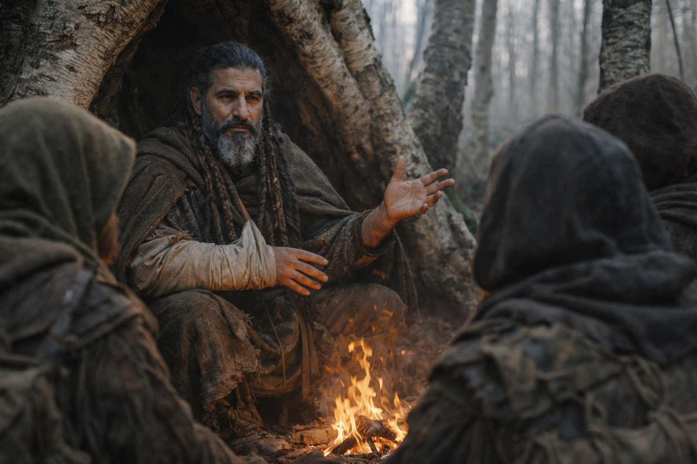
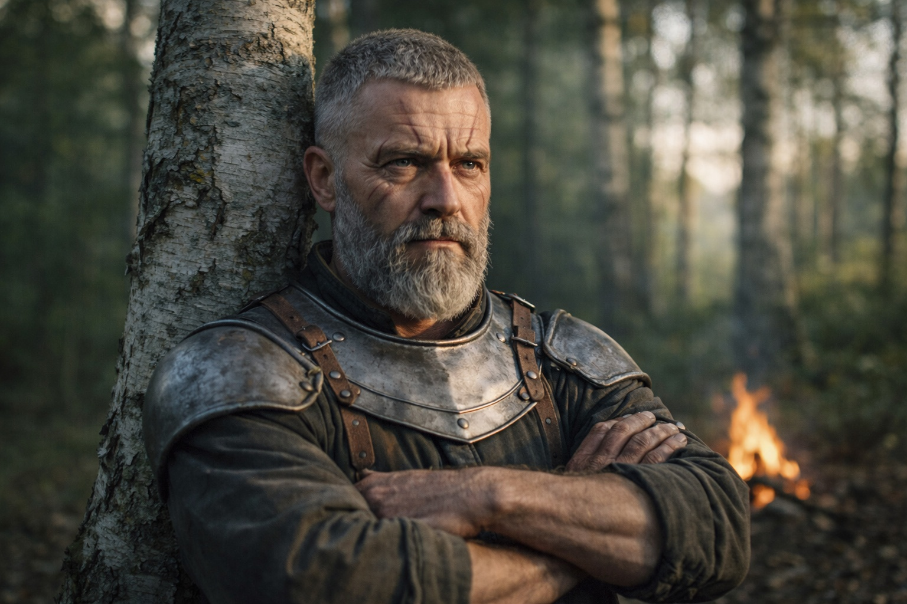
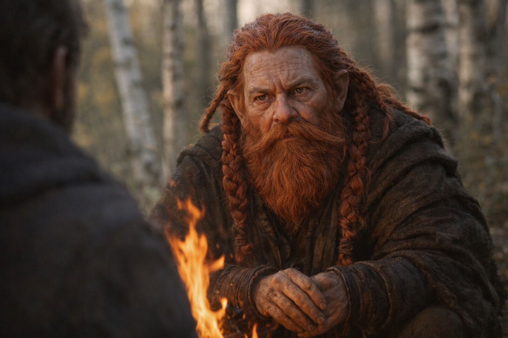
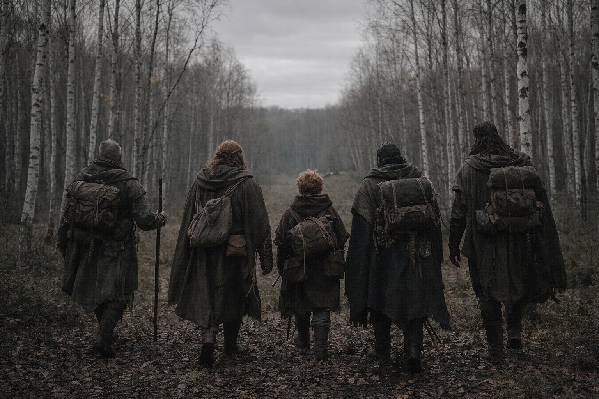

# Capítulo 30.3 | Las Semillas de la Convergencia: El Alcance

Xandor esperó hasta la mañana para explicar, lo cual fue sabiduría o cobardía, y la distinción no importaba porque nadie durmió.

Se sentaron en el hueco entre los abedules con los restos de un fuego que Aldric había reconstruido por calor más que por consuelo, y el viejo druida organizó lo que sabía como organizaba todo: en círculos, llegando al centro a través de órbitas progresivamente más pequeñas, cada una añadiendo una capa que la anterior no había mencionado.

—El artefacto en la mochila de Dulint es una pieza de algo. Eso lo sabéis. Lo que Maris describió anoche sugiere que ese algo es más grande de lo que temía.

—¿Cuánto más grande? —Aldric se apoyaba contra un abedul, brazos cruzados. Tenía puesta su cara de comandante, la que procesaba información sin reaccionar ante ella.

—Cuando examiné el cubo por primera vez, os dije que estaba leyendo. Percibiendo. Emitiendo. Creí que era un instrumento único. Dañado, incompleto, pero singular. Un dispositivo con una función que no podía identificar del todo. —Xandor se ajustó el brazo herido en el cabestrillo. El dolor era constante, pero había dejado de reconocerlo hacía días—. Estaba equivocado. O más bien, era una verdad parcial. El cubo es una pieza. El fragmento que Maris recuperó de la cueva de hielo es otra pieza. Lo que ella vio anoche, las frecuencias, las conexiones, sugiere que hay más.

—¿Cuántas? —preguntó Balin. Se apoyaba en su bastón, el peso fuera de su pantorrilla herida. Su voz contenía la paciencia calculada de alguien que había aprendido que interrumpir a Xandor retrasaba la respuesta en lugar de acelerarla.

—No tengo un número. Los textos antiguos que estudié en Zuraldi mencionaban un sistema. Una red antigua de artefactos conectados, cada uno con una función específica, que juntos formaban algo mayor que la suma de sus partes. Los textos lo llamaban el Nexus. Descarté el nombre como mitología. Los eruditos hacen eso cuando la evidencia es fragmentaria y las implicaciones son incómodas. —Hizo una pausa. Miró el fuego—. Fue un error descartarlo.

Maris estaba sentada frente a él, un paño presionado contra su oído aunque el sangrado había cesado horas antes. El hábito de monitorear el daño se había vuelto reflejo.

—Ella sintió al menos cuatro señales distintas. Quizá cinco. Dos claras, dos débiles. Y algo en el centro.

—Eso coincide con los textos. El Nexus se describía como un sistema de múltiples componentes. Cada uno cumplía una función. Sentir, que lee. Borrar, que elimina. Alterar, que reescribe. Y otros sobre los que los textos discrepaban, debatían o dejaban deliberadamente vagos. El sistema requería todos los componentes juntos para cumplir su propósito. Separados, cada pieza funciona parcialmente. El cubo percibe. El fragmento amplifica el alcance del cubo. Juntos, siguen incompletos, pero son lo bastante ruidosos para que las otras piezas los oigan.

—Otras piezas portadas por otras personas —dijo Aldric.

Xandor asintió.

—Esa es la parte que no podía confirmar hasta que Maris lo vio. El hombre que se ahoga. El elfo oscuro que describió en el volcán. Lleva una pieza. No en una mochila. En su cuerpo. Integrada. Lo que significa que o la integración fue intencional o el sistema se adaptó para usar un recipiente disponible.

—El sistema lo eligió —dijo Maris.

—O era compatible y el sistema se aprovechó. La distinción importa. Elegido implica inteligencia dirigiendo el proceso. Compatible implica mecánica. Los textos antiguos no se ponen de acuerdo sobre si el Nexus tiene voluntad.

Dulint habló por primera vez en lo que podría haber sido un día. Su voz era áspera y baja, la voz de un hombre que había estado pensando en lugar de hablando, lo contrario de su estado natural.

—Dijiste que las piezas quieren estar juntas.

—Las señales convergen. Si eso es «querer» o es física, no puedo decirlo. —Xandor miró a Dulint con la atención cuidadosa de alguien que entendía que las escasas contribuciones del viejo enano solían cortar hasta el hueso—. Pero sí. El sistema se está ensamblando. Las piezas se están encontrando. La activación de nuestro fragmento parece haber acelerado el proceso.

—Y las que no podemos sentir con claridad —dijo Aldric—. Las débiles. ¿Dónde están?

—Maris dijo que una era fría e inmóvil. Guardada por algo que no es una persona. La otra estaba enterrada en interferencia. —Xandor extendió su mano buena—. No sé qué significa eso. Los textos describían guardianes. Entidades asignadas para proteger componentes individuales durante períodos de letargo. Si esas entidades aún existen, las piezas que guardan pueden no ser accesibles por medios convencionales.

—Convencionales —repitió Balin—. ¿En oposición a qué?

—No lo sé. —La admisión le costó algo a Xandor. Maris podía verlo en la tensión de su mandíbula, en cómo las palabras salieron cortadas en lugar de circulares—. Pasé treinta años estudiando fragmentos de este sistema y sé menos de una fracción de lo que necesitaría saber para predecir qué sucede a continuación. Lo que sé es esto: el Nexus tiene múltiples piezas. Nosotros portamos dos. El hombre que se ahoga porta al menos una. Otras existen. El sistema está despertando de su letargo y las piezas se están comunicando. Si esa comunicación es positiva, neutral o catastrófica depende de variables que no puedo identificar.

El silencio se asentó sobre el hueco. El fuego crepitó. Sobre ellos, a través de la copa desnuda de los abedules, el cielo encapotado presionaba hacia abajo con la indiferencia plana de un clima al que no le importaban las revelaciones.

—Así que somos parte de algo —dijo Balin. No era una pregunta. El tono de un hombre joven intentando medir la forma de un problema que excedía sus herramientas.

—Lo fuimos desde el momento en que Dulint encontró el cubo en la mina. Posiblemente antes. —Xandor los miró a cada uno. Sus viejos ojos eran firmes y estaban muy cansados—. La pregunta no es si somos parte de ello. La pregunta es si las otras partes son amenazas o aliados. Y no lo sabremos hasta que estemos lo bastante cerca para que la respuesta importe.

Maris sintió el Faro pulsar en la mochila de Dulint. Débil. Persistente. Alcanzando hacia el noreste a través de los abedules y el cielo encapotado y la distancia, hacia algo que estaba respondiendo.

—El hombre que se ahoga está más cerca que antes —dijo ella—. Lo sintió en la red. Moviéndose. La dirección converge con la nuestra.

—¿Hacia nosotros o hacia el mismo punto? —preguntó Aldric.

—Aún no puede distinguir la diferencia.

Aldric descruzó los brazos. Se apartó del abedul. Su rostro se había asentado en la expresión que ella había aprendido a reconocer como decisión: no el proceso de decidir sino lo que viene después, los rasgos de un hombre que ya había elegido y ahora solo determinaba cuándo anunciarlo.

—Continuamos al norte. Llegamos a la frontera. Sea lo que sea este sistema, sea lo que sea que esté ensamblando, no lo enfrentamos a campo abierto con tres heridos y capas grises detrás de nosotros. Llegamos a un lugar seguro, luego decidimos.

Nadie discutió. No había nada que discutir. La aritmética de la supervivencia no había cambiado. El contexto a su alrededor se había expandido para incluir sistemas antiguos y artefactos conectados y un elfo oscuro al otro lado de algo corriendo en su dirección, pero la matemática inmediata era la misma: llegar a la frontera, seguir vivos, no detenerse.

Recogieron el campamento. Caminaron. El Faro zumbaba en la mochila y el bosque de las tierras bajas los engulló, y en algún lugar lejano, en una dirección que no era exactamente el noreste y no era exactamente ningún lugar, el Nexus continuaba el lento proceso de recordar lo que era.

---

*Siguiente: Las Semillas de la Convergencia: La Señal*

**Fin del Capítulo 30.3 — continúa en el Capítulo 30.4: [Las Semillas de la Convergencia: La Señal](/las-semillas-de-la-convergencia-la-senal/)**
