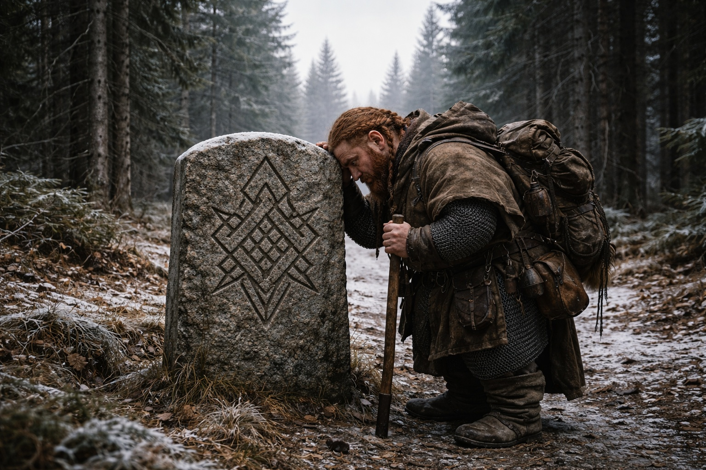
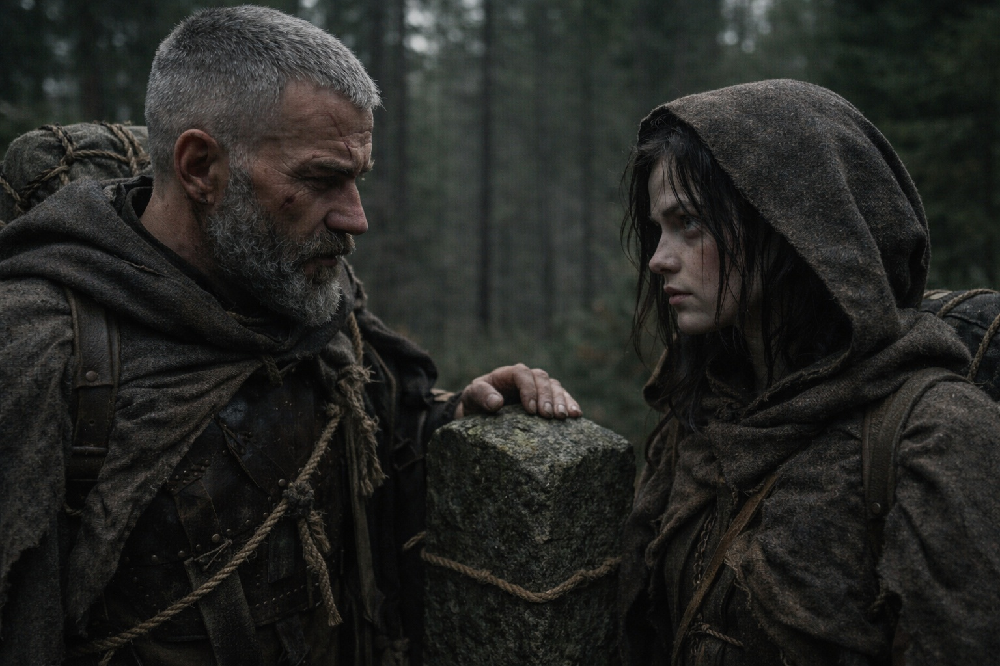
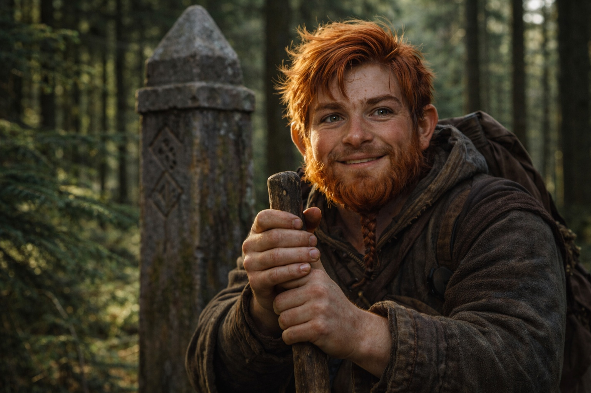
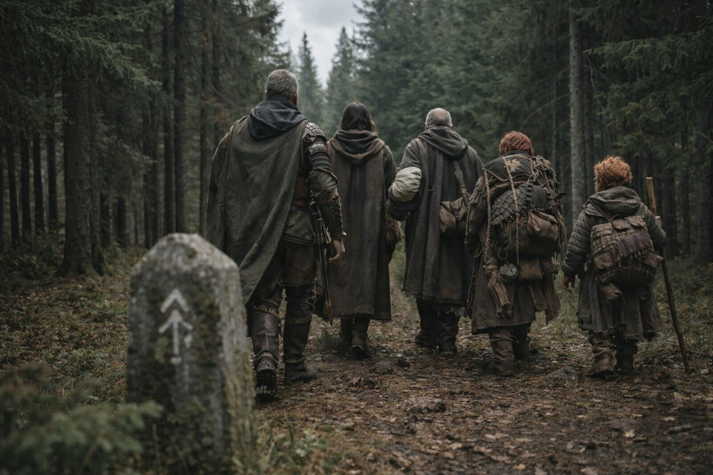

# Capítulo 30.5 | Las Semillas de la Convergencia: El Compromiso

Llegaron a la frontera de Frostgard el sexto día, y no fue nada.

Un marcador de piedra, a la altura de la cintura, tallado con el sigilo de la provincia del norte. El bosque a un lado era idéntico al bosque del otro. Sin muro. Sin puerta. Sin guarnición. Solo un poste de granito en la tierra helada que decía, en silencio burocrático, que el suelo aquí pertenecía a una autoridad diferente a la del suelo que dejaban atrás.

Balin lo alcanzó primero y se apoyó contra él con el agotamiento de un hombre que acabara de completar una maratón con una pierna dañada. Su bastón había adquirido su propia inclinación, la rama de pino desgastada y lisa tras seis días de contacto con suelo congelado. Presionó la frente contra la piedra y no dijo nada.

Aldric revisó el perímetro. Escudriñó la línea de árboles. Escuchó en busca de cuernos. Las capas grises habían estado detrás de ellos desde la hondonada, manteniendo la distancia, sin cerrar nunca, sin quedarse atrás jamás. Persecución profesional. De las que no necesitaban apresurarse porque sabían adónde iba la presa.

La frontera no los detendría. Aldric lo sabía. Las capas grises lo sabían. Las fronteras detenían a mercaderes y refugiados. No detenían a personas con recursos y redes de inteligencia y órdenes permanentes de recuperar aquello por lo que habían sido enviados.

Pero la frontera significaba algo para el grupo porque habían decidido que significaba algo, y en la economía de la supervivencia, las ficciones que mantenían a la gente caminando valían más que las verdades que la detenían.

—Agua —dijo Aldric—. Cinco minutos.

Bebieron. El brazo izquierdo de Xandor había recuperado algo de sensibilidad en los últimos dos días, lo suficiente para hacer el dolor peor en lugar de mejor. Sostuvo su odre con ambas manos, la izquierda temblando, y el acto de llevarlo a su boca fue una victoria que no celebró.

Dulint se sentó contra un árbol. Había cargado el bulto más pesado durante los últimos tres días, redistribuyendo peso de Xandor y Balin sin que se lo pidieran, sin discutirlo, sin ganarse reconocimiento alguno. El viejo enano había encontrado, en el trabajo silencioso, una moneda que podía gastar sin que nadie cuestionara su origen. Bebía con moderación. Comía menos. Vigilaba la línea de árboles al sur con la vigilancia de un hombre que creía deber una deuda que crecía con cada paso que otros daban en su nombre.

Maris estaba de pie junto al marcador. El Faro pulsaba en el bulto de Dulint, constante, direccional y vivo. Noreste. El tirón no se había debilitado desde la visión en el bosque de abetos. Si acaso, se había afilado, la señal volviéndose más precisa con cada día que pasaba, como si la fuente al otro extremo estuviera calibrando, ajustando, aprendiendo a apuntar.

Él estaba allí fuera. Corriendo. Acercándose hacia la señal que venía de la cosa en el bulto de Dulint.

—Maris.

Se dio la vuelta. Aldric estaba de pie con su mochila al hombro, listo para moverse. Pero su rostro no era el rostro del comandante. La máscara de evaluación había caído. Lo que había detrás era más cansado, más viejo y más incierto que cualquier cosa que ella le hubiera visto.

—¿Hacia qué estamos caminando?

La pregunta la sorprendió. No porque fuera inesperada, sino porque Aldric no hacía preguntas que no pudiera responder él mismo. Hacía preguntas cuando quería escuchar a alguien más confirmar lo que él ya sospechaba.

—Ella no lo sabe.

—Ese es el problema. —Miró el marcador. El bosque al norte, idéntico al bosque al sur, sin ofrecer nada—. Me comprometí a escoltar a un enano con un artefacto robado desde Zuraldi hasta Frostgard. Eso está hecho. El artefacto está en Frostgard. El enano está vivo. El contrato se ha cumplido.

—Pero.

—Pero.

Guardó silencio un momento. El viento se movía entre los árboles. Balin estaba reempacando su equipo, favoreciendo la pantorrilla. Xandor hablaba con Dulint en voz baja sobre fuentes de agua y senderos del norte. Los sonidos de un grupo que había funcionado como una unidad durante semanas, el ritmo de cada persona calibrado al de los demás, la pequeña maquinaria de cooperación que se desarrolla cuando la gente se carga mutuamente el tiempo suficiente.

—Mi contrato dice que terminó. Lo que sé dice otra cosa. —La mandíbula de Aldric se tensó—. Hay un sistema allá fuera ensamblándose a sí mismo. Un elfo oscuro corriendo hacia nosotros, cargando una pieza de ese sistema. Algo persiguiéndolo que ahora sabe de nosotros. Y cinco personas de pie junto a un marcador fronterizo fingiendo que importa.

—Estás preguntando si ella cree que deberíamos continuar.

—Estoy preguntando si crees que tenemos opción.

Maris miró en la dirección del Faro. Noreste. Siempre noreste ahora. El tirón era suave y constante y tan fiable como la gravedad, y conducía a algún lugar que no podía ver, hacia alguien dentro de quien había estado dos veces, cuyo miedo y determinación se había puesto como ropa prestada.

—Siempre hay opción —dijo—. Podríamos parar. Dejar el Faro en el suelo. Marcharnos. El sistema encontraría otros conductores o no los encontraría. El hombre que se ahoga alcanzaría aquello que busca o no lo alcanzaría. Nos iríamos a casa, los que tenemos casa, y el mundo haría lo que el mundo hace cuando las personas que podrían haber participado eligen no hacerlo.

—¿Y?

—Y ella no podría dormir.

Aldric casi sonrió. Fue algo sombrío, la expresión de un hombre que reconoce su propia lógica en boca de otra persona. —Yo tampoco. Por razones diferentes.

—La señal va en ambas direcciones —dijo Maris—. Lo que sea que nos encontró a través de la red sabe dónde estamos. Marcharnos no deshace eso. Solo significa que nos marchamos con una diana encima en lugar de caminar hacia algo que podría explicar qué significa la diana.

Él asintió. No acuerdo. Reconocimiento. El asentimiento de un hombre que ya había decidido y lo confirmaba con alguien cuyo juicio confiaba más de lo que diría.

—Todos. —La voz de Aldric llevó la cadencia que llevaba cuando se dirigía a formaciones. No alta. Clara. Los demás levantaron la vista—. Hemos cruzado la frontera. El contrato se ha cumplido. Lo que hay adelante no es parte de aquello para lo que nadie se alistó.

Balin se despegó del marcador. Su bastón encontró su agarre. —Yo me alisté para una aventura. Esto califica.

—Esto califica como morir de formas que aún no has imaginado.

—Eso también califica. —La sonrisa de Balin era fina, genuina, y lo más valiente que Maris había visto en semanas—. Primera vez que me matan artefactos antiguos. Lo cuento.

Xandor se puso de pie. Su brazo izquierdo colgaba en su cabestrillo, inútil, el dolor gestionado pero no ausente. —El sistema está despertando. Lo presenciemos o no, sucederá. Prefiero entender lo que viene a que me pille por sorpresa.

Dulint no dijo nada. Se echó el bulto al hombro con el Faro dentro y se quedó de pie en la línea de árboles mirando al norte. Su silencio fue su propia respuesta. Había dejado de huir de las implicaciones del artefacto en algún punto entre la hondonada y la frontera, y lo que había encontrado al otro lado de huir era algo que no podía articular y no intentó hacerlo. Lo cargaría. Caminaría. Las deudas que debía eran las deudas que pagaría quedándose.

Aldric miró a Maris. Ella ya tenía la mochila lista.

—Noreste —dijo.

—Noreste.

Empezó a caminar. Lo siguieron. Más allá del marcador, más allá de la frontera, más allá de la ficción de que la geografía pudiera contener lo que estaba ocurriendo. Cinco personas moviéndose a través de un bosque de abetos bajo un cielo encapotado, cargando dos piezas de un sistema antiguo que se reensamblaba con o sin su consentimiento, caminando hacia una convergencia que no podían predecir, siguiendo una señal que conducía a un elfo oscuro al otro lado de un mundo roto que corría hacia el mismo punto desde la dirección opuesta.

Detrás de ellos, al sur, las capas grises los seguirían. Siempre los seguirían. Ese problema no había cambiado.

Delante de ellos, al noreste, el Faro tiraba y algo tiraba de vuelta, y la distancia entre ambos se medía en semanas ya, no en meses, y cuando finalmente se encontraran sería la respuesta a todo o el comienzo de algo peor.

Maris caminó y sintió el tirón en el pecho y supo, con la certeza que le costaba sangre y sueño y la erosión constante de la distancia entre ella y sus visiones, que no darían la vuelta. Ninguno de ellos. No porque fueran valientes. Porque habían visto lo suficiente para saber que dar la vuelta y quedarse quietos eran lo mismo, y la única dirección que contenía algo distinto a la espera era hacia adelante.

El bosque los engulló. El marcador quedó solo detrás de ellos, marcando una frontera que ya no importaba.

El Faro zumbó.

---

*Siguiente: La Partida: La Mañana*

**Fin del Capítulo 30.5 — continúa en el Capítulo 31.1: [La Partida: La Mañana](/la-partida-la-manana/)**
