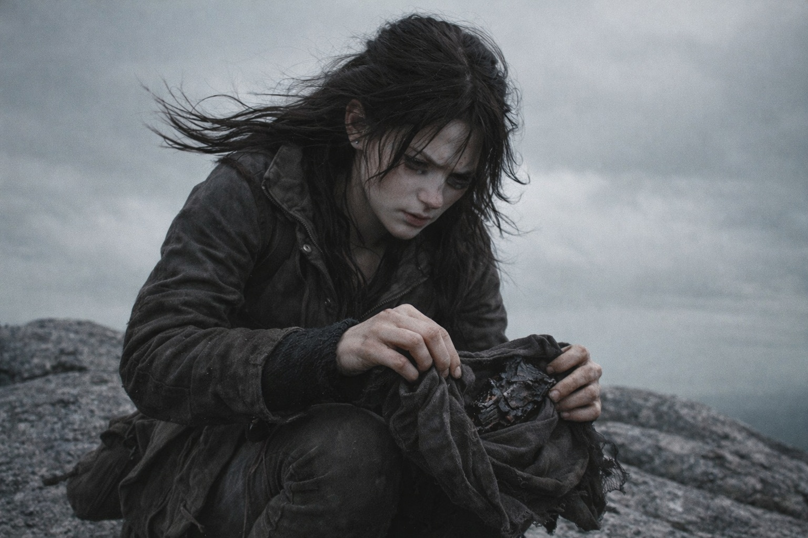
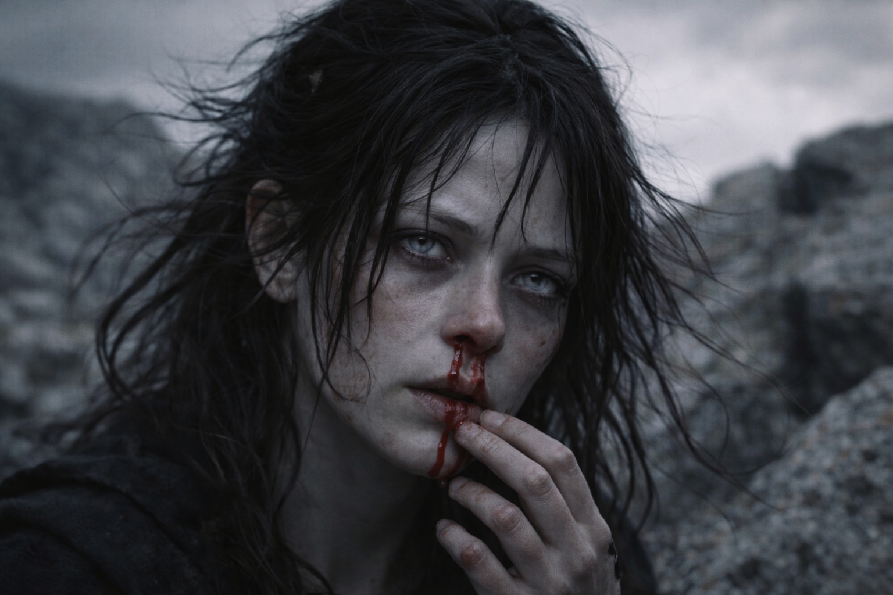

## Capítulo 30 | Parte 1 | La Dirección

---

---

Tres días al norte del hueco y el Faro dejó de señalar.

Maris lo notó porque la constante tracción baja a la que se había acostumbrado, el tirón magnético detrás del esternón que había sido su brújula desde que el fragmento se integró, se aflojó. No ausente. Flojo. La diferencia entre una cuerda bajo tensión y una cuerda enrollada en el suelo.

No dijo nada al principio. Estaban subiendo una cresta por encima de la cobertura arbórea, los pinos adelgazándose hasta granito expuesto y liquen, y el viento había arreciado hasta convertirse en el tipo de asalto sostenido que hacía de la conversación una elección entre gritar y callar. El bastón de Balin encontraba agarre entre las rocas con la paciencia de un hombre que había aprendido, en tres días, exactamente cuánto toleraría su pantorrilla por paso. Xandor caminaba con el brazo izquierdo sujeto al pecho y la mano derecha en el hombro de Dulint cuando el terreno se volvía incierto, una dependencia que ninguno de los dos reconocía en voz alta. Aldric caminaba en cabeza, cuarenta pasos por delante, la cabeza moviéndose en el arco constante de un hombre que escaneaba el terreno como otros hombres respiraban.

Dulint caminaba donde había caminado desde el hueco: en el centro del grupo, rodeado, cargando el peso del macuto y el peso de todo lo demás. No le había hablado a Maris en tres días. No le había hablado a Balin en más tiempo. Hablaba con Xandor sobre asuntos prácticos: fuentes de agua, terreno, el clima. Y la economía de esos intercambios era lo más triste que Maris había presenciado desde que las visiones empezaron.

Coronaron la cresta a mediodía. La vista se abrió hacia el norte: una ladera descendente de abedules y granito que se aplanaba en un bosque de tierras bajas, gris verdoso bajo el cielo cubierto, extendiéndose hasta un horizonte que no ofrecía nada para distinguir una dirección de otra. La frontera de Frostgard estaba en algún punto de esa extensión. Dos días, quizá tres. Lo bastante cerca para importar. Lo bastante lejos para matarlos si las capas grises los atrapaban en campo abierto.

Aldric ordenó un descanso. Balin se sentó como hacía todo ahora: con cálculo. Xandor se dejó caer contra un peñasco y cerró los ojos. Dulint permaneció de pie apartado, mirando hacia el sur, vigilando la cresta detrás de ellos en busca de movimiento.

Maris abrió el macuto.

El Faro descansaba en su envoltorio de tela, el fragmento fusionado a su superficie desde la cueva de hielo, el artefacto combinado zumbando a una frecuencia que sentía en los dientes en lugar de oírla. Lo había estado comprobando dos veces al día desde que empezaron las visiones, registrando la frecuencia de pulso, la dirección de su tracción, la intensidad. Catalogando. Documentación clínica como sustituto de la comprensión.

Lo desenvolvió. Colocó la palma contra la superficie.

El Faro se lanzó.

No físicamente. El artefacto no se movió. Pero la tracción que había estado floja se tensó de golpe con una violencia que arrastró su consciencia de lado, como si alguien hubiera agarrado la cuerda enrollada en el suelo y la hubiera tirado a través de una pared. Su mano se trabó contra la superficie. El pulso, que había sido constante y direccional durante semanas, se aceleró hasta algo frenético. No señalaba al norte. No señalaba en ninguna dirección que pudiera nombrar.

Buscaba.

El Faro estaba buscando. La diferencia era fundamental. Señalar era pasivo, una aguja de brújula respondiendo a un polo distante. Esto era activo. El artefacto estaba extendiendo algo hacia fuera, una frecuencia o una señal o un grito, empujando contra la distancia entre él y lo que estuviera al otro lado con una urgencia que le crispaba los dientes y le llenaba los senos nasales de presión.

Se sacudió. Con fuerza. Noreste. La tracción era tan específica que podría haber dibujado una línea en un mapa y medido el ángulo con precisión de fracción de grado. No una dirección. Una ubicación. Algo allá fuera, al noreste, a una distancia que no podía calcular, estaba respondiendo. Contestando. Tirando de vuelta.

Le corrió sangre de la nariz.

La sintió llegar, cálida sobre el labio superior, y tuvo la suficiente presencia de ánimo para quitar la mano del Faro antes de que la tracción la arrastrara del todo. La señal se amortiguó en el instante en que rompió el contacto, colapsando de vuelta a su estado flojo y enrollado, y se quedó sentada allí en el granito expuesto con sangre goteando de su barbilla y el viento aplanando su pelo contra el cráneo.

Balin llegó primero. —Maris.

—Está bien. —Lenguaje de distancia. Automático. Se presionó la manga contra la nariz e inclinó la cabeza hacia delante—. Está bien. No es una visión. El Faro reaccionó.

—¿Reaccionó a qué? —Aldric, detrás de ella. Había cubierto cuarenta pasos en el tiempo que tardó la sangre en llegar a su barbilla. Su voz era uniforme del modo que significaba que ya estaba evaluando amenazas.

—Algo está respondiendo. —Miró al Faro en su tela, inerte ahora, el pulso reducido a un parpadeo tenue—. Ya no solo está emitiendo. Algo al otro lado está contestando.

Silencio. Viento sobre granito. Xandor había abierto los ojos y la observaba con la atención aguzada que ella había visto después de cada visión significativa desde que el viaje comenzó.

—¿Amigo o enemigo? —preguntó Aldric.

Maris se limpió la nariz. El sangrado ya estaba cediendo. Un coste menor. —No sabe. La señal era específica. Noreste. Un punto fijo, no un objetivo en movimiento. Lo que sea, es estacionario. Y sabe que estamos aquí.

—Eso no es una respuesta.

—Es la única respuesta que tiene.

Aldric miró hacia el noreste. Abedules y tierras bajas y cielo gris, la misma extensión sin rasgos en todas las direcciones. —¿A qué distancia?

—No puede calcular distancia a través del Faro. Lo bastante lejos como para que la tracción se debilitara cuando rompió el contacto. Lo bastante cerca como para que el artefacto reaccionara con más fuerza de la que ha sentido desde que el fragmento se fusionó.

Xandor habló desde su peñasco. —¿Más cerca que antes?

Maris lo consideró. La tracción en la cueva de hielo había sido fuerte pero difusa, una señal extendida sobre un área amplia como humo dispersándose de una hoguera. Esta había sido estrecha. Enfocada. Un haz donde antes había habido un resplandor.

—No más cerca. Más clara. Algo cambió del otro lado. La fuente no solo está emitiendo. Está apuntando.

Dulint no se había movido de su posición vigilando la cresta sur. Su espalda estaba hacia el grupo. Sus hombros rígidos.

—Continuamos al norte —dijo Aldric. No era una pregunta—. La frontera está a dos o tres días. No alteramos el rumbo por una hemorragia nasal.

—Deberías alterar el rumbo basándote en el hecho de que la hemorragia nasal significa que algo está respondiendo. —Maris envolvió el Faro de nuevo en su tela y lo devolvió al macuto. Sus manos estaban firmes. Su pulso no—. El Faro señaló al norte durante semanas. Pasivo. Consistente. Ahora busca hacia el noreste y algo le responde. Eso no es un cambio de grado. Es un cambio de naturaleza.

Aldric la miró durante un largo momento. Sus ojos eran grises, duros, agotados hasta el hueso.

—El noreste y el norte se solapan lo suficiente —dijo—. Por ahora.

Empezó a caminar. El grupo siguió, como siempre seguía, en el orden que las heridas y el silencio y el peso de las cosas no dichas habían dispuesto: Aldric en cabeza, Maris detrás, Xandor y Dulint juntos, Balin en la retaguardia con su bastón y su paso deliberado y constante.

El Faro pulsaba en el macuto. Tenue. Persistente. Apuntando.

Maris caminó y sintió la tracción asentarse de nuevo en su esternón, tensa ahora donde había estado floja, y en el noreste, algo que no podía ver ni nombrar esperaba a que se acercaran lo suficiente para la siguiente respuesta.

---

**Fin del Capítulo 30.1  —> 30.2: [Las Semillas de la Convergencia: La Respuesta](/las-semillas-de-la-convergencia-la-respuesta/)**
