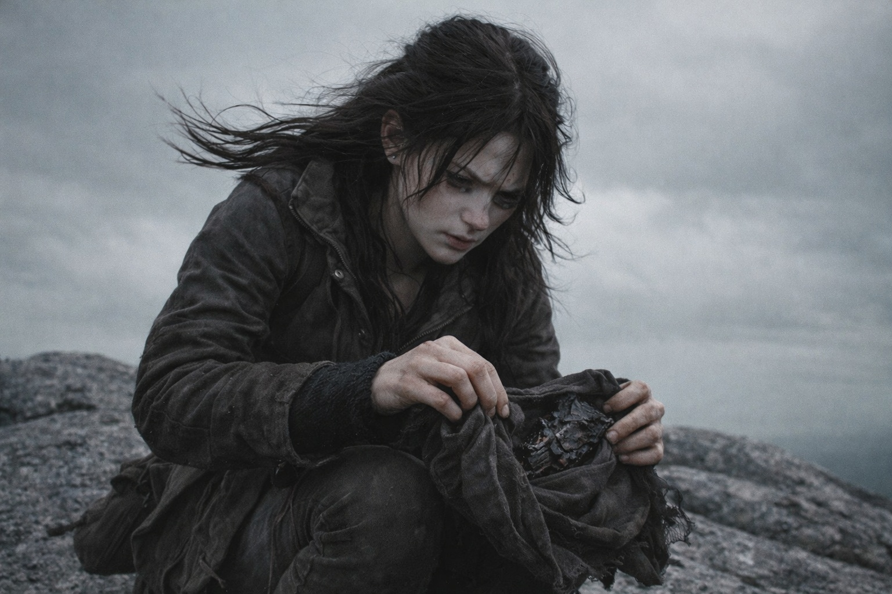
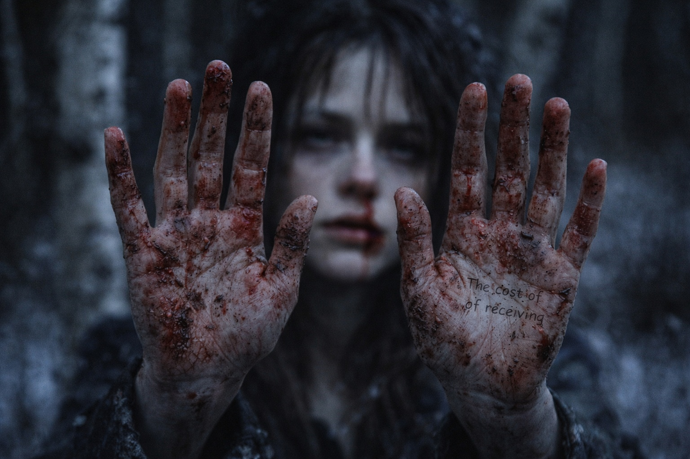

## Capítulo 30 | Parte 2 | La Respuesta

---

Esa noche, la visión llegó antes de que terminara de dormirse.

Habían acampado entre abedules. Aldric hacía la primera guardia. Maris revisó el vendaje de Xandor y luego se acostó donde pudiera ver a los demás. Balin dormía con el bastón cruzado sobre el pecho. Dulint miraba hacia los árboles.

Estaba a medio camino del sueño cuando el mundo se invirtió.

No el hombre que se ahoga. No sus ojos, su miedo, su calor volcánico. Esto era diferente. Esto era la cosa misma.

No encontraba ninguna superficie debajo. Pulsos ámbar y azules cruzaban la oscuridad. Cada uno llegaba con una vibración que sentía en los dientes.

Reconoció el pulso del Faro. Otros le respondían, uniéndose y separándose demasiado deprisa para contarlos.

Con ellos llegó una palabra: *Nexus*. Intentó retenerla. Nunca la había oído.

Las piezas estaban despertando.

Un pulso se intensificó y luego otro respondió. Intentó seguir la secuencia hasta su origen.

Recordó cómo el fragmento se había unido al Faro en la cueva de hielo. ¿Había empezado así? Los pulsos seguían el mismo ritmo.

Junto a la señal del Faro encontró la presencia del hombre que se ahogaba. Reconoció su urgencia antes de entrever la piedra negra que lo rodeaba. Algo cerca de su pecho respondía al pulso.

Y otras. Más tenues. Dos señales tan distantes que se registraban como sugerencias más que como certezas. Una era fría e inmóvil, sostenida por algo que no era una persona. La otra estaba sepultada tan profundamente en interferencia que solo podía sentirla como una presión contra el borde de su conciencia, un peso que sugería enormidad.

Las señales se encontraban en un punto que no podía alcanzar. Intentó ver qué había allí, pero cada pulso volvía a ocultarlo.

Entonces un pulso la atravesó. El dolor le oprimió el pecho. Intentó apartarse, temiendo que el siguiente la retuviera allí.

Las señales se volvieron hacia ella.

La golpearon a la vez. Por un momento no pudo recordar dónde estaba su cuerpo.

Antes de que la soltaran, sintió el punto donde se encontraban. Reconocería esa atracción, pero no podía situarla en un mapa.

El tirón se liberó. La visión colapsó.

Regresó a la hondonada de abedules con un jadeo que llevó la mano de Aldric a su espada. La nariz le sangraba de nuevo. Ambas fosas nasales esta vez, y su oído izquierdo, un hilo tibio que le corría por el cuello hasta el cuello de la ropa. Sus manos estaban presionadas contra el suelo congelado, los dedos hundidos en la tierra como si hubiera estado intentando anclarse.

Xandor estaba despierto. Observando.

—No es él —dijo ella. Su voz estaba destrozada, raspada en carne viva—. No el hombre que se ahoga. La cosa misma. El sistema. Está despertando.

Se tapó los ojos. Los pulsos continuaron varias respiraciones antes de desvanecerse.

—Hay más piezas —dijo Maris—. Ella las sintió responderse. Después se volvieron hacia ella.

La hondonada de abedules quedó en silencio. Balin se había despertado y estaba sentado, su bastón agarrado con ambas manos. Dulint se había dado vuelta y la observaba con una expresión que ella no podía descifrar en la oscuridad.

Aldric se arrodilló junto a ella. Sus ojos eran firmes.

—¿Cuántas piezas?

—Al menos cuatro señales. Quizá cinco. Ella no pudo separarlas todas. Se encontraban en un punto, pero no pudo ver qué había allí.

—¿Dónde?

Maris bajó las manos. Sangre en las palmas. Sangre en la oreja. El sabor del cobre en el fondo de la garganta.

—Ella no lo sabe. Pero sea lo que sea, está ocurriendo participemos o no.

---

**Fin del Capítulo 30.2  —> 30.3: [Las Semillas de la Convergencia: El Alcance](/las-semillas-de-la-convergencia-el-alcance/)**
