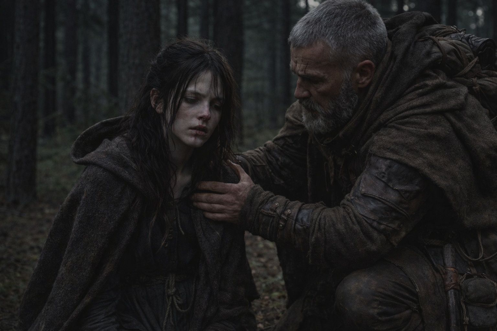
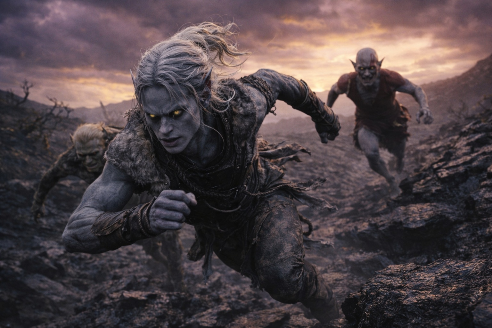
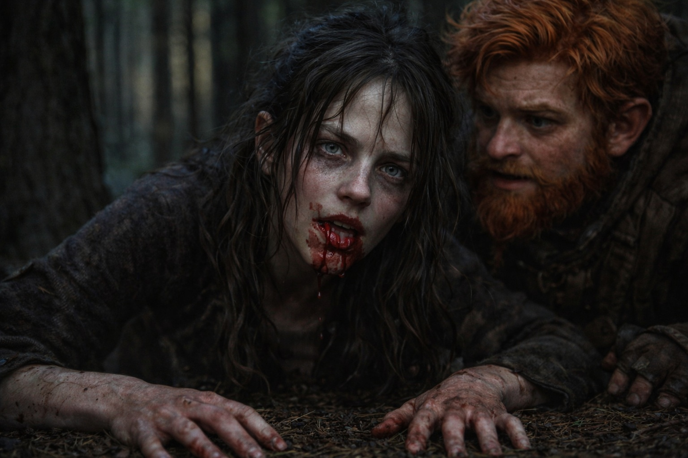
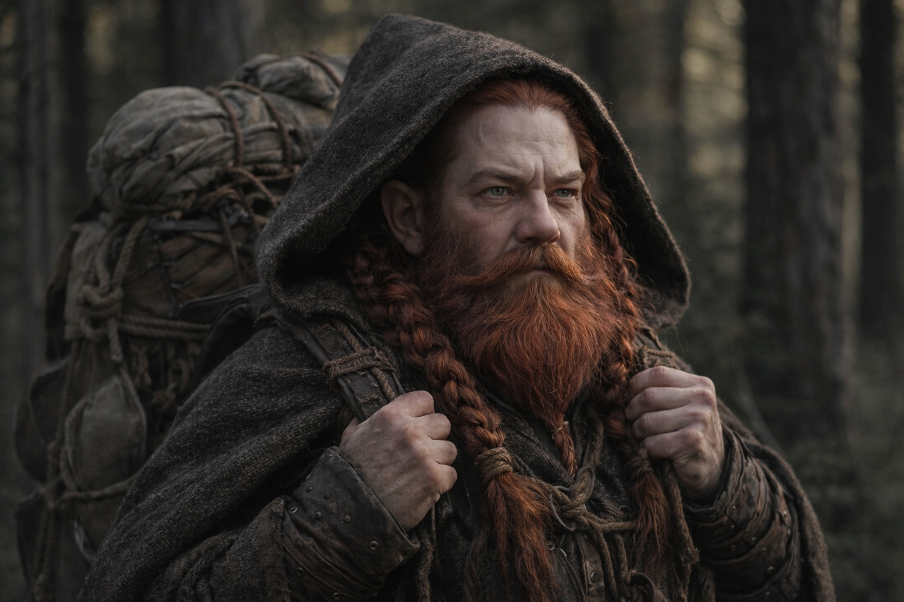

# Capítulo 30.4 | Las Semillas de la Convergencia: La Señal

No tocó el Faro. La visión la encontró de todas formas.

Caminaban. Última hora de la tarde, el bosque de tierras bajas raleando a medida que el terreno viraba al norte, los abedules cediendo paso a rodales de abetos oscuros que crecían cada vez más juntos y bloqueaban la escasa luz que el cielo encapotado dejaba pasar. Balin le contaba una historia a nadie en particular sobre un primo que una vez se comió una bota de cuero por una apuesta, y la historia era cierta o Balin estaba comprobando si alguien lo escuchaba. Maris iba medio paso detrás de Aldric, igualando su ritmo, la mente puesta en el tirón dentro de su pecho que se había vuelto más agudo a lo largo del día, cuando el suelo se ladeó.

No el suelo. Ella.

La visión llegó sin preámbulo, sin la hemorragia nasal que normalmente la precedía, sin la presión en el cráneo que servía de aviso. En un paso caminaba entre abetos. Al siguiente estaba en otro lugar, parada detrás de los ojos de otra persona, sintiendo la urgencia ajena en los músculos de piernas que no eran las suyas.

Él corría.

No el ritmo cauteloso y medido que ella había sentido en la visión del volcán. Corría. A toda velocidad por un terreno que desafiaba la palabra, un paisaje de crestas de piedra negra y vegetación escasa que se retorcía en direcciones que hacían doler los ojos prestados. El cielo sobre él tenía el color de un moretón, púrpuras y amarillos sangrando unos sobre otros en patrones que no seguían ninguna lógica atmosférica que ella conociera. El aire sabía a metal y a algo más, algo orgánico e incorrecto, como el aliento de un ser vivo demasiado grande.

No estaba solo.

Dos figuras corrían con él. Una era pequeña, pegada al suelo, moviéndose con la eficiencia mecánica de una criatura que había calculado exactamente cuánta energía requería cada zancada. Un goblin, pensó ella, aunque el pensamiento le llegó filtrado por la percepción de él y no por la suya propia. La otra era más alta, delgada y angulosa, de piel gris, moviéndose con una gracia fluida que cambiaba y se entrecortaba como si el cuerpo del corredor no pudiera decidirse por una sola forma de ocupar el espacio.

Detrás de ellos, nada visible. Pero la urgencia en las piernas de él, en su respiración, en los cálculos rápidos disparándose a través de una mente que ella podía sentir pero no dirigir, le decía que lo que venía detrás no necesitaba ser visible para estar cerca.

Sus pensamientos eran fragmentarios. Ella captaba pedazos del mismo modo en que atraparías fragmentos de un espejo roto, cada uno reflejando un ángulo diferente del mismo miedo. *La ruta. Este. La cresta cae más allá del marcador.* Un destello de un mapa trazado a mano, líneas que podían ser caminos o patrones de fractura, direcciones que no correspondían a ninguna cartografía que ella reconociera. *Las indicaciones de Szoravel. Confía en ellas o no, pero muévete.* Otro destello: un rostro más viejo, anguloso, ojos de obsidiana, la imagen residual de una conversación que le había dado algo que seguir. *El Faro. No el de ellos. El suyo. El Nulo. Podía sentirlo tirando.*

El Nulo.

La palabra se enganchó en su conciencia. No era una palabra que conociera, pero la mente de él aportó el contexto: un artefacto oscuro, sin rasgos, que llevaba en su mochila, tirando hacia algo al noreste con una fuerza que igualaba el tirón del Faro. Dos piezas del mismo sistema, buscándose a través de la distancia. Él podía sentir la pieza de ellos. El artefacto que ella y Dulint llevaban. Podía sentirlo y corría hacia él.

No hacia ellos. Hacia la señal. Pero la señal eran ellos.

Su pie enganchó una cresta de piedra negra. Tropezó, se sostuvo con manos que ella sintió raspar contra la roca, y siguió corriendo. La sangre brotó de su palma. No la notó. Su mente iba tres pasos adelante, calculando el ángulo del descenso, la distancia al marcador, el tiempo antes de que lo que los seguía los alcanzara.

Ella intentó ver su rostro. La visión no cooperó. Estaba atrapada detrás de sus ojos, compartiendo su impulso hacia adelante, su visión de túnel, su compromiso absoluto con el siguiente paso y el paso después de ese. Pero captó fragmentos en la periferia. El reflejo en un charco de agua estancada que él saltó: piel gris-negra, cabello blanco recogido, ojos violeta-rojizos ardiendo de esfuerzo. Joven. El mismo rostro que había visto en el volcán, pero cambiado. Más duro. Algo en la tensión de su mandíbula que antes no estaba. Había aprendido cosas desde el volcán. No habían sido amables.

La figura pequeña a su lado gritó algo. Ella no pudo oír las palabras, pero el tono se transmitió: advertencia. Práctico. Una cuenta regresiva hacia algo.

Él ajustó su ruta. Giro brusco a la izquierda alrededor de una formación de piedra retorcida. La figura gris y delgada lo siguió, fluyendo alrededor del obstáculo de un modo que era hermoso e inquietante. El goblin lo escaló, compacto y eficiente.

Durante un latido, su mente se aquietó lo suficiente para que un solo pensamiento claro se formara.

*Cerca. Semanas, no meses. La señal es fuerte.*

Él sabía que estaban allí. Al otro lado de lo que separaba su mundo del de ella. Podía sentirlos del mismo modo en que ella podía sentirlo a él. No detalles. No rostros ni nombres. Una presencia. Un tirón. El conocimiento de que en algún lugar, alguien llevaba la otra mitad de lo que él llevaba, y la distancia entre ellos se acortaba.

La visión se resquebrajó.

El dolor irrumpió. Su dolor, no el de él. Estaba de rodillas en el bosque de abetos, la mano de Aldric sobre su hombro, el rostro de Balin cerca del suyo, el sabor a sangre en la boca donde se había mordido la lengua. La hemorragia nasal llegó tarde, la sangre apareciendo después de la visión en vez de antes, como si su cuerpo hubiera estado demasiado sorprendido para protestar a tiempo.

—Volvió. —Su propia voz, áspera. Escupió sangre—. Volvió.

—¿Qué viste? —Aldric, arrodillado, sus ojos recorriendo el rostro de ella buscando signos de algo peor que una hemorragia nasal.

Ella alzó la mirada. El bosque de abetos era oscuro y ordinario y enteramente real. Sus manos temblaban.

—Está cerca —dijo Maris—. A semanas de distancia, no meses. Corre. Tiene gente con él, dos de ellos, y algo detrás que ella no pudo ver pero él podía sentir. —Tragó. El sabor a cobre no se desvanecía—. Puede sentirnos. Nuestro artefacto. Viene hacia la señal.

—Hacia nosotros.

—Hacia el Faro. La distinción importa. —Se presionó la manga contra la nariz. El sangrado era leve. Un peaje menor. Pagaría más después—. Lleva una pieza del sistema. El Nulo. Tira hacia el nuestro del mismo modo en que el nuestro tira hacia el suyo. Dos mitades del mismo circuito roto intentando cerrarse.

Dulint había dejado de caminar. Estaba diez pasos atrás, la mochila pesada sobre los hombros, el Faro dentro de ella zumbando con una frecuencia que Maris podía sentir desde donde estaba. Su rostro era ilegible. Sus manos aferraban las correas de la mochila con una fuerza que le blanqueó los nudillos.

—Y lo que sea que lo persigue —dijo Aldric.

Maris cerró los ojos. La imagen residual del cielo amoratado persistía, las crestas de piedra negra, la sensación de una geografía vasta y hostil. La cosa detrás de él que no necesitaba ser visible para ser letal.

—Ahora también sabe de nosotros. —Abrió los ojos—. El sistema está conectado. Cuando ella lo sintió, lo que sea que lo sigue sintió la conexión. La señal va en ambas direcciones.

El bosque de abetos estaba en silencio. Viento en la copa alta. El crujido de la madera fría.

Aldric se puso de pie. Su expresión había superado la evaluación para convertirse en algo más profundo, el rostro de un hombre recalculando cada variable en una ecuación que acababa de duplicar su complejidad.

—Seguimos adelante —dijo—. Más rápido.

Nadie discrepó. Nadie podía.

---

**Fin del Capítulo 30.4 —>  30.5: [Las Semillas de la Convergencia: El Compromiso](/las-semillas-de-la-convergencia-el-compromiso/)**
