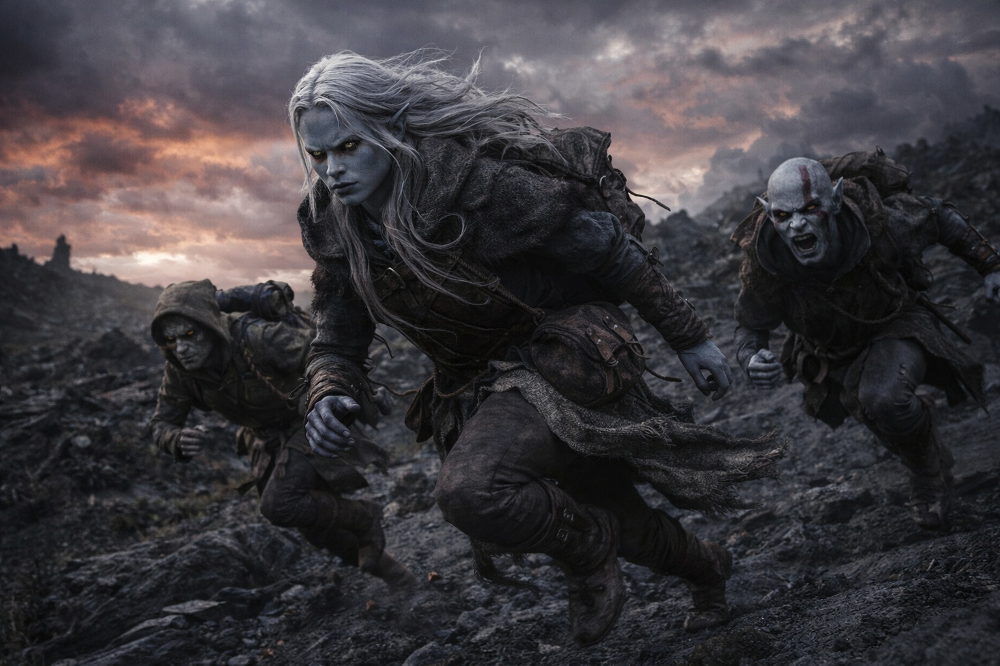
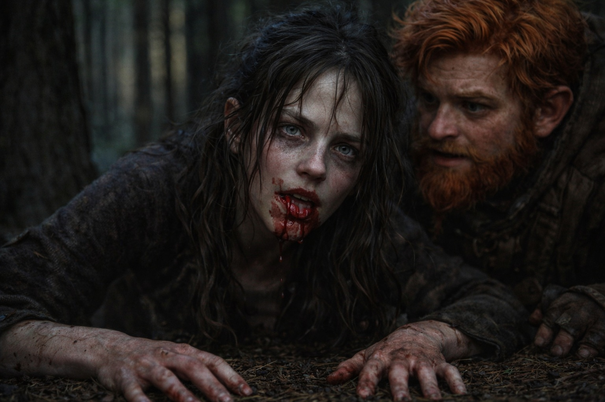

# Capítulo 30.4 | Las Semillas de la Convergencia: La Señal

No tocó el Faro. La visión la encontró de todas formas.

Caminaban. Última hora de la tarde, el bosque de tierras bajas raleando a medida que el terreno viraba al norte, los abedules cediendo paso a rodales de abetos oscuros que crecían cada vez más juntos y bloqueaban la escasa luz que el cielo encapotado dejaba pasar. Balin le contaba una historia a nadie en particular sobre un primo que una vez se comió una bota de cuero por una apuesta, y la historia era cierta o Balin estaba comprobando si alguien lo escuchaba. Maris iba medio paso detrás de Aldric, igualando su ritmo, la mente puesta en el tirón dentro de su pecho que se había vuelto más agudo a lo largo del día, cuando el suelo se ladeó.

No el suelo. Ella.

La visión llegó sin preámbulo, sin la hemorragia nasal que normalmente la precedía, sin la presión en el cráneo que servía de aviso. En un paso caminaba entre abetos. Al siguiente estaba en otro lugar, parada detrás de los ojos de otra persona, sintiendo la urgencia ajena en los músculos de piernas que no eran las suyas.

Él corría.

Corría entre crestas de piedra negra. Los arbustos dispersos le rozaban las piernas. Bajo el cielo morado y amarillo, Maris sentía cómo le ardían los pulmones en cada respiración.

No estaba solo.

Un goblin corría a su lado. Más lejos, un elfo delgado de piel blanca azulada mantenía el paso, cambiando de movimiento cada vez que el terreno ascendía.

Detrás de ellos, nada visible. Pero la urgencia en las piernas de él, en su respiración, en los cálculos rápidos disparándose a través de una mente que ella podía sentir pero no dirigir, le decía que lo que venía detrás no necesitaba ser visible para estar cerca.

Captó fragmentos de pensamiento. *Al este. La cresta desciende después del mojón.* Un vistazo a un mapa y luego el rostro de un drow mayor. *La ruta de Szoravel. Sigue.* Sintió la presión de un objeto bajo su camisa. *El Null.*

El Null.

Sintió su contorno contra el pecho, pero la atracción venía de un lugar que no lograba distinguir de la propia conciencia de él. Seguía una señal. Reconoció en ella el pulso del Faro.

No hacia ellos. Hacia la señal. Pero la señal eran ellos.

Su pie enganchó una cresta de piedra negra. Tropezó, se sostuvo con manos que ella sintió raspar contra la roca, y siguió corriendo. La sangre brotó de su palma. No la notó. Su mente iba tres pasos adelante, calculando el ángulo del descenso, la distancia al marcador, el tiempo antes de que lo que los seguía los alcanzara.

Bajó la vista al saltar un charco. Maris captó su reflejo: piel gris ceniza azulada, cabello blanco recogido, ojos amarillos. La cara de la cámara. Tenía la mandíbula apretada.

La figura pequeña a su lado gritó algo. Ella no pudo oír las palabras, pero el tono se transmitió: advertencia. Práctico. Una cuenta regresiva hacia algo.

Giró a la izquierda para rodear una cresta de piedra. El elfo lo siguió; el goblin trepó por encima.

Durante un latido, su mente se aquietó lo suficiente para que un solo pensamiento claro se formara.

*Cerca. Semanas, no meses. La señal es fuerte.*

Él podía sentir su señal. Ella no sabía si estaba corriendo ahora o si veía algo que aún no había ocurrido.

La visión se resquebrajó.

Cayó de rodillas entre los abetos. Aldric la sostuvo por el hombro. La lengua mordida le llenaba la boca de sangre y ahora también le sangraba la nariz.

—Volvió. —Su propia voz, áspera. Escupió sangre—. Volvió.

—¿Qué viste? —Aldric, arrodillado, sus ojos recorriendo el rostro de ella buscando signos de algo peor que una hemorragia nasal.

Ella alzó la mirada. El bosque de abetos era oscuro y ordinario y enteramente real. Sus manos temblaban.

—Semanas, pensaba él. No meses. —Maris tragó sangre—. Dos personas corrían con él. Algo los seguía, pero ella no pudo verlo. Venía hacia nuestra señal. Ella no sabe cuándo.

—Hacia nosotros.

—Hacia el Faro. —Se apretó la manga contra la nariz—. Lleva algo llamado Null. Lo tenía contra el pecho. Ella no pudo distinguir qué hacía.

Dulint había dejado de caminar. Estaba diez pasos atrás, la mochila pesada sobre los hombros, el Faro dentro de ella zumbando con una frecuencia que Maris podía sentir desde donde estaba. Su rostro era ilegible. Sus manos aferraban las correas de la mochila con una fuerza que le blanqueó los nudillos.

—Y lo que sea que lo persigue —dijo Aldric.

Maris cerró los ojos. Todavía sentía el esfuerzo de aquella carrera.

—Puede que también la haya sentido a ella. —Abrió los ojos—. Ella llegó hasta él. No sabe qué más lo notó.

El bosque de abetos estaba en silencio. Viento en la copa alta. El crujido de la madera fría.

Aldric se levantó y miró atrás por el sendero.

—Seguimos adelante —dijo—. Más rápido.

Nadie discrepó. Nadie podía.

---

**Fin del Capítulo 30.4 —>  30.5: [Las Semillas de la Convergencia: El Compromiso](/las-semillas-de-la-convergencia-el-compromiso/)**
