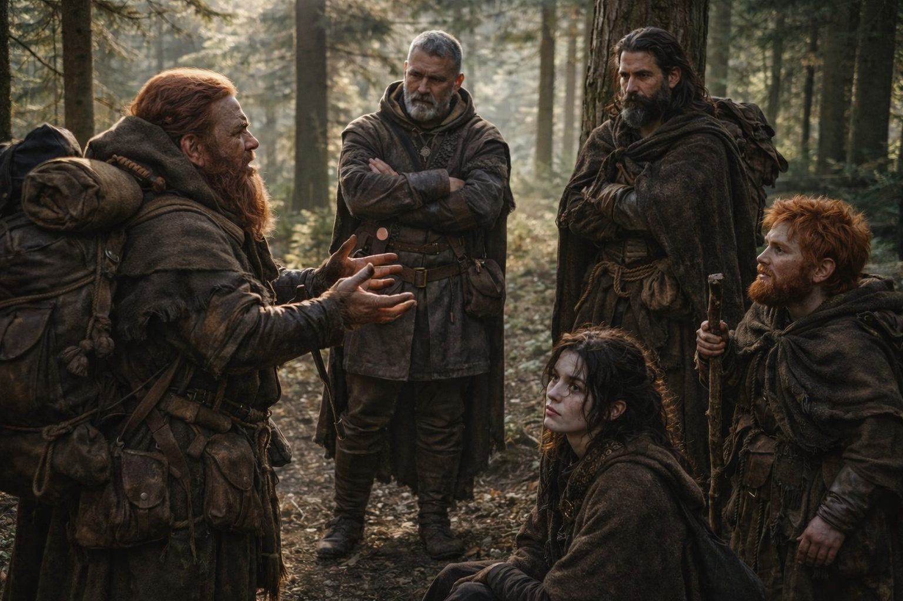
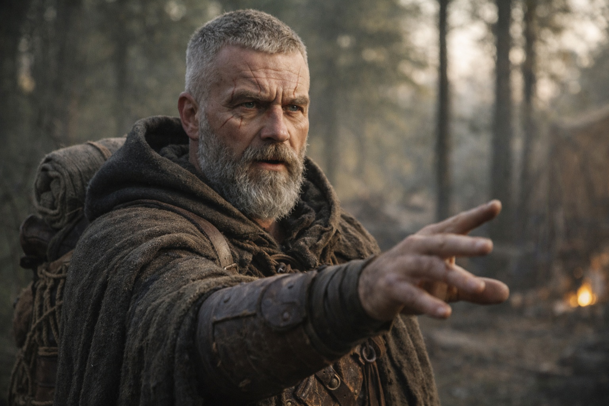
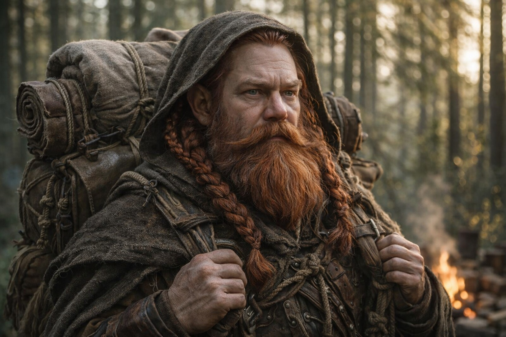
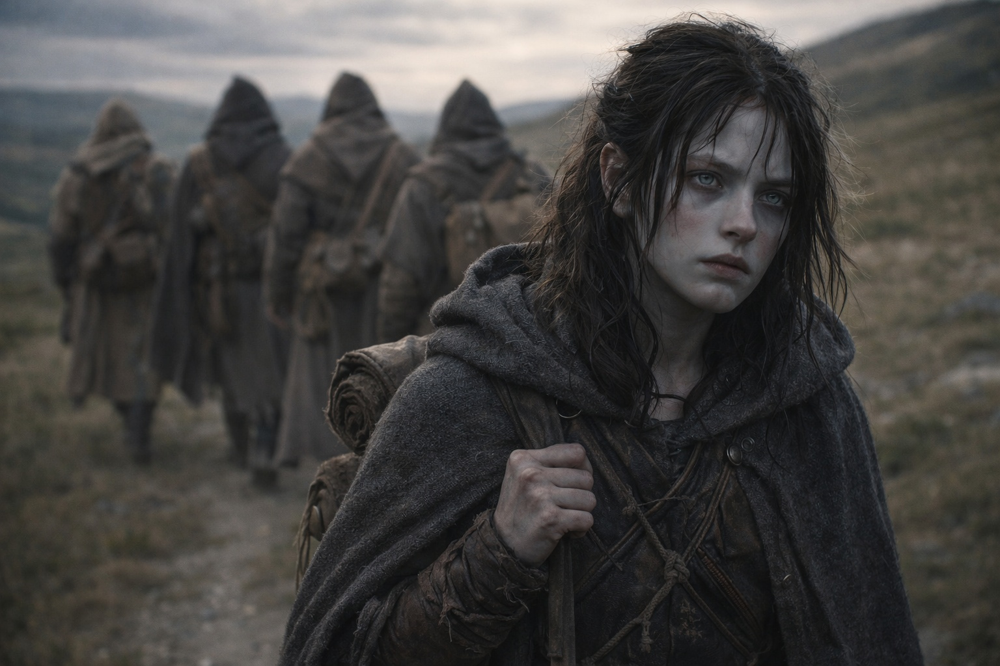
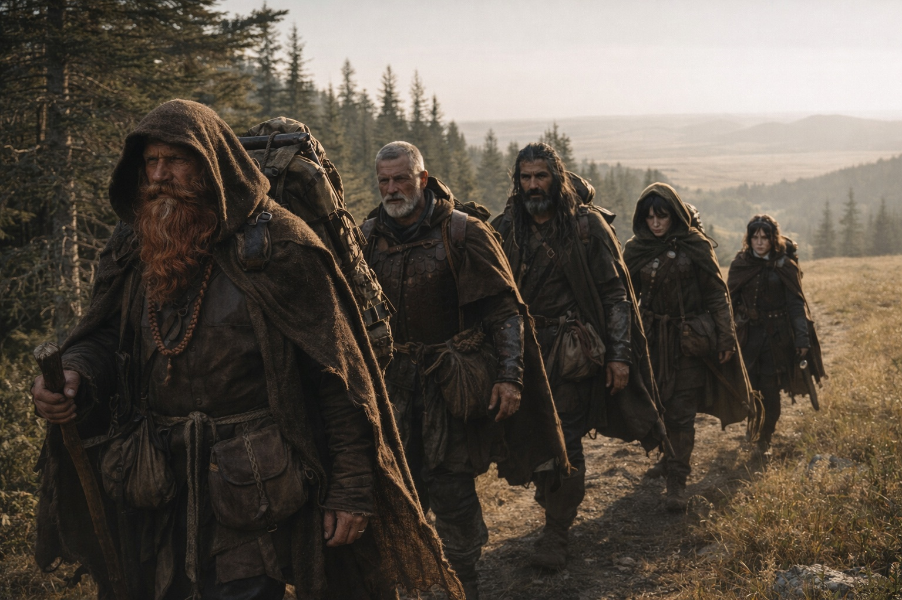

## Capítulo 33 | Parte 3 | El Cambio de Rumbo

---

La discusión duró una hora y no resolvió nada excepto la dirección.

Dulint quería seguir la misión original. Noreste hasta el punto de convergencia. La barrera, el destino, aquello hacia lo que habían estado caminando desde Zuraldi. La persona que portaba el otro artefacto era problema de otro. Su problema era el sistema, el Faro, y lo que fuera que aguardaba en el punto donde el tirón los había estado guiando.

—No conocemos a este hombre —dijo Dulint. Su voz tenía la firmeza cuidadosa de alguien cuyo argumento estaba construido sobre la parte de la verdad que podía soportar compartir—. Conocemos el Faro. Sabemos que nos estaba guiando a algún lugar antes de empezar a guiarnos hacia alguien. Ese lugar sigue existiendo.

—El lugar era dondequiera que él estuviera parado —dijo Maris—. Nunca hubo un punto fijo.

—No sabes eso.

—Ella sabe que el Faro rastrea su artefacto. Sabe que el artefacto se mueve con él. El punto fijo era una coincidencia de su quietud.

Aldric cortó en seco. —Si él lleva la otra mitad de este sistema, entonces es la persona más importante en lo que sea que esté ocurriendo. —Sostenía la dirección del Faro en su mente como sostenía líneas de visión y rutas de escape, con la claridad táctica de alguien que había pasado una carrera leyendo geometría de amenazas—. Lo alcanzamos, tenemos ambas piezas. Tenemos ventaja. Tenemos opciones.

—Tenemos a un hombre que no conocemos —dijo Dulint—, portando algo que no entendemos, al otro lado de una barrera que no podemos cruzar.

—¿Podemos cruzarla? —preguntó Balin.

La pregunta iba dirigida a Xandor. El viejo druida estaba sentado contra un árbol, su mano izquierda abriéndose y cerrándose en su ritmo involuntario. Había permanecido callado durante la discusión, el silencio particular de un hombre que estaba procesando información a través de un marco al que los demás no tenían acceso.

—La barrera no es un muro —dijo Xandor—. Es una membrana. Las cosas la atraviesan. Personas la han atravesado, históricamente. Pero el cruce requiere compatibilidad o circunstancia, y no tenemos ninguna de las dos. —Hizo una pausa. Su mano buena tocó el árbol junto a él. Escuchó—. Sin embargo. El Faro es un componente del sistema que genera la barrera. Puede tener propiedades en el borde de la barrera que aún no hemos observado. La proximidad puede revelar función.

—Puede —dijo Aldric.

—Puede —confirmó Xandor—. No tengo la costumbre de garantizar cosas que no he probado.

—Entonces el plan es: caminar hacia la barrera, esperar que el Faro haga algo útil cuando lleguemos, y de alguna manera alcanzar a un hombre al otro lado de la frontera más peligrosa en la historia registrada. —La voz de Aldric era plana. La planitud que significaba que ya había aceptado el plan y estaba furioso por ello.

—El plan es seguir al Faro —dijo Maris—. El Faro ahora lo rastrea a él. Lo que fuera que iba a hacer cuando alcanzara la barrera, aún va a hacerlo. El destino no ha cambiado. Solo nuestra comprensión de él.

Dulint miraba fijamente el pozo de fuego. Sus dedos gruesos trabajaban la correa de su mochila, un hábito nervioso que Maris había notado aumentar en las últimas semanas. La mochila contenía el Faro y cualquier peso que el Faro hubiera puesto sobre los hombros del viejo enano desde el día en que lo encontró.

—Si seguimos su rumbo —dijo Dulint lentamente—, ya no estaremos caminando hacia la convergencia. Estaremos caminando hacia una persona.

—Sí.

—¿Y si esa persona se aleja de la convergencia?

—Entonces la convergencia nunca fue un lugar.

Dulint cerró los ojos. El argumento que quería hacer, Maris podía sentirlo presionando contra su silencio. La advertencia de la vidente. La visión que cargaba como una segunda mochila, la que nadie podía ver, la que hacía cada decisión más pesada y cada ruta más lenta. Podía sentir su miedo como sentía el Faro, como una frecuencia, baja y constante y agotadora.

No lo dijo. Abrió los ojos y se echó la mochila al hombro y se puso de pie.

—El noreste aún funciona —dijo—. Por ahora.

No era acuerdo. Era la ausencia de una objeción mejor. Serviría.

Aldric levantó el campamento en siete minutos. La eficiencia de un hombre que había decidido un curso de acción y no toleraría que el campamento existiera un segundo más de lo necesario. Balin se puso en fila sin quejarse, su bastón encontrando suelo con un ritmo que se había vuelto tan natural como respirar. Xandor se movía despacio, su cuerpo aún recuperándose del daño que Maris no podía ver del todo, el costo interno de la proximidad a un sistema que usaba carne humana como antena.

Caminaron hacia el noreste. La misma dirección que antes, por ahora. El rumbo del Faro y el curso original se superponían lo suficiente como para hacer el cambio invisible a cualquiera que no lo estuviera sintiendo desde adentro.

Maris lo sentía. La cualidad del tirón había cambiado. Antes, había sido geográfico, el jalón constante de una brújula apuntando al norte verdadero, fiable e impersonal. Ahora era personal. El tirón tenía un latido. Un ritmo que correspondía a la zancada de alguien, la respiración de alguien, el avance de alguien a través de un paisaje que Maris solo podía ver en fragmentos y pagaba con sangre.

Él caminaba hacia el este. Ellos caminaban hacia el noreste. Las líneas convergían en algún punto adelante, en un lugar que se movía porque una de sus coordenadas era una persona y la otra era lo que el Faro pretendía hacer cuando la distancia se cerrara.

Aldric se puso a su paso mientras el bosque se abría hacia terreno abierto.

—Si él lleva la otra mitad del Faro —dijo—, entonces necesitamos alcanzarlo antes de que él alcance la barrera. Porque si el Faro está así de ansioso desde aquí, imagina hacia qué está caminando él.

Maris lo miró. Los ojos grises de Aldric tenían la intensidad particular de un hombre que había pasado años viendo a personas caminar hacia cosas que no entendían, y teniendo razón sobre el resultado, y odiando la prueba.

—Ella lo intenta —dijo Maris.

—Inténtalo más rápido.

Él se adelantó. Maris caminó detrás de él, el Faro zumbando en la mochila de Dulint cuatro pasos delante de ella, el tirón en su pecho constante y personal y apuntando hacia un elfo oscuro que nunca había conocido cuyo miedo había llevado puesto como piel prestada.

Lo intentó más rápido. El dolor de cabeza detrás de sus ojos construyó otro piso.

---

**Fin del Capítulo 33.3  —> 33.4: [Lo Que el Faro Perdió: La Distancia](/lo-que-el-faro-perdio-la-distancia/)**
