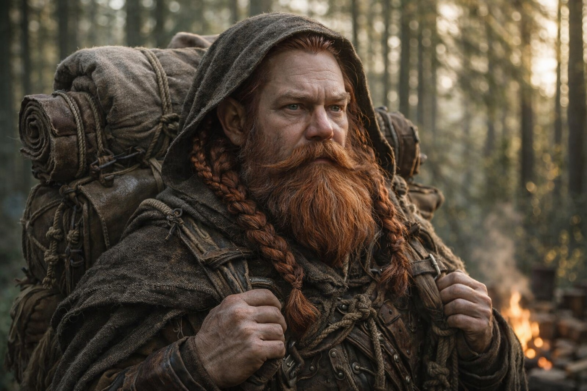

## Capítulo 33 | Parte 3 | El Cambio de Rumbo

---

La discusión duró una hora y no resolvió nada excepto la dirección.

Dulint quería seguir el rumbo original. Los había llevado hasta allí desde Zuraldi. No estaba dispuesto a desviarse por un hombre al que solo habían visto en visiones.

—No lo conocemos —dijo Dulint—. El Faro nos llevaba a algún sitio antes de empezar a seguirlo. Ese lugar sigue existiendo.

—Sentimos varias señales —dijo Maris—. Esta se mueve. No podemos seguir el rumbo anterior y esperar encontrarlo.

—No sabes eso.

—Ella sabe lo que vio. Él giró y la atracción cambió con él.

—Lleva un componente que necesitamos —dijo Aldric—. Si lo alcanzamos, quizá obtengamos respuestas. Si seguimos hacia una marca antigua, quizá no encontremos nada.

—Tenemos a un hombre que no conocemos —dijo Dulint—, portando algo que no entendemos, al otro lado de una barrera que no podemos cruzar.

—¿Podemos cruzarla? —preguntó Balin.

Xandor estaba sentado contra un árbol, flexionando la mano herida. Se detuvo cuando Balin lo miró.

—La barrera no es un muro —dijo Xandor—. Es una membrana. Las cosas la atraviesan. Personas la han atravesado, históricamente. Pero el cruce requiere compatibilidad o circunstancia, y no tenemos ninguna de las dos. —Hizo una pausa. Su mano buena tocó el árbol junto a él. Escuchó—. Sin embargo. El Faro es un componente del sistema que genera la barrera. Puede tener propiedades en el borde de la barrera que aún no hemos observado. La proximidad puede revelar función.

—Puede —dijo Aldric.

—Puede —confirmó Xandor—. No tengo la costumbre de garantizar cosas que no he probado.

—Así que seguimos el rumbo y esperamos que el Faro nos deje cruzar cuando lleguemos. —Aldric miró a Maris—. ¿Ese es el plan?

—Seguir el rumbo y buscar un paso —dijo Maris—. Ella puede seguir comprobando dónde está. No puede prometer qué ocurrirá en la barrera.

Dulint miró el lugar de la hoguera y retorció la correa de la mochila entre los dedos.

—Si seguimos su rumbo —dijo Dulint lentamente—, ya no estaremos caminando hacia la convergencia. Estaremos caminando hacia una persona.

—Sí.

—¿Y si esa persona se aleja de la convergencia?

—Entonces decidimos si seguimos tras él.

Dulint miró hacia Balin. Maris recordó la nota y esperó la objeción. No llegó.

Dulint tomó aire, se echó la mochila al hombro y se levantó.

—El noreste aún funciona —dijo—. Por ahora.

No era acuerdo. Era la ausencia de una objeción mejor. Serviría.

Aldric los tuvo listos en siete minutos. Balin probó la pierna antes de ponerse en marcha. Xandor necesitó ayuda para ajustar la correa sobre el hombro herido.

Caminaron hacia el noreste. La misma dirección que antes, por ahora. El rumbo del Faro y el curso original se superponían lo suficiente como para hacer el cambio invisible a cualquiera que no lo estuviera sintiendo desde adentro.

La atracción cambiaba mientras caminaba. Corrigió el rumbo un poco al este y Dulint siguió su indicación.

Tendría que seguir haciéndolo. No había un destino fijo que pudiera darle a Aldric para que él lo encontrara.

Aldric se puso a su paso mientras el bosque se abría hacia terreno abierto.

—Lleva un componente que necesitamos —dijo Aldric—. Deberíamos alcanzarlo antes de que llegue a la barrera. La señal ya te hace daño aquí.

Él miró el paño que llevaba en la mano. Ella dobló la parte manchada de sangre hacia dentro.

—Ella lo intenta —dijo Maris.

—Inténtalo más rápido.

Aldric se adelantó. Maris siguió a cuatro pasos de Dulint, sin perder la atracción.

Lo intentó de nuevo. El dolor se extendió del ojo izquierdo a la mandíbula.

---

**Fin del Capítulo 33.3  —> 33.4: [Lo Que el Faro Perdió: La Distancia](/lo-que-el-faro-perdio-la-distancia/)**
