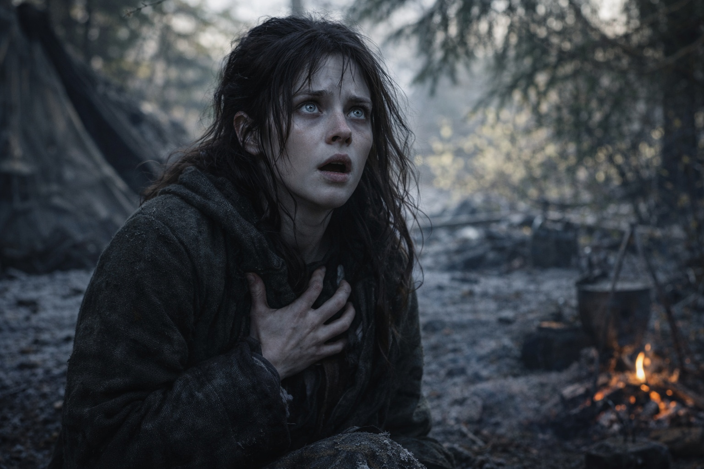
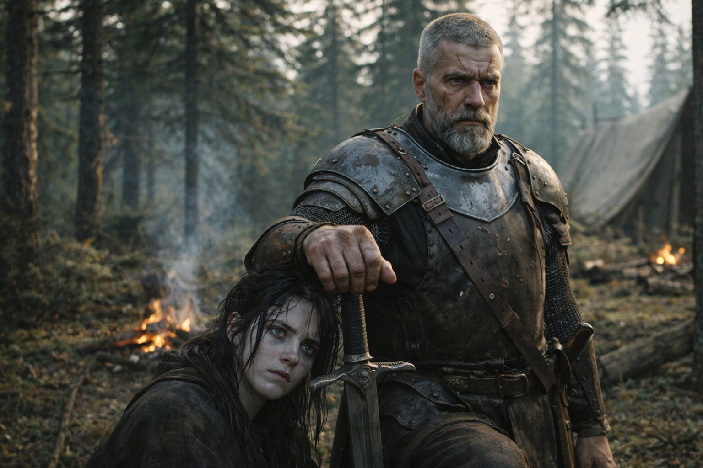
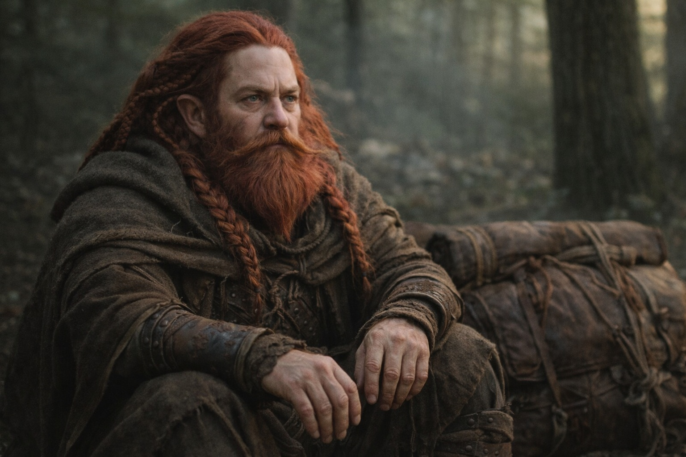
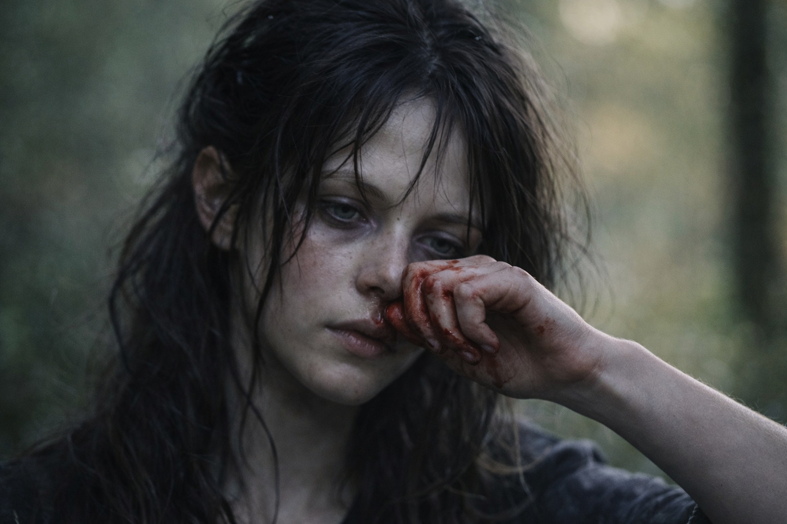

# Capítulo 33.1 | Lo Que el Faro Perdió: El Titubeo

---

El Faro dejó de apuntar al norte.

Maris lo sintió primero, del mismo modo en que había sentido cada cambio desde el bosque de abetos, como una perturbación en el espacio detrás de sus costillas donde vivía el tirón. El tirón había sido constante desde que cruzaron la frontera de Frostgard. Noreste. Firme. Fiable como lo es una brújula, dando dirección sin explicación, sin pedir nada a cambio de su claridad.

Entonces titubeó.

No un corte. No una parada. Un titubeo, ese tipo de vacilación que hacen las máquinas cuando sus entradas de repente discrepan. El tirón se fragmentó, se dispersó, y durante una respiración apuntó a todas partes a la vez, como si aquello que rastreaba se hubiera multiplicado o disuelto o movido en una dirección que no correspondía a ninguna geografía que ella comprendiera.

—¿Maris? —la voz de Xandor. La observaba desde el otro lado del campamento matutino. Su brazo izquierdo descansaba en el cabestrillo, quieto, la mano cerrándose y abriéndose en los ejercicios involuntarios que llevaba haciendo desde que la sensibilidad empezó a regresar—. ¿Qué pasa?

Ella levantó una mano. Espera.

El Faro estaba en la mochila de Dulint, a tres metros. Podía sentirlo a través del cuero, la tela y el envoltorio que el viejo enano le había puesto alrededor. Zumbaba. No el zumbido direccional que significaba noreste. Un zumbido de búsqueda. El sonido que hace un diapasón cuando alguien cambia la nota que se supone debe coincidir.

Entonces se estabilizó.

El tirón regresó. No al noreste. No al norte. Una dirección que no podía nombrar porque no era fija. Se movía. Lenta, continuamente, como un dedo trazando un camino en un mapa.

—Algo cambió —dijo.

Aldric estaba a su lado en tres pasos. Había estado revisando la línea de árboles al sur, el escaneo periférico habitual que se había vuelto tan automático como respirar desde que las capas grises empezaron a seguirlos. Su mano descansaba en el pomo de la espada, sin desenfundar, solo tocando. Confirmando.

—¿Cambiado cómo?

—La dirección. Era noreste. Ahora es... —Buscó el tirón. Lo siguió. El Faro rastreaba algo que se movía—. Está cambiando. Este-noreste. Y moviéndose.

—La barrera no se mueve.

—No.

Balin se acercó cojeando, su bastón encontrando suelo blando en el claro del campamento. Su pantorrilla había mejorado lo suficiente como para que el bastón fuera precaución en vez de necesidad, pero lo conservaba.

—¿Nos equivocamos de camino? ¿Nos saltamos un desvío?

—Los Faros no tienen desvíos —dijo Xandor. Ya estaba de pie, su mano buena presionada contra el tronco del abeto más cercano, lo cual Maris había dejado de encontrar extraño hacía semanas—. Si la dirección cambió, el objetivo cambió.

—Los objetivos no cambian.

—Este sí lo hizo.

Dulint estaba callado. Sentado junto a su mochila con las manos sobre las rodillas y sus ojos de hierro mineral fijos en Maris, y su silencio tenía la cualidad que siempre tenía cuando el artefacto estaba involucrado: la quietud particular de un hombre sosteniendo un secreto que cada vez era menos suyo para guardar.

—El tirón es diferente —dijo Maris. Cerró los ojos. Buscó. El Faro respondió, su frecuencia clara y afilada, más afilada de lo que había sido en días. Pero la cualidad era incorrecta. Ya no geográfica. Ya no una dirección apuntando hacia un lugar fijo en un mapa. Personal. La frecuencia tenía el peso de una persona en ella. La textura de la respiración de alguien, el movimiento de alguien, el miedo de alguien.

Abrió los ojos.

—No apunta a la barrera.

Cinco rostros la miraron. Cinco versiones distintas de la misma pregunta.

—Apunta a algo que se mueve. Algo vivo. —Se presionó una mano contra el esternón donde vivía el tirón—. El objetivo cambió. Ya no rastrea un lugar.

Durante una respiración, había apuntado a todas partes. Luego se había fijado en una dirección que se movía. No al norte. No a la barrera. Otra cosa. Algo que portaba la otra mitad de lo que descansaba en la mochila de Dulint y se movía por un paisaje que Maris no podía ver pero sí sentir, vasto e incorrecto y ardiente.

El Faro zumbó. La nueva frecuencia era clara y certera y dirigida, y seguía a algo que caminaba.

La sangre corrió desde la fosa nasal izquierda de Maris. La limpió con el dorso de la mano y no la miró.

—Tenemos que hablar —dijo.

---

*Siguiente: Lo Que el Faro Perdió: La Revelación*

**Fin del Capítulo 33.1 — continúa en el Capítulo 33.2: [Lo Que el Faro Perdió: La Revelación](/lo-que-el-faro-perdio-la-revelacion/)**