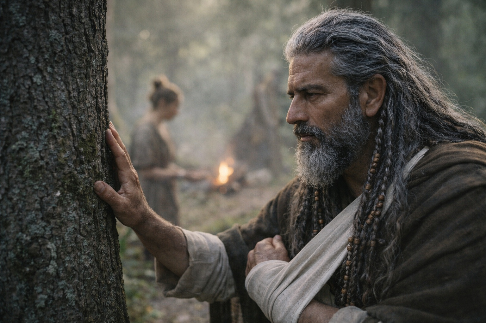
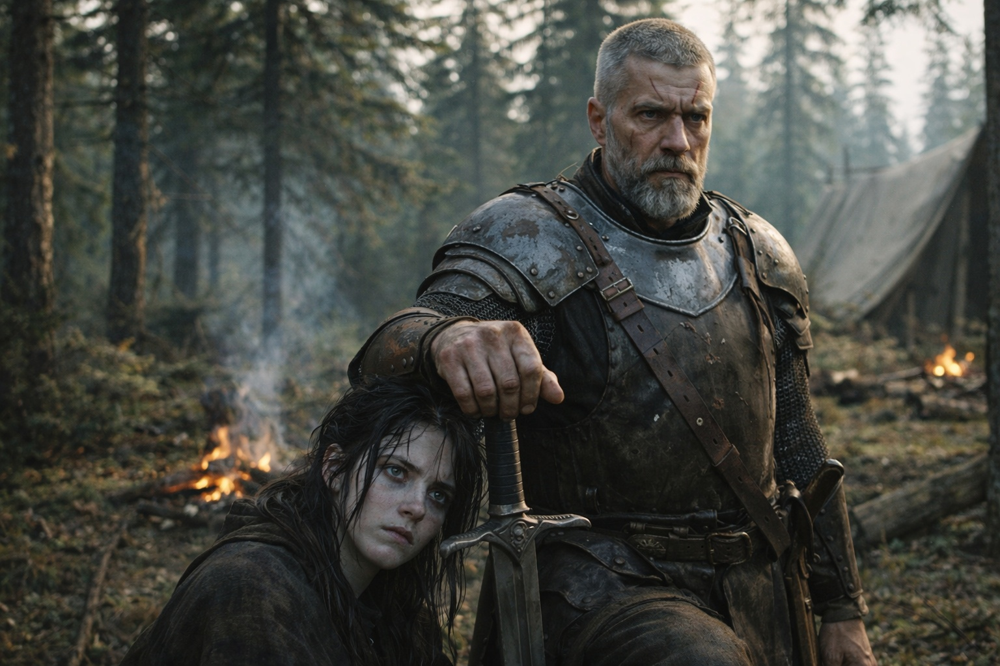

## Capítulo 33 | Parte 1 | El Titubeo

---

---

El Faro perdió el rumbo al noreste.

Maris se detuvo junto al fuego de la mañana. La atracción que había seguido desde la frontera se debilitaba.

Entonces titubeó.

Durante una respiración no pudo distinguir las direcciones. Giró la cabeza, pero ninguna se mantuvo fija.

—¿Maris? —la voz de Xandor. La observaba desde el otro lado del campamento matutino. Su brazo izquierdo descansaba en el cabestrillo, quieto, la mano cerrándose y abriéndose en los ejercicios involuntarios que llevaba haciendo desde que la sensibilidad empezó a regresar—. ¿Qué pasa?

Ella levantó una mano. Espera.

El Faro zumbaba en la mochila de Dulint, a tres metros. La nota subía y bajaba mientras ella intentaba encontrar de nuevo la atracción.

Entonces se estabilizó.

El tirón regresó con otro ángulo. Mientras lo seguía, el rumbo continuó cambiando.

—Algo cambió —dijo.

Aldric dejó su puesto junto a los árboles del sur y se acercó a ella. Apoyaba la mano en el pomo de la espada.

—¿Cambiado cómo?

—La dirección. Era noreste. Ahora es... —Buscó el tirón. Lo siguió. El Faro rastreaba algo que se movía—. Está cambiando. Este-noreste. Y moviéndose.

—La barrera no se mueve.

—No.

Balin se acercó cojeando, su bastón encontrando suelo blando en el claro del campamento. Su pantorrilla había mejorado lo suficiente como para que el bastón fuera precaución en vez de necesidad, pero lo conservaba.

—¿Nos equivocamos de camino? ¿Nos saltamos un desvío?

—Los Faros no tienen desvíos —dijo Xandor. Ya estaba de pie, su mano buena presionada contra el tronco del abeto más cercano, lo cual Maris había dejado de encontrar extraño hacía semanas—. Si la dirección cambió, el objetivo cambió.

—Los objetivos no cambian.

—Este sí lo hizo.

Dulint estaba sentado junto a la mochila, mirando a Maris. No había tocado el cierre desde que ella levantó la mano.

—Se siente distinto. —Cerró los ojos. Bajo el pulso captó un ritmo que reconocía: alguien caminando, respirando con esfuerzo.

Abrió los ojos.

—No apunta a la barrera.

Los otros cuatro la miraron.

—El hombre de las visiones. Ella cree que se ha fijado en él. —Se llevó una mano al pecho—. Ahora puede seguir su movimiento.

En el bosque de abetos lo había sentido siguiendo la señal de ellos. Ahora el Faro le daba su dirección a cada paso.

Giró la cabeza para seguirlo. El tirón continuó hacia el este.

La sangre corrió desde la fosa nasal izquierda de Maris. La limpió con el dorso de la mano y no la miró.

—Tenemos que hablar —dijo.

---

**Fin del Capítulo 33.1  —> 33.2: [Lo Que el Faro Perdió: La Revelación](/lo-que-el-faro-perdio-la-revelacion/)**
