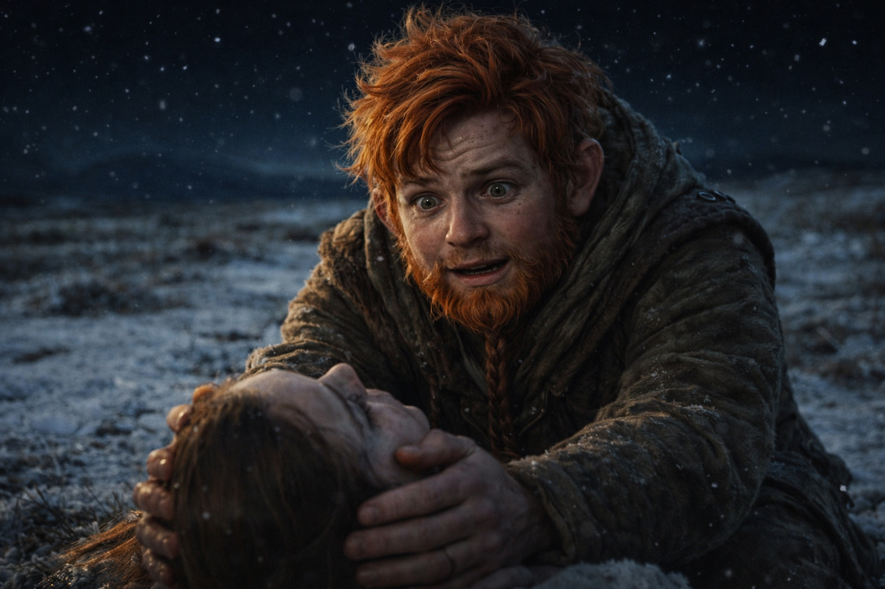
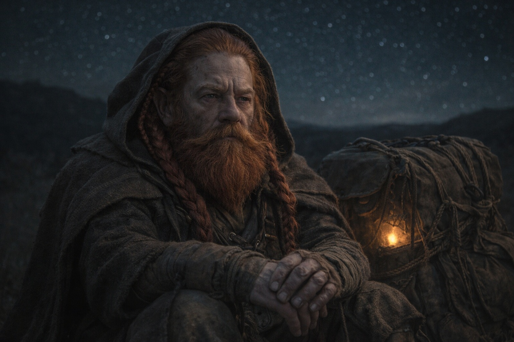

## Capítulo 33 | Parte 4 | La Distancia

---

Maris lo buscó en la tercera noche y encontró la distancia.

La imagen se aclaró, pero no podía llegar más allá. Cada intento encontraba la misma resistencia.

Estaba sentada al borde del campamento, en las colinas que seguían al bosque de abetos. Al anochecer, Aldric había visto las capas grises tres colinas al sur. Ahora vigilaba esa dirección.

Cerró los ojos. Buscó. El Faro respondió.

Primero llegó el calor. Después vio las crestas negras bajo un cielo morado y notó un sabor metálico. Apretó más las manos contra el suelo helado.

Caminaba con el goblin y el elfo pálido. La mujer de la armadura iba delante. Maris podía ver a los cuatro, pero seguía sin sentir nada de ella.

Veía el camino a los pies de él con más claridad que la hierba helada bajo sus propias manos. Cuando intentó llegar hasta él, la barrera la detuvo.

Estaba cansado y tenía miedo. Cuando la mujer se detenía, él se detenía; cuando avanzaba, la seguía. Maris intentó captar un pensamiento lo bastante claro para entenderlo y lo perdió.

Entonces sintió otra presencia a través de él. El zumbido del Faro aumentó cuando intentó separarla de sus pensamientos.

El Faro gritó.

El pulso la golpeó antes de que pudiera retirarse. La visión se volvió blanca y su cabeza chocó contra el suelo. Cuando volvió a ver, miraba las estrellas sobre su campamento.

La sangre le corría de la nariz y del oído izquierdo. El dolor se extendió por el cráneo hasta impedirle levantar la cabeza.

Balin se arrodilló a su lado y le sostuvo la cabeza. Le temblaban las manos.

—Estoy aquí —dijo ella. Las palabras salieron arrastradas—. Estoy de vuelta.

—¿Qué tan lejos? —La voz de Aldric. Desde algún lugar a su izquierda. No podía girar la cabeza.

—Lejos.

—¿Qué tan lejos, Maris?

Cerró los ojos para recordar. Crestas negras, los tres compañeros y la resistencia que le había impedido llegar más lejos.

—Wyrmreach. Al otro lado de la barrera. —El rostro de Balin se desdibujaba sobre ella—. Ella puede verlo. No ha encontrado cómo llegar hasta él. Camina al este, hacia la barrera desde dentro.

—Si camina hacia la barrera —dijo Xandor—, entonces la distancia se cierra.

—No lo suficientemente rápido. Ni de cerca lo suficientemente rápido. La barrera es... ella puede sentirla. Está entre nosotros. No solo distancia. Un límite. El Faro puede percibirlo a través de ella, pero nosotros no podemos cruzarla. Estamos del lado equivocado.

Aldric se agachó junto a Balin, lo bastante cerca para que ella pudiera verlo sin girarse.

—¿Puedes decirle que estamos aquí?

—No.

—¿Puedes enviarle una señal? ¿A través del Faro?

—Siente una señal. Ella no sabe si podría entender un mensaje. —Tragó saliva—. Había otra presencia. Cuando intentó verla, el pulso la golpeó.

—¿Cómo te golpeó?

—La frecuencia se disparó. Por eso estoy en el suelo.

Silencio. El viento cruzó el terreno abierto. Las capas grises eran invisibles ahora, tragadas por la noche tres colinas al sur.

Dulint estaba sentado junto a la mochila, con ambas manos sobre ella. El Faro seguía zumbando mientras esperaba a que Maris recuperara el aliento.

—Seguimos —dijo Dulint—. Nos acercamos hasta donde permita la barrera. Si algo cambia, quiero que estemos allí para verlo.

—¿Algo cambiará? —preguntó Balin.

Nadie respondió.

Maris se quedó quieta mientras los otros discutían la ruta. La atracción seguía allí. Le decía dónde mirar, no cómo llegar.

Podía verlo. No podía alcanzarlo.

El Faro zumbaba.

Balin mantuvo la mano bajo su cabeza hasta que pudo sentarse.

Esperó a que cediera el dolor antes de intentar levantarse.

---

**Fin del Capítulo 33.4 —> 34.1: [El Precio de las Respuestas: El Puesto Avanzado](/el-precio-de-las-respuestas-el-puesto-avanzado/)**
