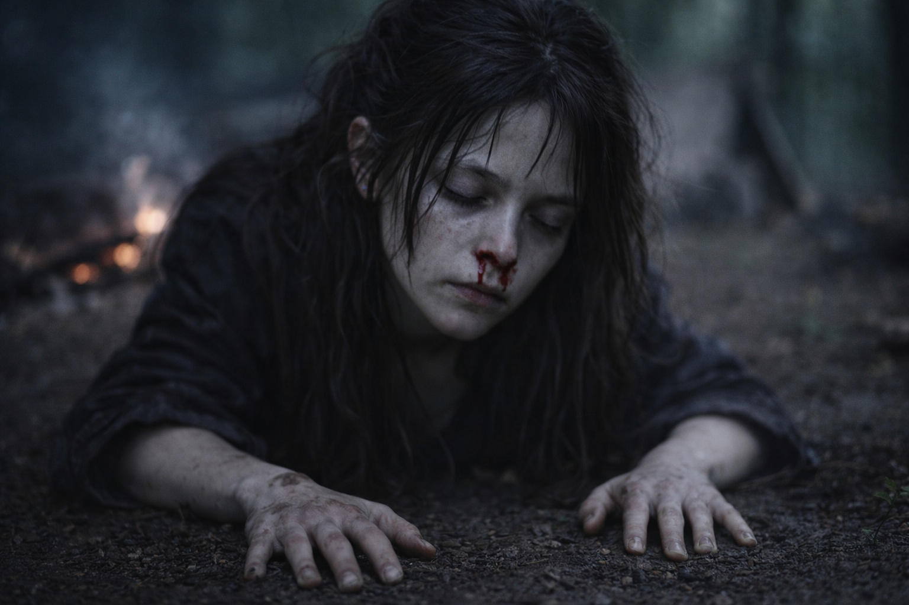
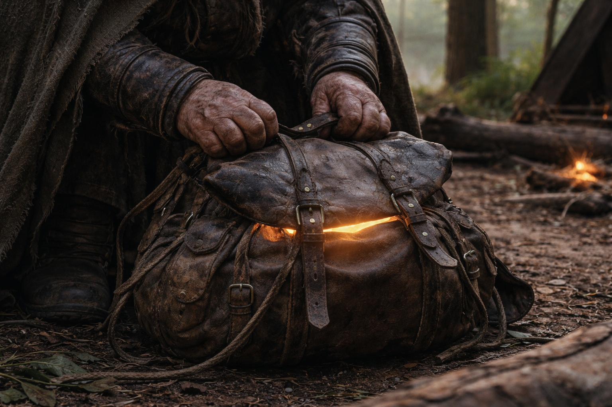
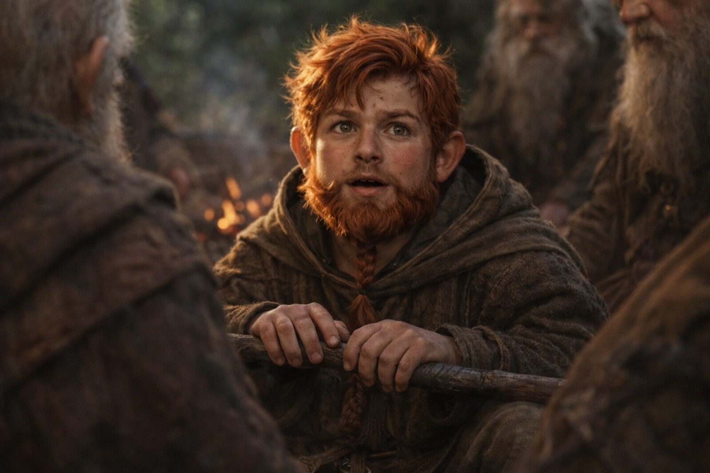

## Capítulo 33 | Parte 2 | La Revelación

---

Maris buscó la visión y lo encontró caminando.

Al este, entre formaciones de cristal negro. Iba con sus dos compañeros y una mujer alta con armadura caminaba delante. Nadie lo amenazaba con un arma.

Maris apretó las palmas contra el suelo frío. Aún podía sentir el campamento bajo ella mientras lo observaba.

Podía sentir el otro artefacto.

El Null estaba bajo su camisa. Reconoció la forma contra el pecho. La atracción del Faro cambiaba cuando él giraba, aunque no sabía si lo seguía a él o al artefacto.

Abrió los ojos. Sangre de ambas fosas nasales esta vez. No se la limpió. Dejó que goteara.

—Ella lo ve —dijo Maris.

El grupo estaba reunido alrededor del fuego apagado. Dulint estaba sentado con la mochila entre las rodillas, protector, instintivo. Balin estaba a su lado, el bastón sobre el regazo. Aldric estaba de pie. Xandor era el más cercano a Maris, su mano buena aún presionada contra el tronco del abeto, escuchando con los sentidos que su entrenamiento le había dado acceso.

—¿El elfo oscuro? —dijo Xandor.

—El Null. Ella volvió a verlo. —Se apretó el puente de la nariz—. La atracción se mueve con él. La tratamos como un lugar al que llegar. No va a quedarse en un sitio.

—Apuntaba a él —dijo Xandor. No era una pregunta.

—A él y a lo que lleva. Ella no puede separarlos. —Miró a Dulint—. Tenemos que seguir comprobando el rumbo.

—Y ahora se está moviendo —dijo Aldric.

—Ahora se está moviendo.

Aldric bajó la vista hacia la ruta que había trazado junto al fuego.

Balin fue el primero en hablar.

—Así que todo hacia lo que hemos estado caminando. La barrera. La convergencia. Lo que hay al final del tirón hacia el noreste. —Golpeó su bastón contra la bota—. Es una persona.

—Una persona que lleva una pieza —dijo Maris—. Había otras señales. Ella no sabe por qué esta es la más fuerte ahora.

—¿Él lo sabe? —preguntó Dulint.

—Sintió nuestra señal en la visión de la carrera. Ella no sabe si conoce quiénes somos.

—¿Puede sentir el Faro?

Cerró los ojos e intentó verlo otra vez. El dolor la golpeó detrás del ojo izquierdo. Apretó la mandíbula y mantuvo la imagen hasta distinguirlo.

Estaba comiendo junto a una formación de cristales. Tenía la mochila abierta a su alcance. Parecía menos agotado que en las visiones anteriores.

La mujer de la armadura estaba cerca de él, observándolo comer.

Maris veía su rostro, pero no sentía nada de ella. Volvió a intentarlo y el dolor aumentó sin revelarle nada más.

—También hay una atracción de su lado. —Abrió los ojos y esperó a que cediera el dolor—. Ella no sabe cómo la interpreta.

Xandor retiró la mano del árbol.

—Sentir localiza otros componentes. Eso coincide con los textos. No deberíamos suponer que Borrar esté activo. Solo sabemos que nuestro rumbo sigue a su portador.

—Y ella no puede leer a la mujer que va a su lado —dijo Maris—. La ve, pero no siente nada.

—¿Puede ocultarle a otros? —preguntó Aldric, con la mano en la espada. Maris negó con la cabeza; no tenía forma de saberlo.

—Podríamos llegar al lugar que marcamos y descubrir que ya se ha ido —dijo Dulint.

—Sí.

—Entonces lo seguimos a él.

—Si queremos encontrar esa pieza.

Dulint aferró las correas de la mochila. Maris esperó mientras él miraba el mapa.

La atracción del Faro se mantenía al este-noreste. Podía sentir pequeños cambios de dirección.

—¿Qué hacemos? —preguntó Balin.

Aldric se agachó junto al mapa.

---

**Fin del Capítulo 33.2  —> 33.3: [Lo Que el Faro Perdió: El Cambio de Rumbo](/lo-que-el-faro-perdio-el-cambio-de-rumbo/)**
