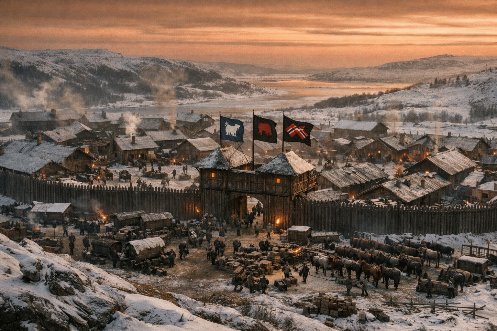
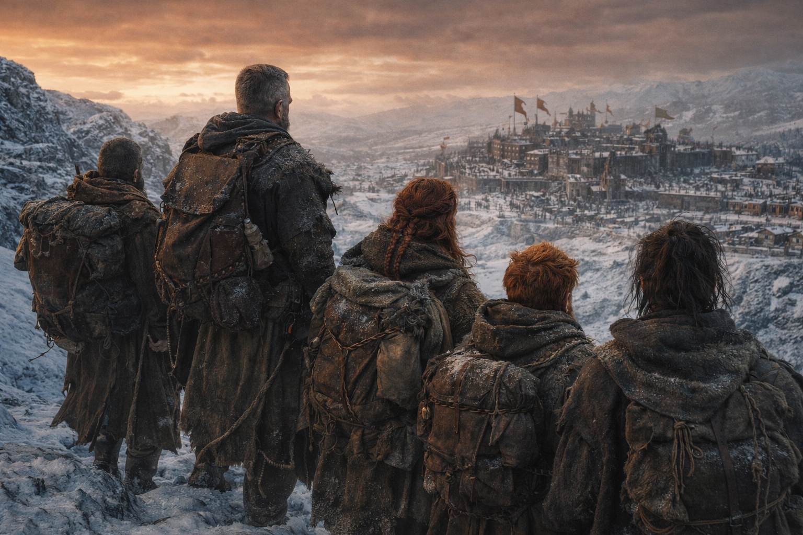

## Capítulo 45 | Parte 4 | El Camino

---

---

Llegaron al asentamiento al cuarto día, tal como Balin había calculado, pero el lugar ya no era lo que solía ser.

Aldric lo observó desde la cresta sur: un puesto comercial de Frostgard, cincuenta edificios, una empalizada de madera, humo en las chimeneas. Debería haber sido una estación de paso, un lugar para reabastecerse, informar y enviar aviso al sur. En cambio, era un punto de concentración militar. Soldados en las calles. Carromatos en proceso de carga. Caballos atados en hileras fuera de los muros. Los estandartes de tres clanes de Frostgard ondeaban en el torreón de la puerta, lo que significaba que se había convocado un consejo de guerra, o se estaba convocando en ese momento, o ya había concluido y la decisión era marchar.

—No entraremos —dijo Aldric.

Los demás lo miraron.

—Cinco viajeros con una historia sobre la barrera, entrando en un campamento militar. Seremos interrogados. Detenidos. Confiscarán el Faro. Tomarán el diario de Xandor como información de inteligencia. Identificarán a Maris como vidente y la retendrán para examinarla. Entraremos como testigos y saldremos como prisioneros.

—¿Entonces qué? —preguntó Dulint.

—Rodeamos. Nos reabastecemos de lo que podamos encontrar fuera de los muros. Seguimos moviéndonos al sur.

—Aldric. —La voz de Dulint llevaba el peso particular de un hombre que había estado caminando sobre suelo congelado demasiado tiempo y que necesitaba hacer una pregunta cuya respuesta ya conocía—. Si no reportamos al asentamiento, y no entregamos nuestro testimonio, y no metemos el relato en canales oficiales, ¿qué estamos haciendo exactamente?

Aldric miró al sur. Más allá del asentamiento. Más allá del territorio de Frostgard. Más allá de todo lo que era organizado y oficial y documentado. Al sur, y luego a donde estuviera el elfo oscuro.

—Lo vamos a encontrar.

El silencio que siguió no era desacuerdo. Era el grupo absorbiendo el cambio, el giro de una misión a otra, la forma en que la aguja de una brújula oscila cuando el campo cambia. Se habían dirigido al sur para reportar. Ahora se dirigían hacia una persona. El destino había cambiado, pero el movimiento era el mismo: adelante, hacia lo que viniera después.

Xandor habló primero. —El testimonio importa. El relato importa. Pero Aldric tiene razón en que entregarlo a un centro de preparación militar arriesga perder el control sobre él. Y el relato sin la persona que causó la brecha está incompleto. El testimonio de cinco testigos es rumor. El testimonio de la persona que tocó la barrera es evidencia.

Balin miró el asentamiento. El humo, los estandartes, la violencia organizada preparándose para desplegarse. —Necesitaremos suministros.

—Lo sé.

—Y Maris necesita descanso. Descanso real. En una cama. Con comida que no sean raciones de viaje.

Maris respondió antes de que Aldric pudiera. —Descansaré cuando lo encontremos. Hasta entonces caminaré. —Su voz no era fuerte, pero era segura, el tipo de certeza que viene de la negativa del cuerpo a aceptar sus propias limitaciones como permanentes—. Puedo sentirlo. Más fuerte hoy que ayer. La conexión está en crudo pero está ahí y tira hacia el noreste y puedo seguirla de la forma en que sigues un sonido en la niebla. No con claridad. Pero lo suficiente.

Aldric la miró. Los ojos blanqueados que habían visto cosas que nadie debería ver. Los moretones desvaneciéndose debajo de ellos, el cuerpo sanando alrededor del daño de la forma en que un árbol crece alrededor de una herida. No era la Maris que había dejado la costa. Esa Maris había sido una vidente con un instrumento calibrado y una misión clara y la confianza de alguien cuyos dones encajaban con la situación. Esta Maris era otra cosa. Los dones habían cambiado. La situación había cambiado. Lo que quedaba era una persona que podía sentir un hilo en un mundo roto y estaba dispuesta a seguirlo.

—Noreste —dijo. Señaló.

Hacia Frostgard. Hacia el territorio entre el asentamiento y la barrera. Hacia el espacio donde tres ejércitos convergían y los cazadores se reorganizaban y los Grukmar marchaban y el cielo era ámbar-óxido y la magia estaba mal y todo era diferente.

Hacia la anomalía.

Aldric contó sus flechas. Once ahora, después del paso a través de la posición de los cazadores. La espada fría en su cadera. Cinco personas con recursos insuficientes e información incompleta y una vidente señalando hacia el territorio más peligroso de Astalor.

Miró a cada uno de ellos. Dulint, que había cargado el Faro y la misión y la responsabilidad y que seguía cargándolos aunque el Faro estuviera muerto y la misión hubiera cambiado. Xandor, que había documentado cada legua y cada anomalía y cada cosa imposible y que seguiría documentando porque la comprensión era la única arma que un erudito llevaba. Balin, que había rezado a través de un báculo agrietado y caminado a través de un mundo roto y cuya fe no estaba en el instrumento sino en aquello hacia lo que el instrumento apuntaba. Maris, cuyos ojos habían sido cambiados por lo que había visto y cuya mano estaba firme mientras señalaba al noreste hacia una persona que nunca había conocido y una conexión que no podía controlar del todo.

Su espada estaba fría. Sus flechas eran pocas. Sus compañeros estaban dañados. El mundo se movilizaba para una guerra que no tenía bandos claros ni objetivos claros ni final claro.

Caminaron.

El cielo estaba mal. El Faro estaba muerto. El mundo se movilizaba para una guerra que aún no se había declarado. En algún lugar, al otro lado de todo, un elfo oscuro de cabello blanco seguía vivo. Maris podía sentirlo. Apenas. Como una vela al otro lado de una tormenta.

—Por ahí —dijo. Señaló hacia la anomalía.

Caminaron.

---

**Fin del Capítulo 45.4 —> 46.1: [Lo Que No Puede Deshacerse: El Regreso](/lo-que-no-puede-deshacerse-el-regreso/)**

