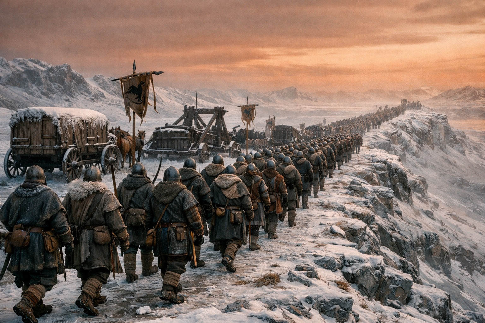
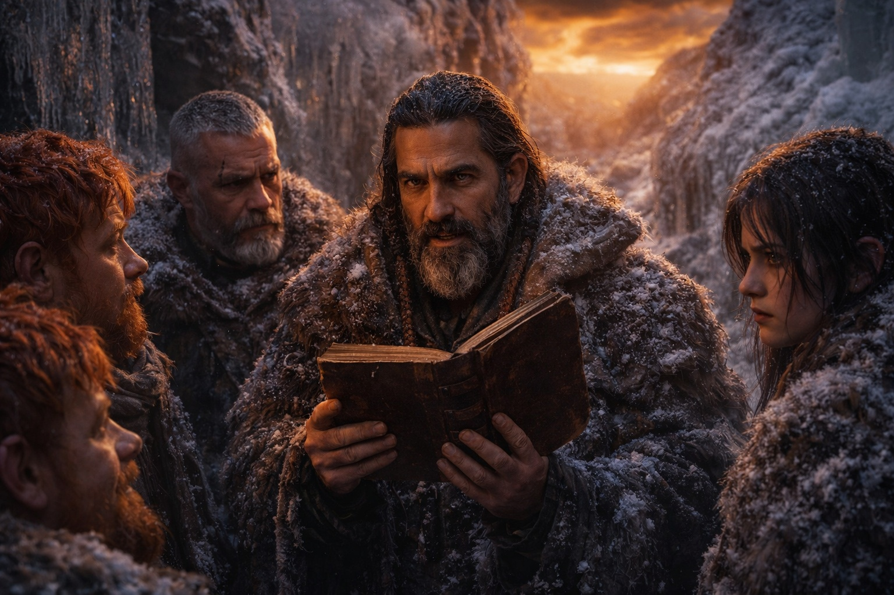
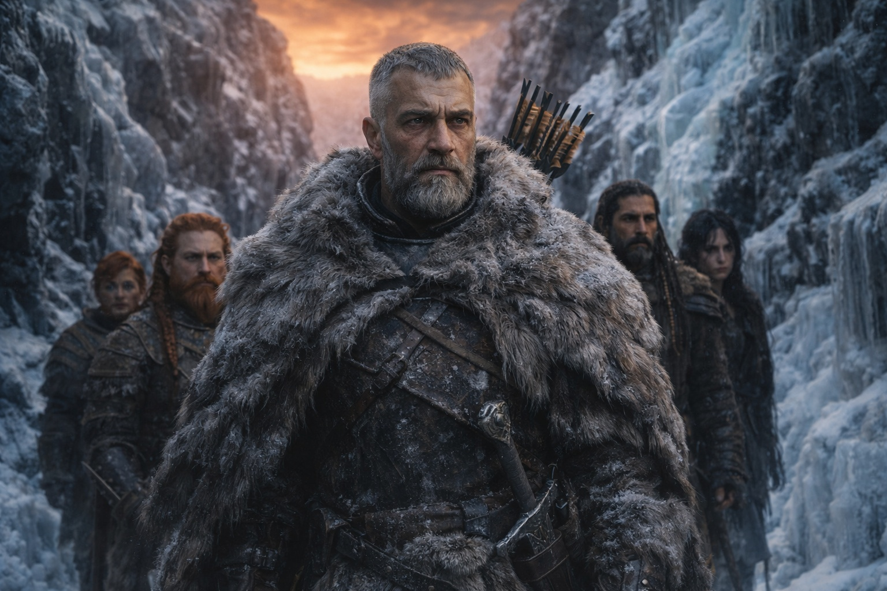

---
order: 1334
title: "Lo Que Sigue: La Guerra"
description: "El cielo prueba que algo pasó. No quién lo hizo."
date: 2024-11-16
language: es
chapter: 45
subchapter: 3
storyline: west
canon_phase: main
canon_sequence: W-045-003
narrative_weight: high
category: Frostgard
author: Aldric
type: Main
tags: ['#lo que sigue', '#aldric', '#frostgard']
thumbnail: image.jpg
featured: false
counterpart_path: site/content/posts/en/frostgard/the-things-that-follow-the-war/index.mdx
counterpart_title: "The Things That Follow: The War"
---

## Capítulo 45 | Parte 3 | La Guerra

---

Al segundo día de marcha hacia el sur, vieron la primera columna lo bastante cerca como para distinguir los estandartes.

Frostgard. Un contingente de guerra completo, al menos doscientos soldados que marchaban en formación por la cresta este, con carromatos de suministros y equipo de asedio que no tenían por qué estar tan al norte en pleno invierno. Era la clase de despliegue que tomaba semanas organizar y días ejecutar, lo que significaba que la decisión de marchar se había tomado apenas horas después de que el cielo cambiara; lo que significaba que quienquiera que comandara esa fuerza había estado preparado para la posibilidad de que el cielo cambiara; lo que significaba que alguien lo había sabido, o sospechado, o temido.

Aldric los observó desde su escondite en un barranco congelado. Los demás estaban agazapados a su espalda, con respiración superficial, esperando.

—No nos buscan a nosotros —dijo—. Se dirigen al noreste. Hacia la barrera.

—Todos se dirigen hacia la barrera —dijo Xandor—. La brecha es el evento principal. Toda facción capaz de proyectar fuerza la está proyectando hacia la fuente. Quieren ver. Quieren entender. Quieren controlar.

—¿Controlar qué?

Xandor miró a Aldric con la expresión de un hombre que ha pensado más lejos de lo que quería. —El sistema del Nexo. La barrera está dañada, no destruida. El sistema que la mantenía está perturbado, no borrado. Los fragmentos que estaban conectados a él, los componentes, los artefactos, los puntos de interfaz, todos siguen existiendo. Están inertes ahora, o degradados, pero siguen siendo componentes de un sistema de escala continental. Y el conocimiento de cómo funcionaba ese sistema, la comprensión de lo que los Drow construyeron y mantuvieron durante mil años, ese conocimiento es ahora lo más valioso en Astalor.

—¿Por qué?

—Porque quien entienda el sistema puede repararlo. O convertirlo en arma. O ambas cosas. —La voz de Xandor era plana, el tono de un erudito declarando hechos que deseaba no fueran hechos—. Los fragmentos de la barrera no son solo piedras muertas. Son componentes de un mecanismo que interactuaba con algo más allá de nuestra comprensión. Las estructuras de energía, los protocolos de contención, la forma en que la barrera se conectaba a lo que sea que es la entidad. Todo eso está codificado en los fragmentos. Incluyendo el Faro.

La mano de Dulint fue a su mochila. El bolsillo interior. La piedra muerta.

—El Faro es una piedra muerta —dijo Dulint.

—El Faro es un componente muerto de un sistema que contenía algo que no debería existir en este mundo. La matriz cristalina, la arquitectura de interfaz, los datos de calibración. Muerto, sí. Pero legible. Analizable. Susceptible de ingeniería inversa por cualquiera con la habilidad y los recursos y la desesperación. —Xandor hizo una pausa—. Y habrá desesperación. La barrera está comprometida. La contaminación se extiende. El campo mágico está desestabilizado. Cada gobierno, cada facción, cada estructura de poder que dependía de la estabilidad ahora enfrenta inestabilidad, y harán lo que los gobiernos siempre hacen cuando enfrentan inestabilidad: buscarán armas.

La columna de Frostgard pasó. Doscientos soldados marchando hacia la barrera bajo la luz ámbar-óxido, sus botas crujiendo sobre suelo congelado en un ritmo que el cuerpo de Aldric reconocía porque su cuerpo había marchado en ritmos como ese y porque el ritmo de la violencia organizada es el mismo en cada ejército.

—Nadie nos va a creer —dijo Xandor.

Aldric miró al erudito.

—Tenemos una piedra muerta, una vidente sangrando y una historia sobre un elfo oscuro que rompió la barrera. Eso es lo que llevamos. Ese es nuestro testimonio. Y cuando lo entreguemos, las personas a las que se lo entreguemos escucharán: cinco viajeros exhaustos con una historia implausible y ninguna prueba más allá de un cristal muerto y una mujer dañada y el cielo.

—El cielo es prueba suficiente.

—El cielo prueba que algo pasó. No quién lo hizo. No por qué. No cómo. El cielo es evidencia de un evento. Nosotros afirmamos ser testigos. Testimonio de testigos de cinco desconocidos sin respaldo institucional, sin autoridad militar, sin conexión política. Seremos escuchados cortésmente e ignorados eficientemente.

El silencio después de eso tenía la cualidad de una verdad que nadie quería aceptar porque aceptarla significaba que el sufrimiento tenía una estructura y la estructura no incluía resolución.

—Entonces no solo testificamos —dijo Aldric—. Lo encontramos.

—¿A quién?

—A la persona que el Faro estaba rastreando. El elfo oscuro. El que se paró en la barrera e hizo esto. —Miró al cielo, el ámbar-óxido que lo cubría todo—. Está vivo. Maris lo dijo. Está al otro lado de la barrera, o cerca de ella, o en algún lugar del territorio entre la barrera y donde sea que la brecha alcanzó. Lo encontramos. Lo traemos de vuelta. Dejamos que él explique.

—El Faro está muerto —dijo Dulint—. No podemos rastrearlo.

—Maris puede sentirlo.

Todos miraron a Maris. Estaba sentada en el barranco, la espalda contra roca congelada, sus ojos blanqueados observando la conversación con la atención particular de alguien que sabe que la están discutiendo y está decidiendo cómo responder.

—Apenas —dijo—. La conexión está en crudo. Sin filtrar. Puedo sentir que existe y que está vivo y que está al norte de nosotros. Más allá de eso, la resolución se ha ido. No es como el Faro. El Faro era preciso. Esto es como oír un sonido en una tormenta e intentar caminar hacia él.

—¿Puedes hacerlo?

—Puedo intentarlo. La conexión podría fortalecerse mientras sano, o podría degradarse mientras la contaminación se extiende. No lo sé. El sistema sobre el que fue construida no existe de la forma en que fue diseñado para existir. Todo está funcionando mal. Incluyéndome a mí.

—¿Y si está muerto? —preguntó Xandor.

Aldric miró al erudito. La pregunta era justa. Aldric la respondió con la misma justicia.

—Entonces averiguamos quién movió sus manos. El elfo oscuro no rompió la barrera solo. Llevaba un artefacto. Estaba conectado a sistemas. Era parte de algo más grande. Si está muerto, el rastro no termina con él. Conduce de vuelta a quien lo envió, a quien le dio el artefacto, a quien diseñó la secuencia que terminó con la barrera abriéndose.

—Eso es una guerra —dijo Dulint en voz baja.

Aldric asintió. —Sí.

La palabra se quedó entre ellos en el barranco congelado mientras los pasos de la columna de Frostgard se desvanecían hacia el noreste y el cielo ámbar-óxido mantenía su posición permanente arriba.

—Ya es una guerra —dijo Aldric—. Tres ejércitos marchando. Facciones movilizándose. Cazadores reorganizándose. Los fragmentos del Nexo convirtiéndose en armas. Los Grukmar moviéndose como fuerza unificada por primera vez en memoria viva. Los dragones haciendo lo que sea que los dragones están haciendo a una escala que no podemos ver. La guerra empezó cuando la barrera se agrietó. La única pregunta es si la peleamos desde dentro con conocimiento o desde fuera con ignorancia.

Revisó sus doce flechas. La espada fría en su cadera. Los cinco en un barranco congelado con el mundo reestructurándose a su alrededor.

—Nadie nos va a creer. Bien. Entonces les traemos pruebas que no puedan ignorar.

---

**Fin del Capítulo 45.3  —> 45.4: [Lo Que Sigue: El Camino](/lo-que-sigue-el-camino/)**

