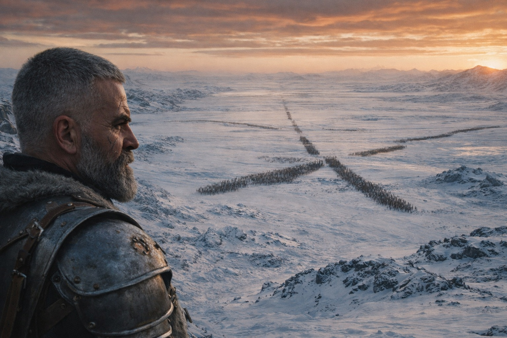
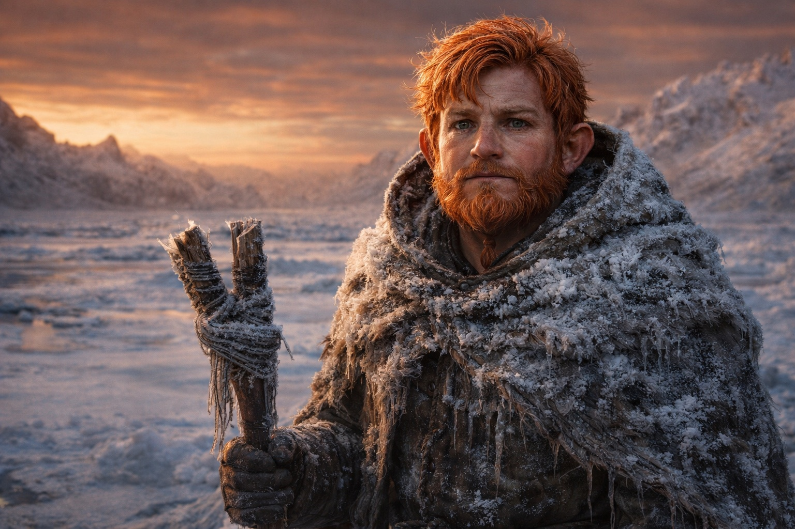
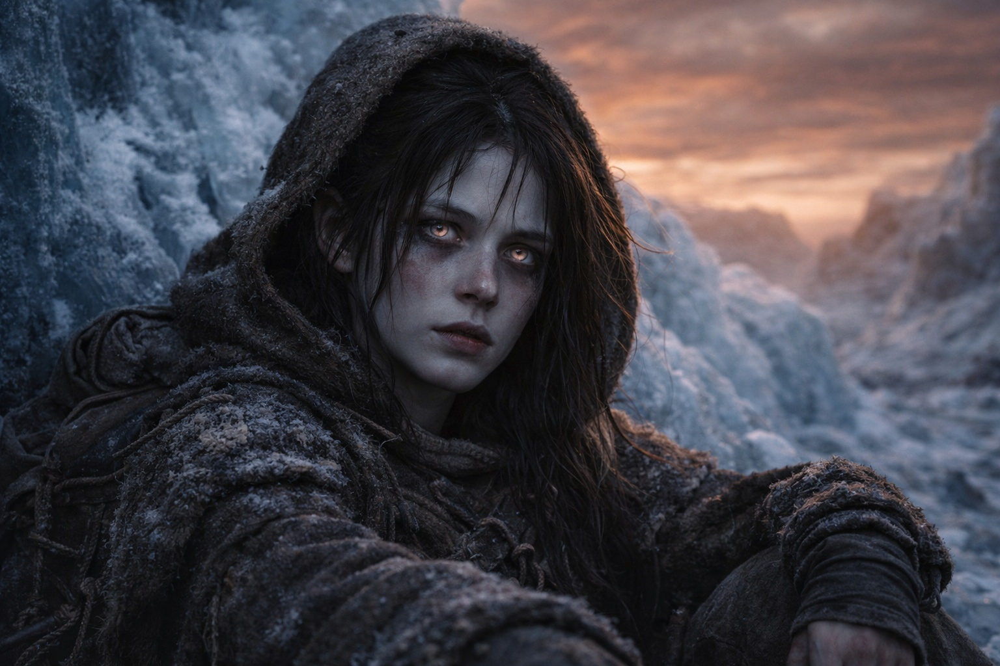
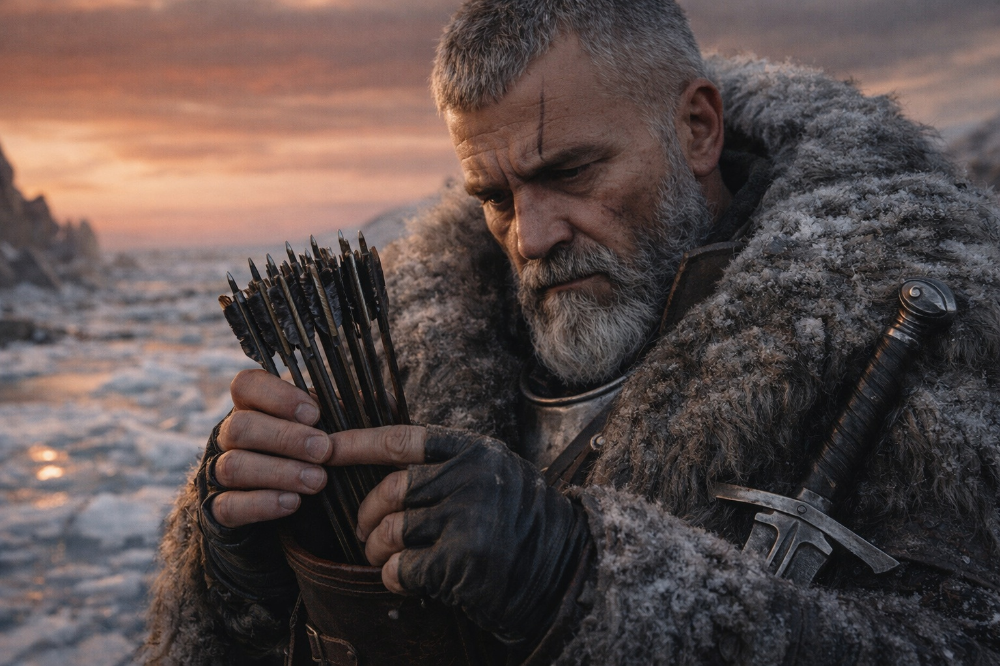
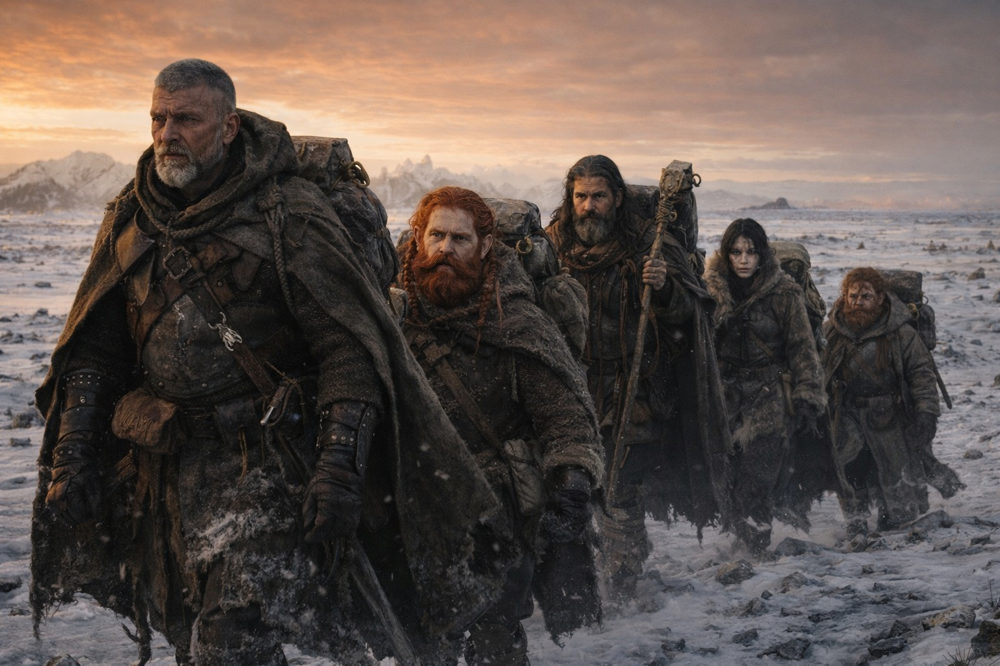

# Capítulo 45.2 | Lo Que Sigue: Las Facciones

---

Atravesaron la posición de los cazadores durante la noche.

Aldric no describió los detalles después, porque eran la clase de detalles que los soldados archivan y los civiles no necesitan. Se gastaron dos de las catorce flechas. Un cazador no regresaría a informar. Los demás se dispersaron en la oscuridad al darse cuenta de que el grupo estaba abriéndose paso a través de ellos, no rodeándolos, y la espada fría en la mano de Aldric resultó ser suficiente; el acero no requiere resonancia para cortar, y Aldric llevaba cortando cosas con acero desde antes de que a alguien se le ocurriera añadirle magia a una hoja.

Para el amanecer habían dejado atrás el corredor sur y alcanzado la cresta donde el terreno se abría. La vista hacia el sur les mostró lo que se avecinaba.

—Tres ejércitos —dijo Balin.

Se había adelantado a explorar mientras los demás descansaban en una depresión entre dos formaciones de hielo. Eran unas breves horas de recuperación que Aldric había concedido porque Maris las necesitaba, y porque forzar a una vidente herida más allá de sus límites costaría más que el tiempo invertido en esperar. Balin había ido al sur con su báculo partido y sus piernas firmes, y había regresado con un informe que entregó del mismo modo en que los sacerdotes entregan las malas noticias: con calma, entendiendo que la calma no ayuda, pero la falta de ella ayuda aún menos.

—Exploradores de Elenoria desde el oeste. Formaciones ligeras, moviéndose rápido, el tipo de unidades que envían cuando quieren entender una situación antes de comprometerse. Están a una semana, quizás menos. Llevarán instrumentos diplomáticos junto con armas, porque la primera respuesta de Elenoria a cualquier cosa es intentar entenderla y su segunda respuesta es intentar controlarla.

—¿Y los demás?

—Bandas de guerra de Frostgard desde el norte. Tres columnas que pude ver desde la cresta. Moviéndose al sur hacia nosotros, o hacia la barrera, o hacia lo que crean que causó el cambio en el cielo. No están explorando. Se están movilizando. Respuesta militar completa. Suministros para una campaña sostenida. Los clanes de Frostgard no se han movido así desde las guerras fronterizas.

Aldric procesó eso. Las bandas de guerra de Frostgard significaban respuesta territorial, el reflejo de un pueblo que vivía en un paisaje hostil y que respondía a cualquier cambio en ese paisaje poniendo guerreros entre ellos y el cambio. No sabrían qué significaba la brecha. Sabrían que el cielo estaba mal y que la anomalía venía del norte y que la respuesta correcta a una anomalía del norte era marchar al norte con armas y hacer preguntas desde una posición de fuerza.

—Y los Grukmar —dijo Balin. Su voz cambió en esto. La calma se mantuvo, pero algo debajo de ella se desplazó.

—¿Cuántos?

—Todos.

Aldric miró al sacerdote. Balin le devolvió la mirada con la firmeza de un hombre que había dicho lo que quería decir y quería decir lo que dijo.

—Los Grukmar no están saqueando —continuó Balin—. Están marchando. Columnas organizadas. No los movimientos a escala de clan que hemos visto en la frontera, las incursiones estacionales, las disputas territoriales. Esta es una movilización a escala tribal. Múltiples clanes moviéndose en coordinación, lo que significa que alguien los ha unido, lo que significa que alguien les ha dado una razón para moverse juntos en vez de unos contra otros.

—La brecha —dijo Xandor. Había estado escuchando desde la depresión donde se sentaba con su diario, su pluma moviéndose incluso mientras procesaba la información, el reflejo del erudito de documentar como forma de comprensión—. La brecha cambia el paisaje de poder. El compromiso de la barrera significa que la custodia Drow está rota. El sistema que mantenía el equilibrio, que mantenía ciertas fuerzas contenidas, que impedía ciertos tipos de expansión, ese sistema está dañado. Los Grukmar entienden los vacíos de poder. Puede que no entiendan la mecánica de la barrera, pero entienden que algo que los contenía ya no los está conteniendo.

—¿Y los dragones? —preguntó Dulint.

La pregunta se quedó en el aire frío. Nadie respondió inmediatamente porque nadie tenía una respuesta cómoda y porque la pregunta en sí llevaba el peso de todo lo que Nyxara había sido y todo lo que la ausencia de Nyxara ahora significaba.

—La Conquista Dragón —dijo Maris. Estaba sentada contra la formación de hielo, los ojos abiertos, los iris blanqueados captando la luz ámbar-óxido. Parecía menos frágil que hacía tres días y más peligrosa, la diferencia entre una herida que sana y una herida que se adapta—.

 El objetivo de Nyxara. La debilidad de la barrera lo hace viable. No solo para ella. Para todos ellos. Lo que sea que los dragones hayan estado planeando durante siglos, la brecha es la condición que hace esos planes ejecutables.

—¿Puedes verlos? —preguntó Aldric.

—Puedo sentir la escala de lo que se mueve. La conexión está en crudo y no puedo dirigirla, pero puedo sentir el peso de ello. Hay cosas en movimiento más grandes que ejércitos. Más antiguas que naciones. La barrera contenía más que una entidad. Contenía cada plan que dependía de que la barrera fuera débil.

Aldric contó sus doce flechas restantes.

Miró al sur hacia el terreno que necesitaban cruzar. Bandas de guerra de Frostgard desde el norte, cerrándose detrás de ellos. Exploradores de Elenoria desde el oeste, a una semana. Grukmar marchando desde el este. Y sobre todo ello, implícitos pero no visibles, los dragones, operando a una escala que hacía que los ejércitos humanos parecieran patrullas fronterizas.

—Estamos entre ellos —dijo—. Todos ellos. Cinco personas en pieles de invierno con una piedra muerta y un báculo partido y doce flechas y el único relato de testigos de lo que pasó en la barrera.

—El relato tiene valor —dijo Xandor.

—El relato nos convierte en objetivo. Cada facción que quiera entender la brecha nos querrá. Por nuestro testimonio. Por el Faro. Por Maris. Ya no somos viajeros. Somos activos. Y los activos se recolectan.

El cielo ámbar-óxido se extendía sobre ellos, la condición permanente a la que cada ejército y facción y fuerza estaba ahora respondiendo. El cielo que probaba que algo había cambiado. El cielo que no explicaba qué.

—Necesitamos llegar a un asentamiento antes de que cualquiera de ellos nos alcance —dijo Dulint—. Meter el relato en canales oficiales. Una vez que esté documentado y distribuido, dejamos de ser la única fuente. Dejamos de valer la pena cazar.

—El asentamiento más cercano está a cuatro días al sur —dijo Balin—. Asumiendo que el terreno no ha cambiado, cosa que no estoy asumiendo.

Aldric envainó su espada. Revisó su carcaj. Doce flechas y la hoja fría y el conocimiento de que el mundo se movilizaba a su alrededor y que ser pequeño en un sistema de este tamaño era protección o vulnerabilidad y no podía decir cuál.

—Cuatro días —dijo—. Nos movemos.

---

**Fin del Capítulo 45.2 — continúa en el Capítulo 45.3: [Lo Que Sigue: La Guerra](/lo-que-sigue-la-guerra/)**

