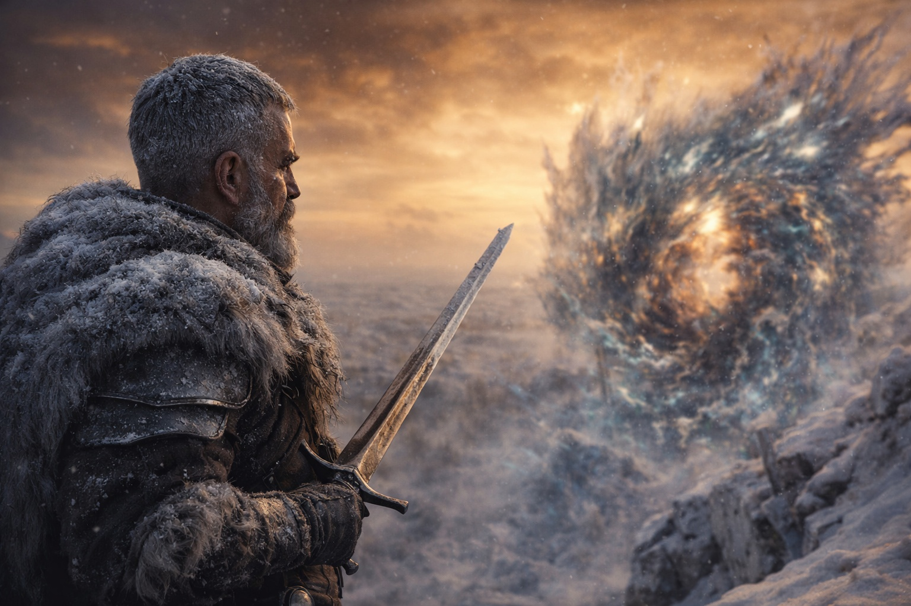

## Capítulo 41 | Parte 2 | El Testimonio

---

Narró en fragmentos.

—Él lo sostiene. El artefacto. Con ambas manos. —Sangre en su labio, congelándose. El campamento helado a su alrededor en silencio. Cinco personas en pieles de invierno sobre suelo cubierto de hielo bajo un cielo dorado y amoratado, observando a una de los suyos sangrar la verdad desde una conexión que se moría mientras ella la usaba—. Está caliente. Ella puede sentir el calor desde aquí. La cosa reconoce la barrera. Se están sincronizando.

Dulint no se movió. No habló. No se acercó a ella ni le dijo que parara. Había tomado esa decisión la primera vez que ella comenzó a sangrar y ella había continuado, y la decisión se había mantenido a través de cada escalada desde entonces, porque detenerla significaba perder la única ventana que tenían hacia lo que estaba sucediendo a una legua y una dimensión de distancia, y Dulint entendía las matemáticas de los costes necesarios del mismo modo que entendía el inventario: sin sentimiento, sin redondeo.

—Él está avanzando. —Su voz cambió. Se aplanó. El lenguaje de la distancia colapsando bajo el peso de lo que estaba viendo, la tercera persona y la primera persona fundiéndose en algo que no era ninguna de las dos, una voz que pertenecía a la visión más que a la mujer que la tenía—. Contacto. El artefacto y la barrera. Es...

Se detuvo. Sus manos se curvaron contra su pecho. Su respiración se detuvo un latido, dos, tres, luego se reanudó como un jadeo.

—El sistema lo está leyendo. Ella puede sentirlo comprobando. Compatible. Autorizado. Está recorriéndolo como... —Su voz se quebró—. Mal. El momento. El sistema encontró el momento. No es... la ventana no está abierta. Él no está en la ventana.

Xandor estaba escribiendo. Su mano temblando. La tinta se congelaba sobre el pergamino. Estaba registrando lo que Maris decía del mismo modo que había registrado cada fragmento, cada análisis, cada pieza del mecanismo que habían ensamblado a partir de profecía y visión y la señal moribunda del Faro. El erudito en él se negaba a dejar de documentar, incluso ahora, incluso al final de aquello que estaba documentando.

—Está reclasificando —dijo Maris—. Él lo sintió. Ella puede sentirlo sintiéndolo. Como una hoja. El sistema cambió lo que cree que él es. Era mantenimiento. Ahora es...

—Amenaza —dijo Xandor. Su voz un susurro. El análisis llegando a su conclusión una legua demasiado tarde.

—La barrera está respondiendo. Está... —Los ojos de Maris se abrieron de golpe. Los dos. El izquierdo nublado, el derecho afilado, y ambos viendo algo que no estaba en el campamento helado—. Se está abriendo. La barrera se está abriendo en el punto de contacto. No rompiéndose. Abriéndose. El mecanismo de defensa. Está haciendo lo que Xandor dijo que haría. Se está abriendo para dejar pasar lo que hay detrás.

La espada de Aldric estaba en su mano. El guerrero que había estado de pie en el borde de la cresta mirando al noreste la había desenvainado sin decidirlo, el reflejo que respondía a una amenaza que ninguna espada podía resolver, la hoja apuntada hacia la distorsión del noreste como si el acero pudiera detener un mecanismo que había operado durante mil años.

—Él la está tocando —susurró Maris. Su voz se había vuelto pequeña. No el lenguaje de la distancia. No el escudo. La pequeñez del testigo—. La barrera está...

Luz.

No del noreste. No del horizonte. Del hilo mismo. La conexión residual entre Maris y la barrera pulsó con una luz que existía en su sistema nervioso en lugar de en el espectro visible, pero el pulso fue tan intenso que se filtró a su rostro, su postura, la forma en que su cuerpo se contrajo alrededor de lo que estaba recibiendo. El pulso la golpeó y se arqueó hacia atrás, su columna despegándose de la cresta helada, sus manos arañando el hielo bajo ella.

Sonido. No sonido que pudieran oír con los oídos. Sonido que podían sentir en el suelo helado, una vibración que viajó desde el noreste a través de una legua de terreno plegado y llegó al campamento como un temblor que desplazó las piedras y agrietó el hielo y envió la débil hoguera a oscilar de costado.

—Se está abriendo —dijo ella. Entonces gritó.

El grito no era suyo. Era el sonido que la conexión producía cuando el evento que estaba calibrada para detectar excedía la capacidad del hilo para transmitirlo. La señal sobrecargando el cable. La nota destrozando el cristal. El grito de Maris era el alarido de muerte del hilo, llevando el último fragmento de lo que estaba viendo a través del instante final de energía residual antes de que la conexión se quemara por completo.

Después silencio.

Maris cayó de costado. Balin la atrapó. Sus ojos estaban cerrados. Su respiración era irregular. Sangre en su rostro, sus oídos, las comisuras de sus ojos. La sangre congelada cartografiando el coste en su piel como un diagrama de todo lo que había pagado por ver lo que había visto.

El suelo tembló de nuevo. Más fuerte. Un solo temblor que viajó desde el noreste y llegó bajo ellos como un juicio.

Dulint se estabilizó sobre la piedra helada. Miró al noreste. La distorsión en el horizonte había cambiado. No creciendo, no encogiéndose. Transformándose. Los colores que habían sido incorrectos durante días ahora eran incorrectos de una manera diferente, los tonos innombrables se desplazaban, se reorganizaban, como si la paleta de lo imposible hubiera sido reordenada por el evento que acababa de ocurrir.

La pluma de Xandor estaba quieta. Su pergamino en el suelo helado. Su rostro gris.

La espada de Aldric seguía desenvainada. Apuntando al noreste. Apuntando a la nada.

Balin sostenía a Maris. Su respiración superficial. Su latido visible en la garganta. Viva. Apenas.

El silencio después del grito se mantuvo.

---

**Fin del subcapítulo  —> 41.3**
