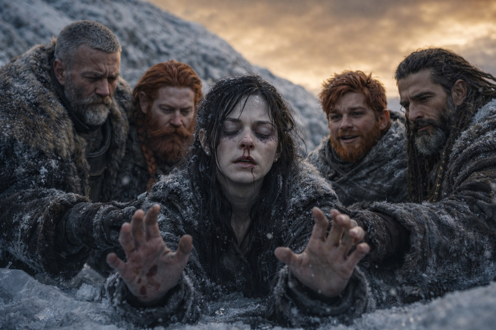
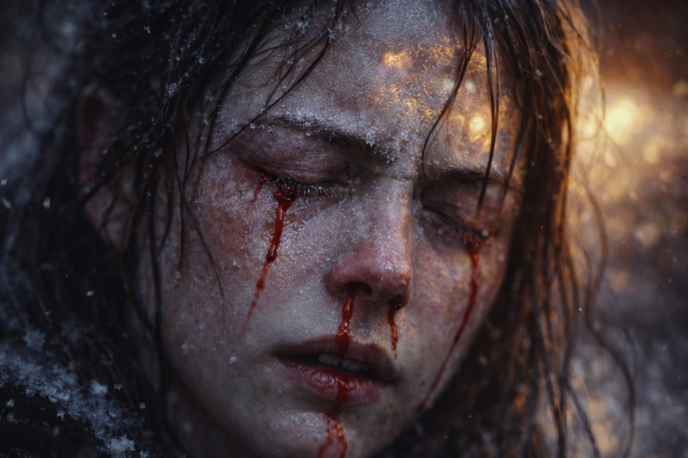

## Capítulo 41 | Parte 1 | La Conexión

---

La conexión no debería haber sido posible.

El Faro estaba muerto. Piedra fría en la mochila de Dulint, oscuro como el día en que lo encontraron si no hubieran sabido que alguna vez había sido otra cosa. El sistema al que pertenecía había sido alterado. La señal que transportaba había sido cortada. El artefacto que los había guiado a través de un continente era un trozo de roca tallada que pesaba exactamente lo que pesa la roca y nada más.

Pero Maris aún podía sentirlo.

No a través del Faro. A través del hilo residual que el Faro había calibrado durante semanas de contacto, la resonancia simpática entre su sensibilidad de vidente y la frecuencia adaptada a la barrera de una persona que nunca había conocido pero cuya señal había rastreado hasta que la señal se volvió tan familiar como su propio pulso. El Faro había construido el puente. El puente permaneció después de que el constructor cayera. Apenas. Funcionando con el eco de una conexión que había sido cortada, del modo en que un diapasón vibra después de que la nota que lo golpeó ha cesado.

Iba a atravesar.

—Maris. —La voz de Dulint. Estaba arrodillado junto a ella en el campamento helado bajo la cresta, el cielo dorado magullado sobre ellos, el suelo helado debajo, el Faro muerto un peso en su mochila que cargaba porque cargar cosas muertas era lo que Dulint hacía cuando las cosas muertas habían importado—. No lo hagas.

—Ella tiene que hacerlo. —El lenguaje de distancia. El escudo. Pero el escudo estaba agrietado, el mortero entre las palabras visible, la construcción temblando con el esfuerzo de mantener distancia de algo que requería presencia—. El hilo residual se desvanece. Horas. Menos. Si ella no atraviesa ahora, el hilo se disuelve y no queda nada a través de lo cual ver.

—El coste...

—Ella conoce el coste. —Maris abrió los ojos. Uno claro. Uno nublado, la pupila izquierda lenta, el daño de su última visión permanente o casi—. El coste es el coste. El hilo es todo lo que queda.

Cerró los ojos. Se extendió.

La extensión era diferente a antes. Antes, el Faro había cargado con el peso de la conexión, amplificando su sensibilidad, proporcionando la señal que seguía como un camino. Ahora no había camino. Había una senda de cabras. Un hilo de resonancia que se extendía desde su sensibilidad de vidente dañada a través de la legua que nunca se había cerrado, a través de la zona de influencia alterada de la barrera, hasta la persona al otro lado que seguía viva y seguía adaptada y seguía portando la frecuencia que el Faro le había enseñado a reconocer.

El hilo ardía. No era metáfora. La energía residual en la conexión era cruda, sin filtrar, la mediación del Faro desaparecida, y sin la mediación la señal llegaba a su sistema nervioso del modo en que la electricidad sin tierra llega a la carne: caliente, directa, dañina.

La sangre vino de su nariz. Ambas fosas nasales. La sintió y no la limpió. La sangre era el precio de entrada. Lo atravesó.

La visión se abrió.

Fragmentos. No las imágenes claras que el Faro había proporcionado. Piezas rotas llegando a su consciencia como esquirlas de un espejo, cada una reflejaba un ángulo diferente de la misma escena, cada una llegaba medio segundo tarde, cada una le costaba algo que podía sentir irse pero no podía nombrar.

Lo vio.

Un drow. Piel oscura como obsidiana. Cabello blanco. De pie dentro de algo que no era un lugar. El interior de la barrera. No podía verlo con claridad, el hilo residual proporcionando impresiones en lugar de imágenes, pero podía sentir la incorrección del entorno que ocupaba, la presión dimensional, el suelo pulsante, la luz que se curvaba. Estaba solo. Un artefacto en sus manos, sacado de su mochila, sostenido ante él, brillando con alineación.

—Puedo verlo —dijo. Su voz llegó a sus oídos desde la distancia, como si estuviera hablando desde dentro de la visión en lugar de desde el suelo helado donde su cuerpo estaba sentado. La sangre corría por su labio superior—. Está ahí. Está en el borde. Sabe que está mal.

—¿Puedes detenerlo? —La voz de Dulint. Cercana. Firme. La voz de un hombre haciendo una pregunta cuya respuesta ya conocía.

—Puedo verlo —repitió.

Esa fue su respuesta.

Podía sentir su miedo. No como emoción. Como frecuencia. El hilo transportaba su estado del modo en que un cable transporta corriente: el miedo, la certeza y las deudas tirando como la gravedad, cada una un peso que podía percibir sin comprender, la obligación acumulada de un viaje que había rastreado pero nunca presenciado directamente. Tenía miedo. Estaba seguro. Los dos estados coexistían en él del modo en que coexisten en una persona que salta desde una altura: el miedo a la caída y la certeza de que el salto es necesario ocupando el mismo cuerpo al mismo tiempo.

—Tiene miedo —dijo Maris. Sangre en sus oídos ahora. El hilo le quemaba más sensibilidad—. Camina de todas formas. La cosa dentro de él, el reloj. Ya no hace tictac. Ha terminado de contar. Ha pasado el conteo. Está en el lugar donde contar se detiene y actuar comienza.

Podía ver el punto de convergencia. Apenas. Un adelgazamiento en el tejido de la barrera, un lugar donde el mecanismo se concentraba, donde la interfaz de mantenimiento habitaba. El artefacto en sus manos respondía a ello, calor y luz y alineación, el componente del Nexus reconociendo el sistema al que pertenecía.

—Va a tocarlo —susurró—. La barrera. La interfaz. Va a...

El hilo pulsó. La visión parpadeó. La sangre vino de su ojo izquierdo, el dañado, una lágrima roja recorriendo su mejilla y congelándose en el frío de Frostgard.

—Maris. —La voz de Balin. Cercana. Su mano en su brazo—. Para. Estás sangrando por el ojo.

—Ella lo sabe. —Maris siguió extendiéndose. El hilo se adelgazaba. Minutos. Segundos. La energía residual se consumía como una mecha que se acerca a la carga—. Está ahí. Está en el borde. Ella puede verlo y no puede alcanzarlo y el hilo se muere y esto es todo lo que hay.

Mantuvo la conexión. Sangre en su rostro. Hielo en su cabello. El suelo helado bajo ella, el cielo dorado magullado arriba, y la legua entre ella y una catástrofe que podía ver comenzando y no podía prevenir.

Lo mantuvo porque mantenerlo era todo lo que le quedaba.

---

**Fin del subcapítulo  —> 41.2**
