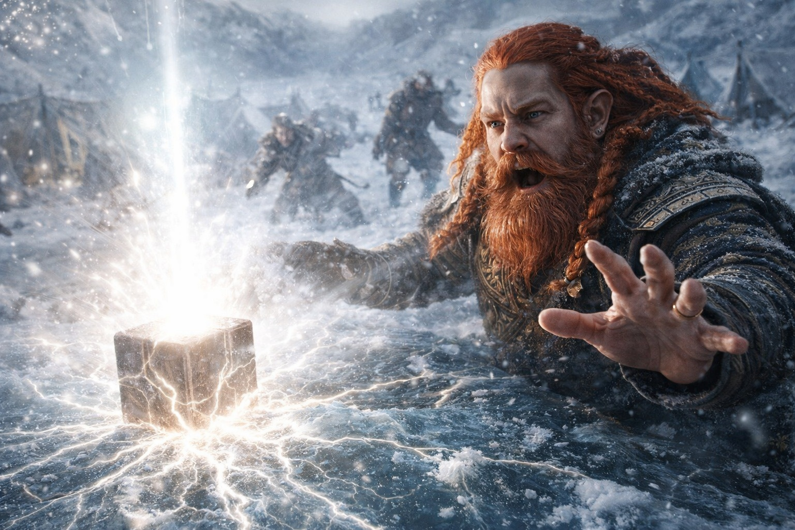
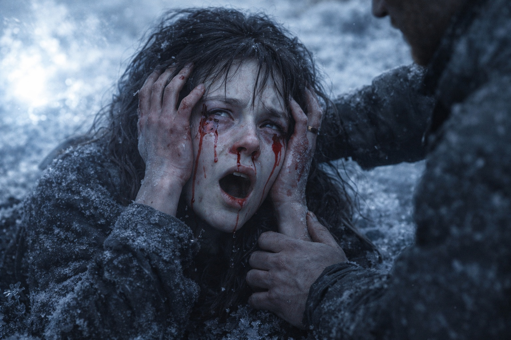
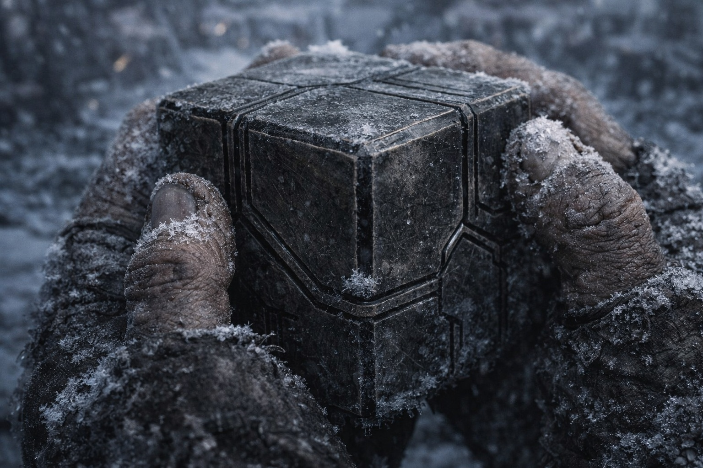
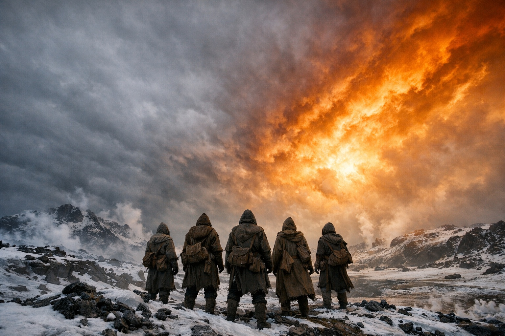
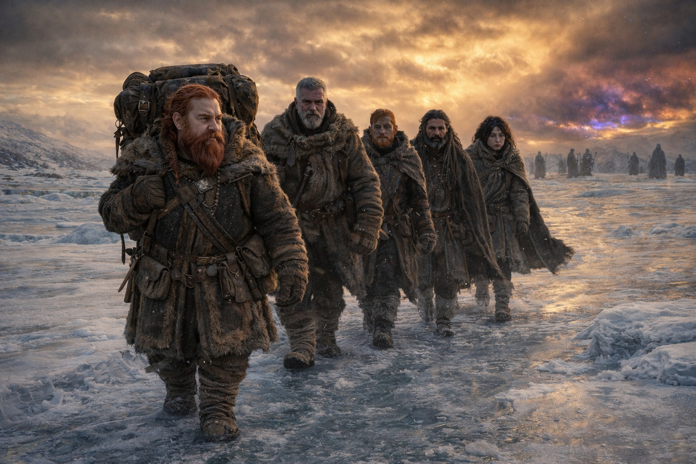

## Capítulo 38 | Parte 4 | El Cambio

---

El Faro gritó.

No zumbó. No pulsó. Gritó. Un sonido que no era sonido, una frecuencia que eludió los oídos de Dulint y entró en su pecho a través de sus costillas como un puño. Lo sostenía cuando ocurrió, porque lo había sostenido durante tres días, y el grito le abrió la mano y el artefacto golpeó el suelo congelado y el sonido siguió llegando, irradiando desde la piedra y el metal y los componentes de cristal en oleadas que hacían vibrar la nieve a su alrededor y agrietarse el hielo en líneas que se expandían hacia afuera como venas.

Todos estaban de pie. Aldric tenía la espada desenvainada antes de que sus ojos estuvieran completamente abiertos, el reflejo de sueño a combate de décadas de entrenamiento, la hoja apuntando a nada porque no había nada a lo que apuntar. Balin tenía su bastón apoyado contra el suelo congelado, los nudillos blancos, su pierna dañada olvidada. Xandor buscaba frenéticamente sus fragmentos, las manos temblándole, su compostura de erudito abandonada ante un sonido para el que su formación no tenía categoría.

Maris ya estaba en el suelo.

Cayó al suelo en el instante en que el Faro gritó, su cuerpo doblándose como si los huesos dentro de él hubieran dejado de cooperar, las manos en las sienes, la boca abierta en una forma que debería haber sido un grito pero no produjo nada. La sangre brotó de su nariz. Ambas fosas nasales. Luego de sus oídos. Luego de las comisuras de sus ojos, lágrimas rojas recorriéndole las mejillas y congelándose en el frío antes de llegar a su mandíbula.

—¡Maris! —Balin se dejó caer a su lado.

No podía oírlo. Sus ojos estaban abiertos y no veían nada en el campamento congelado, veían algo más, algo que ocurría a una legua de distancia y a una dimensión de distancia, algo que la conexión que había mantenido durante semanas ahora transmitía a todo volumen porque el evento que había sido calibrada para detectar estaba ocurriendo y la señal había dejado de ser un susurro para convertirse en una inundación.

El grito del Faro alcanzó su punto máximo. El sonido más allá del sonido alcanzó una frecuencia que Dulint sintió en los dientes, en las uñas, en los empastes de cada cavidad de su boca de cuarenta años. El artefacto en el suelo congelado brilló blanco. No el brillo constante de la dirección. No el pulso cálido de la proximidad. Blanco. La luz incolora de un sistema alcanzando su límite, un componente que se sobrecargaba, un mecanismo que funcionaba más allá de los parámetros para los que fue diseñado.

Entonces se detuvo.

El Faro se enfrió. No se atenuó. Se enfrió. Como si nunca hubiera estado caliente. El brillo desapareció. El zumbido desapareció. La dirección desapareció. El artefacto que los había guiado a través de un continente yacía en el suelo congelado pareciendo lo que era sin su función: una pieza de piedra tallada y metal y cristal, inerte, sin propósito, muerta del modo particular en que mueren las herramientas cuando el sistema al que pertenecen deja de existir en la forma para la que fue diseñado.

Dulint lo recogió. El frío de la piedra era el frío del suelo donde había yacido. Nada más. Nada menos. El Faro no dormía. No se estaba conservando. Había dejado de ser un Faro como una ventana deja de ser una ventana cuando tapias la abertura. La forma permanecía. La función se había ido.

—Qué— —empezó Aldric.

El cielo cambió.

No en el horizonte. No gradualmente. Todo el cielo visible cambió de color en un solo aliento, del gris congelado del invierno de Frostgard a algo que no tenía nombre en ningún idioma que Dulint hablara. Un oro amoratado extendiéndose desde el noreste, lavando el firmamento como sangre a través del agua, devorando el gris, devorando la capa de nubes, devorando el azul frío que debería haber estado sobre sus cabezas y reemplazándolo con algo que parecía la luz antes de un incendio y se sentía como el silencio después de una campana. El color estaba mal. No mal de la manera en que la distorsión había estado mal, local y definida y contenible. Mal de la manera en que una estación está mal cuando llega al espacio destinado a otra estación: de manera integral, en todas partes a la vez.

Las protecciones de Xandor parpadearon. Los pequeños círculos protectores que había mantenido alrededor del campamento desde su primera noche en el pliegue, tiza e intención y la precisión académica de un hombre que entendía la teoría de protección como los arquitectos entienden los muros de carga. Parpadearon una vez. Dos veces. Luego se apagaron. Las líneas de tiza permanecieron en el suelo congelado. La energía detrás de ellas había desaparecido.

—Mis protecciones —dijo Xandor. Su voz era la voz de un hombre viendo su casa arder desde dentro—. No están fallando. Están... —Presionó las palmas contra el círculo más cercano. Nada—. El campo del que se alimentan es diferente. La resonancia ha cambiado. La estructura subyacente que hace funcionales las protecciones ha... —Se detuvo. Miró al cielo—. Cambiado.

El bastón de Balin vibró una vez, una vibración que viajó desde la base hasta la empuñadura y se detuvo. La tenue potenciación que había llevado en la madera durante años, el fortalecimiento menor que hacía del bastón más que madera, se silenció. Lo golpeó contra el suelo. Madera contra piedra. Nada más.

—Regional —dijo Xandor. Estaba registrando, las manos aún temblándole, sacando pergamino de su mochila y escribiendo con una velocidad que sacrificaba legibilidad por completitud—. La desestabilización es regional. No las protecciones. No el bastón. El campo en sí. El sustrato mágico del que todas las aplicaciones estructuradas se alimentan ha sido... —Dejó de escribir. Miró al noreste—. Reestructurado.

Maris respiró.

Estaba en el suelo, de costado, la capa de Balin bajo su cabeza, su respiración la respiración superficial y entrecortada de alguien que había pasado por una convulsión, o una inundación, o ambas a la vez. Sangre en su rostro. Sangre en la escarcha bajo su mejilla. Los ojos cerrados. Las manos acurrucadas contra su pecho.

—Maris. —Dulint se arrodilló a su lado—. Maris, ¿puedes oírme?

Sus ojos se abrieron. Ambos. El izquierdo estaba peor que antes, la nubosidad más profunda, la pupila lenta en responder. Miró al cielo. El cielo del color equivocado que lo cubría todo.

—Está hecho —dijo.

Su voz era la voz de alguien informando desde el lugar de algo que había presenciado y sobrevivido y que cargaría el resto de su vida funcional.

—Está hecho y él está vivo y nada volverá a ser igual.

Silencio. El campamento congelado. Las protecciones muertas. El bastón silencioso. El Faro frío en la mano de Dulint. El cielo del color de una herida que cubría todo el firmamento visible. Las capas grises a una legua al sur, que habían estado vigilando durante días, que habían dejado de moverse en el instante en que el cielo cambió, que ahora permanecían inmóviles en el paisaje congelado como figuras en una pintura que había sido colgada en la habitación equivocada.

Dulint miró el Faro. Oscuro. Muerto. Una pieza de un sistema que ya no existía en la forma para la que fue diseñado. Lo guardó en su mochila de todos modos. El peso era el mismo. Todo lo demás era diferente.

—¿Puedes caminar? —le preguntó a Maris.

Se incorporó. Despacio. Balin la estabilizó. La sangre en su rostro se congelaba en el nuevo frío, el tipo de frío que viene después de que algo grande cambia, no el frío del invierno sino el frío de la ausencia, la temperatura de un mundo que ha perdido un componente alrededor del cual estaba organizado.

—Ella puede caminar —dijo Maris. El lenguaje de distancia. El escudo. Pero sus ojos estaban presentes, ambos, dañados y presentes y cargando el peso de lo que había visto—. Lo necesitará.

Dulint se echó la mochila al hombro. El Faro descansaba dentro como una piedra. Solo una piedra.

—Vamos al sur —dijo—. Lejos del pliegue. Lejos de las capas grises. Encontramos personas que puedan escuchar lo que sabemos. —Miró al cielo. El oro amoratado se profundizaba, el color asentándose en el firmamento como si tuviera intención de quedarse—. Llevamos el análisis. Llevamos los nombres. Llevamos lo que pasó y por qué, y encontramos a alguien que pueda usarlo.

—¿Usarlo para qué? —preguntó Aldric. La misma pregunta que Balin había hecho días atrás. La misma respuesta esperaba.

Pero esta vez Dulint tenía una respuesta. No una buena. No una completa. Pero una respuesta que era mejor que nada, que era todo lo que había tenido antes.

—Para lo que viene después.

Caminó. Lo siguieron. Al sur. Lejos de la legua que ya no importaba, lejos de la barrera que había cambiado, lejos del cielo que lo demostraba. El Faro estaba muerto. Las protecciones estaban muertas. El sustrato mágico de la región había sido reestructurado por un evento que habían predicho y no pudieron prevenir.

Tenían razón. Sobre todo. Y tener razón no había salvado una sola cosa.

LOCK 1. LOCK 5. Conocimiento y velocidad y análisis y sacrificio, y el mundo había cambiado de todos modos, bajo un cielo que no tenía nombre, en un día que recordarían como el día en que las reglas del juego cambiaron.

Dulint caminó al sur. El Faro frío traqueteaba en su mochila. Detrás de ellos, el cielo del noreste pulsó una vez con el oro amoratado de un nuevo orden, y el pulso no se desvaneció.

---

**Fin del Capítulo 38.4 —> 39.1: [Deber Sin Demora: La Mañana](/deber-sin-demora-la-manana/)**
