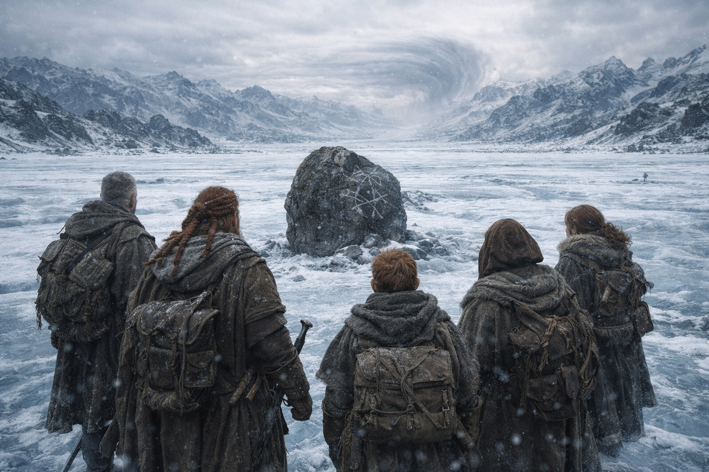

## Capítulo 38 | Parte 2 | El Intento

---

---

Caminaron durante seis horas y no avanzaron nada.

Dulint lo supo antes de que nadie lo dijera. La cresta bajo la que habían acampado seguía visible a sus espaldas, sin cambios, a la misma distancia que a media mañana. La nieve bajo sus pies era la misma nieve. Las formaciones de hielo al oeste eran las mismas formaciones de hielo. Había estado contando sus pasos del mismo modo en que había contado inventario durante cuarenta años, y la cuenta decía que habían caminado cuatro mil pasos hacia el noreste, y sus ojos decían que estaban de pie donde habían empezado.

—Alto —dijo.

El grupo se detuvo. La mano de Aldric fue a su espada, el reflejo de un hombre cuyo cuerpo había aprendido a desenfundar antes de que su mente hubiera aprendido a pensar, y Dulint no se lo reprochó. No había nada contra lo que luchar. Ese era el problema.

—Marca esta piedra. —Dulint señaló un peñasco con una grieta recorriéndole la cara como un delta fluvial—. Xandor, usa la tiza.

Xandor la marcó. Una X blanca sobre piedra oscura. Caminaron hacia el noreste durante otra hora, el suelo helado crujiendo bajo sus botas, el viento cortándoles a través de las pieles, el Faro zumbando contra la espalda de Dulint con la devoción de una señal que no había cuestionado su dirección ni una sola vez en tres meses.

Encontraron la piedra. La X blanca. Intacta. Habían caminado en línea recta durante una hora y habían llegado al punto de partida.

—El terreno está en bucle —dijo Xandor. Su voz tenía la planitud controlada de un erudito registrando un fenómeno que no podía explicar—. No en círculos. En bucle. La geografía misma está plegada.

—¿Podemos rodearlo? —preguntó Balin.

—¿Rodear qué? El pliegue es el terreno. No hay forma de rodearlo. —Xandor sacó el fragmento del Ateneo y lo sostuvo junto al resplandor del Faro. El artefacto apuntaba al noreste. Una legua. El Faro llevaba diciendo una legua desde ayer. Diría una legua mañana. La distancia no era mentira. La distancia simplemente no era navegable con pies que existían en este lado de la influencia de la barrera.

—El Faro dice una legua —dijo Maris. Caminaba sin mirar al suelo, sus ojos gris pálido fijos en la distorsión del noreste del modo en que una persona observa una herida que no puede alcanzar—. Mis pies dicen que no nos hemos movido.

El bastón de Balin golpeó la piedra helada. El sonido resonó plano, absorbido por algo en el aire que devoraba la resonancia.

—¿Por qué podemos verlo pero no alcanzarlo?

Nadie respondió. Porque la respuesta era el mecanismo que Xandor había descrito: la influencia de la barrera rechazaba la aproximación desde este lado. No un muro. Nada tan honesto como un muro. Una distorsión. El paisaje se plegaba sobre sí mismo, las leguas se curvaban, la línea recta retornaba a su origen. La barrera no necesitaba combatirlos. Simplemente hacía que el suelo que pisaban fuera insuficiente para la distancia que necesitaban cruzar.

Dulint intentó el sur. Luego el oeste. Luego el noreste en un ángulo diferente. Cada vez la marca de tiza los esperaba. Cada vez el Faro zumbaba su paciente legua, del modo en que una brújula señalaría el norte incluso si el viajero caminara en círculos, porque la brújula no era responsable de las piernas del viajero.

A media tarde el frío se había intensificado. La escarcha en sus capas había dejado de derretirse con el calor corporal, lo cual significaba que su calor corporal estaba perdiendo la guerra contra la temperatura, lo cual significaba que necesitaban refugio. La cresta imposible ofrecía lo que el terreno llano no: un cortavientos, un saliente, un lugar donde el suelo helado podía despejarse lo suficiente para encender un fuego.

Regresaron a la cresta. La X de tiza los vio llegar.

—No nos deja acercarnos —dijo Aldric. Estaba de pie en el borde de la cresta, mirando al noreste, su mano buena apretándose y aflojándose sobre la empuñadura de su espada—. Todo el paisaje es una puerta y está cerrada.

—No cerrada —dijo Xandor. Estaba sentado en el suelo helado, los fragmentos desplegados ante él otra vez, trabajando el problema del modo en que trabajaba cada problema: negándose a dejar que la frustración reemplazara el análisis—. La puerta se abre. Para el portador. Con el artefacto. Por invitación del mecanismo. Nosotros no somos el portador. No tenemos el artefacto. El mecanismo no nos ha invitado.

—Entonces estamos ante una puerta que no podemos abrir.

—Estamos ante una puerta que no sabe que existimos.

El fuego prendió. Llamas delgadas luchando contra el viento. Balin lo alimentó con la paciencia metódica de un hombre cuya cojera había regresado genuina y que comprendía que el calor no era confort sino supervivencia. El frío aquí era distinto del frío a través del cual habían marchado durante semanas. Tenía una cualidad deliberada, como si la temperatura misma fuera parte de la influencia de la barrera, empujándolos no mediante muros sino mediante la acumulación de pequeñas imposibilidades: distancia que no se cerraba, terreno que se repetía, frío que se profundizaba más rápido de lo que el fuego podía combatir.

Maris no había hablado desde la prueba de la tiza. Estaba sentada contra la cresta helada, envuelta en pieles que parecían demasiado finas, los ojos cerrados, la respiración superficial. La sangre seca había desaparecido de su rostro. La vacuidad no.

—Maris. —Dulint se sentó a su lado. No lo bastante cerca para invadir. Lo bastante cerca para que lo oyera sobre el viento—. No te extiendas.

—Ella no se está extendiendo. —El lenguaje de distancia. Tercera persona. El escudo que levantaba cuando la conexión era demasiado cercana y el coste de la cercanía se medía en sangre y función—. Ella está escuchando. El Faro lleva señal residual. Ella puede oír la resonancia sin forzar el paso.

—¿Qué dice?

Maris abrió los ojos. El izquierdo estaba levemente nublado, el daño en la visión de su último intento no del todo sanado, un coste que había pagado y no recuperado y que quizá no recuperaría nunca.

—Él sigue caminando. Noreste. Hacia la barrera. La cosa dentro de él está contando. —Hizo una pausa—. Una legua en el Faro. Una legua que no termina.

Dulint miró la X de tiza en el peñasco. Una legua. Cuatro mil pasos que conducían de vuelta a la misma piedra. Una distancia que existía y no podía cruzarse, una verdad que podía conocerse y sobre la que no podía actuarse, una brecha entre comprensión y capacidad que no se medía en leguas sino en el tipo de distancia que separaba un lado de un sistema roto del otro.

LOCK 1. El conocimiento crea sufrimiento, no soluciones.

—Lo intentamos de nuevo mañana —dijo Dulint—. Enfoque diferente. Nos separamos. Probamos los límites del pliegue. Si el bucle tiene bordes, los encontramos.

—¿Y si no tiene bordes?

—Entonces también lo sabremos.

El fuego crujió contra el frío. El Faro zumbó. Una legua. La distorsión en el horizonte noreste pulsó una vez, colores que se plegaban sobre sí mismos, el cielo haciendo algo que los ojos humanos podían registrar pero el lenguaje humano no podía describir.

Tenían una legua y ningún terreno.

---

**Fin del subcapítulo  —> 38.3**