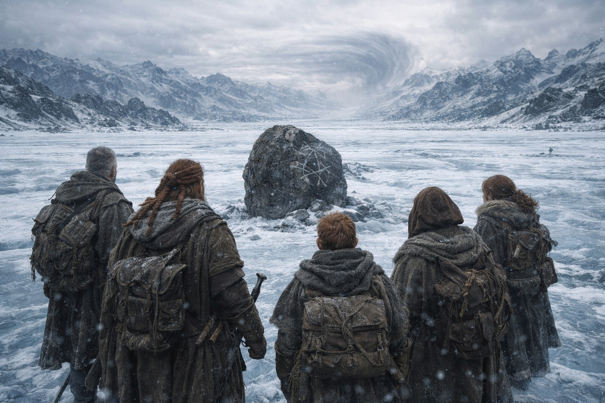
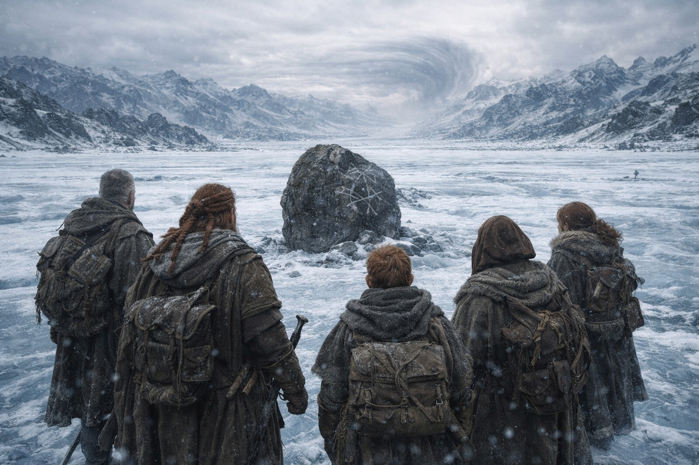
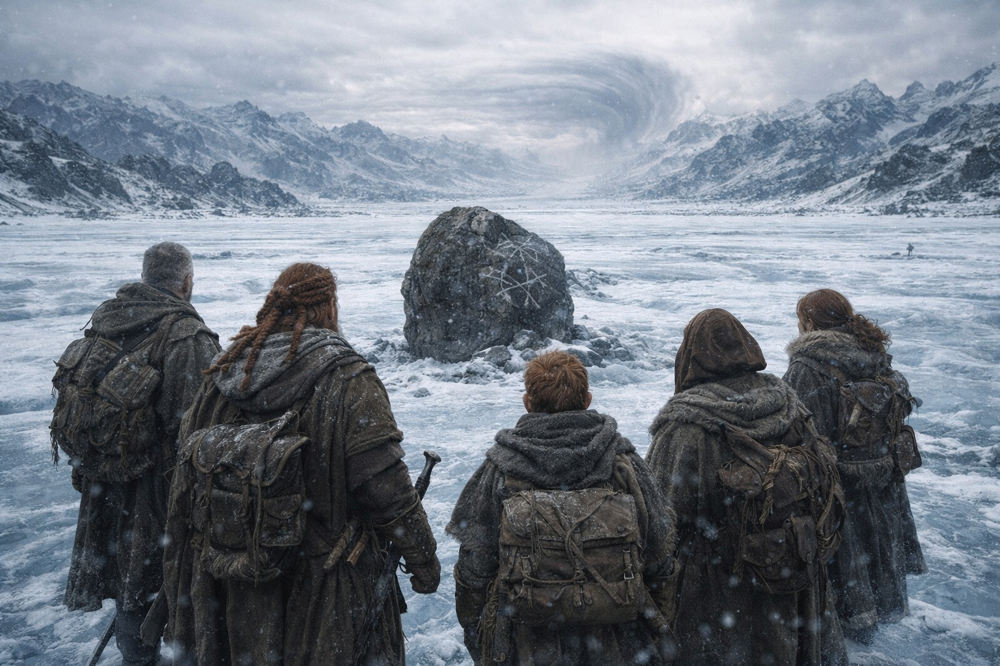
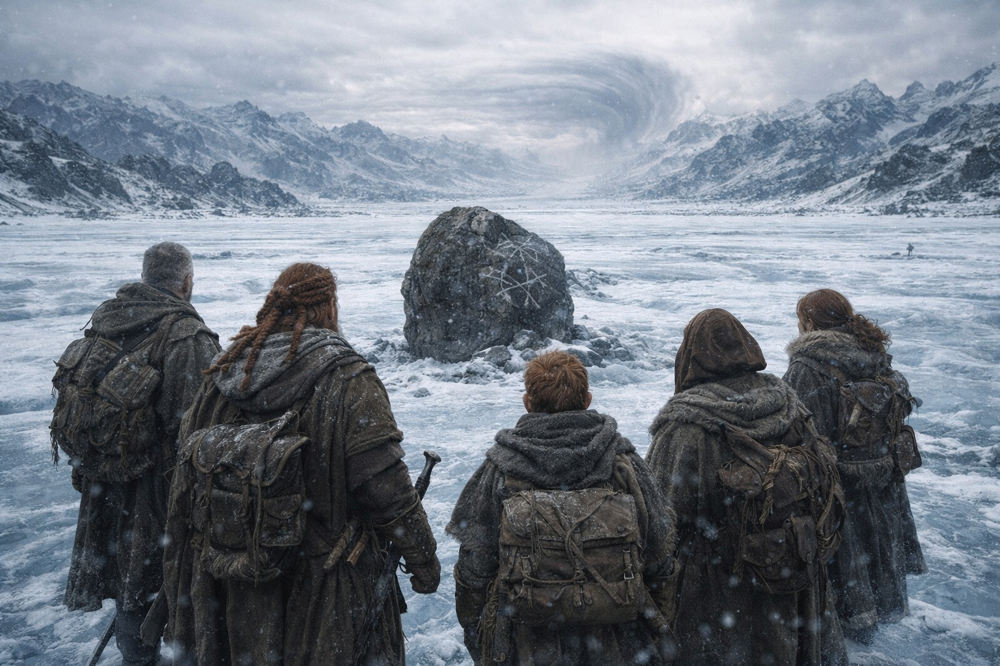

# Capítulo 38.3 | Teníamos Razón: La Impotencia

---

Probaron el pliegue durante dos días más.

Dulint envió a Aldric al sur. Envió a Balin al oeste. Envió a Xandor al noreste en cada ángulo que el terreno ofrecía. Cada vez la marca de tiza esperaba. Cada vez el Faro emitía su paciente zumbido de una legua. El pliegue no tenía bordes. No era un muro con extremos que pudieran rodear caminando. Era el paisaje en sí, doblado, la geografía reescrita de modo que la distancia entre aquí y la barrera existía en todas las direcciones y no era transitable en ninguna.

La segunda tarde, Aldric enterró su espada en el suelo congelado hasta la empuñadura y la dejó ahí mientras respiraba. Nadie preguntó si estaba bien. Su rostro decía que la pregunta no mejoraría las cosas.

—No podemos llegar hasta él —dijo Dulint.

Las palabras cayeron sobre el campamento helado como el cierre de un libro de cuentas. Xandor no levantó la vista de sus fragmentos. Balin alimentó el fuego. Aldric arrancó su espada del suelo, limpió el hielo de la hoja y la envainó sin mirar a nadie a los ojos.

—Eso no lo sabemos —dijo Aldric. Su voz estaba controlada del modo en que un hombre controla un caballo que quiere desbocarse—. Lo hemos intentado dos días. Dos días no es...

—Dos días es lo que tenemos. —Dulint había hecho el cálculo durante la marcha, del mismo modo en que había hecho cada cálculo durante cuarenta años: con honestidad, sin redondear a su favor—. Maris dice que está cerca. Días, dijo. Quizá menos. Hemos pasado dos días caminando en círculos por un paisaje que no nos deja pasar. Si hay un camino más allá del pliegue, no tenemos tiempo para encontrarlo.

La mandíbula de Aldric se tensó. Su mano estaba de nuevo sobre la espada, no agarrándola, descansando, pero del tipo de descanso que tiene un arco cuando está tensado.

—Todo en mí dice que me mueva.

—Lo sé.

—Todo para lo que fui entrenado dice que vaya hacia la amenaza.

—Lo sé.

—Y vamos a quedarnos aquí sentados.

—Vamos a quedarnos aquí sentados. —Dulint dejó que las palabras existieran sin suavizarlas—. Porque quedarnos aquí sentados y vivos es la única versión de esto que importará en una semana. Los hombres muertos no llevan informes. Los hombres muertos no llevan análisis. Los hombres muertos no le cuentan a nadie qué pasó y por qué. —Miró a cada uno de ellos—. Documentamos. Atestiguamos. Sobrevivimos para contárselo a alguien.

—¿Contarle qué a alguien? —La voz de Balin, desde el fuego. Callada.

—Cuál era el mecanismo. Cómo funcionaba. Quién estaba involucrado. Qué salió mal. —Dulint sacó el Faro de su mochila y lo sostuvo en la palma de la mano. El resplandor era constante. Una legua—. Cuando esto termine, alguien necesitará saberlo. Alguien que pueda hacer algo con las consecuencias. Somos las únicas personas que tienen el análisis. Eso nos hace más valiosos vivos e informados que muertos y valientes.

Aldric se puso de pie. Caminó hasta el borde de la cresta. Se quedó mirando al noreste, hacia la distorsión. Nadie lo detuvo. Nadie lo siguió. Necesitaba la distancia del modo en que una herida necesita aire: no para sanar, sino para respirar.

Maris llevaba una hora en silencio. Estaba sentada envuelta en sus pieles, con los ojos cerrados, respirando con el ritmo superficial de alguien que conserva cada gramo de energía para un único propósito. Dulint la observó. La nubosidad en su ojo izquierdo no había mejorado. La piel bajo ambos ojos había adquirido la cualidad amoratada de alguien cuyo cuerpo procesaba un daño que no podía reparar al ritmo en que se le infligía.

—Maris.

Abrió los ojos. Uno claro. Uno nublado.

—Puedo sentirlo caminar —dijo. Su voz era pequeña. No el lenguaje de distancia. No el escudo. La pequeñez de alguien que estaba viendo suceder algo que no podía cambiar, viéndolo del modo en que una persona ve un río subir hacia una casa en la que vive—. Tiene miedo. Camina de todas formas.

Dulint se sentó a su lado. El suelo congelado mordió a través de sus pantalones.

—¿Puedes decirle que se detenga?

Maris cerró los ojos. Se extendió. El esfuerzo se veía en la tensión de su mandíbula, el leve temblor en sus manos, la forma en que su respiración cambió de conservación superficial a tensión superficial. Mantuvo la extensión durante tres respiraciones. Cuatro. Cinco.

—No puede oírme.

—Abrió los ojos. La sangre brotó en su fosa nasal izquierda y se la limpió con el dorso de la mano, el gesto practicado, automático, un coste pagado tantas veces que el pago se había vuelto rutina—.

Hay algo en el camino. Algo que suena como un reloj.

La Voz. Ninguno de ellos conocía la palabra. Pero la descripción de Maris llevaba su forma: algo dentro del portador que estaba contando, midiendo, avanzando hacia un momento que había sido programado antes de que ninguno de ellos estuviera involucrado. Un mecanismo dentro de una persona, marcando el tiempo, llevando la cuenta, manteniendo al portador en el camino que el mecanismo requería.

—Un reloj —repitió Dulint.

—Ticando. Ni rápido. Ni lento. Exacto. —Maris se apretó las pieles—. Ella intentó llegar a través de él. El reloj empujó de vuelta. No con fuerza. Con certeza. El tipo de certeza que no necesita fuerza porque el resultado ya está construido dentro del mecanismo.

Dulint le puso una mano en el hombro. No consuelo. Reconocimiento. El toque de un hombre que entendía que a veces lo más valiente que una persona hacía era quedarse quieta y sentir algo que no podía arreglar.

—¿Cuánto tiempo?

—Ella no lo sabe. Días. Menos. —Maris miró hacia la distorsión del noreste—. El reloj se hace más fuerte. No porque el volumen aumente. Porque la distancia entre él y la barrera está disminuyendo. Cuando esté lo bastante cerca, el reloj dejará de contar y empezará a ejecutar.

El fuego crepitó. Las chispas subieron al aire helado y murieron.

—Entonces observamos —dijo Dulint. No apartó la mirada de la distorsión—. Seguimos vivos. Recordamos todo. Y cuando esto termine, lo llevamos de vuelta a las personas que necesitan escucharlo, y nos aseguramos de que escuchen.

Nadie discutió. No porque estuvieran de acuerdo. Porque no había nada que discutir. El terreno no los dejaba acercarse. El mecanismo dentro del portador no dejaba pasar a Maris. El reloj ticaba con la certeza de algo construido para ticar, y ellos estaban en el lado equivocado de una legua que no terminaba, observando a través de una conexión que sangraba y un artefacto que zumbaba, sabiéndolo todo y sin poder cambiar nada.

LOCK 1 se mantenía. El conocimiento creaba sufrimiento, no soluciones.

El Faro zumbaba. Una legua. Siempre una legua.

El reloj ticaba. No podían oírlo. Pero Maris podía sentirlo. Y la sensación era suficiente.

---

**Fin del subcapítulo — continúa en el Capítulo 38.4**
