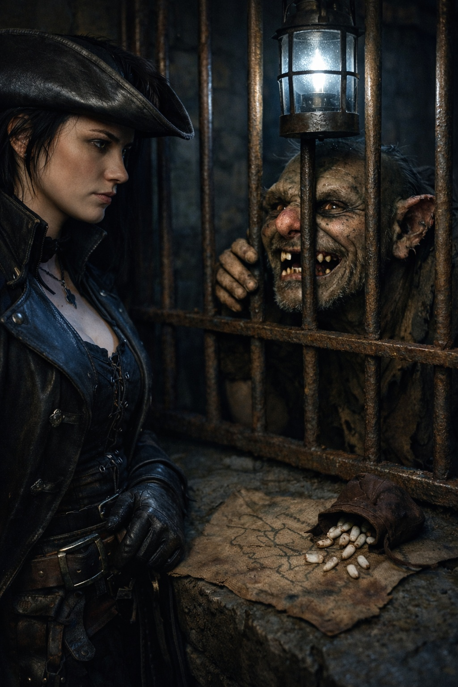
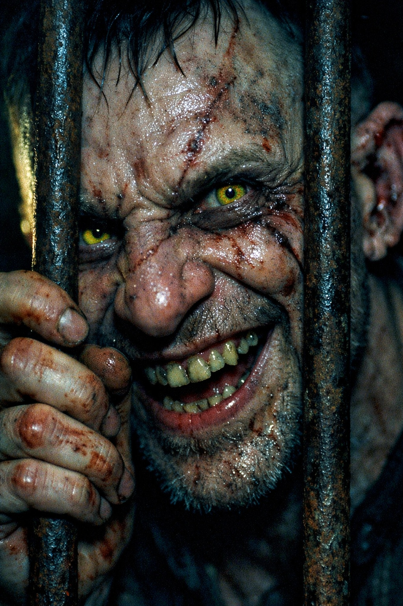
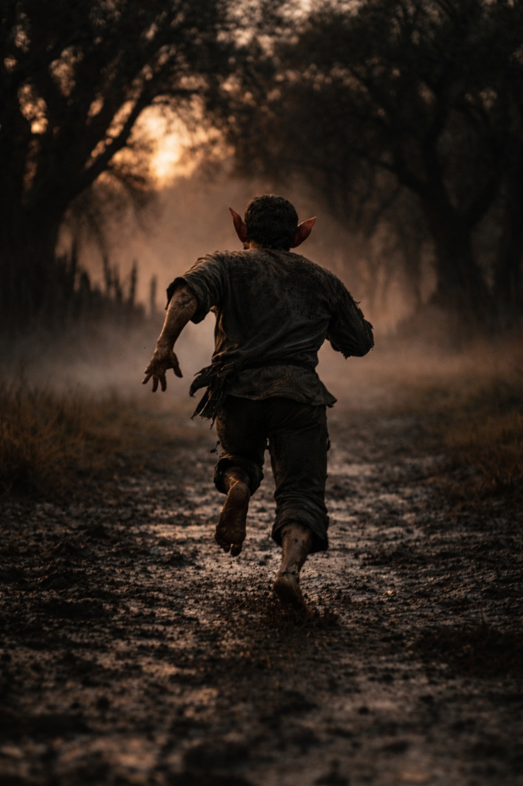

## Lore | El Poder Indómito de las Tribus Grukmar

---

El mensajero goblin frotó el muñón de un dedo contra el barrote frío. Le faltaban otros dos y la mayor parte de una oreja.

La Capitana Morrigan lo estudió a través de los barrotes de la celda del puesto fronterizo. La criatura había sido encontrada a una legua dentro del territorio lumeshireano, cargando nada más que una bolsa de cuero llena de dientes—no dientes de goblin, notó—y lo que parecía ser un mapa mal dibujado.

—Dice que es un desertor —dijo el Sargento Hollis—. Dice que quiere intercambiar información por santuario.

—Los goblins no desertan.

—Eso le dije.

El goblin presionó su cara contra los barrotes, sonriendo con lo que quedaba de sus dientes.

—Zikvik cruzó tu cerca vivo —dijo en un común vacilante—. ¿Quieres saber por qué? Pregunta por tribus del interior. Pregunta qué se mueve en pantanos.

Morrigan se quedó fuera del alcance de los barrotes. Él no dejaba de mirar la puerta a su espalda, aunque le mantuviera la sonrisa.

—¿Qué se mueve en los pantanos?

—Una cama de este lado de cerca. Después Zikvik cuenta.

---

> *«Ningún acuerdo con un jefe de Grukmar obliga a los campamentos vecinos.»*

Morrigan conocía la frase del informe de inteligencia. Explicaba los acuerdos rotos de sus archivos, pero no el cambio en las incursiones. En años anteriores, bandas dispersas de goblins y partidas de orcos habían cruzado durante la estación seca para apoderarse de suministros.

Este año era diferente.

Ahora las incursiones hacia el exterior casi habían cesado. Los exploradores seguían informando de luchas entre campamentos y humo sobre los pantanos. A Morrigan le parecía poco probable que hubiera paz, pero no tenía ningún testimonio del interior de aquellos campamentos.

El mando lo llamaba una victoria. Morrigan lo llamaba preocupante.

Había preguntado qué tribus daba el mando por derrotadas. La respuesta no había nombrado ninguna.

—Las tribus profundas —dijo ella al goblin—. ¿Cuáles?

Zikvik dejó de sonreír. Escondió la mano mutilada dentro de la manga.

—Nada de nombres. Tú apuntas nombres. —Miró a Hollis—. Algo despierta en pantanos. Jefes dicen arrodillarse. Otros dicen inundación, agua mala, mover campamento. Zikvik no espera que se pongan de acuerdo.

—¿Y tú adónde ibas?

—Aquí. A menos que abras puerta equivocada. —Señaló más allá de ella, hacia el portón.

---

Morrigan archivó su informe esa noche.

*Goblin capturado afirma conocimiento de actividad inusual en el interior de Grukmar. Detalles vagos. Recomiendo ampliar el reconocimiento.*

La respuesta llegó tres días después: *Activos de reconocimiento actualmente asignados al teatro del norte. Mantener los turnos habituales de patrulla. Tratar al sujeto capturado según protocolo siete.*

El protocolo siete significaba liberación en la frontera con una advertencia. Morrigan observó al goblin correr de vuelta hacia la línea de árboles, moviéndose más rápido de lo que había esperado para algo con tantas partes faltantes.

No miró hacia atrás.

Morrigan esperó a perderlo de vista antes de decirle a Hollis que cerrara el portón.

---

> *«Más allá de este portón no se garantiza el rescate.»*

La advertencia estaba tallada sobre el portón. Un registro antiguo fechaba la última expedición imperial un siglo antes, pero su informe estaba sellado. Morrigan no había encontrado ninguna entrada posterior que explicara por qué cesaron las expediciones.

Morrigan llevaba seis años sirviendo en aquella frontera. Había luchado contra goblins, rastreado bandas de guerra orcas, catalogado las criaturas que emergían de los pantanos durante la temporada de tormentas. Creía que entendía Grukmar.

Pero últimamente, las patrullas reportaban cosas que no encajaban en los patrones usuales. Campamentos orcos abandonados a mitad de comida. Madrigueras goblin vacías excepto por los muy viejos y los muy jóvenes. Huellas que llevaban más profundo hacia los pantanos—huellas masivas, de cosas que no podía identificar.

La versión de Zikvik explicaría los campamentos vacíos. No explicaba por qué las huellas se adentraban en los pantanos. Pidió a los exploradores que comprobaran de nuevo la dirección.

Escribió otro informe. Este fue más arriba en la cadena: *Recomiendo evaluación formal de actividad interior de Grukmar. Patrones de migración inusuales sugieren posible desestabilización regional.*

La respuesta fue la misma que antes. Recursos asignados a otro lugar. Mantener los turnos habituales de patrulla.

La tranquilidad continuaba.

Morrigan incrementó las patrullas de todos modos, bajo su propia autoridad. Si algo venía saliendo de Grukmar, quería verlo antes de que llegara a los muros.

Ninguna partida nueva llegó al muro. Los exploradores encontraron más huellas, pero discrepaban sobre su dirección. Un dibujo mostraba un talón ancho donde otro señalaba la abertura de los dedos.

Puso ambos dibujos junto al mapa de Zikvik. Nada le indicaba la escala.

Había expulsado a la única persona a quien podía preguntársela.

**Fin de Lore 2 — continúa en Lore 2: [El Pacto del Dominio Umbra'kor con la Oscuridad](/el-pacto-del-dominio-umbrakor-con-la-oscuridad/)**
