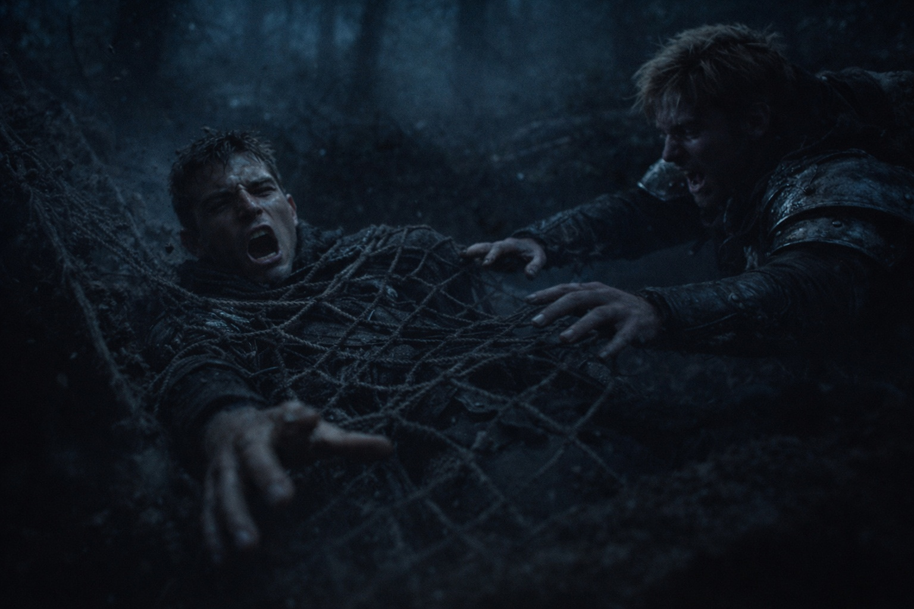

## Prólogo | Gritos en la niebla

--- 

La niebla flotaba entre los árboles negros. Varian entrecerró los ojos contra la penumbra, una mano en la empuñadura de su espada.

El grito de una mujer rompió la quietud.

Se volvió hacia Elric. Su amigo había palidecido.

—*¿Es una mujer?* —El susurro de Elric apenas se escuchó.

Varian asintió, desenvainando la espada. El roce del acero contra el cuero sonó demasiado fuerte en el opresivo silencio.

—*¡Socorro! ¡Por favor, que alguien me ayude!*

---

Varian se movió antes de poder pensarlo mejor. Cada pisada aplastaba hojas húmedas. Una sombra revoloteó entre los troncos —apareció y desapareció.

Elric lo agarró del brazo. —*Espera. ¿Has visto eso?*

Otro parpadeo, esta vez a su izquierda. Varian sopesó los riesgos.

—*Podría ser una trampa* —murmuró.

—*Deberíamos volver. No es nuestra...*

—*¡Ayudadme!* —Ronco. Desesperado.

Varian se soltó. —*No puedo dejarla.*

Se adentró más en la niebla. Las ramas le arañaban la cara. Detrás de él, Elric maldijo y lo siguió.

---

Los gritos eran cada vez más fuertes. Varian corrió con más fuerza, los pulmones ardiendo. Atravesó una maraña de arbustos hacia un claro.

Nada.

Vacío. Silencio. Solo niebla y el peso de ojos invisibles.

—*Yo no...* —comenzó Elric.

El suelo cedió.

El estómago de Varian se contrajo. El mundo giró. La espada se le escapó de las manos, desapareciendo en la oscuridad.

No golpeó el suelo. En cambio —una sacudida contra una malla áspera que se tensó a su alrededor. Las fibras de la red le mordieron la piel mientras se agitaba.

—*¿Elric?*

Un gemido. El crujido de la cuerda. —*Aquí. Maldita sea, estoy aquí.*

---

Sus ojos se adaptaron lentamente. Yacían enredados en el suelo del bosque, los bordes de la red atados a los árboles cercanos. Varian hizo fuerza contra las cuerdas. Se mantenían firmes, clavándose más con cada movimiento.

—*Te lo dije* —gruñó Elric—. *Trampa.*

Varian se retorció, tratando de alcanzar el cuchillo del cinto. Tenía los brazos inmovilizados.

—*Ahorra fuerzas. No saldremos de ésta fácilmente.*

Una risita descendió desde arriba.

—*Vaya, vaya.* —Una voz de mujer —nada parecida a los gritos desesperados que los habían atraído—. *Qué ratoncitos más tontos hemos cazado.*

---

Varian abrió la boca para responder. El mundo se inclinó de lado. La lengua se le volvió gruesa e inútil.

—*No se resistan, muchachos.* —La voz era paciente. Divertida—. *El veneno de esas cuerdas actúa rápido. Duerman ahora. Tendremos tiempo de sobra para conocernos cuando despierten.*

La oscuridad se deslizó por los bordes de su visión. Luchó por mantener los ojos abiertos, por pensar.

Lo último que vio fue la silueta de una mujer orca contra las estrellas. Sus colmillos brillaban. Los observaba sin parpadear.

**Fin de Prólogo 7 — continúa en Prólogo 8: [La marcha de la Desesperación](/la-marcha-de-la-desesperacion/)**
