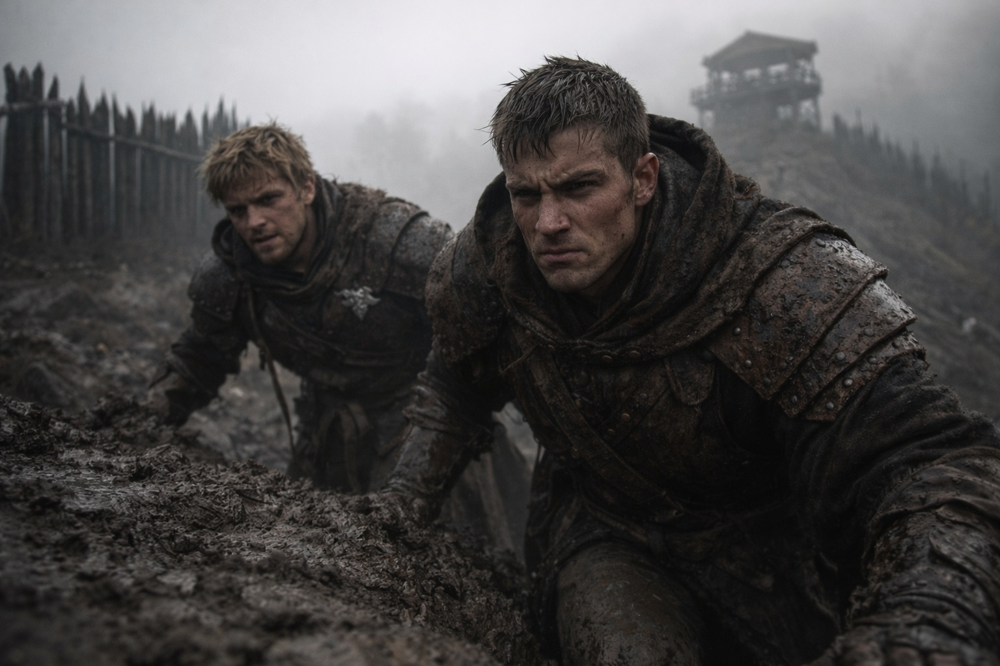
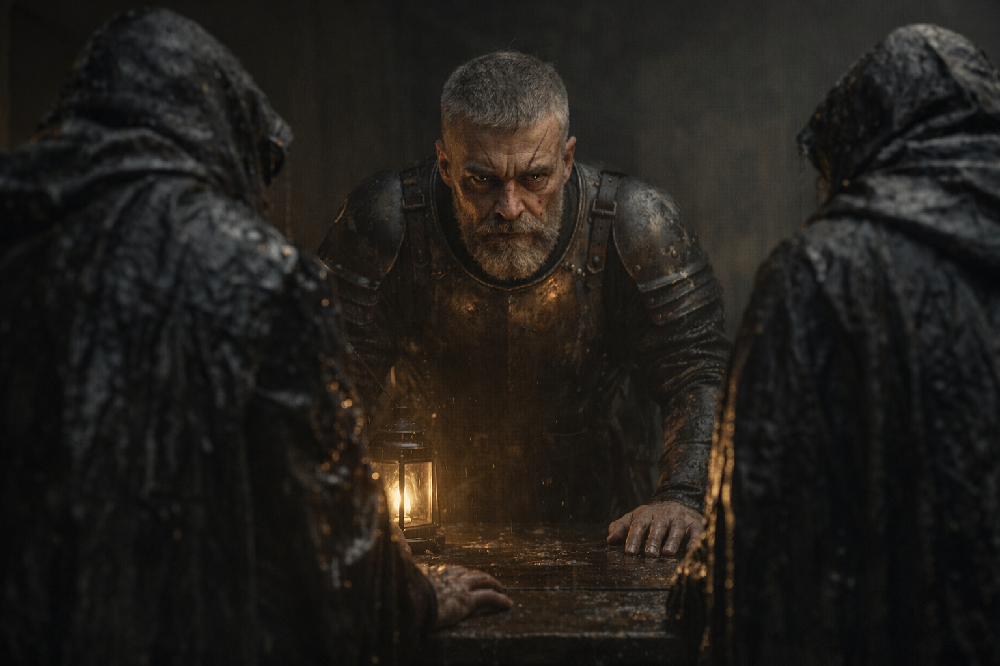
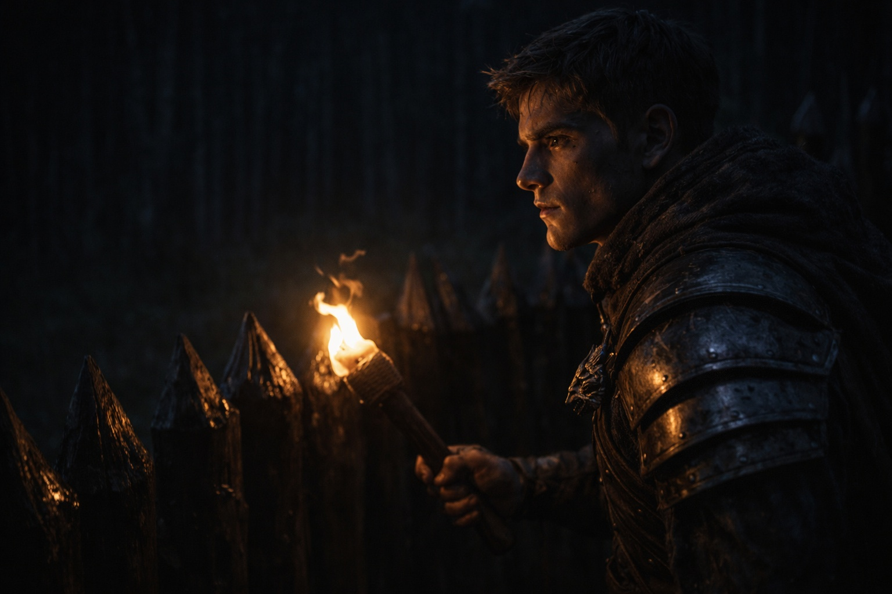
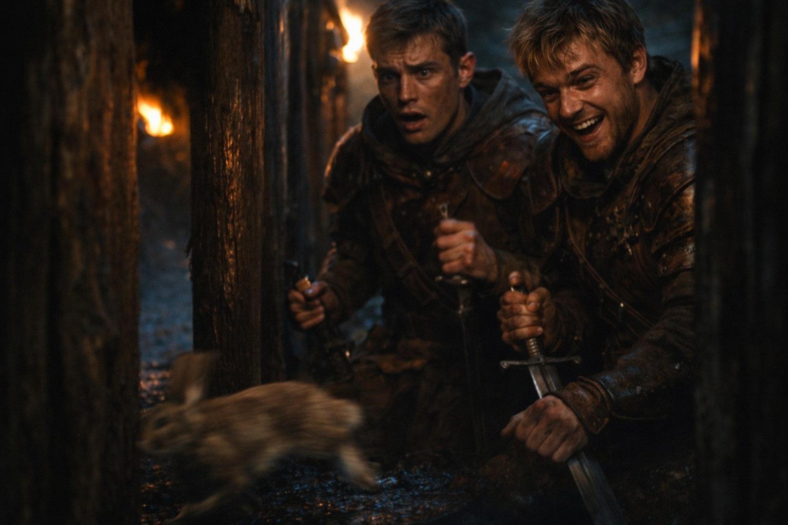
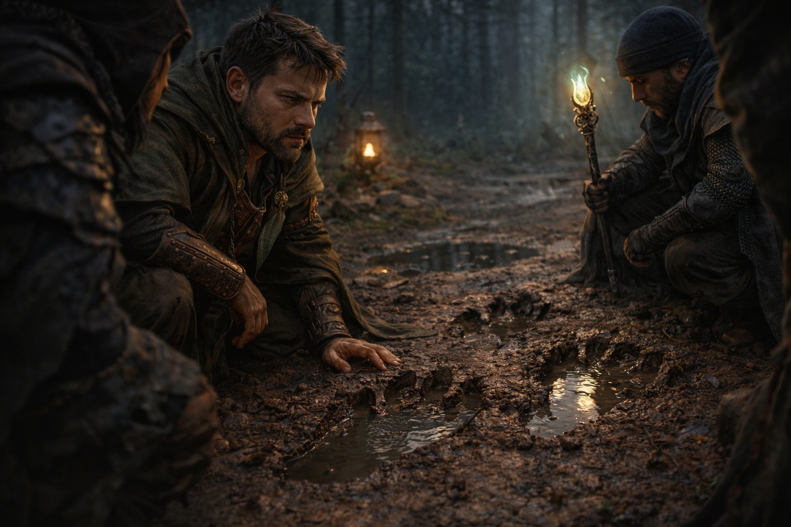

---
publication_order: 118
order: 118
title: Sin Rastros
date: 2024-04-19
language: es
chapter: null
subchapter: null
storyline: prologue
canon_phase: prologue
canon_sequence: P-006
narrative_weight: medium
category: Lumeshire
author: Valarian
type: Prologue
tags: ['#sin rastros', '#lumeshire']
thumbnail: image.jpg
featured: false
counterpart_path: site/content/posts/en/lumeshire/morning-tidings-goblin-threats-at-grukmars-edge/index.mdx
counterpart_title: No Tracks
---

## Prólogo | Sin Rastros

--- 

El barro tiraba de las botas de Varian mientras subía hacia el puesto. Elric lo seguía un paso atrás, respirando por la nariz como si el aire mismo lo ofendiera.

Los ojos de la muchacha se habían alojado detrás de los suyos. No miedo en abstracto. Miedo con forma. Miedo que miraba más allá de él hacia la línea de árboles como si los árboles fueran una puerta.

—*¿Dormiste?* —preguntó Elric.

—*No.*

—*Igual.*

Después de eso, las palabras se sentían como ruido que haces justo antes de que algo te encuentre.

Alden esperaba junto a la puerta del capitán. Ambas manos en su lanza. No apoyándose —sosteniéndose. Su rostro había perdido el color, y eso le hizo más a Varian que cualquier campana de alarma.

—*Jinetes* —dijo Alden—. *Aldeas fronterizas. Están con el capitán.*

---

Varian golpeó una vez y entró porque esperar se sentía como un lujo.

Eldric estaba de pie detrás del escritorio, manos planas sobre la madera. Dos hombres con capas salpicadas de barro lo enfrentaban, hombros encorvados como si hubieran cargado algo pesado durante kilómetros.

—*...tres reses más* —decía uno—. *Gargantas abiertas.*

Eldric levantó la vista. Su expresión era la que usaba antes de que las tormentas golpearan el muro.

—*Varian. Elric.* —Dos nombres, limpios y cortantes.

—*No se llevaron la carne* —dijo Elric, porque era lo bastante rápido para ver la parte equivocada.

El jinete asintió. —*Las dejaron donde cayeron.*

El silencio se posó sobre los hombros de Varian como un peso físico.

—*Señor.* —Se obligó a decirlo directo—. *Incidente en la aldea anoche. Una muchacha. Arañando el aire. Sin atacante.*

No dijo cómo sus ojos se habían fijado en el bosque como si hubiera visto algo inclinándose entre los troncos.

—*Sin rastros* —repitió Eldric, probando la frase en busca de debilidades.

—*Ninguno. Pero miraba los árboles como si estuvieran demasiado cerca.*

Eldric despidió a los jinetes con un asentimiento que significaba: váyanse, antes de que el miedo se propague. Cuando la puerta se cerró, no mostró el peso. Ese era su propósito.

—*Nadie cruza a [Grukmar](https://www.drusniel.com/el-poder-indomito-de-las-tribus-grukmar/).*

Lo dijo como una línea fronteriza en un mapa que existía porque hombres morían más allá de ella.

—*Vigilamos. Guardamos. No vamos de cacería.*

---

El sol subió más alto —un ojo frío detrás de nubes dispersas. Varian caminó por el borde de la aldea hasta que le dolieron las piernas. Cada sombra parecía estar esperando.

Al anochecer encontró a Elric en la armería, pasando una piedra de afilar por su hoja.

—*¿Tranquilo?*

—*Hasta ahora.* —Elric no levantó la vista—. *Se siente mal. Como una tormenta que puedes oler pero no ver.*

—*¿Y cuando ellos crucen primero?*

—*Entonces estaremos listos.*

---

La primera guardia la hicieron juntos. El bosque yacía completamente quieto. Sin viento. Sin canto de pájaros. Nada más que el crujir de sus botas y el sonido de su propia respiración.

—*Las historias* —dijo Elric—. *Sobre los rituales goblin. ¿Te crees algo de eso?*

—*Para asustar niños.*

—*¿Pero tú no?*

Por un largo momento Varian no respondió. —*Creo que algo vive en ese bosque que no piensa como nosotros. Quizás los goblins lo sirven. Quizás los usa. De cualquier manera, solo un tonto va a buscarlo.*

Elric se congeló. —*Ahí.* —Su antorcha apuntó hacia la línea de árboles.

Varian entrecerró los ojos. Movimiento. Un destello, allí y desaparecido.

Su espada se deslizó fuera. Se quedaron congelados mientras la noche presionaba cerca.

Una rama crujió.

Varian giró. Una forma estalló desde los árboles—

Un conejo. Un conejo aterrorizado que corrió entre los postes y desapareció.

Elric se desplomó contra el muro, riendo temblorosamente. —*Encontramos nuestro goblin.*

Varian no sonrió. Cuando envainó su espada, sus manos no estaban firmes.

---

El descanso resultó esquivo. Varian se revolvió en su cama estrecha mientras las sombras reptaban por el techo. El rostro de la muchacha flotaba detrás de sus ojos. Los viejos árboles, sus ramas extendiéndose como dedos.

Cuando el sueño lo arrastró, estaba lleno de formas amenazantes y el espeso hedor cobrizo de la sangre.

---

Amanecer gris. Cielo gris.

Elric esperaba en el patio, rostro demacrado y ojeroso.

—*La patrulla ha vuelto. Encontraron huellas.*

A través de la puerta, hacia la línea de árboles. Un grupo de hombres permanecía en tenso silencio. Se apartaron cuando Varian se acercó.

En la tierra húmeda: huellas, largas y abiertas, inconfundiblemente inhumanas.

Elric se agachó, trazando una con el dedo. —*A media milla de la frontera.*

Varian miró fijamente el bosque —hacia esos espacios oscuros entre los troncos donde cualquier cosa podría estar observando.

Los hombres se dispersaron. Varian se quedó donde estaba.

Pensó en los granjeros que trabajaban sus campos a la vista de esa línea de árboles. Tontos valientes, o ciegos. Nunca había podido decidir.

El viento cambió. Por un momento, habría jurado que olía algo debajo del pino y la arcilla. Algo mal.

Luego desapareció.

**Fin de Prólogo 6 — continúa en Prólogo 7: [Gritos en la niebla](/gritos-en-la-niebla/)**
