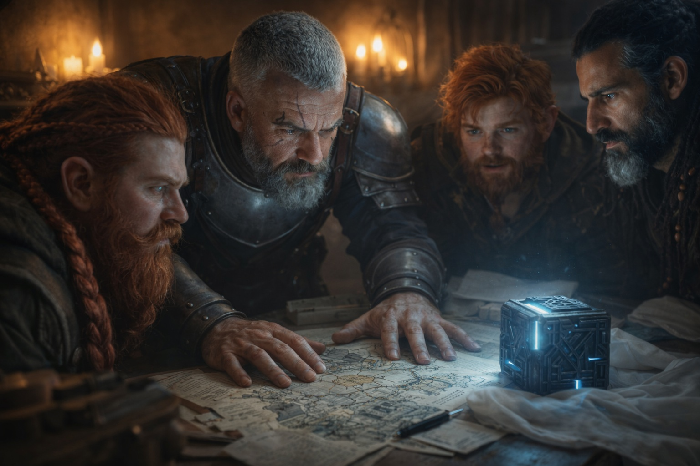
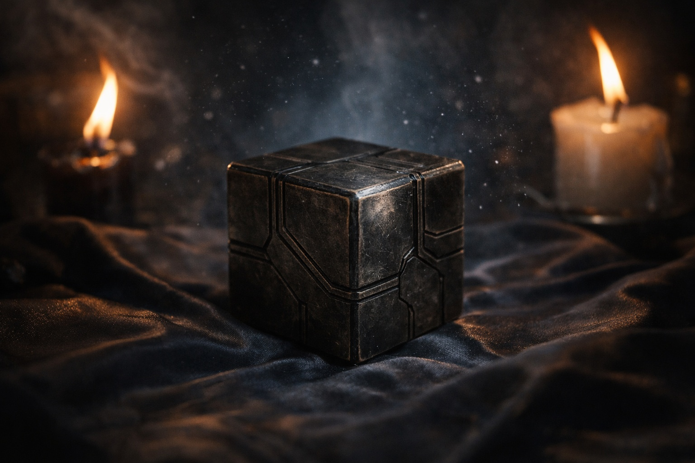

## Capítulo 10 | Parte 3

--- 

Le dieron a Eldric la persecución desde Stonehold en adelante.

Él la reconstruyó como un mapa de campaña.

Primer contacto después de la activación.

Cuatro perseguidores.

Ningún interés en las huellas cuando el cubo estuvo escondido bajo la alcantarilla.

Movimiento directo hacia el objeto enterrado.

Después, adaptación cuando Dulint lo recuperó.

—Esa parte importa —dijo Eldric.

—¿Por qué? —preguntó Balin.

—No los seguían a ustedes. Seguían al cubo.

Dulint asintió.

—Eso concluimos.

—Bien. Las conclusiones son más baratas cuando otro paga el experimento.

Balin lo miró.

Eldric lo ignoró.

Xandor había organizado sus notas en tres columnas.

**Observado. Texto. Hipótesis.**

Eldric aprobó.

Bajo *Observado*:

El cubo se orientaba.

Se calentaba.

Los perseguidores podían volver a localizarlo después de ocultarlo.

Bajo *Texto*:

**Fase de Sentido. Resonancia.**

Bajo *Hipótesis*:

El cubo buscaba resonancia y exponía suficiente actividad propia para ser rastreado.

Nada más.

—¿Desde Riverhold? —preguntó Eldric.

Dulint señaló al norte.

—Principalmente hacia allí. Frostgard, quizá. Pero empezó a cambiar esta tarde.

—¿Cómo?

—Pequeñas correcciones. Después mayores.

—Objetivo en movimiento.

—Quizá —dijo Xandor.

Eldric lo miró.

—Bien.

—¿Qué?

—No dijiste que sí.

Xandor tocó la columna de hipótesis.

—Primero la evidencia.

El cubo cambió de orientación.

Los cuatro hombres lo vieron.

Su cara más brillante se movió varios grados hacia Eldric.

Después se detuvo.

Balin miró de uno a otro.

—Bueno.

Eldric se movió a la izquierda.

El cubo no lo siguió.

Se movió a la derecha.

Nada.

—No me rastrea a mí.

Xandor frunció el ceño.

—Cambió cuando entraste ayer.

—O mientras entraba.

Eldric miró detrás de sí.

Puerta.

Escaleras más allá.

—Si algo se acercaba desde esa dirección, yo habría quedado entre el cubo y eso.

Xandor observó la orientación.

—Posible.

—Mejor que decidir que soy mágico porque cuento salidas.

Balin soltó una risa por la nariz.

Dulint ocultó una sonrisa.

El cubo volvió a moverse.

Hacia la puerta.

La mano de Eldric quedó cerca del cuchillo.

—¿Cuánto falta para que eso llegue?

—No lo sabemos —dijo Xandor.

—Entonces decidimos si nos movemos.

—Lo intentamos —dijo Dulint—. Las principales rutas del norte están vigiladas.

—¿Caminos menores?

—¿Con el cubo exponiéndonos?

Eldric consideró el mapa.

—El peligro ya controla los caminos.

Balin se apoyó en la ventana.

—¿Entonces esperamos?

—Nos preparamos —dijo Eldric—. Esperar es como llama la gente a la preparación cuando no la ha hecho.

Puso a Balin en la ventana.

A Dulint junto al cubo.

A Xandor con sus notas.

Eldric tomó la puerta.

El cubo se movió otra fracción hacia él.

No.

Hacia lo que hubiera detrás.

—Ahora —dijo— descubrimos si esa diferencia importa.

---

**Fin de Capítulo 10.3 —> 10.4: [El Nudo en Riverhold: La Atracción](/el-nudo-en-riverhold-la-atraccion/)**
