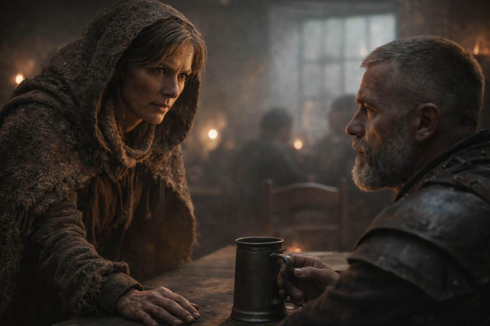

## Capítulo 10 | Parte 1

---

La taberna tenía tres salidas. Eldric eligió una silla de espaldas a la pared y apartó una taza pegajosa de la mano con la que empuñaba la espada. Desde allí podía llegar a la puerta de la cocina antes de que se levantara nadie de la barra.

Llevaba casi un año sin mando. Las costumbres se negaban a marcharse con el cargo.

La cerveza estaba aguada y era barata, que era lo que importaba desde que habían dejado de pagarle. Destituido con honores, lo habían llamado. Había preguntado cuánto pagaban los honores. Nadie se había reído.

Intentó no contar los días.

Trescientos cuarenta y siete desde su destitución. No recordaba qué había comido aquella mañana, pero el número lo esperaba cada vez que despertaba.

Habían encontrado el cuerpo de Varian hacía noventa y tres días. El de Garrick, cinco días después. También había pagado aquellas bebidas.

*Organizados*, les había dicho. *Las incursiones Grukmar no son aleatorias. Están coordinadas. Alguien está unificando las tribus.*

Habían asentido.

Después lo enviaron lejos.

Varian y Garrick murieron después.

—Eldric.

Levantó la vista.

Sera estaba junto a la mesa, polvorienta y gastada por el viaje.

—Sera. —Señaló la silla vacía—. No esperaba verte tan lejos de Zuraldi.

—Yo tampoco esperaba estar aquí. —Se sentó—. Busco a Xandor.

Eso captó su atención.

—Está en Riverhold. En el Descanso del Erudito.

El alivio apareció y desapareció de su rostro.

—¿Por qué?

Sera dudó.

Eldric esperó.

—Dulint y Balin. Enanos de Stonehold; un mercader mayor y su sobrino. Pasaron por Zuraldi llevando algo.

—¿Valioso?

—No lo sé. —Se inclinó hacia él—. Pero la gente que los seguía sí parecía saberlo.

Los ojos de Eldric fueron por costumbre hacia la salida más cercana.

—¿Cuándo?

—Hace cuatro días. Quizá cinco.

Con aquel tiempo podían haber llegado a Riverhold. Eldric dejó la taza.

—¿A qué distancia los seguían?

—Lo bastante cerca como para no quedarme a averiguar qué querían.

—Necesito ver a Xandor.

—Entonces llévame contigo.

Cruzaron Riverhold entre el mercado de la tarde.

Eldric leyó la multitud sin pensarlo: manos ocultas bajo capas, gente que mantenía posición en vez de avanzar, carros bloqueando líneas de visión, callejones que se cerraban como trampas.

Nada evidente los siguió.

Eso significaba poco.

En el Descanso del Erudito, Xandor abrió la puerta antes de que Sera llamara dos veces.

—Eldric.

—¿La enviaste tú?

—No. Estaba a punto de enviar a otra persona.

—¿Por qué?

Xandor miró hacia la habitación interior.

—Porque Dulint y Balin llegaron ayer.

Sera cerró los ojos un instante. —Vivos. Bien. Pediré una habitación abajo; no duermo desde ayer. —Xandor le indicó dónde encontrar al posadero.

—¿Qué trajeron? —preguntó Eldric cuando ella se hubo marchado.

—Llevo un día examinándolo y no puedo darte un nombre del que me fíe.

—Muéstramelo.

Xandor abrió la puerta interior.

---

**Fin de Capítulo 10.1 —> 10.2: [El Nudo en Riverhold: La Llamada](/el-nudo-en-riverhold-la-llamada/)**
