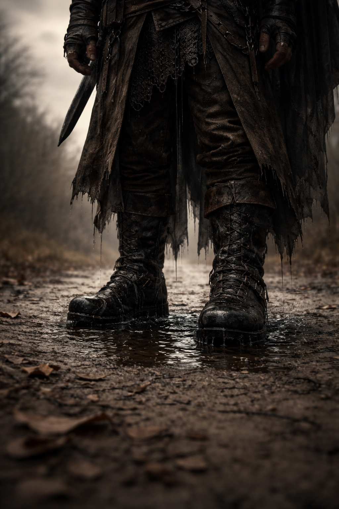
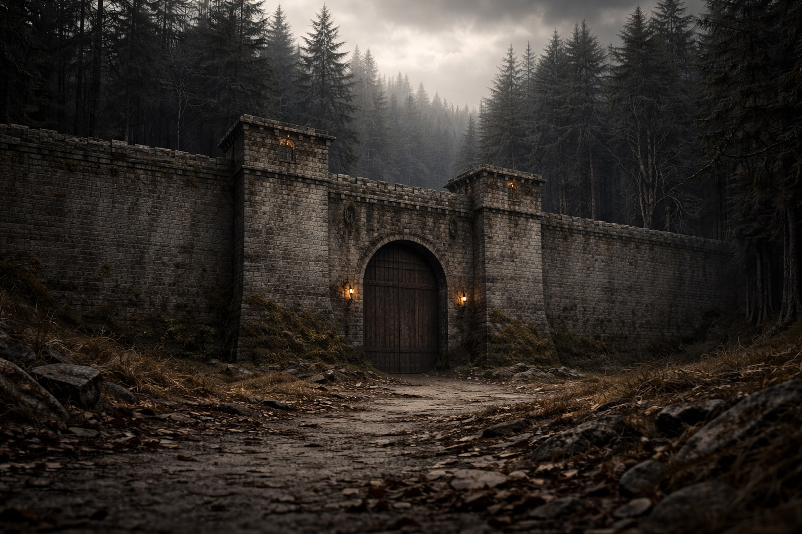
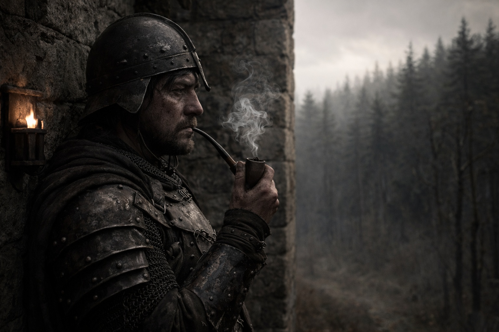
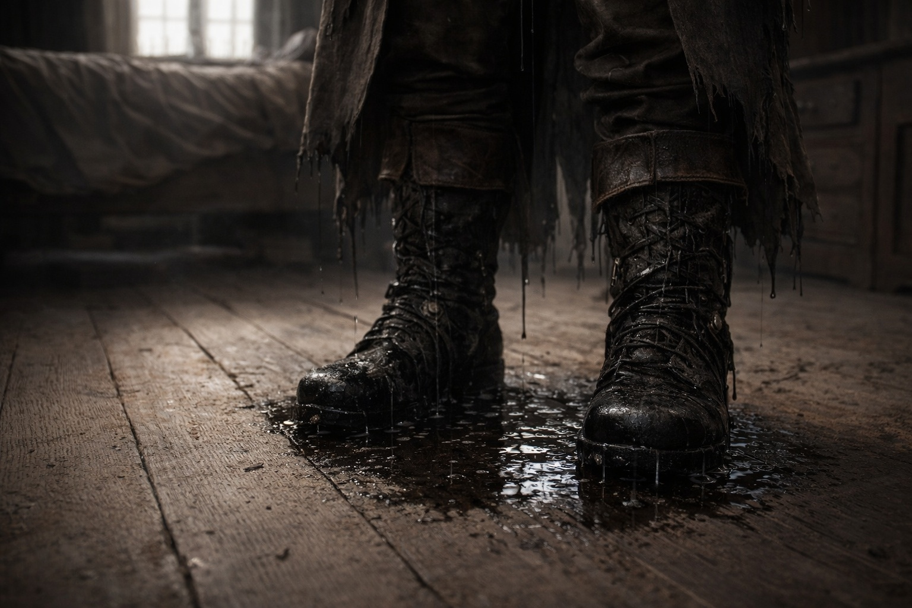

## Lore | La Defensa Resiliente del Imperio Divino de Lumeshire

---

Las botas de Valarian estaban mojadas.

Había tomado el camino oriental desde los barracones. La grava elevada solía mantenerse seca durante las lluvias de otoño; el día anterior lo había cruzado sin mancharse las suelas.

Miró hacia abajo. El agua se acumulaba alrededor de sus pies, oscura e inmóvil, sin reflejar nada.

Inclinó un pie para vaciar el agua. Sonaba la campana de guardia; podría preguntarle a un sacerdote por el charco después de la ronda.

El muro de la guarnición apareció a la vista: treinta pies de piedra gris entre los barracones y los árboles. Más allá, los mapas de patrulla señalaban los pantanos y las ruinas de Grukmar.

El cabo Bren esperaba en el puesto de control, frotándose las manos. Ya tenía el informe desplegado para que Valarian lo leyera.

—¿Algo durante la noche? —preguntó Valarian.

—Huellas de goblin cerca de la cerca sur. Una banda pequeña, quizás seis. No cruzaron.

—Nunca cruzan durante la temporada de cosecha. Demasiado tráfico de patrullas.

Bren asintió, pero su expresión era extraña. —Hay otra cosa. Venn presentó un informe. Dijo que vio luces en los bosques orientales.

—Venn ve luces cada vez que bebe.

—No estaba bebiendo. Estaba en la tercera guardia. Dijo que las luces se movían, como linternas, pero no había nadie llevándolas.

Valarian tomó el informe de las manos de Bren y lo revisó. Formulario estándar, la letra apretada de Venn, el espacio de las firmas de testigos en blanco.

—Necesita dos testigos para hacer esto oficial.

—Lo sé. Por eso está molesto. Marrek estaba de guardia con él, pero Marrek dice que no vio nada.

Valarian dobló el informe y lo metió en su cinturón. —Entonces va al archivo de no verificados. Igual que la última vez.

Bren dudó. —¿Y si había algo?

—Entonces esperamos hasta que alguien más lo vea. Ese es el procedimiento. —Valarian le dio una palmada en el hombro—. No te preocupes. El imperio ha sobrevivido a cosas más extrañas que luces flotantes.

Recorrió el perímetro. En cada puesto cotejó el nombre del centinela con la lista. El agua se le metía entre los dedos de los pies cada vez que se detenía.

En la puerta occidental, encontró a Marrek fumando una pipa y mirando las montañas.

—No viste las luces —dijo Valarian.

Marrek no se volvió. —Vi algo. No estoy seguro de que fueran luces.

—¿Qué era?

Una larga pausa. El humo se elevaba de la pipa.

—Una forma —dijo Marrek finalmente—. Al borde de los árboles. Alta. Demasiado alta para ser un hombre. Solo estaba ahí parada, observando el muro.

—¿Y no reportaste eso?

—¿Reportar qué? '¿Vi una forma'? Eso no es un informe. Eso es un poema.

Valarian no podía discutir con esa lógica. Los formularios tenían casillas para huellas de goblin, avistamientos de orcos, clima inusual. No había casilla para *formas altas que se sentían mal*.

Miró hacia la línea de árboles oriental. Los árboles permanecían inmóviles en el aire de la mañana, oscuros y densos. Más allá de ellos, la tierra se elevaba hacia las montañas de Stonehold. Más allá de esas, según los mapas antiguos, yacían territorios que ni siquiera los exploradores patrullaban.

*Umbra'kor.* Había oído a soldados describir ciudades bajo las montañas y ritos celebrados sin luz. Cada uno juraba que una parte distinta era cierta. Valarian nunca había visto un informe de allí.

¿Y más allá de Umbra'kor?

*Wyrmreach*.

Tampoco había conocido a nadie que hubiera estado en Wyrmreach. Un relato de fogata lo situaba al otro lado de un mar; otro aseguraba que se llegaba por un camino bajo tierra. Ambos narradores se lo habían oído a otra persona.

—El Capitán Eldric piensa que Venn estaba soñando —dijo Marrek.

—Eldric piensa que todo son sueños o problemas de disciplina.

—¿Qué piensas tú?

Valarian miró el agua que le oscurecía las botas y volvió la vista a la línea de árboles, donde nada destacaba.

—Tengo una lista que terminar —dijo—. Si vuelves a verlo, llama al puesto de al lado. Consígueme otro testigo.

Marrek asintió y dio una calada a la pipa. Siguió mirando los árboles.

De vuelta dentro, Valarian archivó los retrasos del grano y aprobó una solicitud de botas. Aflojó los cordones de las suyas bajo el escritorio mientras firmaba los turnos de patrulla de la semana siguiente.

Al mediodía, llegó un mensajero de la torre de vigilancia oriental. Una sola página, sellada con el sello menor que significaba *inusual pero no urgente*.

Valarian rompió la cera.

*La Patrulla Siete regresó antes de lo previsto. Un miembro desaparecido: el soldado Coller. Equipo de búsqueda enviado. Sin rastros.*

Lo leyó dos veces. Luego caminó a los cuarteles del Comandante y colocó el informe sobre su escritorio.

—¿Desaparecido cómo? —preguntó el Comandante sin levantar la vista.

—El informe no lo dice. Solo que estaba con la patrulla al atardecer y desapareció al amanecer. Sin huellas. Sin señales de lucha. Su equipo todavía estaba en su tienda.

El comandante dejó la pluma junto a los informes sin abrir. —Archívalo.

—¿No deberíamos...?

—Archívalo, Valarian. Bajo 'inexplicados'. Tenemos tres docenas de desapariciones inexplicadas en ese archivador. Ninguna llevó a ningún lado. Ninguna lo hace nunca.

Valarian vaciló. —¿Podría estar relacionado con los avistamientos? ¿Las luces de Venn, o lo que vio Marrek?

—La búsqueda no encontró nada. —El comandante levantó la vista—. Si vuelven a salir, no harán la guardia de esta noche. ¿Qué puesto propones dejar vacío?

Volvió a su papeleo.

Valarian se quedó ahí un momento más, luego se fue.

Fuera, un centinela llegó a la esquina y dio media vuelta sobre el muro. Valarian esperó a que pasara antes de cruzar el patio.

Aún tenía el informe de Coller en la mano. Lo dobló para que cupiera en el cajón pequeño.

Archivó el informe de avistamiento de Venn en el cajón de no verificados.

Archivó el informe del soldado desaparecido en el archivador de inexplicados. Completó su turno, cenó, y durmió sin soñar.

Por la mañana, sus botas estaban mojadas de nuevo.

Esta vez, aún no había salido de su habitación.

---

*Del registro de guardia: luces de Venn no verificadas; Marrek discrepa de la descripción. El capitán Eldric no recomienda cambios en la guardia. Nadie ha reclamado el equipo de Coller.*

**Fin de Lore 1 — continúa en Lore 1: [Fragua y Fuego: La Postura del Reino Montañoso de Stonehold Contra el Caos](/fragua-y-fuego-la-postura-del-reino-montanoso-de-stonehold-contra-el-caos/)**
