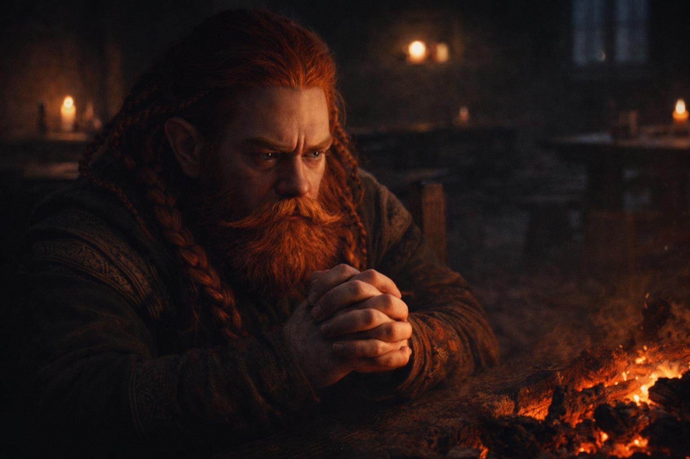
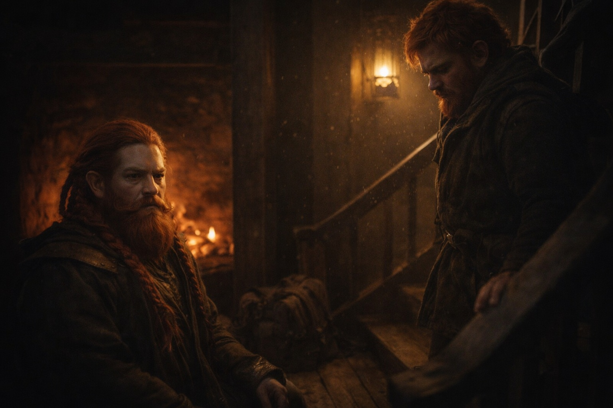
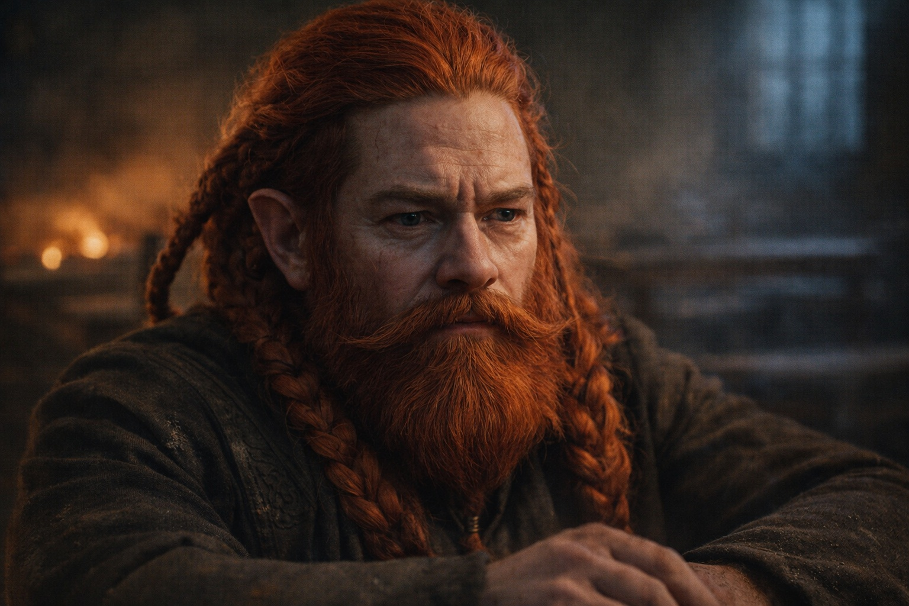
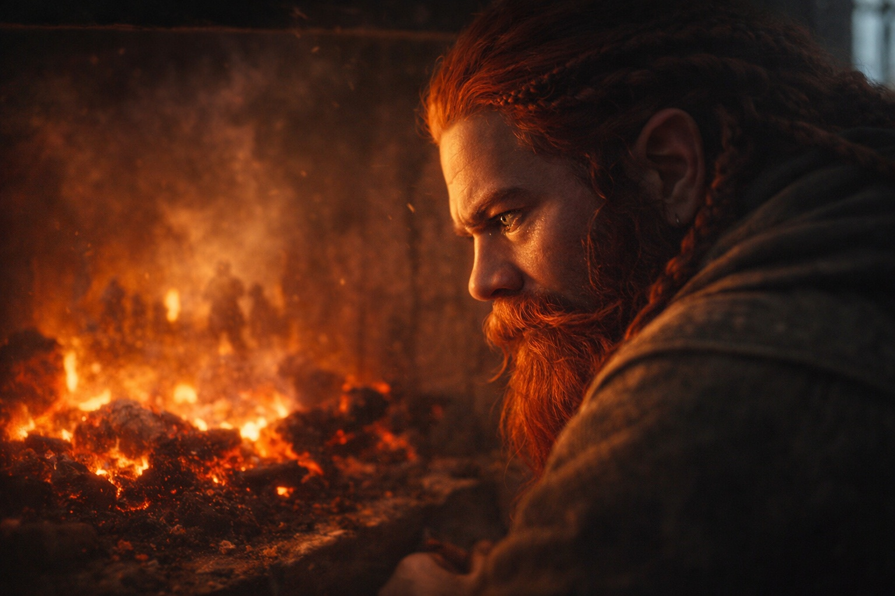
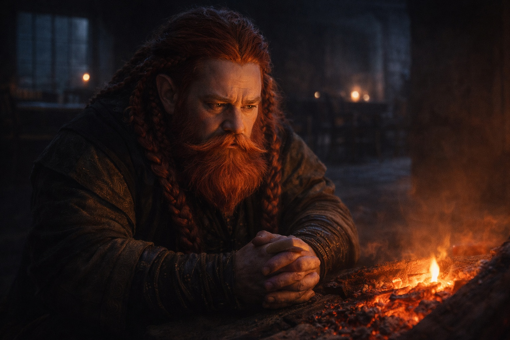

## Capítulo 16 | Parte 1

---

Dulint no podía dormir.

La noche antes de la partida, y su mente no se calmaba. Se sentó en la esquina del salón común de la posada, mucho después de que los otros se habían ido a sus camas, viendo el fuego morir y escuchando palabras que no dejaban de resonar.

*Fracasarás.*

No era una amenaza. No era una maldición. Solo una declaración de hecho, pronunciada con una voz que no contenía ninguna emoción.

El rostro de la vidente apareció sin ser invitado—curtido, antiguo, ojos que lo miraban a través como si estuviera hecho de cristal. No había sido cruel. No había sido amable. Solo... observadora. Viendo el futuro desplegarse en patrones que él no podía ver.

*Fracasarás. La pregunta es qué tan completamente.*

Escuchó pasos en las escaleras y forzó su expresión a algo que se pareciera a la calma. Balin apareció, rostro joven arrugado con preocupación.

—¿Tío? Es tarde.

—Los hombres viejos no necesitan mucho sueño. —La mentira salió fácilmente, suavizada por la repetición.

—Has estado diferente desde que dejamos Stonehold. —Balin se sentó frente a él, sin ser invitado pero bienvenido—. Algo te pesa.

*Stonehold ardiendo. Tu rostro. Mi muerte.*

—Siempre hay algo pesando sobre los enanos viejos —dijo Dulint—. Hemos tenido más tiempo para acumular pesos.

—Tío—

—No es nada que te ayude saber. —Honesto, a su manera. Saber solo haría que Balin se apresurara. Apresurarse los mataría a todos.

*Lentamente,* había dicho la vidente. *Fracasa lentamente, y algunos podrán sobrevivir.*

Balin lo estudió por un largo momento, luego asintió con reluctancia. —Descansa un poco. Mañana partimos.

—Lo sé.

Cuando Balin se fue, Dulint se volvió hacia el fuego moribundo. Las llamas le recordaban cosas que no podía dejar de ver—visiones de Stonehold con fuego en sus salones, enanos corriendo y gritando, el cuerpo de Balin inmóvil y frío.

Eso era lo que el fracaso completo parecía. Eso era lo que intentaba prevenir.

*Diles,* susurró algo. *Comparte la carga.*

Pero compartir la carga significaba compartir el miedo. Y el miedo hacía que la gente hiciera cosas desesperadas e imprudentes. Del tipo que hace que la gente muera.

Llevaría esto solo. Esa era la única manera de llevarlo en absoluto.

---

*Siguiente: La Advertencia del Vidente: La Visita*

**Fin de Capítulo 16.1 — continúa en Capítulo 16.2: [La Advertencia del Vidente: La Visita](/la-advertencia-del-vidente-la-visita/)**