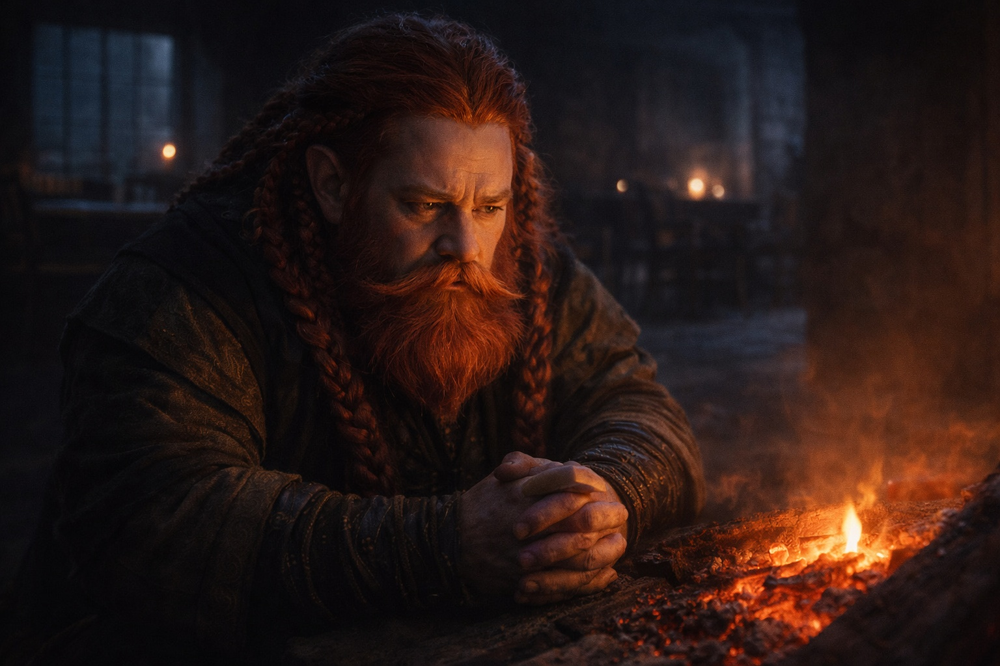

## Capítulo 16 | Parte 1

---

Dulint no podía dormir.

La noche antes de la partida, y su mente no se calmaba. Se sentó en la esquina del salón común de la posada, mucho después de que los otros se habían ido a sus camas, viendo el fuego morir y escuchando palabras que no dejaban de resonar.

*Fracasarás.*

La voz de la vidente había sido plana al decirlo. Eso hacía las palabras peores.

Todavía podía ver su rostro curtido, sus ojos fijos en algún punto detrás de él.

*Fracasarás.*

Escuchó pasos en las escaleras y forzó su expresión a algo que se pareciera a la calma. Balin apareció, rostro joven arrugado con preocupación.

—¿Tío? Es tarde.

—Los viejos no necesitan dormir mucho. —Ya había usado aquella excusa.

—Has estado diferente desde que dejamos Stonehold. —Balin se sentó frente a él, sin ser invitado pero bienvenido—. Algo te pesa.

*Stonehold ardiendo. Balin desaparecido.*

—Siempre hay algo pesando sobre los enanos viejos —dijo Dulint—. Hemos tenido más tiempo para acumular pesos.

—Tío—

—No es nada que te ayude saber. —Honesto, a su manera. Saber solo haría que Balin se apresurara. Apresurarse los mataría a todos.

*Fracasa lentamente,* había dicho la vidente.

Balin lo estudió por un largo momento, luego asintió con reluctancia. —Descansa un poco. Mañana partimos.

—Lo sé.

Cuando Balin se fue, Dulint volvió la mirada al fuego moribundo. Recordó lo que la vidente había descrito: Stonehold ardiendo. Balin ausente de los caminos que ella podía seguir.

Debería contárselo.

En cambio, observó cómo el último tronco se partía y se hundía entre las brasas. Si Balin lo sabía, intentaría adelantarse a la advertencia. Dulint conocía lo suficiente a su sobrino para saberlo.

Así que no dijo nada.

---

**Fin de Capítulo 16.1 —> 16.2: [La Advertencia del Vidente: La Visita](/la-advertencia-del-vidente-la-visita/)**
