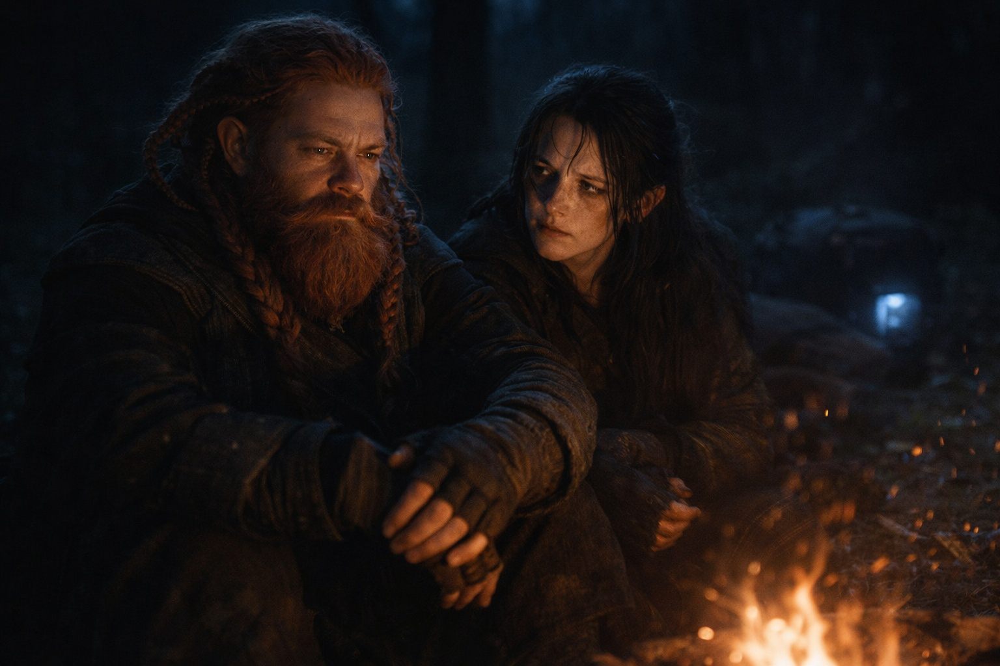
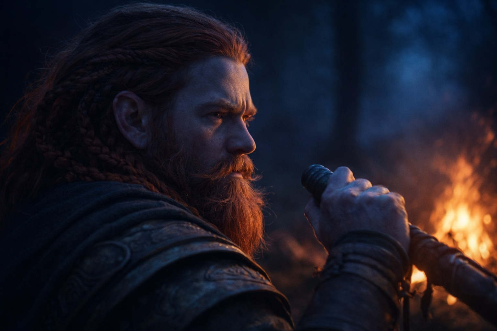
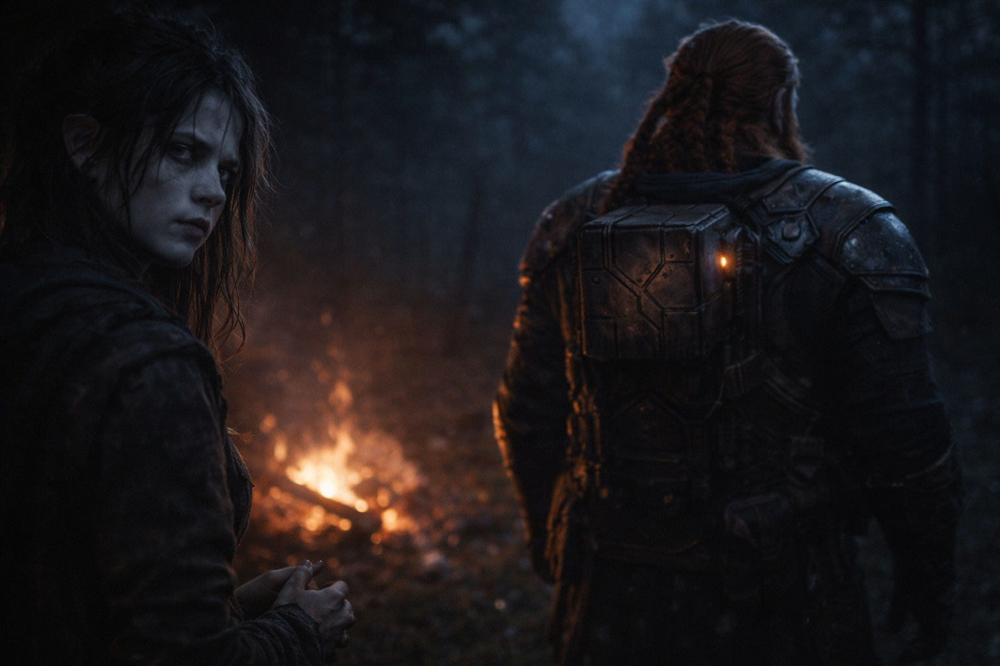

## Capítulo 16 | Parte 4

--- 

Maris lo encontró esa noche.

Dulint había tomado la primera guardia—no porque fuera su turno, sino porque el sueño no vendría de todos modos. Ella apareció de las sombras de su campamento improvisado, moviéndose silenciosamente, sentándose a su lado sin invitación.

—Tú tampoco duermes —dijo.

—Enanos viejos. —Casi sonrió—. No descansamos fácil.

—Sabes algo desde antes de Riverhold. —No era una pregunta—. Algo que usaste cuando elegiste la ruta del valle.

Dulint guardó silencio. El Faro pulsaba junto a los petates.

—Yo no veo nada —dijo—. Fui a ver a alguien que sí.

Maris se volvió hacia él.

—Una vidente —dijo Dulint—. Antes de empezar esto. Me mostró lo que podría pasar.

—¿Qué cosas?

—Stonehold ardiendo. Balin desaparecido. Otros caminos donde ambos permanecen. —Mantuvo los ojos en la oscuridad más allá del fuego—. Y una instrucción. Fracasa lentamente.

—Y no se lo estás diciendo a los otros.

—No.

—Esa no es tu decisión. —Su voz era aguda—. Sus vidas. Sus futuros. Merecen saber qué están arriesgando.

—Saberlo podría hacer que Balin se apresurara. Podría hacer que todos eligiéramos desde el miedo.

—Quizás. O quizás estaríamos mejor preparados.

Dulint miró las brasas. —Oí *fracasa lentamente* y elegí el valle. Ni siquiera sé si eso era lo que quería decir.

—Y aun así dejaste que todos discutieran como si el terreno fuera la única razón.

—Mintiéndoles.

—Protegiéndolos.

Maris estuvo callada por un largo tiempo. Cuando habló de nuevo, su voz era más suave, pero no menos cierta.

—Aún así no es tu decisión.

Dulint miró hacia los petates, donde Balin dormía entre los demás. —Intentaba mantenerlo vivo.

—Aun así no es tu decisión.

---

**Fin de Capítulo 16.5 —> 17.1: [La Segunda Elección: La Oscuridad Segura](/la-segunda-eleccion-la-oscuridad-segura/)**
