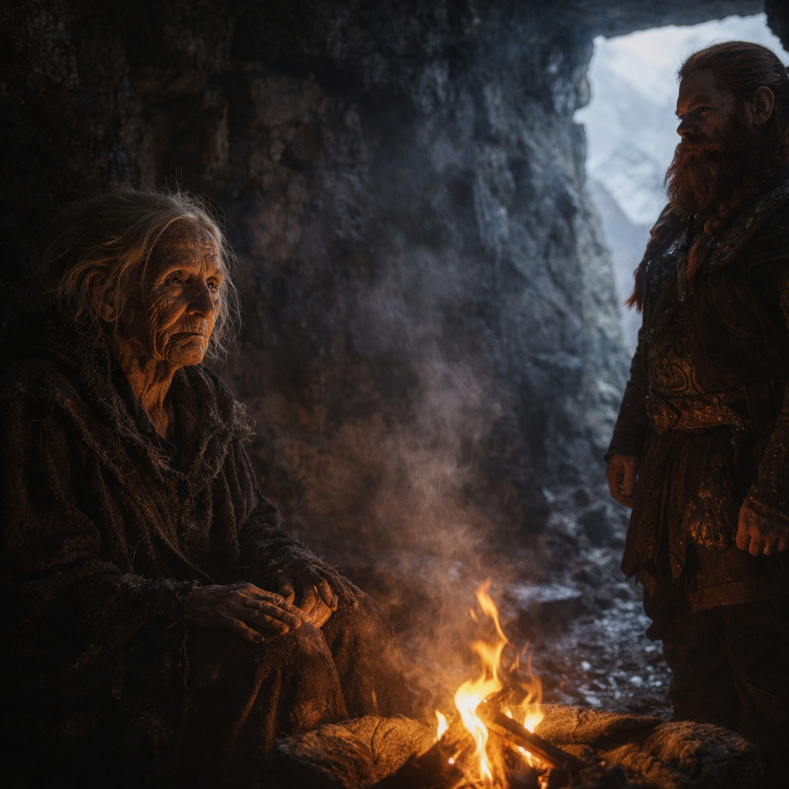

## Capítulo 16 | Parte 2

---

*Tres semanas antes.*

La vidente vivía en una cueva sobre la línea de árboles, donde el aire de montaña se hacía fino y el sendero se volvía traicionero. Dulint no le había dicho a nadie a dónde iba. Le dijo a Balin que necesitaba explorar adelante. Se dijo a sí mismo que solo quería información.

Ella estaba sentada junto a un brasero frío cuando llegó. Dulint no pudo saber si lo esperaba.

—El enano con la piedra que canta. —Su voz era débil, apenas audible—. Llevas algo ruidoso.

—¿El artefacto?

—No sé qué llevas. —Inclinó la cabeza, los ojos enfocados en algo más allá de él—. Conozco la estela que deja. Y puedo seguir algunos de los caminos alrededor del hombre que lo carga.

El corazón de Dulint golpeaba. —Dime.

—Fracasarás.

Dulint aferró la correa de la mochila. —Tiene que haber algo...

—Todos los caminos que puedo seguir terminan en pérdida. —Se acercó. De cerca parecía más pequeña de lo que Dulint esperaba, todo tendón y huesos viejos.

—¿Qué clase de pérdida?

—En un camino, Stonehold arde y no puedo encontrar a tu sobrino más allá. —Su mirada volvió a deslizarse detrás de él—. En caminos mejores, Balin permanece. Stonehold permanece. Tú... —Frunció el ceño—. Te pierdo de vista antes del final.

—¿Muerto?

—He dicho que te pierdo de vista.

—¿Cómo puedo—

—Lentamente.

No añadió nada.

—¿Lentamente?

Por primera vez, la incertidumbre cruzó el rostro de la vidente.

—Fracasa lentamente.

—Eso no me dice qué hacer.

—No. —Se volvió hacia el brasero frío—. Te dice lo que vi. Lo que hagas con ello es tuyo.

Dulint permaneció allí un momento más, esperando algo más. No llegó nada.

Se marchó con una advertencia que no entendía y una palabra que no podía olvidar.

*Lentamente.*

---

**Fin de Capítulo 16.2 —> 16.3: [La Advertencia del Vidente: La Ruta](/la-advertencia-del-vidente-la-ruta/)**
