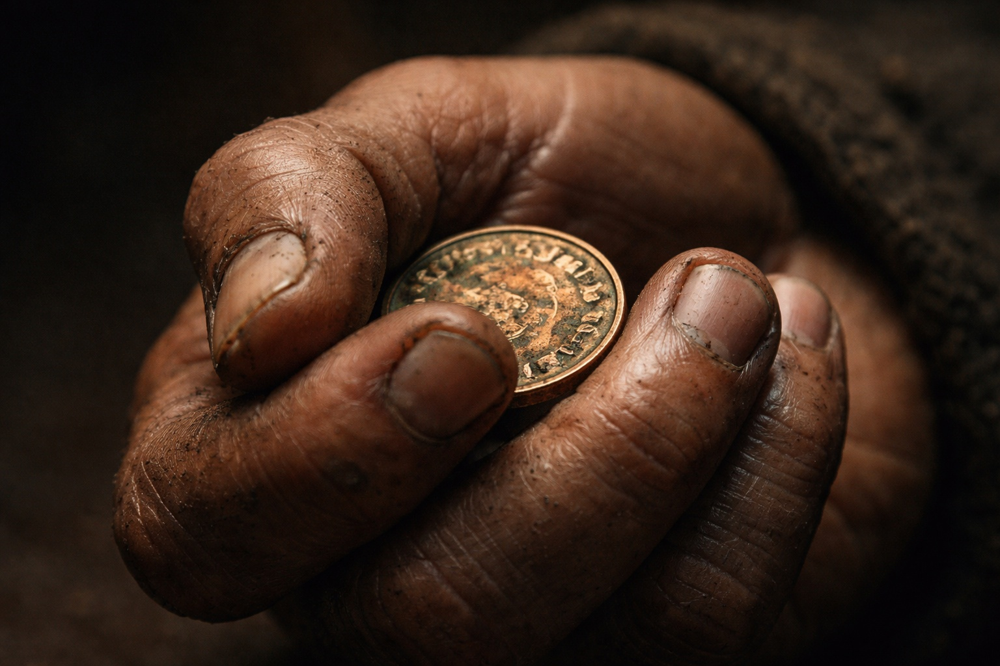
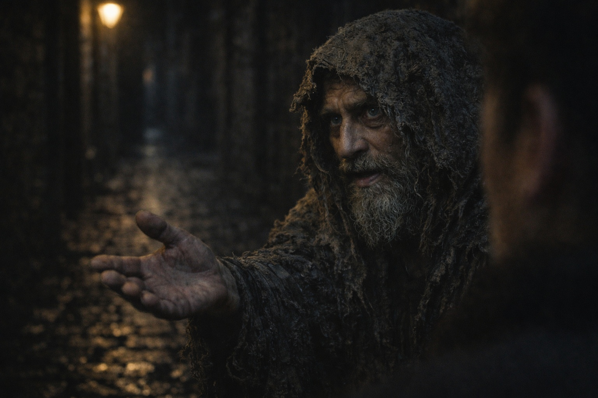

## Capítulo 12 | Parte 4

---

Un anciano se cruzó en el camino de Maris.

—¿Una moneda para el desafortunado?

Su barba había recogido media Riverhold.

La mano le temblaba.

Maris le dio una moneda de cobre.

—Para comida.

—Por supuesto.

Los dedos se cerraron alrededor de la moneda.

El temblor se detuvo.

Maris dejó de respirar.

Los ojos del hombre se clavaron en los suyos. Un instante antes apenas había podido sostenerle la mirada.

—El Descanso del Erudito —dijo.

Su voz ya no sonaba como la suya.

—Pregunta por Xandor.

Eso fue todo.

Maris esperó.

El anciano parpadeó.

La mano volvió a temblarle. Se agarró a la pared cuando las rodillas le cedieron un poco.

Miró el cobre.

—Que la luz la bendiga, señora.

Después se alejó arrastrando los pies.

Maris observó hasta que la multitud se lo tragó.

No era el primer desconocido cuya boca le hablaba con la voz de otra persona.

Seguía siendo desagradable.

Quien hubiera hablado ya no estaba. Miró la espalda del anciano mientras se alejaba, sin ganas de llamarlo y descubrir qué respondía.

Xandor podía ser un nombre, al menos. Podía preguntar por un nombre.

La presión detrás de sus ojos tiró hacia la siguiente calle.

Maris la siguió.

En un puesto de pan preguntó por el Descanso del Erudito.

—Dos calles al norte. Postigos azules.

Ninguna profecía necesaria.

Maris continuó.

La imagen estable no regresó.

Eso le preocupó más que si lo hubiera hecho.

---

**Fin de Capítulo 12.4 —> 12.5: [La Hierba Donde Cayó: La Elección](/la-hierba-donde-cayo-la-eleccion/)**
