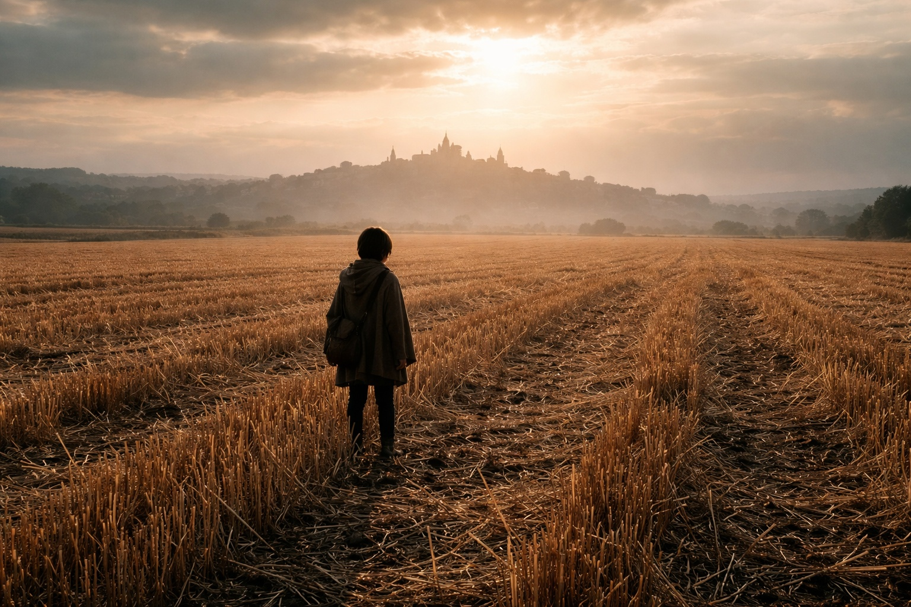

## Capítulo 12 | Parte 1

---

Ese mismo día, antes de llegar a Riverhold, lo primero que sintió Maris fue la hierba fría contra la mejilla.

Después barro entre los dedos.

Después el dolor en la mandíbula.

Maris Hale abrió los ojos.

El sol se había movido.

Había sido por la mañana cuando caminaba hacia Riverhold. Ahora la luz caía baja sobre el campo.

Horas perdidas.

Otra vez.

Rodó sobre un codo.

Su cráneo protestó.

La lengua también le dolía. La tocó con cuidado y saboreó sangre.

Se la había mordido durante la visión.

Nada útil.

Bote.

Agua negra.

Una mano perdiendo el agarre.

Cerró los ojos hasta que el campo dejó de inclinarse.

Suelo debajo.

Viento en la cara.

Una alondra llamando en algún lugar a la izquierda.

Cosas normales.

Apoyó una rodilla.

Después la otra.

—Bien —dijo.

Su voz sonaba terrible.

—Qué divertido.

Riverhold estaba en el horizonte, lo bastante cerca para ver tejados y humo.

No recordaba haber salido del camino.

No recordaba haber entrado en el campo.

No recordaba haber caído.

Eso era lo bastante normal como para dar miedo.

La visión presionó contra el borde de sus pensamientos.

Bote.

Agua negra.

La mano.

Normalmente los detalles se rompían después de despertar. Primero el color. Después los rostros. Después la secuencia.

Esta vez permanecían.

Maris se puso de pie.

Las piernas le temblaron tanto que tuvo que esperar antes de moverse.

Presionó la uña del pulgar contra la vieja cicatriz en la base de la palma.

Dolor concreto.

Lugar concreto.

Aquí.

Ahora.

El campo siguió siendo un campo.

Bien.

Empezó hacia Riverhold.

La mano regresó una vez mientras caminaba.

Exactamente igual.

Eso era nuevo.

---

**Fin de Capítulo 12.1 —> 12.2: [La Hierba Donde Cayó: La Imagen Estable](/la-hierba-donde-cayo-la-imagen-estable/)**
