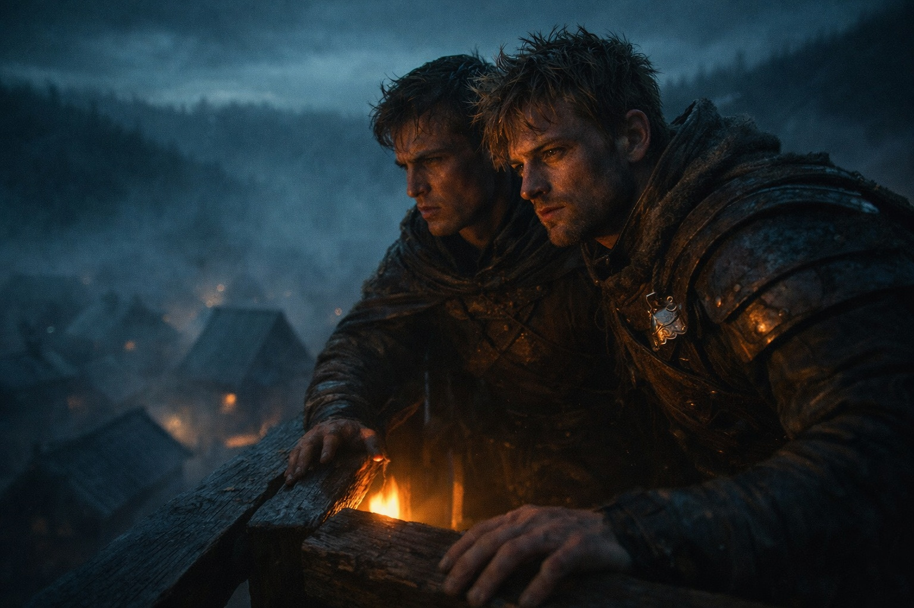
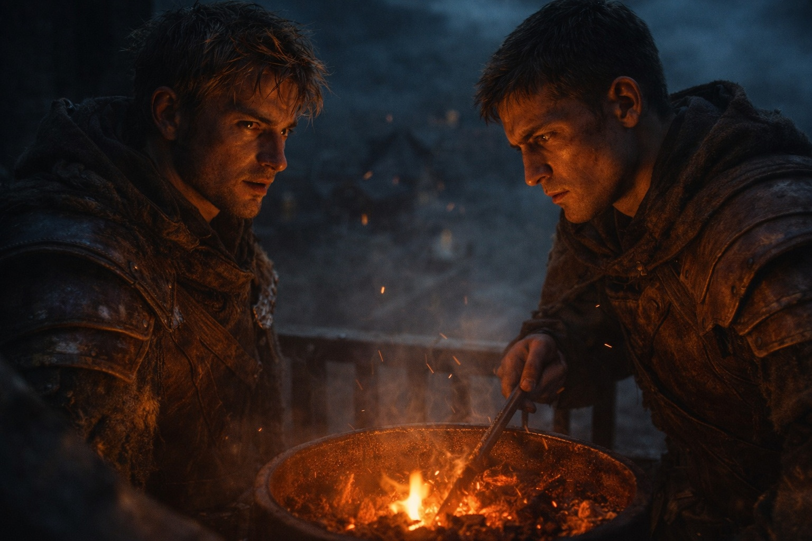
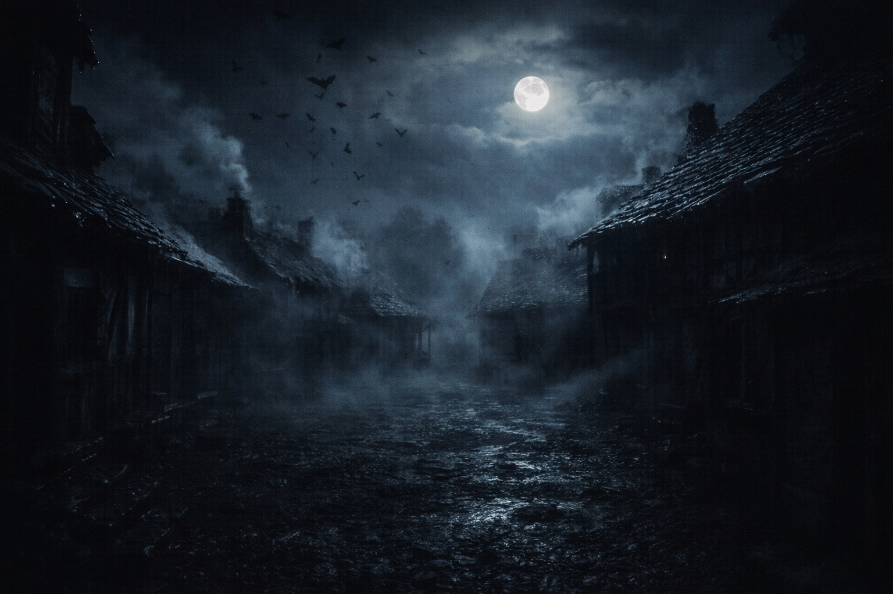
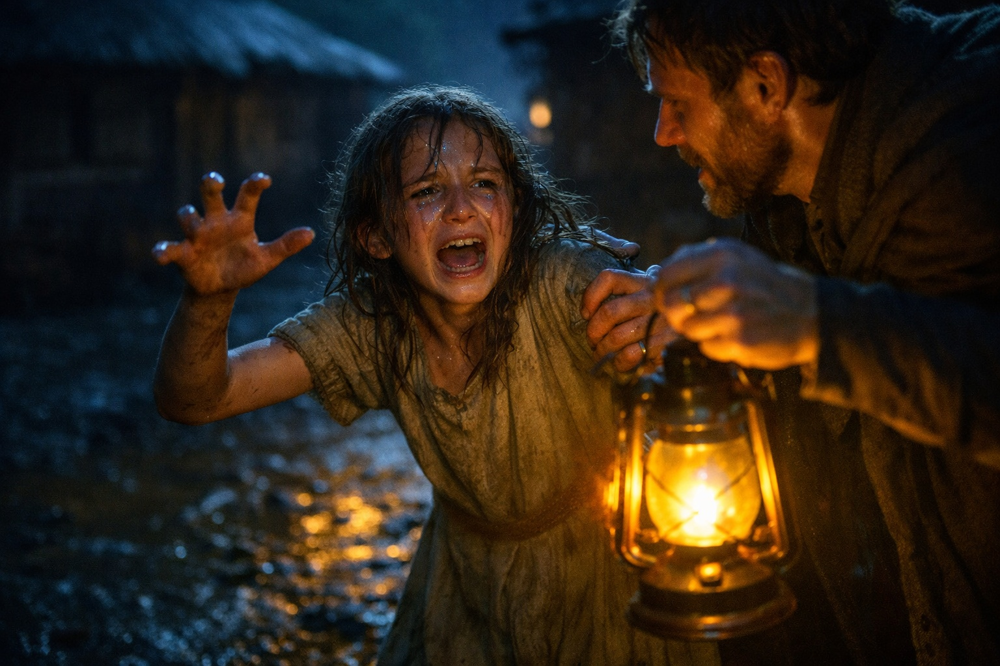
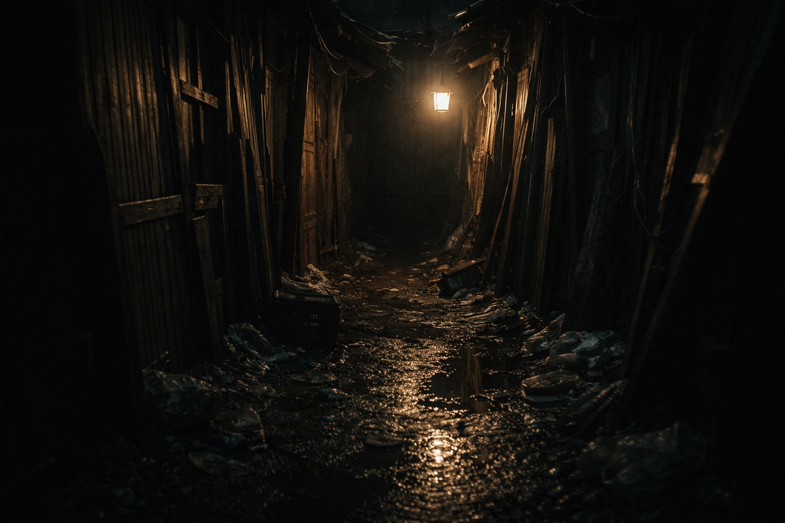

## Prólogo | El Grito

--- 

El viento cortaba a través de la torre de vigilancia, haciendo crujir las viejas maderas. Varian se apoyó contra un poste tosco y miró hacia la aldea abajo —chozas agrupadas bajo la sombra del bosque, niebla serpenteando por calles embarradas.

Detrás de él, Elric cambió su peso. Las tablas chirriaron bajo sus pies. La luz del fuego atrapó las líneas en su rostro —marcas de demasiadas noches sin dormir.

—*Tranquilo* —dijo Elric.

—*Siempre lo está.*

—*Podría ser peor. Dicen que están luchando contra hordas de gigantes en los pasos de [Frostgard](https://www.drusniel.com/hielo-y-hierro-los-guerreros-inquebrantables-del-imperio-de-frostgard/).*

Varian resopló. —*Mejor que proteger granjeros de nabos de sus propias sombras.*

—*¿Quién dice que es todo contra lo que protegemos?*

La pregunta quedó flotando entre ellos. Varian quería descartarla —chismes de aldea, canciones de cuna— pero las palabras no le salían. El bosque los observaba con una paciencia que le erizaba la piel.

---

—*Mi tío sirvió en las campañas de [Grukmar](https://www.drusniel.com/el-poder-indomito-de-las-tribus-grukmar/).* —La voz de Elric bajó—. *Me contó cosas. Cosas que no quieren que se sepan.*

—*¿Como qué?*

Una mirada por encima del hombro —rápida, nerviosa, como si la noche misma pudiera estar escuchando.

—*Los [Grukmar](https://www.drusniel.com/el-poder-indomito-de-las-tribus-grukmar/)i veneran dioses antiguos. Usan cautivos para rituales. Magia de sangre.*

—*Mierda.* —La negación salió automática. Pero la duda se coló de todos modos, fría e indeseada.

—*¿Entonces por qué se retiró el Imperio? ¿Por qué dejaron toda esta tierra vacía?*

Varian hurgó en las brasas. Las historias de su infancia surgieron sin que las llamara —piedras de ofrenda manchadas de sangre, monstruos que caminaban como hombres.

Tonterías.

—*Este páramo te ha podrido el cerebro* —gruñó—. *Ahí fuera no hay nada más que...*

---

Un grito rasgó la oscuridad.

Alto. Terrible. De esos que hacen que hasta un guardia veterano se quede inmóvil.

Ambos hombres se congelaron.

—*¡La plaza!*

Se movieron. La memoria muscular tomó el control donde el coraje fallaba. Las botas golpearon escalones desvencijados. La armadura resonó demasiado fuerte en la aldea silenciosa.

La aldea yacía cerrada y quieta. Solo tenues volutas de humo de chimenea probaban que alguien estaba vivo ahí dentro.

—*¡Ahí!*

Una figura pequeña tropezó de entre dos chozas. Una niña, doce años como mucho, vestido desgarrado y sucio. Se tambaleó al descubierto con los brazos agitándose, luchando contra sombras que solo ella podía ver.

Varian llegó primero. Se agachó, lo bastante cerca para captar el olor del miedo rodando desde ella —acre, animal.

—*¿Estás herida?*

Su cara se alzó. Una máscara de terror. Surcos de lágrimas cortando la mugre. Su boca se movía pero nada salía. Luego sus dedos encontraron su brazo y se clavaron, uñas mordiendo a través de la tela, y temblaba tan fuerte que él podía sentirlo en sus huesos.

—*Estás a salvo.* —Las palabras sonaron falsas—. *Vamos a llevarte a casa.*

No se movía. Sus ojos permanecían fijos en la boca del callejón, en las sombras acumulándose entre esas paredes inclinadas.

Lentamente, Varian se volvió a mirar.

Nada.

Solo oscuridad. Solo un callejón vacío.

Pero la niña emitió un sonido —pequeño, herido, más animal que humano— y le cortó más profundo que cualquier grito.

Su agarre se volvió blanco en la lanza. La noche presionaba cerca, espesa con algo que no podía nombrar.

Después, se diría que ella no había visto nada. Un truco de sombras. Un sueño febril.

Pero sus ojos nunca dejaron ese callejón. Y cuando finalmente se volvió, guiándola hacia las luces de la aldea, la nuca le picaba como si algo lo observara irse.

**Fin de Prólogo 3 — continúa en Prólogo 4: [Charla de Taberna](/susurros-del-pasado-el-roce-de-una-patrulla-de-novatos-con-las-leyendas-de-grukmar/)**
