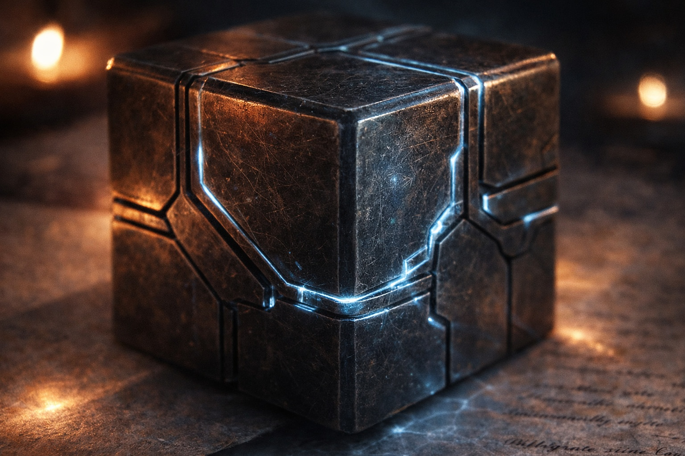
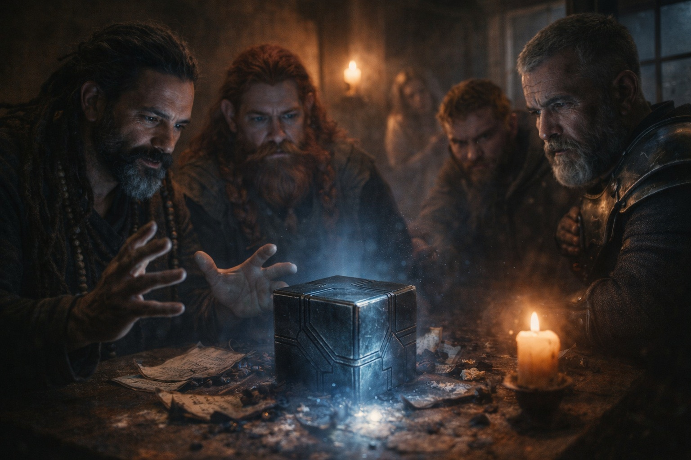

## Capítulo 14 | Parte 1

---

Xandor había estudiado fragmentos durante cuarenta años.

La mayoría se contradecían.

Los nombres cambiaban entre reinos. Los símbolos se copiaban mal. Los escribas convertían diagramas en decoración y decoración en doctrina.

Pero cinco marcas no cambiaban.

Había colocado doce copias sobre la mesa antes de confiar en eso.

Dulint se inclinó sobre su hombro.

—Llevas una hora con eso.

—Más.

—¿Una hora útil?

Xandor empujó tres páginas hacia él. Cada una mostraba una representación distinta del mismo dispositivo antiguo. Manos distintas. Siglos distintos.

Las cinco marcas aparecían en el mismo orden.

—No son adornos —dijo Xandor.

Eldric permaneció junto a la puerta.

—¿Qué son?

—Pensaba que nombraban cinco versiones del mismo objeto. —Xandor tocó la primera marca. Después la segunda—. No es así.

El cubo pulsó.

La primera marca se iluminó sobre su superficie.

Las otras cuatro siguieron oscuras.

Balin dejó de fingir que no escuchaba.

Xandor acercó otro fragmento. Una línea dañada corría bajo los cinco símbolos.

—Léela —dijo Eldric.

—Puedo leer tres palabras con seguridad.

—Esas.

—Primero. Antes. Todo.

Balin frunció el ceño.

—No es mucho.

—No. —Xandor miró el cubo—. Pero cambia la pregunta.

Dulint cruzó los brazos.

—¿De cuál a cuál?

—De *¿qué es esto?* a *¿de qué forma parte?*

Maris se movió en su rincón. Tenía ambas manos alrededor de una taza que no había tocado.

—El grito no parece incompleto.

—No —dijo Xandor—. Imagino que una mano cortada seguiría doliendo.

Ella lo miró.

—Mala metáfora.

—Mucho.

Xandor tocó el cubo.

El primer símbolo se calentó bajo su dedo.

—Un texto llama Nexus al conjunto completo. Supuse que hablaba de este objeto. Me equivocaba. Esto es una parte.

—Sentido —dijo Dulint.

—El nombre asociado a la primera marca, sí.

Ya sabían lo que hacía Sentido. Buscaba. Se orientaba. Se exponía lo suficiente para que los enemigos pudieran seguirlo.

Lo que Xandor no había sabido era que *Sentido iba primero*.

Balin miró las cuatro marcas oscuras.

—Entonces esas faltan.

—Quizá.

La expresión de Eldric se tensó.

—Ayer elogiabas la incertidumbre.

Xandor asintió.

—Entonces déjame ganarme la palabra. Observado: cinco marcas se repiten en el mismo orden. Observado: la nuestra responde a la primera. Afirmación textual: las cinco juntas forman algo llamado Nexus.

—¿Y el resto?

—Desconocido.

El cubo volvió a pulsar.

Cuatro marcas permanecieron oscuras.

Por primera vez desde que Dulint había puesto aquella cosa sobre su mesa, Xandor agradeció lo que no hacía.

---

**Fin de Capítulo 14.1 —> 14.2: [Nombrar Sin Explicar: La Advertencia](/nombrar-sin-explicar-la-advertencia/)**
