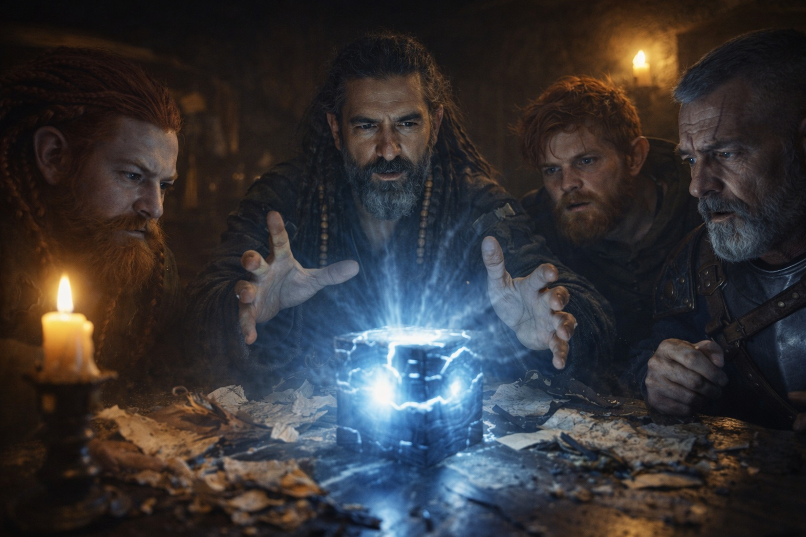
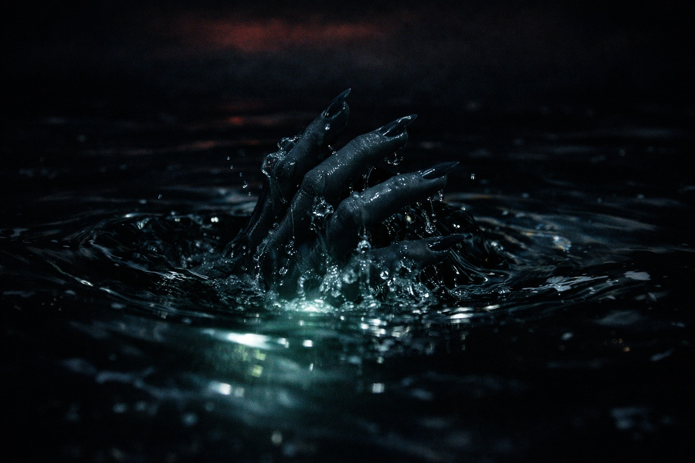

## Capítulo 14 | Parte 2

--- 

—Hay algo peor.

Xandor colocó tres fragmentos copiados junto al Faro.

Eldric permaneció de pie.

—¿Nueva evidencia?

—Una traducción antigua que traduje mal.

Balin suspiró.

—Reconfortante.

—No.

Xandor señaló una línea que había copiado años atrás.

—La traduje como *la llamada cruza el camino cerrado*. Pensé que describía distancia.

Dulint frunció el ceño.

—¿Y ahora?

—Otra copia usa la misma frase junto a un símbolo de la Barrera.

Maris se quedó inmóvil.

Eldric preguntó:

—¿Afirmación o prueba?

—Afirmación. Tres fuentes, dos dañadas. Suficiente para preocuparme. No suficiente para llamarlo un hecho.

—Bien.

Balin miró de uno a otro.

—Que alguien explique la parte preocupante.

Xandor tocó la línea.

—Sentido quizá no se detenga en la Barrera.

—La señal cruza mundos.

—Los textos dicen que la *llamada* lo hace.

—¿Hay diferencia?

—Posiblemente una muy importante.

Dulint miró el cubo.

—Si llama, ¿a qué llama?

—No lo sé.

—¿A las otras piezas?

—No lo sé.

—Entonces ¿qué sabes?

Xandor giró el tercer fragmento.

Una segunda línea aparecía bajo la primera.

—Lo que llama es oído. Lo que oye puede responder.

Nadie habló durante un momento.

Maris miró las palabras.

—El agua negra.

Xandor no respondió.

—El bote. El hombre ahogándose.

—Maris...

—Crees que fue una respuesta.

—Creo que pudo serlo.

La silla de Maris raspó el suelo.

—No. No puedes usarme para hacer que las piezas encajen.

Xandor se detuvo.

Ella respiraba demasiado rápido.

Tomó el carboncillo y tachó la conclusión bajo sus notas.

—Tienes razón.

Maris lo vio hacerlo.

—Observado —dijo Xandor—: tus visiones empeoraron al acercarte al artefacto. Afirmación textual: Sentido puede llamar a través de la Barrera. Hipótesis: tus visiones podrían estar relacionadas.

—Podrían.

—Podrían.

Su respiración se calmó una fracción.

Eldric fue hacia la ventana.

—Si algo al otro lado puede oírlo, ¿movernos puede hacerlo callar?

—No.

—¿Podemos detener la transmisión?

—No sé cómo.

—¿Podemos destruirlo?

La mano de Dulint se cerró sobre el borde de la mesa.

Xandor miró el cubo.

—No sé qué haría destruir una parte de un sistema incompleto.

—Otra respuesta útil.

Balin se frotó la cara.

—Así que llevamos una cosa que grita a través de la Barrera y no sabemos quién escucha.

Xandor volvió a mirar la segunda línea.

—Ni qué.

El Faro pulsó una vez.

Esta vez nadie lo llamó búsqueda.

---

**Fin de Capítulo 14.2 —> 14.3: [Nombrar Sin Explicar: Los Fragmentos](/nombrar-sin-explicar-los-fragmentos/)**
