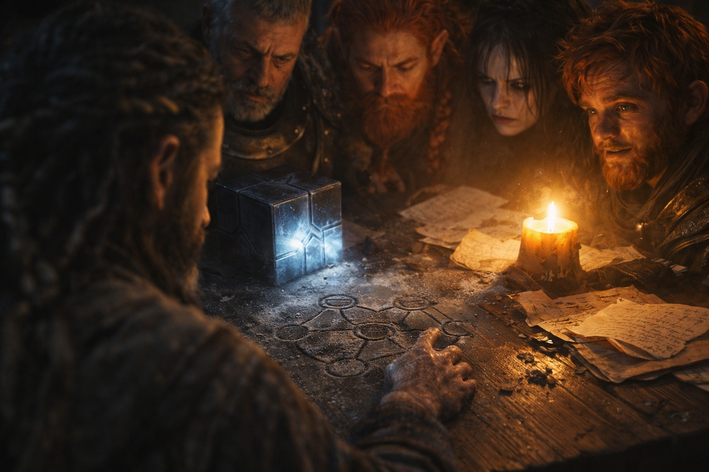
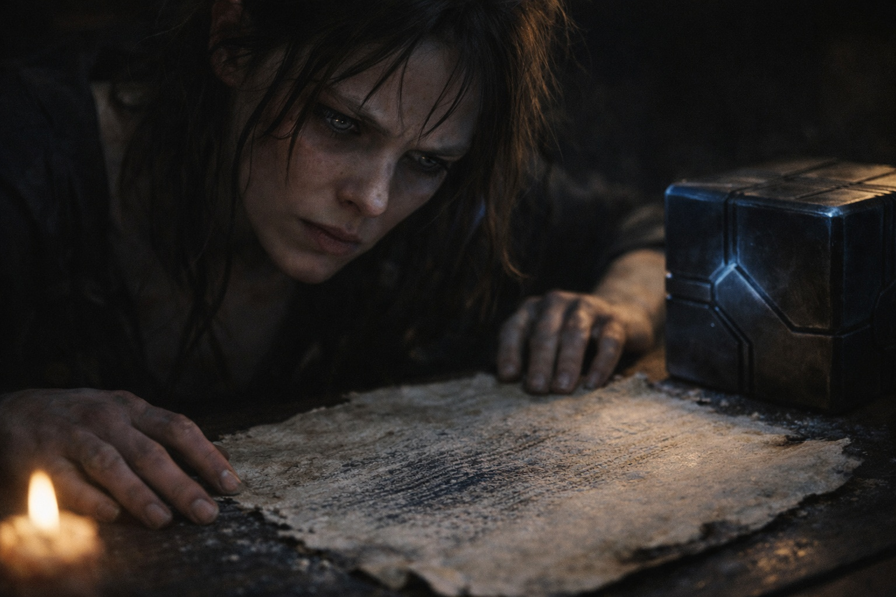
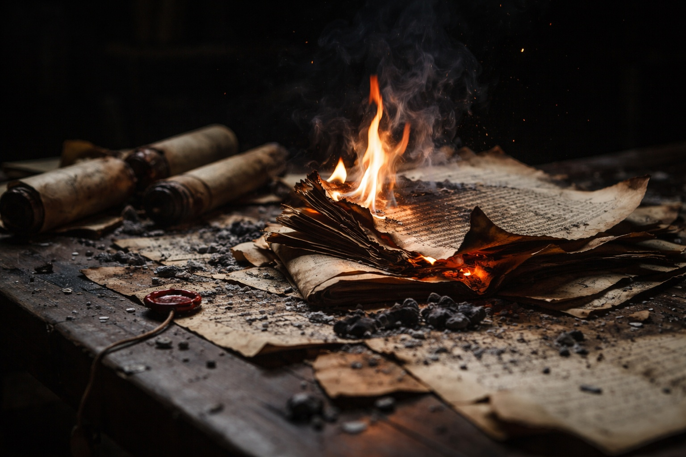

## Capítulo 14 | Parte 3

--- 

—Dame los otros cuatro nombres.

Eldric lo dijo como una orden.

Xandor ordenó sus copias por antigüedad, no por procedencia. A la más antigua le faltaba un borde, reducido a ceniza.

—Sentido. Borrar. Alterar. Atar. Reescribir.

Balin esperó.

—¿Eso es todo?

—Son nombres. Pediste nombres.

—Esperaba que cuarenta años compraran algo más.

—Yo también.

Xandor señaló la segunda marca.

—Borrar aparece junto a palabras que significan ausencia, despejar y eliminar. Un fragmento menciona memoria. Otro quizá se refiera a un camino. No sé si son ejemplos, metáforas o malas copias.

Los ojos de Maris se estrecharon.

—Entonces no nos digas que borra recuerdos.

—No iba a hacerlo.

Eldric asintió una vez.

—¿Alterar?

—«La mano que moldea». Esa línea sobrevive en dos fuentes.

—¿Moldea qué?

—Ninguna lo dice.

—¿Atar?

—Unir. Mantener. Posiblemente conectar.

—¿Reescribir?

Xandor vaciló.

Eso hizo que Dulint levantara la vista.

—El lenguaje conservado empeora ahí —dijo Xandor—. No se vuelve más oscuro. Se vuelve menos preciso. Los escribas dejan de describir una función y empiezan a rezar alrededor de ella.

La boca de Balin se tensó.

—Odio esa frase.

—Yo también.

Xandor desplegó la copia más dañada.

—Una línea dice *lo que fue puede escribirse de otro modo*. Tengo seis traducciones posibles para *de otro modo*.

—¿Alguna agradable? —preguntó Balin.

—No.

Dulint estudió los cinco nombres.

—¿Tienen que usarse en ese orden?

—Las marcas siempre se escriben en ese orden. No es lo mismo.

—¿Se vuelven más poderosas?

—No lo sé.

—¿Encontrar una despierta la siguiente?

—No lo sé.

Eldric parecía casi satisfecho.

Al menos se podía planificar alrededor de la ignorancia.

Xandor reunió las copias.

—Lo frustrante no es que los registros estén dañados. Alguien esperaba que se leyeran. Los mismos nombres sobreviven en reinos que no compartían idioma.

—¿Qué significa eso? —preguntó Dulint.

—Que a alguien le importó lo suficiente como para conservar la secuencia.

—Y alguien más quemó las explicaciones.

Xandor miró el borde ennegrecido que sostenía.

—Sí.

El Faro pulsó.

Sentido.

Cuatro nombres permanecieron sobre la página.

Sin instrucciones. Sin promesa de que encontrarlos fuera a ayudar.

---

**Fin de Capítulo 14.3 —> 14.4: [Nombrar Sin Explicar: La Dirección](/nombrar-sin-explicar-la-direccion/)**
