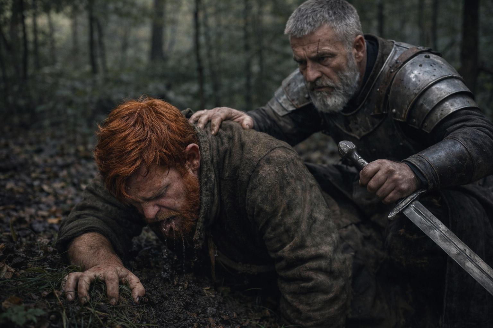
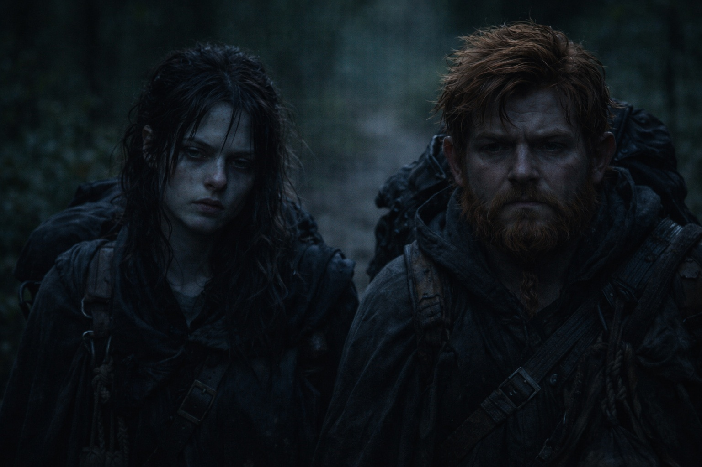

## Capítulo 18 | Parte 4

--- 

La pelea terminó.

No con victoria—con retirada. Los Grukmar se retiraron, arrastrando a sus heridos, dejando tres cuerpos en el suelo húmedo de sangre. Eldric había matado dos de ellos. La magia de Xandor había ahuyentado más.

Y Balin había matado uno.

No podía dejar de mirarlo. El cuerpo gris-verdoso, el charco de sangre oscura extendiéndose debajo, cómo sus ojos se habían vuelto planos y vacíos. En su cabeza, la muerte había sido limpia. Un estocada, una caída, un final noble.

La hoja había entrado mal—en ángulo, raspando entre las costillas en lugar de deslizarse a través. El Grukmar no había muerto instantáneamente. Había hecho sonidos. Sonidos húmedos, gorgojeantes que no eran del todo palabras pero podrían haberlo sido.

*Primera vez matando a alguien.*

Intentó ponerlo en la lista.

Su estómago se revolvió. Balin apenas logró dar tres pasos antes de estar de rodillas, vomitando en el pasto. Todo su cuerpo temblaba.

Una mano en su hombro. Eldric.

—No lo mires.

—No puedo—no puedo parar—

—Lo sé. —Eldric lo puso de pie.

—Maté— —Balin no pudo terminar. Otra ola de náusea.

—Estás vivo. Muévete. Hablamos después.

—Pero—

—Procesa después. Muévete ahora.

Balin se movió.

El cuerpo quedó donde cayó. No podía mirarlo de nuevo. No podía no mirarlo. Cada pocos pasos sus ojos volvían hacia el cuerpo.

Maris cayó en paso junto a él. Su cara estaba pálida, ojos perseguidos.

—Vi la violencia —dijo en voz baja—. No supe que era la nuestra hasta que empezó.

—¿Me viste?

—Un momento. Tú en el suelo, con sangre en las manos. No podía distinguir dónde, ni cuándo, ni de quién era la sangre.

—No era mía.

—Lo sé ahora. —Lo miró con esos ojos grises que veían demasiado—. ¿Cómo se siente?

Balin buscó palabras. No encontró nada que encajara.

—Mal —dijo finalmente—. Se siente mal. En las historias, matar al enemigo se siente bien. Justificado. Pero él—eso— —Tragó—. No parecía un monstruo cuando murió. Parecía... sorprendido. Como si no hubiera esperado que terminara así.

Maris apartó la mirada.

Caminaron en silencio.

Detrás de ellos, la sangre se empapaba en la tierra.

Balin intentó una vez más añadir la muerte a su lista.

No pudo.

Siguieron caminando.

---

**Fin de Capítulo 18.4 —> 18.5: [Rumbo al Norte: Las Consecuencias](/rumbo-al-norte-las-consecuencias/)**