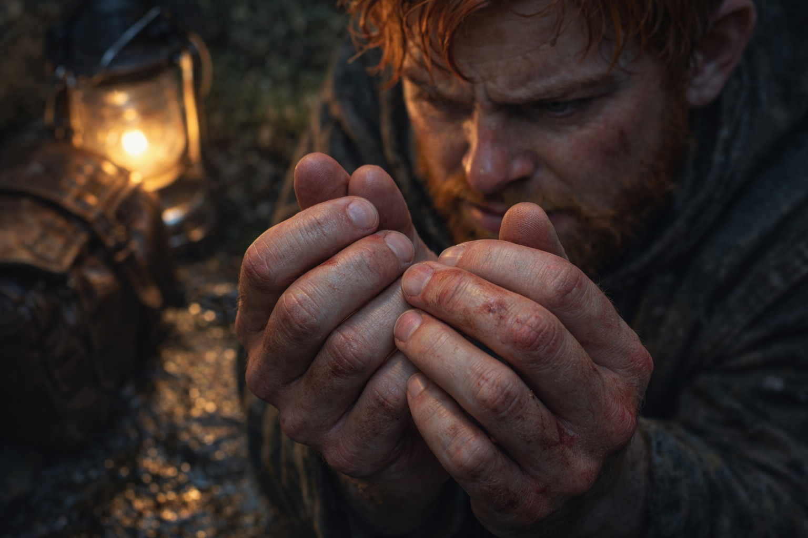
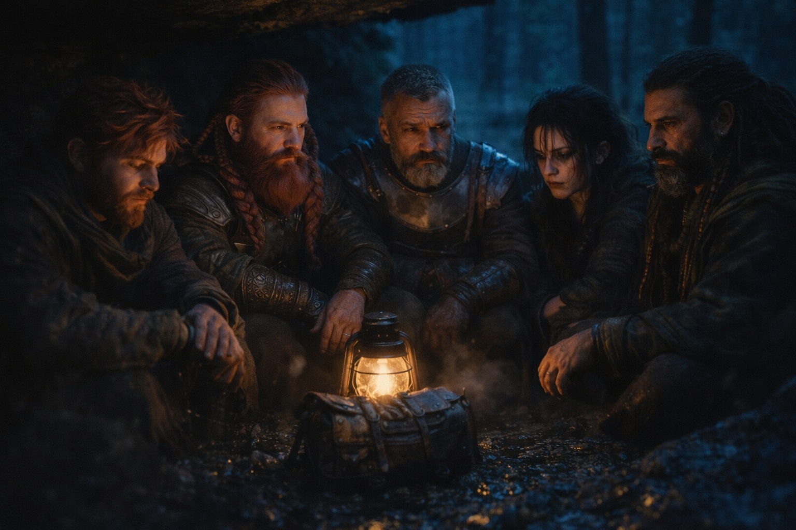

## Capítulo 18 | Parte 5

--- 

No se detuvieron hasta el anochecer.

El campamento era improvisado—apenas más que un claro donde podían colapsar contra rocas y pretender que estaban a salvo. Xandor atendió heridas: una cortada en el brazo de Eldric, moretones en las costillas de Dulint, cortes en las manos de Balin que no recordaba haberse hecho.

El artefacto estaba entre ellos, pulsando y apuntando como siempre, su llamado sin disminuir.

—Volverán. —La voz de Eldric era plana, factual—. Los herimos, pero no los rompimos. Se reagruparán, juntarán refuerzos, intentarán de nuevo.

—¿Entonces cuál es el punto? —La voz de Balin salió más cortante de lo que pretendía—. Peleamos, se retiran, vuelven, peleamos de nuevo. ¿Cuánto hasta que perdamos?

—Seguimos moviéndonos. Nos mantenemos adelante de ellos. Llegamos a algún lugar defendible.

—Personas casi murieron hoy.

Eldric miró hacia el sendero que se oscurecía. —Sí.

Dulint estaba sentado, aferrado a la mochila. No había hablado desde que se detuvieron.

—¿Tío? —Balin se acercó—. ¿Estás bien?

—No. —La voz de Dulint era apenas un susurro—. No estoy bien. No he estado bien desde Stonehold.

—¿Qué quieres decir?

—Quiero decir— —Dulint se detuvo. Empezó de nuevo—. Quiero decir que seguimos moviéndonos. Eso es todo lo que podemos hacer. Es todo lo que hemos podido hacer.

Su tío había estado a punto de decir algo. Balin estaba demasiado cansado para volver a preguntar.

Maris se sentó aparte de los demás, rodillas contra el pecho, ojos fijos en nada.

—Ella lo vio venir —dijo Balin en voz baja—. La emboscada.

—Ella ve muchas cosas —respondió Xandor—. Ver y detener no son la misma habilidad. No la culpes por poderes que nunca pidió.

—No la culpo. Solo... —Balin se apagó—. No sé lo que siento. No sé cómo sentir.

Xandor bajó la voz. —Entonces no fuerces una respuesta esta noche.

Balin miró sus manos. Manchadas, a pesar del agua que Xandor le había dado.

Sentía la espada entrando mal, y el sonido que el Grukmar hizo al morir no paraba de repetirse.

*Primera vez matando a alguien.*

—Eldric. —La voz de Balin se quebró—. ¿Cuándo deja de sentirse así?

Eldric se sentó a su lado.

—Esta noche no —dijo.

Balin esperó el resto. No llegó.

Se sentaron en silencio mientras caía la oscuridad.

Balin se frotó la mancha de las manos. El agua de Xandor las había dejado limpias hacía horas.

Todavía podía verla.

Al amanecer, seguirían hacia el norte.

---

**Fin de Capítulo 18.5 —> 19.1: [Dirección: Recuperación](/direccion-recuperacion/)**
