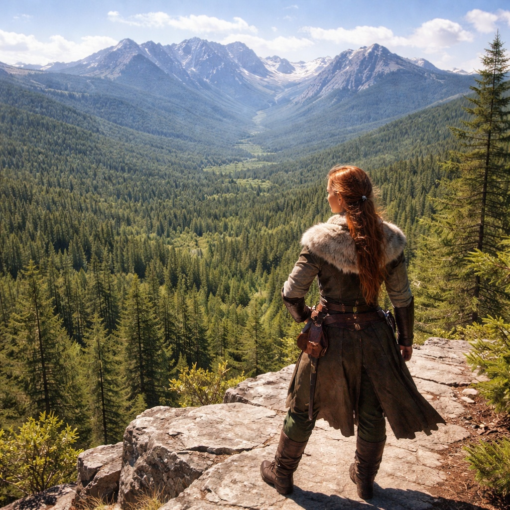
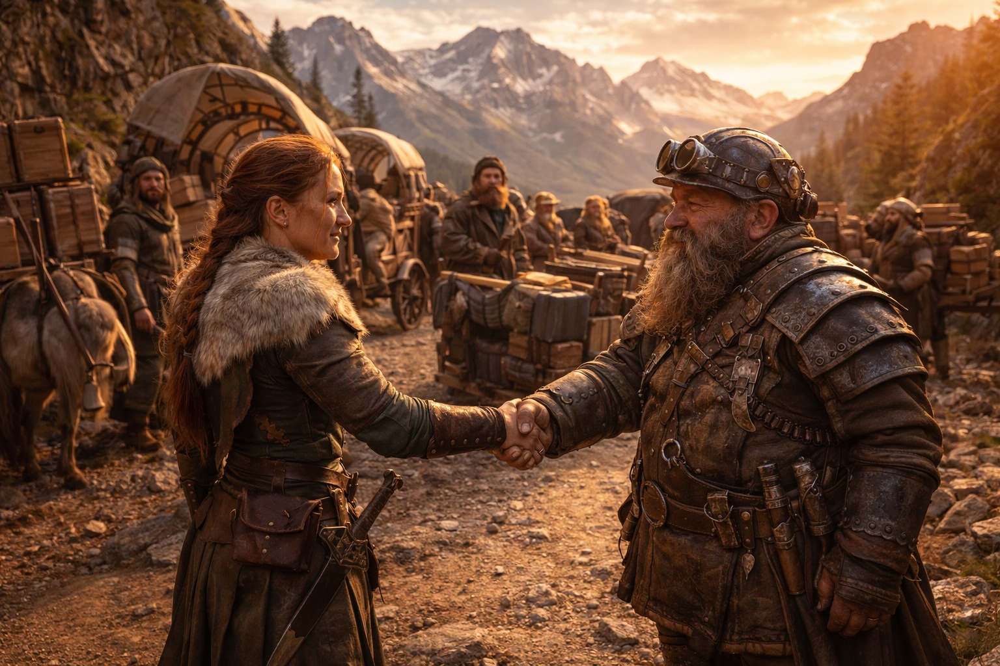
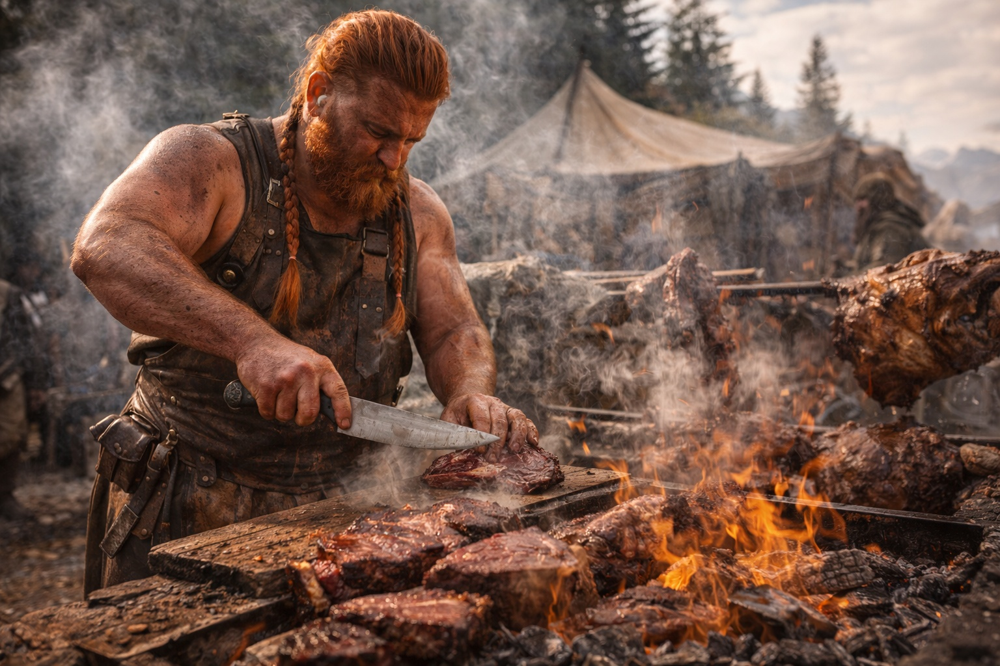
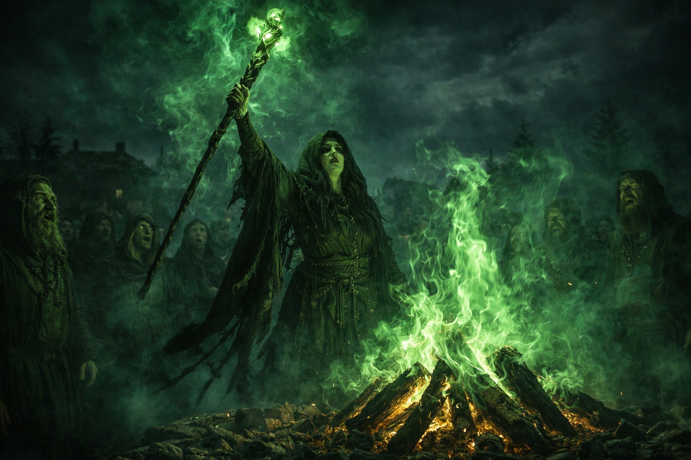

## Lore | Los Zuraldarr

--- 

Zuraldi se extiende por los confines del este de Lumeshire, una accidentada extensión de densos bosques y escarpadas montañas. La tierra crió a gente resistente, los Zuraldarr, cuya fuerza estaba a la altura del terreno que llamaban hogar.

Anja estaba en lo alto de un acantilado, con los ojos escrutando el horizonte. Abajo, los bosques de Zuraldi se extendían como un mar verde, sólo interrumpido por el brillo de los ríos y algún que otro claro. Al este, se alzaban los picos de Stonehold, marcando la frontera con el reino enano.

"¿Ves esos pasos? Señaló las estrechas brechas entre las montañas. "Nuestros antepasados los utilizaban para superar a todos los ejércitos que intentaban apoderarse de nuestras tierras".

Su aprendiz, Torben, entrecerró los ojos contra el sol. "Pero ahora formamos parte de Lumeshire, ¿no?".

Anja asintió. "Con nuestras condiciones. El imperio aprendió que era mejor tenernos como aliados que como enemigos".

## Una Historia Escrita en Piedra y Sangre

En la plaza del pueblo, la anciana Hilda pasaba los dedos sobre un antiguo monolito de piedra. En su superficie había grabadas escenas de batalla y triunfo.

"Esto cuenta la historia de la Batalla del Paso del Hacha Rota", explicó a un grupo de niños con los ojos muy abiertos. "Mil soldados imperiales entraron en el paso. Sólo quedaron diez vivos".

Una niña levantó la mano. "¿Pero por qué no los matamos a todos?".

El rostro curtido de Hilda se arrugó en una sonrisa. "Para enviar un mensaje. A los Zuraldarr no se les puede conquistar, sólo negociar con ellos".

## El paso de las caravanas

El paso de montaña resonaba con ruedas y cascos. Una larga hilera de carromatos se abría paso a través del terreno rocoso, cargados de mercancías. Los comerciantes de Zuraldarr guiaban ponis de montaña por los recodos con la soltura de quien lleva recorriendo esos senderos desde la infancia.

Marta, la matriarca de los comerciantes, iba a la cabeza de la caravana.

Su aguda mirada escudriñaba el traicionero camino, siempre atenta a rocas sueltas o señales de bandidos.

Un mercader enano, con la barba trenzada con hilos de oro, se acercó a ella. "¡Marta! Me alegro de verte. ¿Cómo va la cosecha este año?"

"Abundante como siempre, Thorin. Tu pueblo no pasará hambre este invierno".

El enano asintió agradecido. "Y tendréis suficientes hachas y picos para que os duren hasta la próxima primavera. Aunque debo decir que este camino de montaña nunca es fácil".

Marta sonrió, con un orgullo feroz en los ojos. "Por eso nos necesitas, amigo mío. Nadie conoce estos senderos como los Zuraldarr".

Como para demostrar lo que decía, gritó una serie de órdenes. La caravana cambió de formación con suavidad, sorteando un recodo especialmente traicionero del camino con práctica facilidad.

"Impresionante", murmuró Thorin. "Ya veo por qué el imperio valora vuestra alianza".

La expresión de Marta se volvió seria. "Más les vale. Esta ruta comercial es la savia de nuestros dos pueblos. Lumeshire sabe que controlamos el camino más rápido entre sus tierras y Stronehold".

Mientras hablaban, los trabajadores descargaban de algunos vagones cajas de metalistería enana y piedras finamente talladas, sustituyéndolas por sacos de grano, barriles de carne salada y cajas de productos frescos.

"Vuestra carne es especialmente popular esta temporada", dijo Thorin. "Algo en la hierba de la montaña le da un sabor que nuestra gente no puede resistir".

Marta asintió, complacida. "Nos aseguraremos de aumentar el envío la próxima vez. Ahora, ¿discutimos los términos de esas herramientas de mithril que mencionaste la temporada pasada?".

Su apretón de manos fue firme. Cuando el sol se ocultó tras los picos, la caravana salió del sendero para montar campamento. Los ponis comieron antes que los conductores.

## Las fiestas de los más fuertes

El aire se llenó del chisporroteo de la carne y del rico aroma de la carne asada.

 En el centro de la aldea, una enorme hoguera brillaba al rojo vivo. Encima de él, cortes de carne más grandes que el torso de un hombre giraban lentamente en los espetones.

A Torben se le hizo la boca agua al ver cómo la carnicera del pueblo, una mujer con brazos como troncos de árbol, trinchaba gruesos trozos de carne asada. Cada filete era del tamaño de un escudo, carbonizado por fuera y rojo por dentro.

"Nada fortalece más que la carne de Zuraldarr", gruñó la carnicera, dándole a Torben un plato que se hundía bajo el peso de la carne. "Come, muchacho. La necesitarás para rodar los troncos mañana".

Cerca de allí, la anciana Hilda se rió. "En mis tiempos, teníamos que talar un árbol antes de ganarnos el filete". Pero sus ojos brillaban de alegría mientras lo decía, con su propio plato lleno.

## Brujas del Bosque

Al caer la noche, la fiesta se hizo más silenciosa. Los ojos se desviaron hacia el borde de la hoguera, donde las sombras parecían moverse por sí solas. Un silencio se apoderó de la reunión cuando una figura emergió de la oscuridad.

Magda la Bruja era alta y delgada, con el pelo canoso alborotado y adornado con huesos y plumas. Sus ojos, agudos y penetrantes, recorrieron a la multitud. El respeto y el miedo se extendieron por la asamblea a partes iguales.

Xandra, la matriarca del Liderazgo, se adelantó. "Bienvenida, Magda. ¿Bendecirás nuestro banquete?"

La voz de Magda ronca como hojas secas. "Haré más que eso, niña. Los huesos hablan de cambio en el viento. Mejor nos preparamos".

Levantó su nudoso bastón y las llamas del fuego central se volvieron de un verde espeluznante.

 A su luz, las sombras danzaban sobre los árboles circundantes, adoptando formas que hacían que hasta el más valiente Zuraldarr se inquietara.

Tan rápido como empezó, terminó. El fuego volvió a la normalidad y Magda se fundió de nuevo en las sombras. Las conversaciones se reanudaron lentamente, pero con una energía nerviosa.

"Brujas", murmuró un joven guerrero a su compañero. "No se puede vivir con ellas ni sin ellas".

Su amigo asintió sabiamente. "Sí. Me dan mucho miedo, pero prefiero tenerlas con nosotros que contra nosotros".

## Guardianes del Bosque

La niebla matutina aún se aferraba al suelo cuando los druidas se reunieron. En lo profundo del bosque, donde la copa de los árboles bloqueaba casi toda la luz, se había formado un claro. No con hachas. Los árboles simplemente habían crecido separados allí, dejando un espacio que ninguno de los ancianos de la aldea recordaba haber visto crear.

Xandor, con la barba más blanca que gris, lideraba el círculo.

Habló sin levantar la voz. No necesitaba hacerlo.

"Los elfos susurran a los árboles y engatusan a las flores para que florezcan. Pero nosotros somos Zuraldarr. No pedimos favores a la naturaleza. Luchamos con ella, la desafiamos y nos ganamos su respeto".

A su alrededor, los otros druidas asintieron. Sus manos estaban callosas, sus nudillos cicatrizados. Cada uno llevaba un bastón cortado de una madera diferente, y el aire a su alrededor pesaba más de lo que debería.

Una joven druida se adelantó y apretó la mano contra el tronco de un viejo roble. La corteza del árbol se onduló al tocarla, y un leve gemido emanó de lo más profundo de su interior.

"Bien", dijo Xandor. "El bosque conoce tu fuerza. A ver cómo partes esa roca de ahí. No con tus manos. Con el poder del bosque".

La joven druida sonrió. La roca se partió con un sonido como de hueso al quebrarse. Xandor no dijo nada, pero su expresión sugería que no debería haber ocurrido tan rápido.

## El Consejo de las Matriarcas

Caía la noche y, en el Gran Comedor, seis mujeres se reunían alrededor de una mesa circular. Cada una llevaba una faja que denotaba su función: Agricultura, Defensa, Comercio, Justicia, Espiritualidad y Liderazgo.

Anja, que ahora llevaba la faja de Defensa, habló primero. "El imperio pide más tropas para vigilar la frontera del este".

Marta, la matriarca del Comercio, frunció el ceño. "Ya estamos al límite con el aumento de los envíos a Stronehold".

"Tal vez", dijo Xandra, la matriarca del Liderazgo, "sea hora de recordar a Lumeshire los términos de nuestro acuerdo".

Hilda, en representación de la Espiritualidad, asintió sabiamente. "Los espíritus de nuestros antepasados susurran cautela. Debemos mantener nuestra fuerza, nuestra independencia".

Las mujeres debatieron hasta bien entrada la noche. Al amanecer, salieron con una decisión. Si era la correcta, ninguna podía asegurarlo.

Al concluir la reunión, Xandra se volvió hacia Hilda. "¿Qué hay de la advertencia de Magda?".

El rostro de Hilda se volvió solemne. "Las palabras de la bruja tienen peso. Sugiero que la consultemos a ella y a los druidas antes de tomar una decisión definitiva".

Xandra asintió, pero no parecía tranquila.

---

A la mañana siguiente, Torben encontró a Anja en el mismo acantilado donde le había mostrado los pasos de montaña.

—Dijiste que nos unimos a Lumeshire con nuestras condiciones —dijo.

Anja permaneció callada un rato. El viento traía el sonido de martillos desde los campos de entrenamiento, y el leve olor a humo de leña desde el claro de los druidas.

—Dije lo que Hilda me enseñó —respondió al fin—. Las condiciones se establecieron hace mucho tiempo. Si siguen vigentes... —Se quedó callada, mirando los picos del este donde empezaban las fronteras de Stonehold—. Pregúntame de nuevo la próxima estación.

Torben esperó más. No llegó nada más.

Debajo de ellos, la aldea se movía en su rutina matutina. Los niños luchaban en los campos de entrenamiento. Los granjeros trabajaban las terrazas. En el bosque, los leñadores talaban árboles bajo la vigilancia de los druidas, llevándose solo lo que les decían.

Todo se veía como siempre. Pero la advertencia de Magda colgaba sobre la aldea como humo que no se disipaba, y el Consejo de Matriarcas había tomado una decisión de la que nadie hablaba.

Anja se dio la vuelta del acantilado y caminó de regreso a la aldea sin volver a mirar los pasos del este.

**Fin de Lore 2 — continúa en Lore 1: [Los Misterios del Dominio Wymreach](/profundidades-oscuras-el-dominio-wymreach/)**