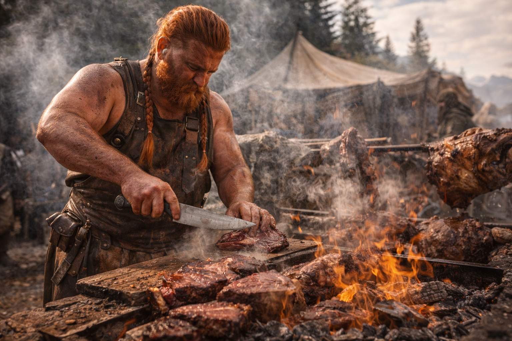
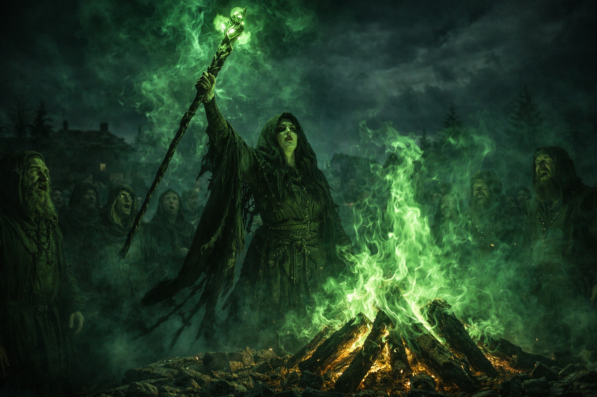
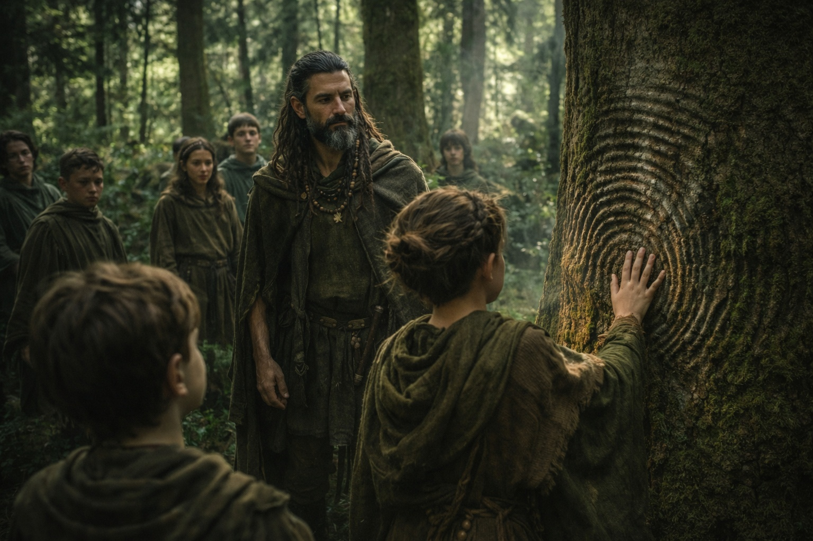

## Lore | Los Zuraldarr

---

El viento de los picos orientales tiraba de la capa de Anja. Desde el acantilado podía seguir los bosques de Zuraldi hasta los pasos de montaña. Las canciones de la aldea afirmaban que ningún ejército había tomado aquellos caminos sin permiso.

Torben estaba a su lado, entornando los ojos hacia Stonehold. Un río brilló entre los árboles de abajo.

—¿Ves esos pasos? —Anja señaló las estrechas brechas entre las montañas—. Nuestros antepasados los utilizaban para superar a todos los ejércitos que intentaban apoderarse de nuestras tierras.

Su aprendiz volvió la vista hacia ella. —Pero ahora formamos parte de Lumeshire, ¿no?

Anja asintió. —Con nuestras condiciones. El imperio aprendió que era mejor tenernos como aliados que como enemigos.

## Una Historia Escrita en Piedra y Sangre

En la plaza del pueblo, la anciana Hilda pasaba los dedos sobre un antiguo monolito de piedra. En su superficie había grabadas escenas de batalla y triunfo.

—La batalla del Paso del Hacha Rota —dijo a los niños, siguiendo con el pulgar una fila de figuras desgastadas—. La canción dice que entraron mil soldados imperiales. Diez salieron andando.

Una niña levantó la mano. —¿Pero por qué no los matamos a todos?

Hilda sonrió. —Alguien tenía que llevar el mensaje. —Limpió la tierra de la última figura—. Así lo contaba mi madre. Una copia imperial lo llama retirada. Ninguna da los nombres de los diez.

## El paso de las caravanas

Más tarde, la caravana de Marta llegó a un recodo sobre la explanada de intercambio. Las ruedas trituraban la piedra suelta. Los carreteros zuraldarr acortaron los tiros antes de guiar a los ponis de montaña por la curva.

Marta, la matriarca de los comerciantes, iba a la cabeza de la caravana.

Observaba cómo cedían las piedras sueltas bajo el primer carro.

Un mercader enano, con la barba trenzada con hilos de oro, se acercó a ella. —¡Marta! Me alegro de verte. ¿Cómo va la cosecha este año?

—Bastante para llenar tus carros, Thorin. Si has traído lo que acordamos pagar.

El enano señaló los carros cargados. —Hachas y picos, como prometí. Aunque debería cobrar por la subida.

—Entonces yo debería cobrar por bajarte. —Marta levantó una mano para detener al primer carretero.

Mandó a dos carreteros a calzar las ruedas traseras. El último carro pasó la curva con la llanta exterior suspendida sobre el vacío.

Thorin esperó a que llegara al terreno llano. —Recordaba esa curva más ancha.

—Has traído un carro más ancho. —Marta señaló la explanada de descarga—. Lumeshire mandaría una columna por aquí si los dejáramos. Imagínate hacerla dar media vuelta.

En la explanada, los trabajadores cambiaron las herramientas enanas y las piedras talladas por grano y barriles de carne salada. Marta contaba cada carga al pasar.

—El doble de carne la próxima vez —dijo Thorin—. Los últimos barriles se acabaron antes del deshielo.

—El doble de sal en la carga de vuelta. Después podemos hablar de esas herramientas de mithril.

Se estrecharon las manos. Al anochecer la caravana acampó en la explanada. Marta comprobó el pienso de los ponis antes de aceptar su propia cena.

## Las fiestas de los más fuertes

De vuelta en la aldea, la grasa siseaba al caer al fuego del festín. Torben se acercó al asador, siguiendo el olor.

En el centro de la aldea, una enorme hoguera brillaba al rojo vivo. Sobre ella, cortes de carne más grandes que el torso de un hombre giraban lentamente en los espetones.

El carnicero sujetó con el tenedor un costillar asado y le cortó a Torben una porción que sobresalía del plato. Él recogió los jugos con un mendrugo.

—Come antes de que se enfríe —dijo—. Mañana te toca el primer turno de troncos.

Hilda tendió su plato. —En mis tiempos teníamos que talar el árbol primero. —El carnicero le puso una segunda porción sin levantar la vista.

## Brujas del Bosque

Los cantos vacilaron cuando Magda salió de entre los árboles. Torben oyó la punta de hierro del bastón golpear una piedra más allá del fuego.

De su pelo canoso y suelto colgaban huesos y plumas. Un guerrero apartó el banco para dejarla pasar; ella pasó sin darle las gracias.

Xandra, la matriarca del Liderazgo, se adelantó. —Bienvenida, Magda. ¿Bendecirás nuestro banquete?

Magda plantó el bastón junto al hoyo. —Pregúntame después del invierno. Los huesos han caído mal dos veces. Yo reservaría grano.

Alzó el bastón y el fuego se volvió verde. Se le cortó el aliento. Bajó el bastón deprisa y se apoyó en él con ambas manos.

Las sombras cambiaron de forma sobre los árboles. Los guerreros se removieron en los bancos.

La llama recuperó su color habitual. Magda se marchó despacio, apoyándose en el bastón a cada paso. Xandra la siguió con la mirada hasta los árboles.

—¿Alguna vez trae buenas noticias? —murmuró un guerrero joven.

Su compañero no apartó los ojos del plato. —Yo voy a reservar grano.

## Guardianes del Bosque

Al amanecer, la niebla humedecía las túnicas de los druidas reunidos en un claro. Hilda decía que los árboles se habían apartado para el primer círculo. Un leñador aseguraba que su abuela aún conservaba el hacha con que lo habían abierto. Xandor había oído ambas versiones.

Xandor dirigía el círculo.

Esperó a que la druida más joven dejara la mochila antes de hablar.

—Hilda dice que ningún hacha tocó este claro. No puedo demostrar que tenga razón. —Apoyó el bastón contra una raíz—. Al menos podemos dejar los árboles en pie hoy.

A su alrededor, los otros druidas asintieron. Sus manos estaban callosas, sus nudillos cicatrizados. Cada uno llevaba un bastón cortado de una madera diferente, y el aire a su alrededor se sentía pesado.

La joven druida apoyó la mano contra un roble. La corteza se onduló y el tronco emitió un gemido grave. Ella retiró la mano y sacudió los dedos, que se le habían agarrotado.

—Deja que se te recupere la mano —dijo Xandor—. Después prueba con la roca suelta. Solo lo necesario para abrir la grieta.

Flexionó los dedos y lo intentó. La roca se partió con un estampido que espantó a los pájaros de las copas. Ella trastabilló, con sangre en la nariz. Xandor le sujetó el codo. —Basta. Siéntate.

## El Consejo de las Matriarcas

Aquella tarde, Marta volvió del paso para reunirse con otras cinco mujeres en la mesa del consejo del Gran Salón. Anja sacudió el polvo de la faja de Defensa mientras las demás ocupaban sus puestos: Agricultura, Comercio, Justicia, Espiritualidad y Liderazgo.

Anja habló primero. —El imperio pide más tropas para vigilar la frontera del este.

Marta, la matriarca del Comercio, frunció el ceño. —Ya estamos al límite con el aumento de los envíos a Stonehold.

Xandra acercó la petición imperial. —Léanme la cláusula que nos obliga a enviarlas.

Hilda puso una copia del acuerdo sobre la mesa. —Aquí dice que custodiamos los pasos. Su copia dice la frontera oriental. Mi madre insistía en que eran la misma obligación.

Discutieron hasta el amanecer. Al final Xandra redactó una respuesta que pedía a Lumeshire presentar el acuerdo anterior. No incluyó ninguna cifra de tropas.

Al concluir la reunión, Xandra se volvió hacia Hilda. —¿Qué hay de la advertencia de Magda?

—Pregúntale qué vio —dijo Hilda—. Y pregunta a los druidas por el grano. Antes de prometer que lo entregaremos.

Xandra asintió, pero no parecía tranquila.

---

Cuando terminó el consejo, Torben encontró a Anja en el acantilado donde le había mostrado los pasos.

—Dijiste que nos unimos a Lumeshire con nuestras condiciones —dijo.

Anja permaneció callada un rato. El viento traía el sonido de martillos desde los campos de entrenamiento, y el leve olor a humo de leña desde el claro de los druidas.

—Dije lo que Hilda me enseñó —respondió al fin—. Las condiciones se establecieron hace mucho tiempo. Si siguen vigentes... —Se quedó callada, mirando los picos del este donde empezaban las fronteras de Stonehold—. Pregúntame de nuevo la próxima estación.

Torben esperó más. No llegó nada más.

Debajo de ellos, la aldea se movía en su rutina matutina. Los niños luchaban en los campos de entrenamiento. Los granjeros trabajaban las terrazas. En el bosque, los leñadores talaban árboles bajo la vigilancia de los druidas, llevándose solo lo que les decían.

Un mensajero aguardaba fuera del Gran Salón. Torben lo había visto pedir dos veces la respuesta del consejo. Nadie se la había llevado.

Anja se apartó del borde y caminó de regreso a la aldea sin volver a mirar los pasos del este.

**Fin de Lore 2 — continúa en Lore 1: [Los Misterios del Dominio Wyrmreach](/profundidades-oscuras-el-dominio-wymreach/)**
