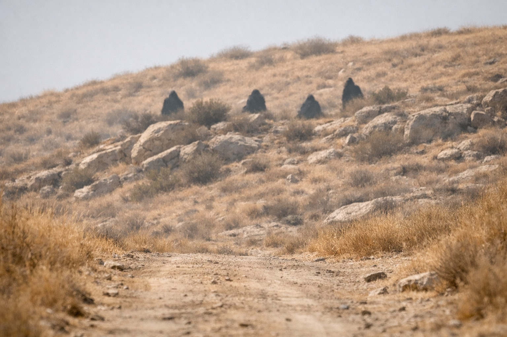

## Capítulo 8 | Parte 2

--- 

Se quedaron junto al camino con el cubo entre ambos.

La luz aumentaba y disminuía sin un ritmo estable.

Balin se acercó un poco más.

—¿A qué se siente?

—No a poder.

—Entonces, ¿a qué?

Dulint apretó el artefacto.

Había sostenido herramientas encantadas antes. Una piedra rúnica durante la guerra se había sentido como estar demasiado cerca de una fragua: calor, presión, demasiado de algo.

El cubo se sentía como menos.

—Ausencia —dijo.

Balin frunció el ceño.

Dulint buscó una explicación que tuviera sentido.

—En una mina, a veces sabes que hay una cavidad detrás de la pared antes de romperla. Cambia el aire. Cambia el sonido. La piedra alrededor lleva la forma de lo que falta.

La expresión de Balin se agudizó.

—Esto se siente así —dijo Dulint—. Un hueco que puedes sostener.

—Eso es peor que magia.

—Mucho.

Giró el cubo. La cara más brillante siguió apuntando al noreste.

Las palabras de la bruja regresaron: *Cargas un peso que tira. Un hambre que hará despertar lo que duerme.*

—¿Tira de qué? —preguntó Balin.

—No lo sé.

Algo se movió en la ladera detrás de ellos.

Dulint se cubrió los ojos con una mano.

Una figura.

Después otra.

Después dos más.

Estaban demasiado lejos para verles la cara, pero no para ver el paso. Los cuatro avanzaban con intención por el mismo camino.

Balin miró de las figuras al cubo.

—¿Viajeros?

—Quizá.

—No suenas convencido.

—Soy viejo. La convicción cuesta extra.

Dulint guardó el cubo en la mochila.

Las figuras lejanas no redujeron el paso.

*Llama.*

No sabía si el pensamiento venía de la advertencia de la bruja o de él.

—Nos movemos —dijo Dulint.

—¿Rápido?

—Tan rápido como me permita la rodilla sin caerse.

Balin volvió a mirar a las figuras.

—Eso no es muy rápido.

—Entonces quéjate mientras caminas.

Empezaron hacia Riverhold.

---

**Fin de Capítulo 8.2 —> 8.3: [El Camino de Zuraldi: La Duda del Sobrino](/el-camino-de-zuraldi-la-duda-del-sobrino/)**
