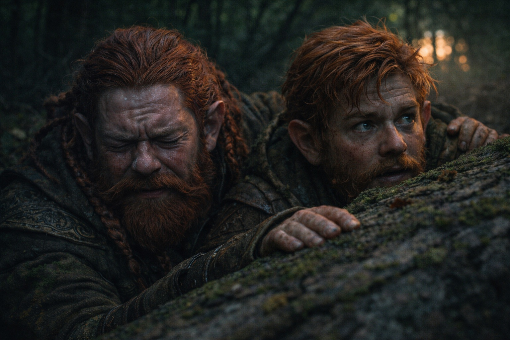

## Capítulo 8 | Parte 5

--- 

Llegaron a los árboles porque Balin arrastró a Dulint durante los últimos cien pasos.

Los pulmones de Dulint parecían raspados por dentro. Su rodilla derecha había dejado de producir quejas individuales y se había instalado en una amenaza continua.

Detrás de un roble caído, Balin lo obligó a sentarse.

—Dos minutos.

—Uno.

—No estás negociando desde una posición fuerte.

Dulint bebió e intentó no devolver el agua con la tos.

Desde el campo abierto más allá de los árboles llegaban pasos.

La misma cadencia.

Más cerca.

Balin miró la mochila.

—Sabemos que siguen el cubo.

—Sí.

—Entonces tíralo.

Dulint no respondió.

—Déjalo aquí. Se detienen por él. Nosotros vamos al sur, rodeamos hacia el este después y llegamos a Riverhold sin equipaje brillante.

Era un buen plan.

Ese era el problema.

Dulint puso la mochila sobre sus piernas.

Se imaginó abriéndola.

Dejando el cubo bajo el roble.

Alejándose más ligero.

Su mano no se movió.

Balin lo observó.

—Tío.

—No puedo dejarlo.

—¿Por qué?

Dulint abrió la boca.

Ninguna respuesta sobrevivió al camino hasta su lengua.

Porque Thrain había llevado un mapa hacia el peligro.

Porque el cubo había salido de la mina que construyó el nombre de su familia.

Porque la bruja lo había reconocido.

Porque algo dentro de Dulint se rebelaba ante la idea de entregárselo a hombres que caminaban como maquinaria de bombeo.

Nada de eso era una prueba.

—Thrain conservó el mapa —dijo al fin.

Balin lo miró fijamente.

—Cuando se inundaron las galerías antiguas, lo conservó. Soltarlo quizá le habría hecho más fácil escapar.

—¿Ésa es tu razón?

—He pasado media vida llamando valor a eso. —Dulint se frotó la rodilla—. No estoy preparado para llamarlo estupidez la primera vez que la familia me pide lo mismo.

—Es una razón terrible.

—Sí.

—Posiblemente la peor de hoy.

—Aún es temprano.

Balin miró hacia el sonido de los pasos.

Después volvió a Dulint.

—Podríamos morir por esto.

—Podríamos.

—Y todavía no sabes qué es.

—No.

Balin maldijo en voz baja.

Dulint apretó las correas.

Sabía que Balin tenía razón.

Eso no hacía que sus manos quisieran soltarlo.

—Riverhold —dijo Dulint.

Balin pasó un brazo bajo su hombro.

—Más le vale a Xandor ser muy entretenido.

Juntos se internaron más en los árboles.

---

**Fin de Capítulo 8.5 —> 9.1: [El Mar de Pesadillas: El Agua Negra](/el-mar-de-pesadillas-el-agua-negra/)**
