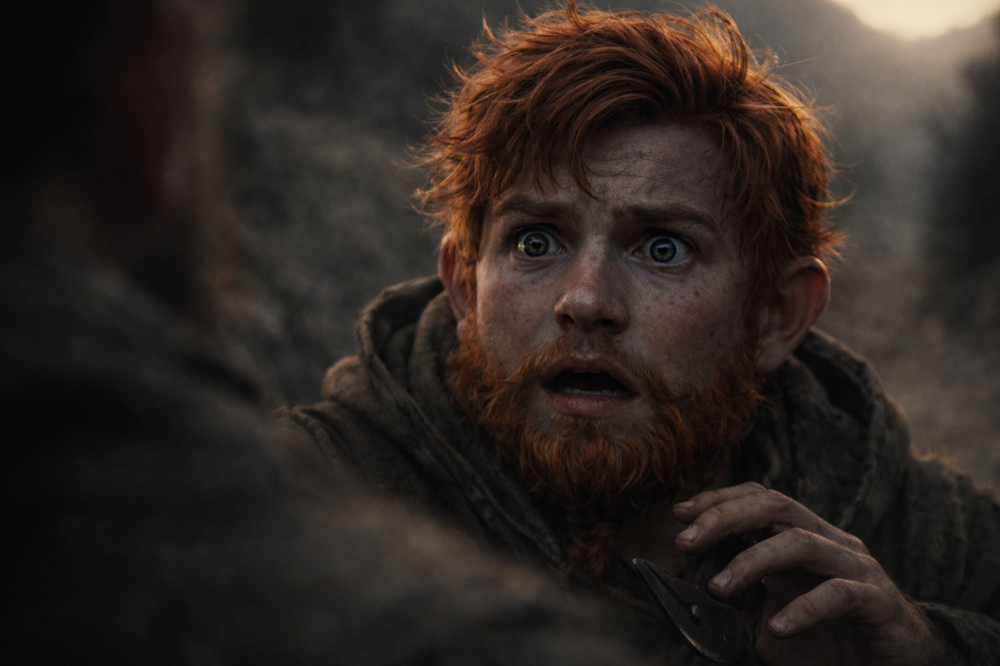

## Capítulo 8 | Parte 3

--- 

Ya no estaban viajando.

Los estaban siguiendo.

La rodilla derecha de Dulint marcaba cada desnivel con un pulso agudo. La vieja lesión del Pozo Profundo había aprendido paciencia con los años. Sabía que tarde o temprano él le daría algo de lo que quejarse.

Balin no.

—Sabías más de lo que me dijiste.

Dulint siguió caminando.

—Tío.

—Te he oído.

—Siempre me oyes. Responder es lo raro.

Dulint suspiró.

Balin lo agarró del antebrazo.

—Yo saqué ese cubo de la pared. Lo sostuve antes que tú. Anoche la bruja dice que tira de algo. Esta mañana empieza a brillar. Ahora aparecen cuatro desconocidos armados detrás de nosotros.

—Lo noté.

—Y estás usando la voz.

—¿Qué voz?

—La que usas cuando el camino te parece de repente fascinante porque estás decidiendo cuánta verdad puedo soportar.

Dulint se detuvo.

Maldito chico.

—No sé qué es el cubo —dijo Dulint—. No sé por qué despertó. No sé quiénes son esas personas.

—¿Pero?

—Pero creo que están aquí por él.

Balin soltó su brazo.

—Eso era lo que estabas omitiendo.

—Sí.

—Lo cual es mentir.

—En los túneles.

—Estamos en un camino.

—Entonces parece que la regla viaja.

Balin le lanzó una mirada que casi parecía satisfacción.

Dulint volvió a caminar.

—Riverhold —dijo—. Xandor sigue siendo nuestra mejor opción.

—Ya lo sé. Yo lo propuse.

—Me acuerdo.

—Bien. La edad no se lo ha llevado todo.

—Sigue poniéndolo a prueba.

Caminaron hasta que el camino giró entre dos colinas grises.

Balin miró atrás.

Se detuvo.

—Tío.

Dulint se volvió.

Las cuatro figuras habían coronado la subida.

Ya lo bastante cerca para ver armas bajo las capas de viaje.

No estudiaban las huellas. No buscaban el rastro.

Sus rostros seguían orientados hacia Dulint y Balin.

—Saben exactamente dónde estamos —dijo Balin.

Uno de los perseguidores rodeó un socavón sin cambiar de cadencia. El siguiente hizo lo mismo. Su paso no se acortaba ni se alargaba, las piernas trabajando con la repetición de varillas de bomba.

Dulint sintió el pulso del cubo contra la espalda.

Balin oyó el zumbido.

—Estamos marcados.

—Sí.

—Por el cubo.

Dulint ajustó la mochila.

—Eso parece.

Balin sacó su cuchillo de mina.

—¿Y ahora?

—Ahora dejamos de teorizar y averiguamos lo difícil que es esconderlo.

---

**Fin de Capítulo 8.3 —> 8.4: [El Camino de Zuraldi: Los Seguidores](/el-camino-de-zuraldi-los-seguidores/)**
