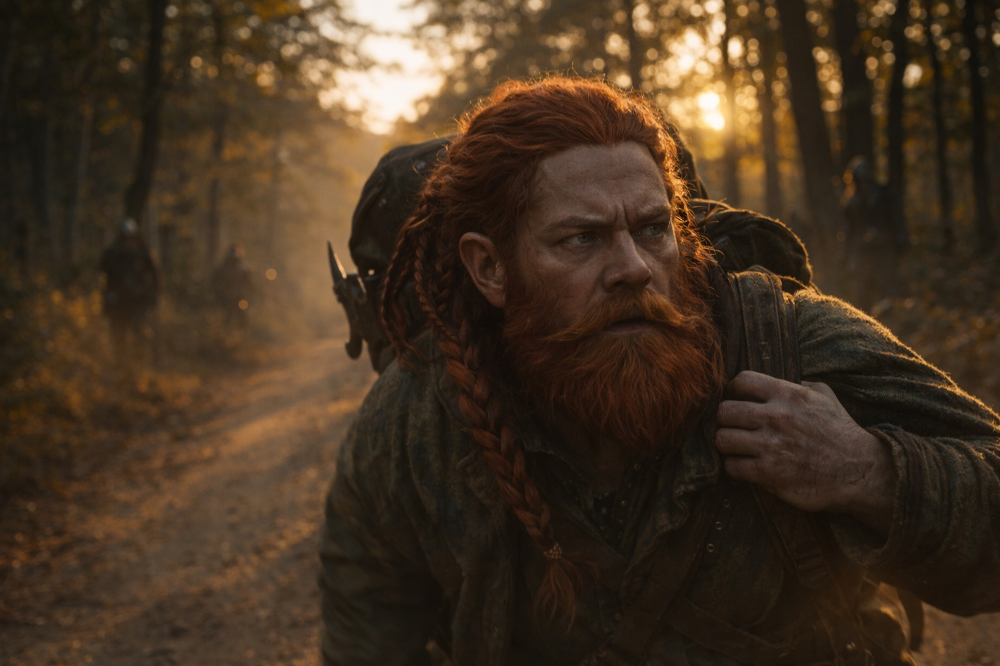
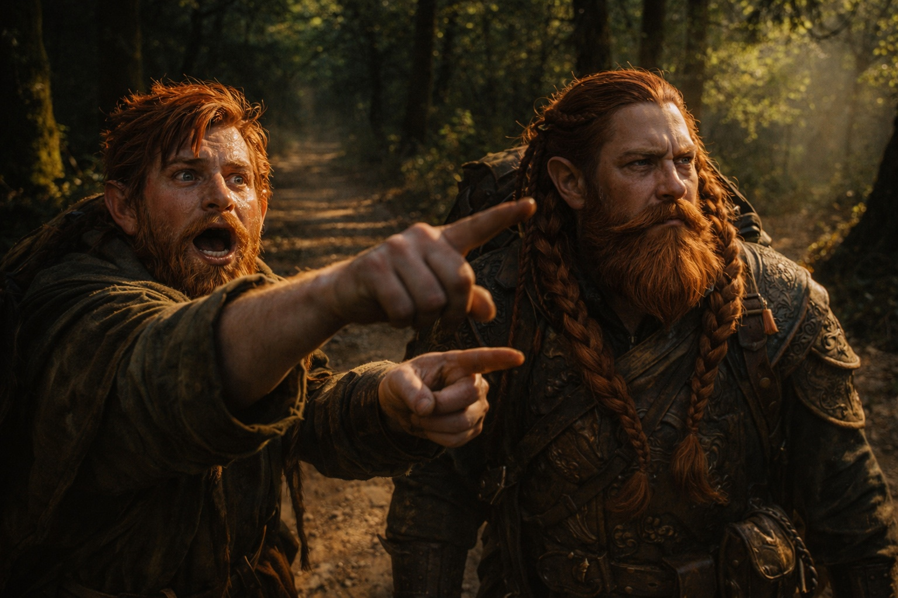
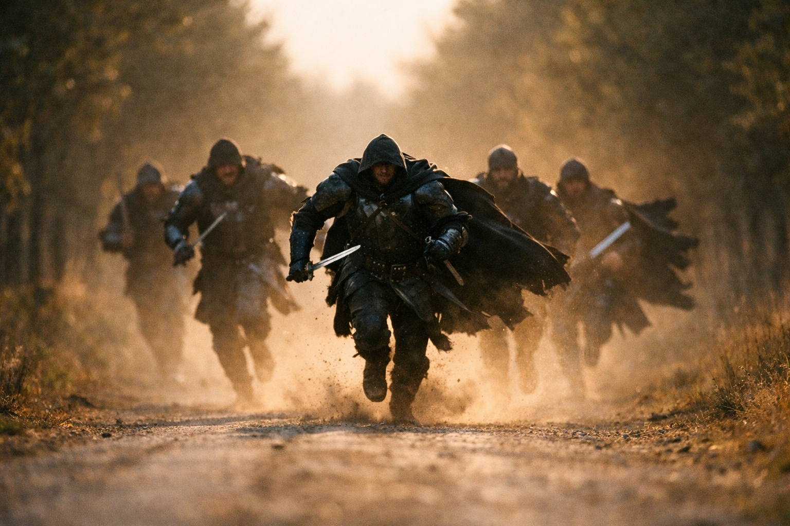

## Capítulo 8 | Parte 4

--- 

Media legua después, el camino cruzaba una alcantarilla seca de piedra.

Dulint se detuvo.

—¿Qué? —preguntó Balin.

—Experimento.

—Esa palabra suena cara cuando la dices tú.

Dulint sacó el cubo de la mochila. Estaba todavía más caliente.

Lo envolvió en su capa de repuesto y después en la tela encerada del paquete de comida. El zumbido se apagó un poco bajo las capas, pero no desapareció.

—Ayúdame.

Encajaron el bulto bajo la alcantarilla entre dos piedras planas y lo cubrieron con grava.

Después abandonaron el camino.

A cincuenta pasos entre los matorrales, Dulint encontró una pequeña cresta de piedra suficiente para ocultar a dos enanos. Se agacharon detrás.

Su rodilla protestó con entusiasmo.

Balin asomó la cabeza.

—Si esto nos mata, pienso perseguirte como fantasma.

—Si mueres primero, tú cargas la mochila.

Los perseguidores llegaron a la curva.

No siguieron las huellas que salían del camino.

Los cuatro giraron hacia la alcantarilla.

Directamente hacia el cubo enterrado.

Balin bajó la cabeza.

—Bueno.

—Sí.

—Eso responde a la pregunta.

Dulint calculó la distancia.

Demasiado cerca para abandonar el cubo. Lo bastante lejos para recuperarlo si se movían ya.

—Vamos.

Bajaron por la parte trasera de la cresta.

La rodilla de Dulint casi cedió. Balin lo sujetó por el cinturón y lo mantuvo en pie.

Rodearon entre zarzas, aparecieron por debajo de la alcantarilla y alcanzaron el bulto enterrado mientras los perseguidores seguían aproximándose por el camino superior.

Dulint apartó la grava.

En cuanto cerró la mano sobre el cubo envuelto, el zumbido atravesó la tela y le entró en los huesos.

—Lo tengo.

—Maravilloso. Corre.

Corrieron.

Un grito llegó desde atrás.

La primera voz que habían oído de los perseguidores.

Después las botas golpearon el camino más deprisa.

Dulint arriesgó una mirada.

Dos siguieron por el camino.

Dos entraron en los matorrales.

—Se separan.

—Otra vez.

—Aprenden.

—Nosotros también.

Balin señaló una franja oscura de árboles al frente.

—Bosque. Media legua.

Dulint miró su rodilla como si pudiera ofrecer una propuesta alternativa.

La ofreció.

La ignoró.

—Riverhold sigue al este de ese bosque.

—Suponiendo que Xandor esté allí.

—Si no está, puedes quejarte directamente con él.

Detrás, los perseguidores empezaron a correr.

---

**Fin de Capítulo 8.4 —> 8.5: [El Camino de Zuraldi: La Decisión](/el-camino-de-zuraldi-la-decision/)**
