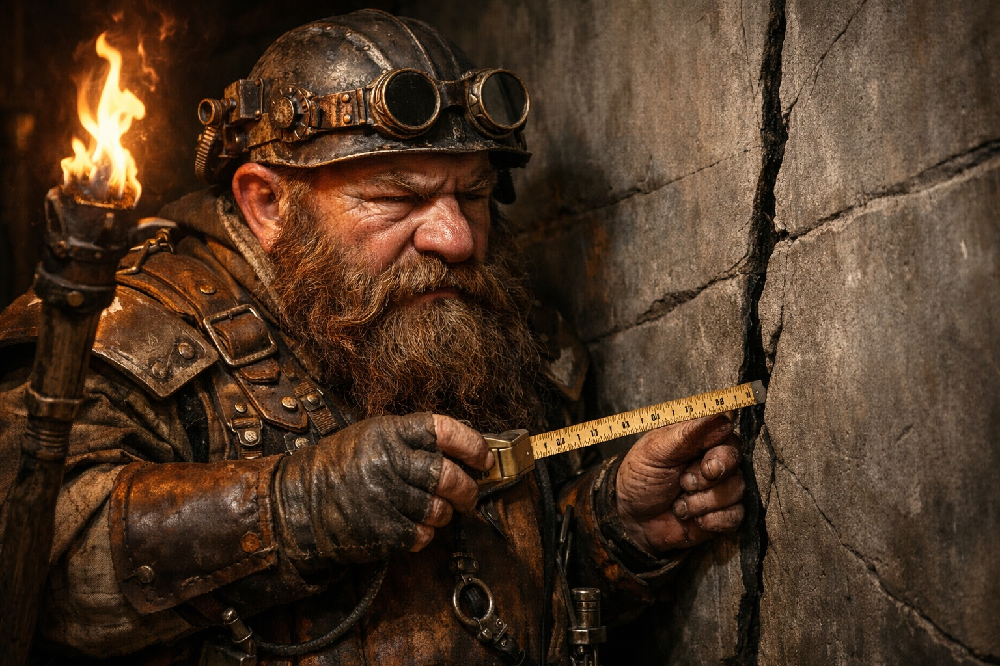
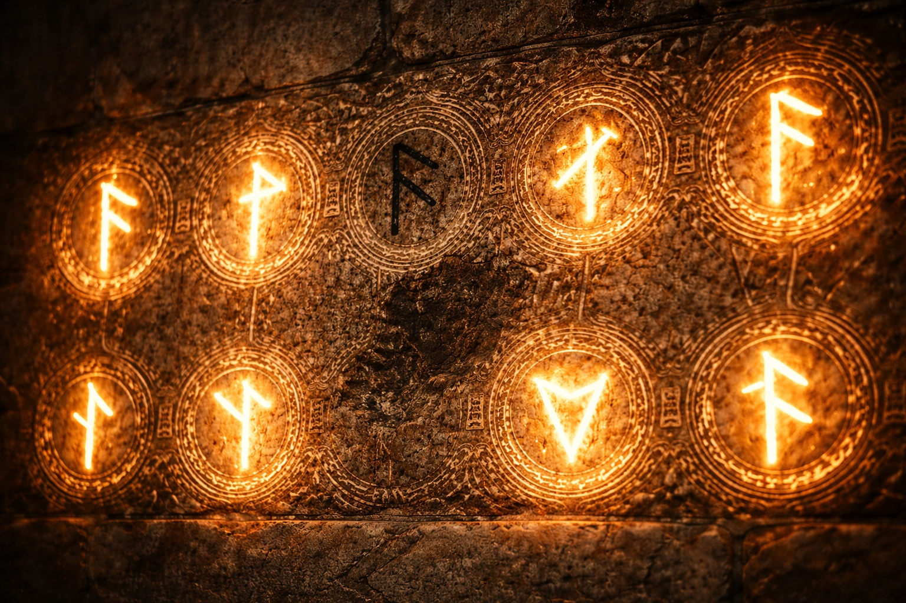
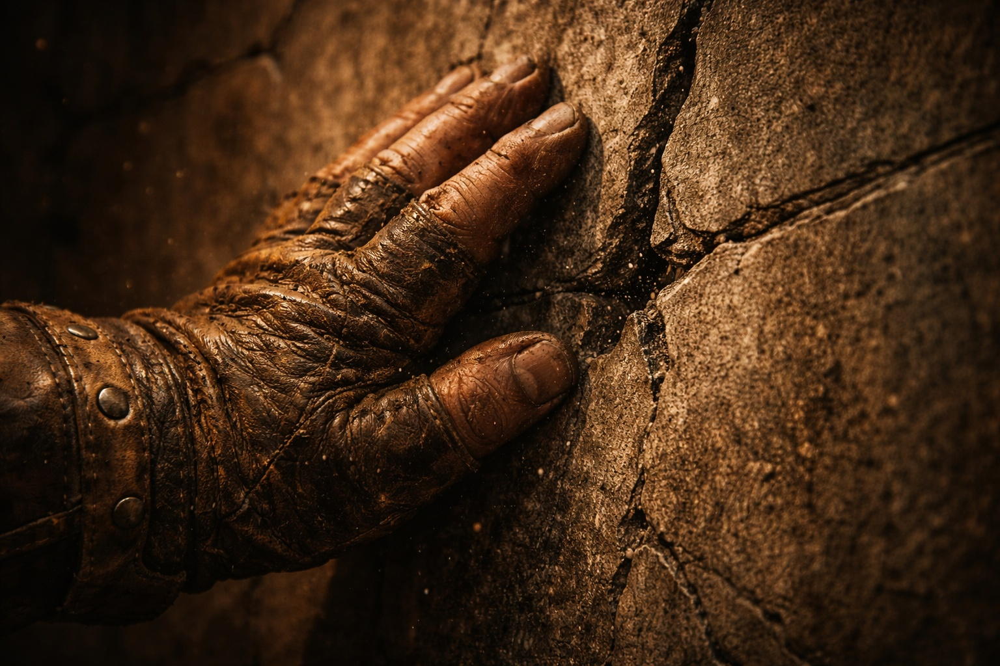

## Lore | Fragua y Fuego: La Postura del Reino Montañoso de Stonehold Contra el Caos

---

La grieta tenía trece pulgadas de largo.

El capataz Bragni sujetó la cinta contra la roca húmeda y marcó ambos extremos con tiza. En la segunda medición, la fisura había rebasado la marca.

Trece pulgadas. Quizás catorce.

Guardó la cinta y pasó un dedo por la fisura. Tan cerca del Corazón de la Forja solía tener que secarse las manos antes de medir. Aquella franja estrecha de roca estaba fría.

Retiró el dedo entumecido.

—¿Cuándo la notaste por primera vez? —preguntó Bragni.

Detrás de él, el equipo de inspección se movía nerviosamente. Torgen, el mayor, se aclaró la garganta. —Hace tres días. Pensamos que era un asentamiento. Un asentamiento normal, del tipo que ocurre después de un deshielo de primavera.

—Es otoño.

—Sí.

Bragni tocó la grieta de nuevo. El frío se estaba extendiendo ahora, una fina línea de entumecimiento que subía hacia su muñeca. Retiró la mano.

—Esto no es un asentamiento —dijo.

En la estación del pozo, Bragni extendió los planos por el suelo. La leyenda atribuía el Pozo Seis a los primeros canteros y consignaba una bendición de los sacerdotes de Vondar. Un topógrafo posterior había escrito *¿labores antiguas más allá del final?* debajo del relleno negro; luego lo había tachado.

La piedra bendecida no se agrietaba. Esa era la doctrina.

Bragni dejó la tiza junto a la fecha de la bendición. El polvo blanco cayó sobre las cifras.

—¿Ha habido alguna actividad sísmica? —preguntó Bragni—. ¿Temblores? ¿Retumbos desde abajo?

El equipo intercambió miradas. Torgen habló de nuevo. —No exactamente temblores. Más como... presión. Los mineros dicen que se siente como si algo empujara contra las paredes desde el otro lado.

—¿El otro lado de qué?

—Ese es el problema. —La voz de Torgen bajó más—. Se supone que no hay otro lado. Según los planos, el Pozo Seis termina en roca madre sólida. No hay nada más allá.

Bragni estudió el relleno negro: *roca infranqueable, confirmada por inspección*. La nota discutida era anterior al sello que lo certificaba. No había ningún dibujo de las supuestas labores.

Enrolló el plano. —Llévame hasta el fondo.

Bajaron de nuevo por el pozo durante veinte minutos. Bragni rozaba las runas de la pared al pasar, por costumbre de infancia. Los surcos conservaban calor, aunque la última marca de mantenimiento del templo apenas se leía.

Se detuvo. —Esta.

La siguiente runa estaba oscura. Pasó el pulgar por el contorno: los surcos estaban intactos, pero fríos.

Torgen asintió. —También lo notamos. Lo reportamos al templo. Dijeron que enviarían a alguien.

—¿Cuándo?

—El próximo mes.

*El próximo mes.* Como si las runas muertas pudieran esperar como errores de contabilidad.

Bragni siguió adelante.

Al fondo encontró las marcas de tiza bajo una fisura que ya se prolongaba por el techo.

A la luz de las antorchas, el borde irregular parecía latir. Bragni subió la escalera de inspección y apoyó la cinta contra él.

Diecisiete pulgadas.

Se quedó mirando el número. Luego midió de nuevo.

Diecinueve pulgadas.

—Está creciendo —dijo.

—Imposible —respondió Torgen—. La piedra no crece.

—No tan deprisa. —Bragni bajó—. ¿Cuándo la mediste por última vez?

—Esta mañana. Doce pulgadas.

Bragni comparó la tiza de la pared con la anotación de doce pulgadas de Torgen. No podía explicar la diferencia. Hasta sus propias marcas habían quedado anticuadas.

Bragni apoyó la palma en la pared, debajo de la grieta. La piedra estaba tan fría que le dolió la palma.

Y escuchó algo.

Una vibración le subió por la muñeca y se le instaló en los dientes. Contuvo la respiración para escuchar si funcionaban las bombas.

—¿Escuchan eso? —susurró.

El equipo se quedó en silencio. Uno por uno, negaron con la cabeza.

Comparó el pulso con el ritmo de las bombas que conocía. No coincidían. Al apartar la mano, dejó de sentirlo.

Se frotó la palma entumecida contra el pantalón.

—Vamos a sellar este pozo —dijo—. Inmediatamente. Barricada completa. Refuerzo de hierro. Piedra con runas.

—¿Qué? —Torgen dio un paso adelante—. El Consejo Minero no ha aprobado—

—El Consejo puede inspeccionarlo después de que lo apuntalemos. —Bragni se apartó de la pared—. Busca a los herreros. Quiero aquí a un sacerdote antes de que terminen.

Torgen volvió a mirar las marcas de tiza.

Luego asintió y corrió.

La barricada llevó tres horas. Clavaron vigas de hierro en la roca y añadieron cadenas y una capa gruesa de mortero. Al sacerdote le falló la voz antes de terminar las runas; completó la última apoyado en un herrero, con sangre en la manga.

Bragni supervisó cada paso. Cuando se colocó el sello final, presionó su mano contra él.

El mortero le calentó la palma. Dejó la mano allí hasta recuperar la sensibilidad en los dedos.

Archivó el informe aquella noche: *Pozo Seis sellado. No excavar más allá de la barricada hasta la inspección.* El formulario exigía una evaluación del riesgo. Bragni escribió *bajo* junto a *sección sellada* y subrayó *hasta la inspección*.

El Consejo Minero lo leyó. Le agradecieron su diligencia. Aprobaron una mención por acción rápida.

La respuesta repetía su evaluación del riesgo y agradecía el trabajo del equipo. No daba fecha para la inspección.

---

*Informe archivado. Pozo Seis sellado. Equipo de inspección reasignado.*

*El registro del Consejo dio el expediente por cerrado.*

Tres semanas después, Bragni despertó en la noche y descubrió que la pared de su habitación estaba fría al tacto.

Encendió una lámpara y buscó una grieta en el yeso. No había ninguna.

Empezó un informe en el reverso de la mención y lo dobló antes de escribir el número de la habitación.

Por la mañana la pared estaba caliente. Guardó el papel doblado en un cajón.

**Fin de Lore 1 — continúa en Lore 2: [Los Zuraldarr](/the-zuraldarr/)**
