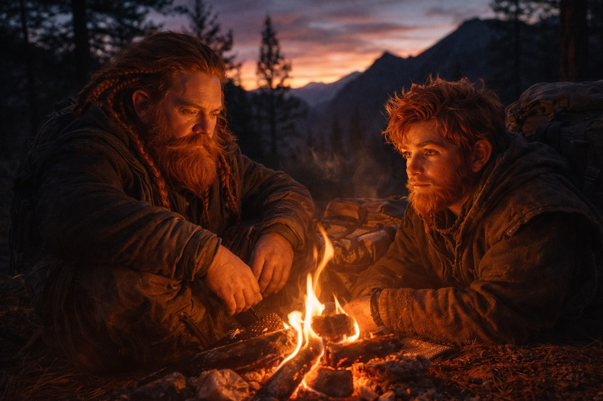
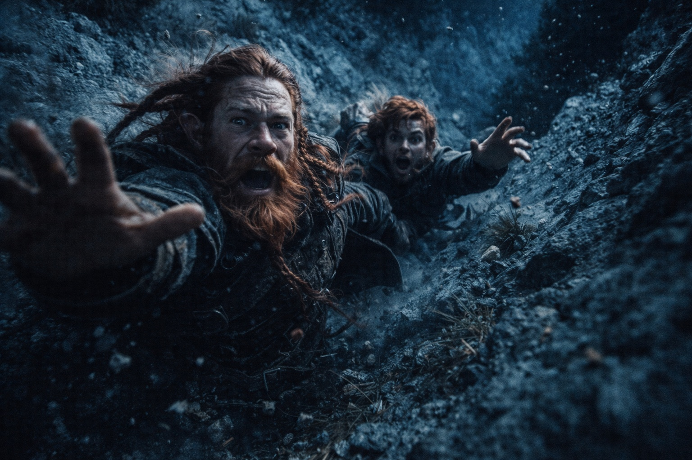
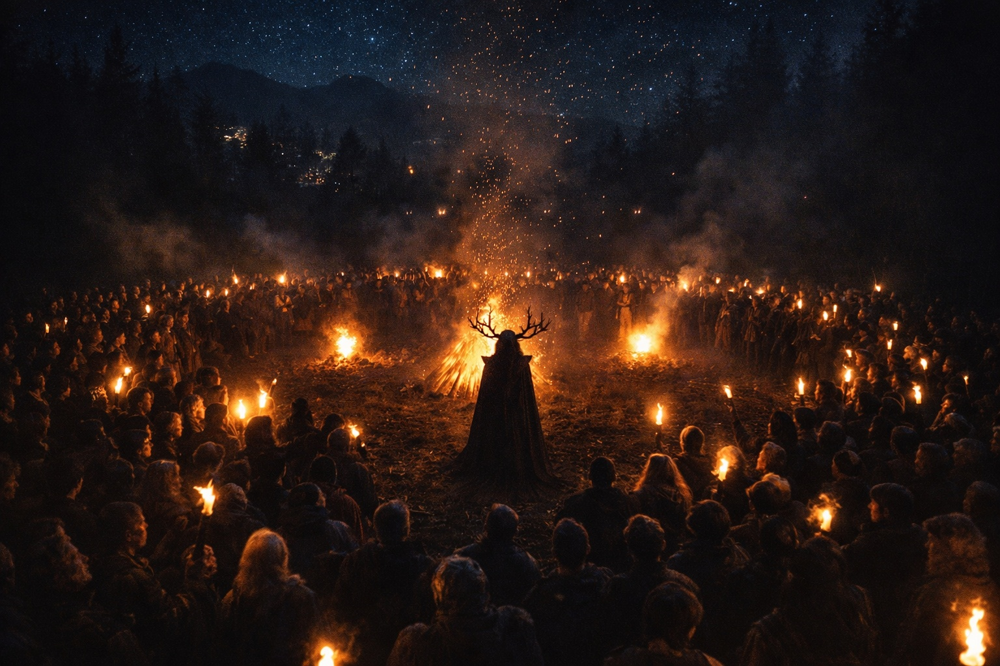

## Prólogo | Un viaje complicado

--- 

Dulint y Balin caminaban por el sendero serpenteante de la montaña, con las mochilas cargadas de provisiones y el peso de su descubrimiento. 

*"¿Cuánto falta, tío?*, preguntó Balin, ajustándose las correas de los hombros.

Dulint entrecerró los ojos y miró los picos lejanos. *"Pronto acamparemos, muchacho. No tiene sentido arriesgar el pellejo por estos senderos al anochecer".

Encontraron un pequeño claro enclavado entre altísimos pinos. Mientras Balin recogía leña, Dulint desempaquetaba sus escasas raciones.

El fuego prendió. Dulint se apoyó contra un tronco, las articulaciones crujiendo como leña mojada.

*"Háblame otra vez de los zuraldi "*, dijo Balin, con los ojos reflejando las llamas. *"¿Cómo son?*

Dulint se acarició la barba, con una mirada lejana. *"Gente fuerte, los zuraldi. Construidos como las montañas que llaman hogar. Valoran la fuerza, sí, pero también tienen sabiduría. Conocimientos ancestrales, transmitidos de generación en generación".

*"¿Y nos ayudarán? "* La voz de Balin contenía una nota de incertidumbre.

*"Si alguien puede dar sentido a lo que hemos encontrado, ése es Xandor "*, asintió Dulint. *"Ahora duerme un poco. Tenemos un largo camino por delante".

## Sombras en la noche

El aire nocturno rozaba la piel de Dulint mientras vigilaba. Sus ojos se esforzaban contra la oscuridad, buscando amenazas en las sombras de los imponentes pinos. Una rama se quebró. Su mano voló hacia su hacha.

*"Balin", siseó. *"Despierta, muchacho "*.

Su sobrino se removió, refunfuñando. *"¿Y ahora qué, viejo? ¿Otro mapache te ha puesto nervioso?"

Un grito gutural partió el aire. No era un mapache.

Balin se incorporó como un rayo, olvidado el sueño. *"En el nombre de... "*

*"Bandidos "*, Dulint escupió la palabra como una maldición.

Salieron de la maleza, una masa retorcida de piel verde y dientes amarillentos.

Seis, no, siete criaturas. Las hojas curvadas brillaban a la luz de la luna.

Los músculos de Dulint se tensaron, la memoria muscular de décadas pasadas se apoderó de ellos. Levantó el hacha, cuyo peso le resultaba familiar y reconfortante.

*Quédate cerca, muchacho. Y no hagas ninguna estupidez".

Balin buscó a tientas su pico, con los nudillos blancos alrededor del mango. *"Un poco tarde para eso, ¿no? "*

El primer goblin corrió hacia Dulint. Él se apartó y bajó el hacha en un arco despiadado. La criatura se desplomó y la sangre oscura manchó el suelo del bosque.

Otro cargó contra Balin. El joven enano lanzó un golpe torpe y su pico silbó en el aire. La hoja del goblin le atravesó el brazo, arrancándole un grito de dolor.

*"¡Balin!", rugió Dulint, atravesando a otro atacante. *"¡Detrás de ti!*

Su sobrino giró y clavó la punta de su pico en el pecho de un goblin. El chillido de la criatura se cortó bruscamente.

La sangre retumbaba en los oídos de Dulint. Dos muertos, pero seguían llegando más. Demasiados. Agarró el brazo ileso de Balin.

*"¡Corre!*

## Una huida desesperada

Se adentraron en el bosque, con las ramas golpeándoles la cara. Las raíces amenazaban con hacerles tropezar a cada paso. 

*Dulint giró a la izquierda, hacia una empinada cuesta. Las piernas le ardían mientras subían a duras penas, con las piedras sueltas repiqueteando por la pendiente.

Balin respiraba entrecortadamente. *"Tío... No puedo..."*

*"Puedes y podrás "*, gruñó Dulint. *"A menos que te apetezca convertirte en estofado goblin "*.

Llegaron a la cima de la colina, pero al otro lado se encontraron con una caída en picado. El corazón de Dulint se hundió. Un callejón sin salida.

Balin se asomó por el borde, con el rostro pálido a la luz de la luna. *"¿Y ahora qué?*

El sonido de la persecución se hizo más cercano. La mente de Dulint se agitó, sopesando sus opciones. Cada una peor que la anterior.

*"Descendemos "*, dijo sombríamente. *"Lento y constante. Como escalar los pozos de las minas de casa"*.

Balin asintió, tragando saliva. Comenzaron a descender, con los dedos buscando apoyo en la pared rocosa.

Un guijarro pasó rozando la oreja de Dulint. Levantó la vista y vio caras de goblins que los miraban con desprecio.

*"¡Más rápido!"*, le gritó.

Medio saltaron, medio se deslizaron por el acantilado. Los brazos de Dulint protestaron. Ya casi. Sólo faltaba...

Su pie resbaló. El mundo se inclinó. Cayó, llevándose a Balin con él.

Golpearon el suelo con fuerza. Dulint jadeó buscando aire, parpadeando para alejar las manchas de su visión. Por encima de ellos, los gritos de triunfo de los goblins resonaban en las rocas.

*"¿Tío? "* La voz de Balin sonaba lejana. *"¡Tío, levántate!"*

Dulint se puso en pie, ignorando el dolor que le recorría el cuerpo. Los goblins ya estaban a medio camino del acantilado.

*"Corre "*, resolló. *"¡Corre!"*

## Amigos Inesperados

Avanzaban a trompicones, cada paso era una agonía. 

Los pensamientos de Dulint se fragmentaron. ¿Cuánto tiempo llevaban corriendo? ¿Minutos? ¿Horas?

Una raíz le atrapó el pie. Cayó de bruces contra el suelo. La suciedad le llenó la boca, el sabor de la derrota.

"¡Tío!" Las manos de Balin lo agarraron por los hombros, intentando levantarlo. "Por favor, tenemos que..."

Un silbido cortó el aire. Algo golpeó el árbol junto a ellos con un ruido sordo. ¿Una flecha?

Siguieron más, una lluvia de proyectiles a su alrededor. Pero no contra ellos. A sus perseguidores.

Los gritos de los goblins resonaron en el bosque, esta vez de dolor y miedo. Dulint levantó la cabeza y entrecerró los ojos en la oscuridad.

Unas formas se movían en la cresta.

Figuras altas y musculosas que lanzaban piedras con una precisión mortal. Los Zuraldi.

Los goblins huyeron por donde habían venido. Dulint se hundió aliviado, con la frente apoyada en la fría tierra.

*"¡Kaizur!"*, gritó una voz. *"¿Estáis heridos, amigos?*

Respondió Balin, con voz temblorosa. *" Seguiremos vivos, todo gracias a ti "*.

Dulint se levantó con dificultad cuando se acercaron sus salvadores. Reconoció a uno de los zuraldi, un hombre corpulento de barba espesa y ojos amables.

*"¿Jokin? "* Dulint entrecerró los ojos, sin atreverse a creer su suerte. *"¿Eres tú, viejo amigo?*

El hombre esbozó una amplia sonrisa. *"¡Dulint, viejo mordedor de rocas! ¿En qué lío te has metido esta vez?

Balin miró a uno y otro, con la confusión reflejada en el rostro. *"Tío, ¿lo conoces? "*

*"Sí "*, asintió Dulint. *"Este es Jokin Xeberria. Hemos comerciado más veces de las que puedo contar. Su mujer hace el mejor talo de este lado de las montañas "*.

Jokin le dio una palmada en el hombro a Dulint, casi haciéndole caer. *"Venid, amigos. Parece que os vendría bien un fuego caliente y una bebida fría. Hablaremos más cuando hayáis descansado".

## Un nuevo desafío

Mientras se dirigían a la aldea Zuraldi, Balin se inclinó hacia Dulint. *"Tío, ¿qué eran esas cosas? Nunca había visto a unos bandidos luchar así "*.

Dulint frunció el ceño. *"No lo sé, muchacho. Pero me gustaría averiguarlo".

La aldea de Zuraldi bullía de actividad a pesar de lo avanzado de la hora. La noticia del ataque se extendió rápidamente, y los rostros curiosos se asomaban a las ventanas a su paso.

Jokin los condujo a un gran edificio comunal, las paredes talladas con diseños antiguos, alisados por generaciones de hombros apoyados contra ellos. Dentro ardía un fuego.

*"Sentaos, sentaos "*, Jokin señaló un par de robustas sillas. *"Maiarí traerá comida y bebida "*.

Como invocada por su nombre, apareció una mujer regordeta de rostro amable, con una bandeja cargada de pan y humeantes cuencos de sopa.

*Muchas gracias", dijo Dulint, con una pronunciación torpe pero sincera. La mujer le sonrió.

Mientras comían, Dulint relató su angustiosa huida. Jokin escuchaba atentamente, con expresión cada vez más seria.

*"¿Criaturas así, aquí? "*, negó con la cabeza. *"Es algo inaudito. El último avistamiento de semejantes bestias fue hace décadas, e incluso entonces, nunca llegaron tan al norte".

Balin habló, con la boca llena de pan. *"Necesitamos hablar con Xandor. Es urgente".

Jokin enarcó las cejas. *"¿Xandor? Lo buscáis en el lugar equivocado. Estos días se queda en Riverhold. Desde hace años".*

Dulint y Balin intercambiaron miradas. Riverhold. Una ciudad ribereña amurallada en la frontera, hecha para el comercio y los problemas. Muy lejos de las casas de montaña a las que estaban acostumbrados.

*"¿Cuánto tardaríamos en llegar a Riverhold? "*, preguntó Dulint, temiendo ya la respuesta.

Jokin se acarició la barba pensativo. *"¿Para vosotros, enanos? Dos días, si el tiempo acompaña y no os paráis a discutir con el camino. Pero los caminos no son seguros estos días, sobre todo con esas criaturas rondando "*.

A Balin se le iluminó la cara. *"¿Dos días? No está tan mal, tío. Podríamos... "*.

Dulint le dio una patada por debajo de la mesa y le lanzó una mirada de advertencia. *"Agradecemos la información, Jokin. Tendremos que considerar nuestras opciones".

Jokin asintió, con los ojos brillantes de curiosidad. *"Por supuesto. Eres bienvenido a descansar aquí todo el tiempo que necesites. Pero dime, viejo amigo, ¿qué te trae tan lejos de casa? ¿Seguro que no es sólo para perseguir a nuestro díscolo druida? "*.

Dulint se removió incómodo en su asiento. *"Es... complicado. Digamos que hemos encontrado algo que necesita la experiencia de Xandor".

*"Ah "*, Jokin sonrió con complicidad. *"Una de esas situaciones. Bueno, tus secretos están a salvo con nosotros. Ahora, termina tu sopa antes de que se enfríe. Podemos hablar más por la mañana".

Mientras Jokin los dejaba con su comida, Balin se inclinó hacia Dulint. *"¿Qué hacemos ahora, tío? No podemos quedarnos aquí esperando que Xandor pase por Zuraldi, pero los caminos... "*.

Dulint suspiró, sintiendo de pronto cada uno de sus años. *"Descansaremos esta noche, muchacho. Mañana vamos a Riverhold".*

## Profecía a la luz del fuego

Cayó la noche, y la aldea se vació hacia las afueras. Dulint y Balin, aún doloridos del camino, siguieron a la multitud porque quedarse quietos era peor.

*"¿Qué está pasando? "*, susurró Balin a su tío.

Dulint se encogió de hombros, con los ojos entrecerrados por la curiosidad. *"Averigüémoslo, muchacho "*.

Salieron a un gran claro donde cientos de aldeanos se habían reunido en un amplio círculo. Las antorchas y hogueras lanzaban luz inestable sobre los rostros. En el centro había una figura solitaria, y todos la miraban.

La bruja era alta y delgada, envuelta en un manto oscuro. Una corona de ramas nudosas se recortaba contra las estrellas. Las brasas flotaban a su alrededor como insectos atraídos por algo que no podían ver.

Se hizo el silencio cuando levantó los brazos. Su voz era grave, pero llegaba.

*"Hijos de Zuraldi, escuchadme. Algo se acerca. Lo he visto — guerra, decisiones difíciles, y un ajuste de cuentas que ninguno de nosotros pidió".*

Un murmullo recorrió la multitud. Dulint sintió que Balin se tensaba a su lado.

*"Afilad las hachas"*, continuó la bruja. *"Reforzad los muros. Y manteneos unidos — porque a lo que viene le da igual si estáis preparados".*

Los fuegos crepitaron y escupieron chispas. Su mirada recorrió la multitud, lenta y deliberada.

*"Pero he visto algo más. Esperanza. Pequeña y obstinada, llevada por manos que no esperaréis. Buscadla".*

Bajó los brazos. La hoguera rugió, lanzando chispas a la oscuridad.

Cuando los reunidos empezaron a dispersarse, la mirada de la bruja los encontró entre la multitud que se disipaba. Se movió entre los aldeanos como humo, apareciendo junto al codo de Dulint antes de que pudiera reaccionar.

*"Lleváis algo"*, dijo, con la voz lo suficientemente baja para que solo ellos pudieran oír. Sus ojos hundidos se fijaron en la mochila de Dulint.

La mano de Dulint se movió instintivamente para cubrir el cierre de la mochila. *"No sé de qué..."*

La boca de la bruja se curvó, sin llegar a ser una sonrisa. *"Muéstramelo".*

Dulint dudó. Luego, con Balin pegado a su hombro, desenganchó la mochila y sacó el cubo al aire nocturno.

La bruja no lo tocó. Dio una vuelta, tarareando una hilera de palabras que Dulint no pudo atrapar, un ritmo más que un idioma. Y en la última nota, su voz cayó —más profunda, más vieja, como si alguien más hablara a través de ella.

*"Cargas un peso que tira"*, dijo. *"Un hambre que hará que despierte lo que duerme".*

Su mirada subió de golpe, clavando a Dulint en su sitio. *"Riverhold. Busca a Xandor".*

Volvió a mirar el cubo, como si escuchara algo dentro. *"Lo que guarda el cubo, el mundo responderá".*

Y entonces desapareció, fundiéndose con las sombras como si nunca hubiera estado allí.

Dulint y Balin intercambiaron miradas estremecidas.

*"Tío"*, susurró Balin, *"ella sabía lo de..."*

Dulint asintió con gravedad. *"Sí. Y ahora ya sabemos hacia dónde correr".*

Volvieron a casa de Jokin sin hablar. La mochila pesaba más sobre el hombro de Dulint. Ninguno mencionó las palabras de la bruja, y así fue como supo que ambos no pensaban en otra cosa.

Dulint se tumbó en el jergón y miró a la oscuridad, escuchando.

Durante largo rato sólo estuvo la aldea asentándose: madera crujiendo, brasas moviéndose, voces lejanas apagándose en sueño.

Luego, cerca del amanecer, la mochila a su lado se calentó. El zumbido llegó después. Suave. Constante. Como un latido con el que no podía discutir.

**Fin de Prólogo 2 — continúa en Prólogo 3: [El Grito](/la-mirada-de-un-guardia-a-grukmar/)**