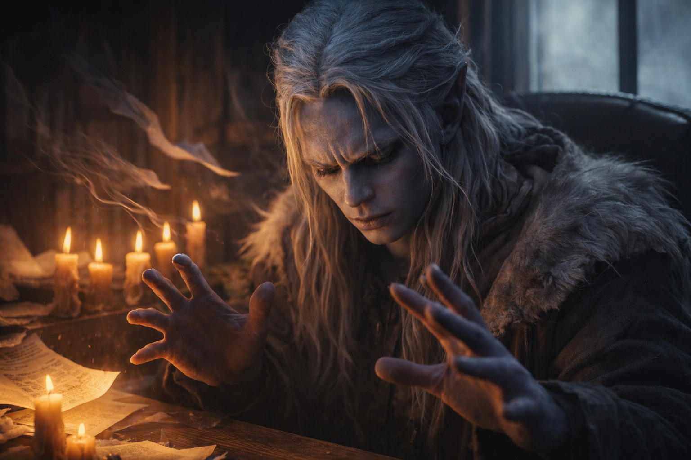

## Capítulo 4 | Parte 1
--- 

Mes uno.

La corriente de la fragua le calentaba los tobillos por las rendijas del suelo. Había pedido practicar lejos de la rejilla del techo; Zaelar le había dejado elegir la habitación. Ahora había velas a lo largo del muro, la más lejana a seis metros.

—Usa la corriente de la fragua. —Zaelar se acomodó en su silla junto a la ventana—. Siéntela, luego redirige.

Cerró los ojos y siguió el calor de la fragua hacia arriba, buscando una corriente que pasara cerca de las velas.

La vela más cercana vaciló. El esfuerzo le acortó la siguiente respiración.

—Bien. Más lejos.

Empujó. La corriente quería elevarse, pero la persuadió hacia los lados, la enhebró a través de su consciencia como sacar un hilo de una telaraña. La segunda vela parpadeó. La tercera...

Su concentración se fragmentó. La corriente se dispersó, y tres velas se apagaron a la vez mientras papeles se levantaban del escritorio de Zaelar en una ráfaga caótica.

—Lo siento. —Drusniel abrió los ojos. Su respiración llegaba más pesada de lo que debería, como si hubiera corrido en lugar de permanecer quieto.

—La precisión disminuye más allá del brazo de distancia. —Zaelar recogió sus papeles sin preocupación—. Estás trabajando con flujo de aire existente, no creándolo. Cuanto más lejos empujas, más debes tener en cuenta la interferencia: otras corrientes, obstáculos, cambios de temperatura.

—¿Hasta dónde puedo empujar esto?

—Más lejos de lo que sabes. —Una leve sonrisa—. Pero todavía no.

Tras cinco minutos tuvo que apoyarse en el escritorio. En casa solo podía practicar mientras pasaba la patrulla, cuando los pasos tapaban su respiración.

—De nuevo —dijo.

---

Mes tres.

El maniquí de práctica recibía el calor de una antorcha. En casa, el Consejo había impuesto una tregua en las rutas mineras disputadas. Las patrullas seguían reforzadas, pero su padre pasaba las tardes impugnando el fallo en vez de comprobar las horas de entrenamiento. Drusniel salía con los suministros al amanecer y se apartaba de los carros antes de llegar al mercado.

—Empieza por hacerlo oscilar —dijo Zaelar desde la puerta—. Ahora el aire tiene que llevar fuerza suficiente para mover la madera.

—Entendido.

Drusniel reunió la corriente que ascendía de la antorcha. Cuando la sintió presionar contra su percepción, la dirigió hacia el maniquí.

El maniquí se balanceó sin caer. A Drusniel se le cortó la respiración al soltar la corriente.

—De nuevo —dijo Drusniel.

—Descansa primero. Estás...

—De nuevo.

Volvió a tomar la corriente de la antorcha y añadió la de la fragua que salía por la rejilla de la esquina. Le palpitaban las sienes cuando las comprimió juntas y las soltó.

El maniquí voló hacia atrás, estrellándose contra la pared. Drusniel se tambaleó. Calidez goteó de su nariz.

<video controls playsInline preload="metadata" poster="./image.jpg" width="100%">
	<source src="./Drow_Magic_Discovery_Cinematic_Video.mp4" type="video/mp4" />
	Tu navegador no admite la reproducción de este vídeo.
</video>

Se tocó el labio superior. Sangre.

—Ahí. —Zaelar estaba junto a él, presionando un paño contra su cara—. Ese es tu límite actual.

—Puedo hacer más.

—No sin hacerte un daño para el que aún no estás preparado. —Lo guio hasta una silla—. Si sangras por la nariz, has ido demasiado lejos. Sigue forzando y no bastará con descansar una noche.

Drusniel se inclinó sobre el paño, procurando no mancharse la ropa.

—Mañana —dijo a través del paño—. Quiero intentarlo de nuevo.

Zaelar dejó un paño limpio junto a su mano.

—Mañana —concordó.

---

Mes cinco.

—Cierra los ojos.

El suelo estaba caliente bajo las botas de Drusniel. Fuera, el verano había secado los senderos de las crestas; llegaba a la torre en menos de la mitad del tiempo de su primera visita. Cuando se abrían las nubes, seguía esperando al anochecer para volver.

Cerró los ojos.

Sintió la corriente de la ventana en el rostro y, por debajo, el calor de la fragua. Seguir ambas a la vez le produjo un dolor sordo en la frente.

—¿Qué sientes?

—Aire. —Drusniel empujó su consciencia hacia afuera—. Corriente de la ventana. Calor desde abajo. Mi respiración.

—¿Qué más?

Siguió la corriente de la ventana hasta las sillas. Donde se dividía, algo le cerraba el paso.

El obstáculo se desplazó hacia la puerta.

—Te moviste. —Drusniel mantuvo los ojos cerrados—. Estás junto a la puerta ahora. Estabas junto a la ventana.

Abrió los ojos. Zaelar permanecía exactamente donde lo había percibido, una mano en la manija de la puerta.

—Has seguido el desplazamiento. —Zaelar mantuvo la mano en el pestillo—. Con práctica podrías advertir que entra alguien antes de oírlo.

—Eso es útil.

—Te habría sido útil la primera vez que viniste, ¿verdad?

—¿Y el agua? Dijiste que también podía trabajar con ella.

—Empezaremos por percibirla. —Zaelar se acercó a la ventana—. Hay una palangana en la esquina. Intenta encontrar el agua sin mirar.

Soltó el aire antes de intentarlo. Percibió la palangana como un peso por debajo de su consciencia, y mantenerlo allí le enfrió los dedos.

—Siento... algo. ¿La palangana?

—Sí. Primero se percibe; después se mueve. —Zaelar acercó la palangana—. Hay maestros que podrían enseñarte más que yo a trabajar con el agua.

Drusniel retiró la atención. La sensibilidad volvió a sus dedos con dolor.

—Quiero volver a intentarlo mañana.

<video controls playsInline preload="metadata" poster="./power-confidence_sora.jpg" width="100%">
	<source src="./Drow_Magic_Progress.mp4" type="video/mp4" />
	Tu navegador no admite la reproducción de este vídeo.
</video>

---

**Fin de Capítulo 4.1 —> 4.2: [Conocimiento Prohibido: Los Textos Antiguos](/conocimiento-prohibido-los-textos-antiguos/)**
