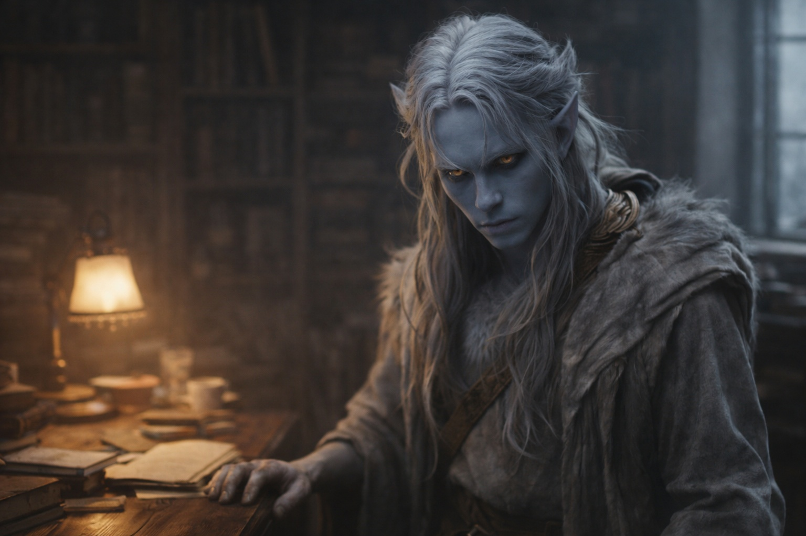

## Capítulo 4 | Parte 5
--- 

—No.

Drusniel permanecía de pie en el estudio de Zaelar, manos sueltas a los costados. Tres días desde el mapa. Tres días de sopesar argumentos e intentar encontrar terreno sólido en un paisaje que no dejaba de cambiar.

—¿No a Wyrmreach? —Zaelar dejó su té sin preocupación aparente—. ¿O no a la oferta de mensajero específicamente?

—Ambos. No me voy. No ahora. —Drusniel mantuvo su voz estable—. Mi familia me necesita aquí.

—Tu familia ya no sabe que existes. —Las palabras eran gentiles. Casi amables—. Ven una silla vacía en la cena y una puerta cerrada por la noche. No saben lo que puedes hacer. En lo que te has convertido.

—Entonces se lo mostraré. Cuando esté listo. —Encontró la mirada de Zaelar—. Dijiste que el poder es real. Dijiste que soy raro. Enséñame más. Déjame volverme lo suficientemente fuerte para protegerlos sin cruzar a un reino de muerte.

Zaelar lo estudió por un largo momento. Sin irritación esta vez: solo cálculo, paciente y frío.

—Por supuesto. —Inclinó la cabeza—. La oferta permanece cuando estés listo. Aunque debería mencionar: la ventana para el pasaje seguro se estrecha cuando termina el verano. El mar de pesadilla se vuelve más traicionero en los meses fríos. —Una pausa—. El poder no tiene línea temporal, pero la oportunidad a veces sí.

El alivio sorprendió a Drusniel. Había esperado argumento. Presión. En cambio, Zaelar simplemente alcanzó hacia un texto en su escritorio.

—¿Continuamos? Tengo un nuevo ejercicio para percepción de aire. Más difícil que antes.

*Dije que no*, pensó Drusniel. *Eso significa que estoy en control.*

El pensamiento se sentía verdadero. Quería que fuera verdadero.

—Continuemos —dijo.

---

El camino de vuelta a Umbra'kor se sentía mal.

Drusniel había hecho este viaje docenas de veces ahora: pasajes de superficie conectando la torre de Zaelar con la ciudad subterránea. La ruta era familiar. Los cambios de presión, la luz cambiante, el momento específico cuando el resplandor de los hongos reemplazaba el cielo gris.

Esta noche, algo había cambiado.

Lo sintió antes de poder nombrarlo. Una perturbación en los patrones del aire. Movimiento donde debería haber quietud. Su nuevo sentido seguía activándose en los bordes de la consciencia: presencia, desplazamiento, algo moviéndose en las sombras justo más allá de la vista.

*Estás imaginando cosas.*

Pero su entrenamiento de asesino no estaba de acuerdo. Los vellos de su cuello se erizaron. Su pulgar rozó las yemas de sus dedos sin pensamiento consciente y luego se detuvo.

Aceleró el paso. Las paredes del túnel se cerraban más. La luz de hongos proyectaba sombras extrañas, y cada sombra parecía contener una forma que se desvanecía cuando miraba directamente.

La entrada del recinto apareció adelante. Guardias. Seguridad. Hogar.

Drusniel no corrió. Correr mostraba miedo, y el miedo invitaba la persecución. Pero caminó más rápido de lo usual, y no dejó de mirar sobre su hombro hasta que pasó por la puerta.

El túnel detrás de él permanecía oscuro y vacío.

*Imaginando cosas*, se dijo a sí mismo de nuevo.

Las palabras se sentían huecas.

---

Shyntara estaba esperando en los aposentos familiares.

Permanecía de pie junto a la ventana de la sala común, silueteada contra la luz de hongos, y no se volvió cuando Drusniel entró. Pero su voz cortó el silencio como una hoja.

—¿A dónde vas?

Se detuvo en el umbral. —A entrenar. Te lo dije.

—Me has dicho muchas cosas. —Se volvió entonces, y su expresión era la que usaba cuando evaluaba amenazas—. Desapareces al amanecer. Regresas al anochecer. Te sobresaltas ante sonidos que no existen, y tus ojos se van a los muros cuando crees que nadie está mirando.

—Siempre he contado cosas.

—No así. —Cruzó la habitación, deteniéndose a un brazo de distancia. Lo suficientemente cerca para agarrar. Lo suficientemente cerca para matar, si quisiera—. Algo cambió. Después de la prueba. Algo es diferente en ti.

—Fallé. —Las palabras salieron más duras de lo que pretendía—. Todo es diferente.

—No es a eso a lo que me refiero. —Sus ojos pálidos lo estudiaron—. Te mueves diferente. Reaccionas a cosas antes de que pasen. Es como observar a alguien entrenando para combate, excepto que no has estado en los salones de entrenamiento. Ni una vez desde la prueba.

El pulso de Drusniel se aceleró. Mantuvo su respiración estable, su expresión neutral. Años de vivir en una casa de asesinos le habían enseñado eso al menos.

—Encontré otras formas de entrenar. Túneles superiores. Los puntos de acceso a la superficie donde hay silencio.

—Estás mintiendo. —Se acercó más—. Estás tomando riesgos. Peligrosos. He visto esto antes: personas que fallan en algo importante, y luego se lanzan a algo peor para probar que todavía importan. —Su voz se endureció—. ¿Es eso lo que es esto? ¿Algún tipo de deseo de muerte disfrazado de entrenamiento?

—Estoy afrontándolo. —Sostuvo su mirada—. La prueba rompió algo. Estoy intentando volver a armarlo. Eso es todo.

El silencio se extendió entre ellos. Algo en la expresión de Shyntara cambió: no suavizándose exactamente, pero recalculando. Había encontrado una explicación que encajaba: hermano en duelo, elecciones imprudentes, el tipo de espiral que probablemente había visto antes en su mundo de sombras y cuchillos.

Estaba equivocada. Pero al menos no tenía razón.

—Padre está preocupado —dijo finalmente—. Por la familia. Por enemigos moviéndose contra nosotros. Está demasiado distraído para notar lo que estás haciendo, pero yo no.

—Entonces deja de notarlo.

—No puedo. —Su voz bajó más—. Eres mi hermano. Sea lo que sea en lo que te hayas metido...

—No me he metido en nada.

—Sea lo que sea —continuó como si él no hubiera hablado—, lo descubriré. Y cuando lo haga, más vale que sea algo con lo que pueda ayudar. Porque si es algo que amenaza a esta familia...

Dejó la amenaza sin terminar. No necesitaba terminarla.

—Nunca amenazaría a esta familia —dijo Drusniel.

—No. —Se movió más allá de él hacia la puerta—. Solo le guardarías secretos. Que a veces es lo mismo.

Se fue.

Drusniel permaneció solo en la sala común, con el pulso retumbándole en los oídos.

La sensación de ser observado del túnel no se había desvanecido. Si acaso, se sentía más fuerte aquí, como si algo lo hubiera seguido a casa y se hubiera asentado en las sombras del recinto de su familia.

*Algo se aproxima.*

No sabía qué. Pero sabía, con fría certeza, que las decisiones que tomara en los próximos días importarían.

Cambiarían las cosas.

Pondrían en movimiento eventos que no podrían deshacerse.

Fue a su habitación y yació en la oscuridad, esperando a que la presencia que podría o no ser Annariel se comunicara.

Pasó mucho tiempo antes de que durmiera.

---

**Fin de Capítulo 4.5 — continúa en Capítulo 5.1: [La Rivalidad de la Casa: La Tormenta que se Avecina](/la-rivalidad-de-la-casa-la-tormenta-que-se-avecina/)**
