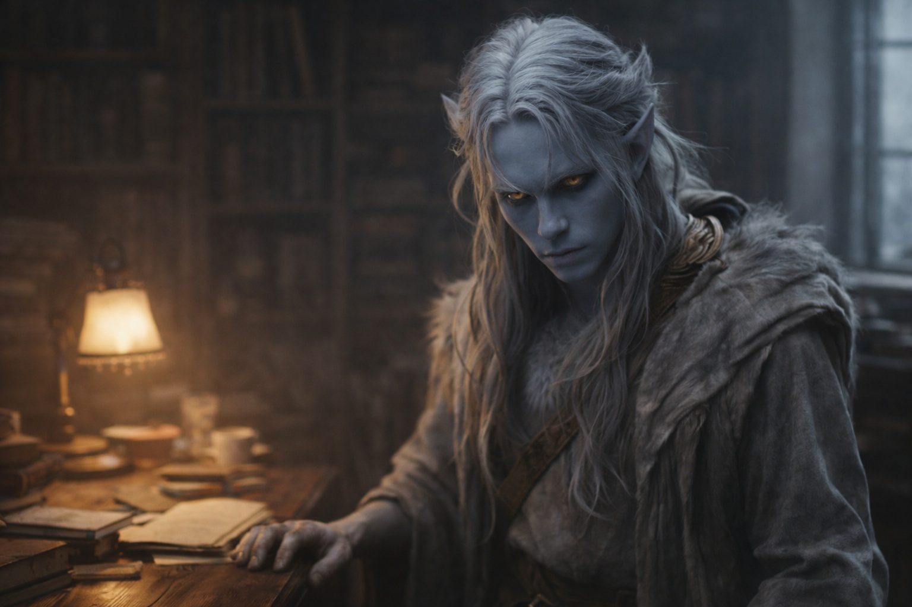
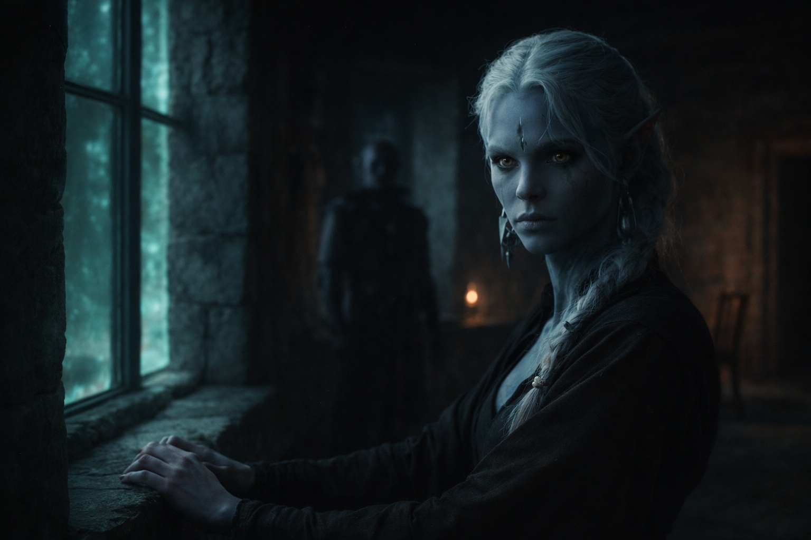

## Capítulo 4 | Parte 5
--- 

—No.

Drusniel estaba junto al escritorio, aún helado por el camino de aquella mañana. Llevaba tres días pensando en el mapa. Daría su respuesta antes de que Zaelar pudiera desplegarlo otra vez.

—¿No a Wyrmreach? —Zaelar dejó su té sin preocupación aparente—. ¿O no a la oferta de mensajero específicamente?

—A las dos cosas. No me voy. Ahora no. —Drusniel mantuvo la voz firme—. Mi familia me necesita aquí.

Zaelar lo estudió durante un largo momento.

—Por supuesto. —Inclinó la cabeza—. La oferta sigue en pie. El cruce empeora después del verano; si reconsideras, el momento importa.

Luego tomó un texto de su escritorio.

—¿Continuamos? Tengo un nuevo ejercicio para percepción de aire. Más difícil que antes.

Drusniel había esperado otra discusión. Ocupó la silla antes de que Zaelar cambiara de parecer.

—Continuemos —dijo.

---

El camino de vuelta a Umbra'kor se sentía mal.

En el recodo donde el aire de la superficie solía ceder a la quietud de los túneles, un remolino fresco le rozó la nuca.

Buscó detrás de él con su percepción del aire. El esfuerzo le tensó las sienes. Algo perturbaba la corriente más allá del recodo, pero no conseguía retener su forma.

*Estás imaginando cosas.*

Aceleró el paso y se pegó al muro para que nadie pudiera pasar por ese lado.

Las lámparas de los guardias aparecieron delante.

Caminó directamente hacia ellas. Solo se volvió a mirar cuando estuvo dentro de la puerta.

El túnel detrás de él permanecía oscuro y vacío.

---

Shyntara estaba esperando en los aposentos familiares.

El cinturón de su espada descansaba sobre una silla y dejaba aceite en la tela. Se apartó de la ventana cuando él entró.

—¿A dónde vas?

Se detuvo en el umbral. —A entrenar. Te lo dije.

—¿Desde el amanecer hasta el anochecer? —Miró el polvo de sus botas—. Llevas meses sin usar nuestro patio.

—No necesito el patio.

—Necesitas alguien con quien practicar. A menos que estés entrenando para otra cosa.

—Fallé. —Las palabras salieron más duras de lo que pretendía—. Todo es diferente.

—Mueves los pies más deprisa. Ayer te volviste antes de que se abriera la puerta de la cocina. —Se acercó—. ¿Quién te enseña?

El pulso de Drusniel se aceleró. Mantuvo su respiración estable, su expresión neutral. Años de vivir en una casa de asesinos le habían enseñado eso al menos.

—Encontré otras formas de entrenar. Túneles superiores. Los puntos de acceso a la superficie donde hay silencio.

—El silencio no explica la sangre que llevas en los puños. ¿Qué haces allí arriba?

—Averiguar qué puedo hacer todavía. —Mantuvo las manos a los costados—. El templo no va a enseñarme.

Shyntara volvió a mirarle las mangas.

—Padre tiene que ocuparse del Consejo. Yo, de las patrullas. No me obligues a buscarte también por los túneles superiores.

—Entonces deja de notarlo.

—No puedo. —Su voz bajó más—. Eres mi hermano. Sea lo que sea en lo que te hayas metido...

—No me he metido en nada.

—Entonces dame un nombre. Alguien a quien preguntar si no vuelves.

—Volveré.

—No me estás respondiendo. —Recogió el cinturón y se marchó.

Drusniel permaneció solo en la sala común, con el pulso retumbándole en los oídos.

Cuando miró hacia el corredor oscuro, regresó la sensación de ser observado que había sentido en el túnel.

Fue a su habitación y yació en la oscuridad, esperando que la presencia regresara.

---

**Fin de Capítulo 4.5 —> 5.1: [La Rivalidad de la Casa: La Tormenta que se Avecina](/la-rivalidad-de-la-casa-la-tormenta-que-se-avecina/)**
