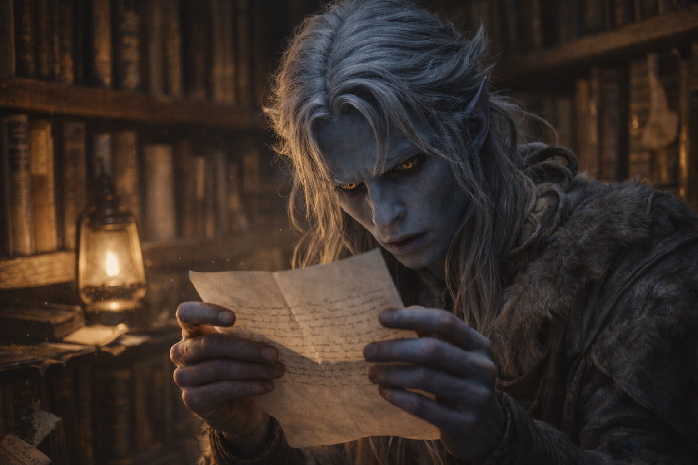
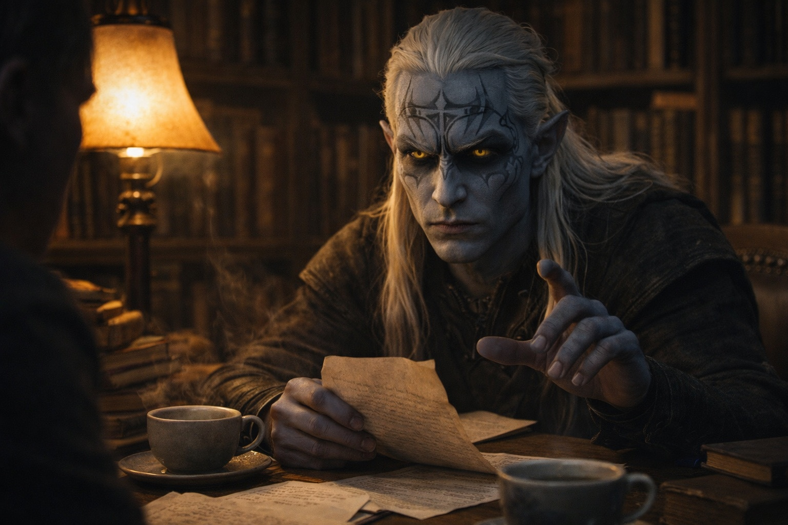

## Capítulo 4 | Parte 3
--- 

El índice de correspondencia de Zaelar saltaba del cuarenta y seis al cuarenta y ocho.

Drusniel lo notó porque Zaelar no se saltaba nada.

Durante dos días no dijo nada. Observó cómo Zaelar archivaba las cartas salientes, cómo cada número de referencia correspondía a una marca de estante, cómo los códigos antiguos permanecían en los márgenes después de que cambiara el sistema.

El cuarenta y siete aparecía una sola vez en un índice antiguo junto a una marca obsoleta.

Drusniel la siguió hasta los estantes de teoría elemental. El volumen parecía intacto, pero la contracubierta quedaba una fracción demasiado alta. Habían ocultado una hoja doblada bajo el revestimiento.

El papel era más nuevo que el libro. La letra era de Zaelar.

*El candidato progresa según lo anticipado. La intervención en la prueba produjo el resultado esperado. Protocolo de canal comprometido estable. La aceleración sigue siendo viable.*

Drusniel la leyó dos veces.

*La intervención en la prueba produjo el resultado esperado.*

Dobló la hoja por el pliegue existente y devolvió el volumen exactamente a su sitio.

Zaelar regresó una hora después, llevando dos tazas de té.

—Has sido productivo. —Dejó una taza en la mesa de lectura—. ¿Encontraste algo interesante?

—Lo suficiente. —Drusniel dejó el té intacto. Levantó la hoja doblada—. Cuarenta y siete.

Los ojos de Zaelar fueron al papel.

—¿Dónde encontraste eso?

—Tus números me dijeron dónde buscar.

Una pausa breve.

—Claro que sí.

—La intervención en la prueba produjo el resultado esperado. —Drusniel mantuvo la voz nivelada—. Tus palabras.

Zaelar se sentó. —Sabía que alguien iba a intervenir. No sabía quién.

—¿Antes de mi prueba?

—Sabía que el patrón había empezado antes de tu prueba. No sabía qué mano había detrás.

—Protocolo de canal comprometido.

—Una descripción de lo que observé. Tu contacto no era limpio.

—Conveniente.

—Sí.

Drusniel dobló la carta una vez.

—¿Por qué alguien me manipularía?

—Porque eres valioso. —Hizo un gesto hacia los textos antiguos que los rodeaban—. Afinidad de aire y agua, pura y fuerte. El primero en generaciones. Hay personas que matarían por controlar a alguien con tu potencial. Otros que matarían por evitar que lo alcances.

—Podría irme —dijo—. Dejar de venir aquí. Regresar con mi familia y olvidar que algo de esto pasó.

—Podrías. —La expresión de Zaelar no cambió—. El poder permanecería. Tendrías que descubrir sus límites por tu cuenta, sin guía. Y quienquiera que saboteó tu prueba todavía estaría ahí fuera, todavía trabajando en cualquier plan que te convirtió en su objetivo.

—O tú podrías ser quien me saboteó. Y todo esto es... —Drusniel se detuvo.

La magia funcionaba. Fuera lo que fuera sobre lo que Zaelar hubiera mentido, ese hecho permanecía.

—La elección es tuya —dijo Zaelar en voz baja—. No te detendré si quieres irte. Pero pregúntate: ¿qué ganas al alejarte? ¿Y qué pierdes?

Drusniel miró la carta. Los estantes de conocimiento antiguo. Sus propias manos, donde energía leve había parpadeado esa mañana cuando había capturado una corriente sin pensar.

El conocimiento de Zaelar funcionaba. Drusniel todavía no estaba dispuesto a renunciar a eso.

—Me quedaré —dijo.

Algo que podría haber sido satisfacción cruzó los rasgos de Zaelar.

—Bien. Todavía tenemos mucho trabajo por hacer.

---

Esa noche, la presencia regresó.

Drusniel yacía en la oscuridad, agotado de la práctica, y sintió la calidez familiar en el borde de su consciencia. La textura que imitaba a Annariel.

*Drus. Escuché que tuviste un día difícil.*

Se tensó. *¿Escuchaste de quién?*

*Zaelar lo mencionó. Hemos estado en contacto.* La voz pulsó con simpatía. *Está preocupado por ti. Dice que encontraste algo que te perturbó.*

*Una carta. Sobre mi prueba.* Drusniel eligió sus palabras cuidadosamente. *Mencionaba sabotaje. Protocolos de contacto mental.*

*Lo sé.* Una pausa, cargada con culpa. *Debería habértelo dicho antes. He sospechado que alguien estaba interfiriendo con nosotros. Con nuestra conexión. Pero no podía probar nada.*

*¿Sabías que la conexión podría estar comprometida?*

*Temía que pudiera estarlo. Cómo nuestros mensajes a veces se sentían... extraños. Pensé que estaba imaginando cosas.* Una pausa —más larga de lo natural, como si la presencia estuviera consultando algo que Drusniel no podía ver—. *No confíes en él porque yo lo diga. Ponlo a prueba. Siempre pones las cosas a prueba.*

El pulgar de Drusniel tocó tres yemas.

*Ponlo a prueba.*

La voz también había aprendido ese lenguaje.

*Estoy cansado*, envió. *Necesito descansar.*

*Por supuesto.* La presencia comenzó a desvanecerse. *Hablaremos pronto. Estoy orgulloso de ti, Drus. Te estás convirtiendo en algo extraordinario.*

La calidez se retiró.

Drusniel yació en la oscuridad, con los ojos fijos en una grieta fina en la piedra sobre él. La siguió hasta que sus manos dejaron de temblar.

El poder era real.

Todo lo demás seguía bajo prueba.

---

**Fin de Capítulo 4.3 —> 4.4: [Conocimiento Prohibido: La Tierra Distante](/conocimiento-prohibido-la-tierra-distante/)**